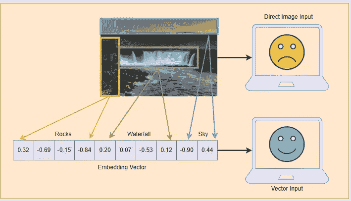
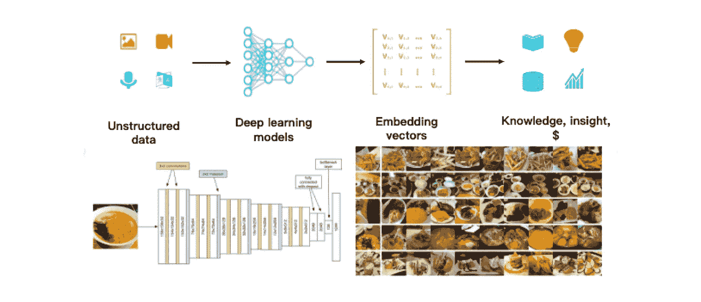
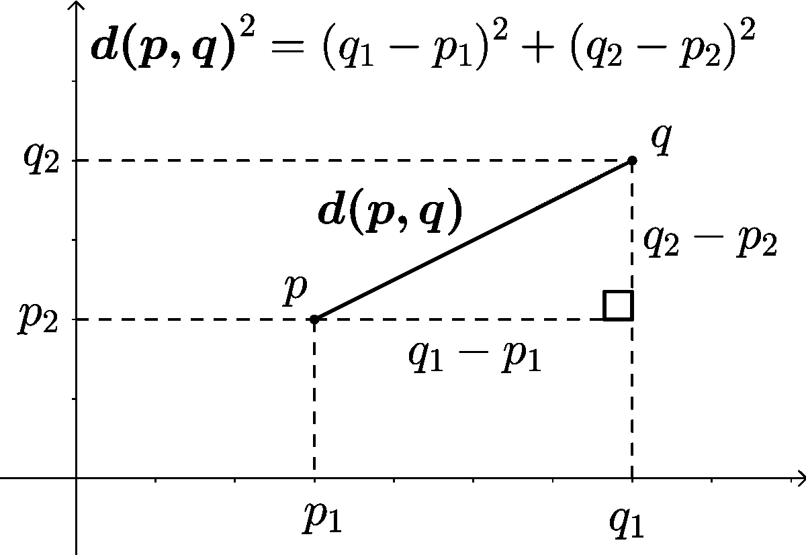
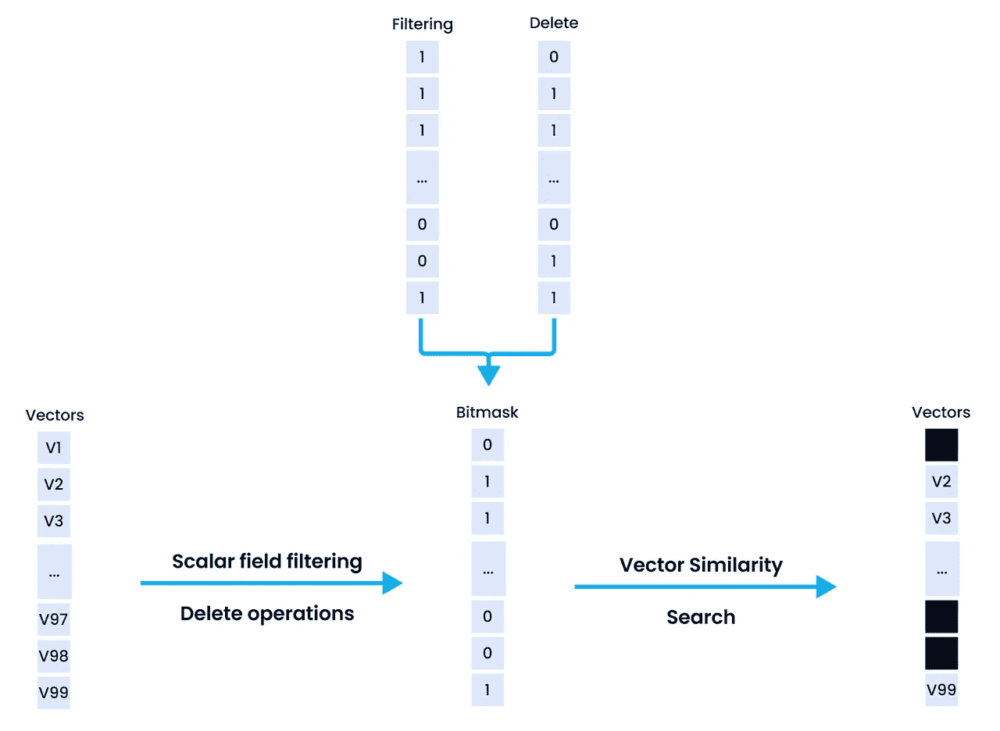
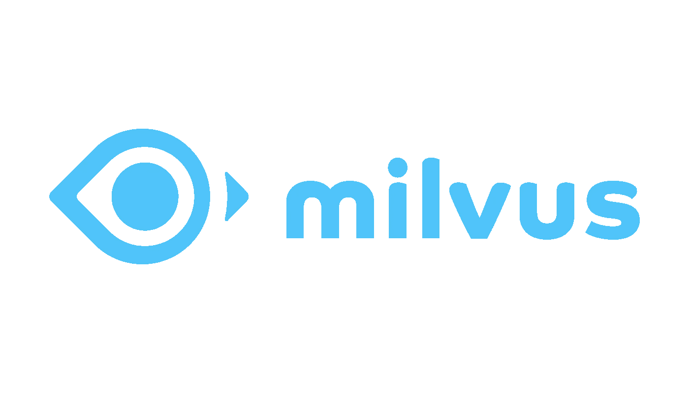
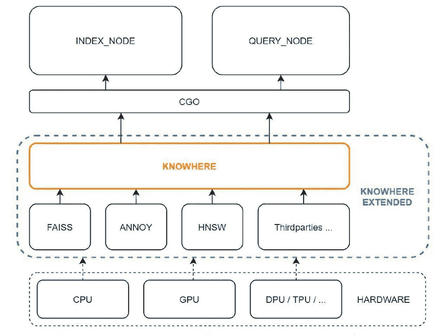
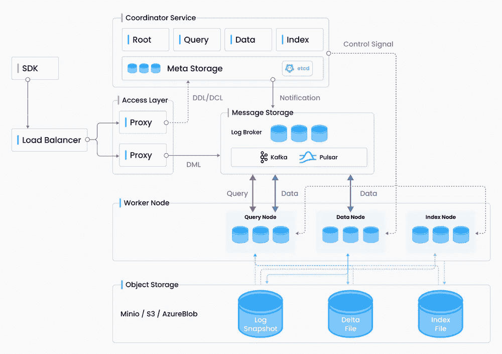
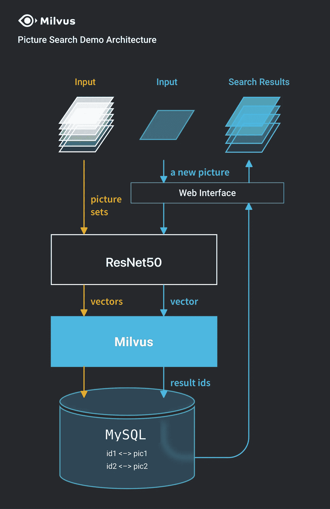
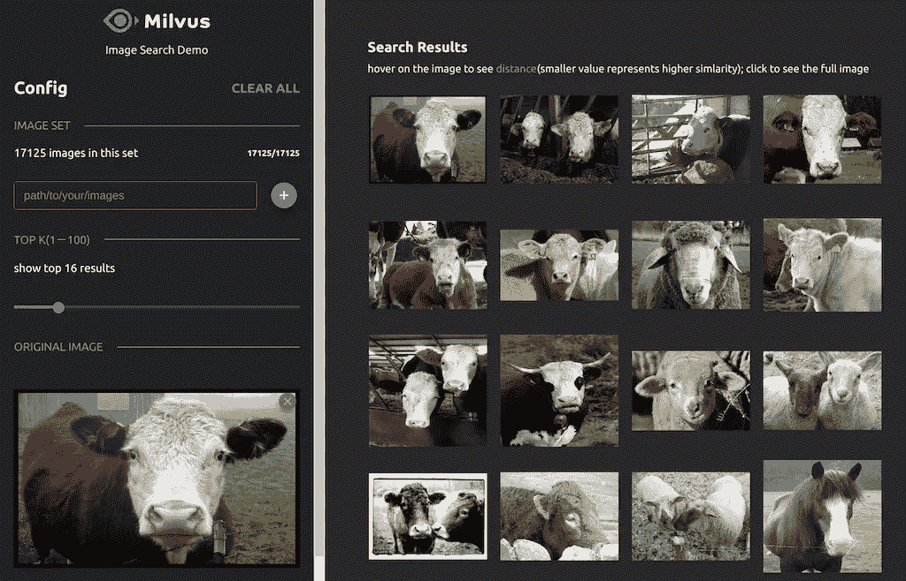

# 使用 Milvus 矢量数据库进行可扩展的快速相似性搜索

> 原文：<https://pub.towardsai.net/scalable-and-blazing-fast-similarity-search-with-milvus-vector-database-d221706e605a?source=collection_archive---------0----------------------->

## 在几毫秒内存储、索引、管理和搜索数万亿个文档向量！

来源: [Milvus 博客](https://milvus.io/blog/scalable-and-blazing-fast-similarity-search-with-milvus-vector-database.md)

# 介绍

在这篇文章中，我们将涉及一些与向量数据库和大规模相似性搜索相关的有趣方面。在当今快速发展的世界中，我们会看到新技术、新业务、新数据源，因此我们需要不断使用新的方法来存储、管理和利用这些数据来获得洞察力。结构化的表格数据已经在关系数据库中存储了几十年，商业智能在分析和提取这种数据的洞察力方面发展很快。然而，考虑到当前的数据环境，

> [“超过 80–90%的数据是非结构化信息，如文本、视频、音频、web 服务器日志、社交媒体等”](https://mitsloan.mit.edu/ideas-made-to-matter/tapping-power-unstructured-data)

组织一直在利用机器学习和深度学习的力量来尝试从这些数据中提取见解，因为传统的基于查询的方法可能不够甚至不可能。从这些数据中提取有价值的见解有巨大的、未开发的潜力，而我们才刚刚开始！

> “由于世界上大多数数据都是非结构化的，因此分析和处理这些数据的能力带来了巨大的机遇。”
> 
> — Mikey Shulman，Kensho 负责人

顾名思义，非结构化数据没有隐含的结构，比如由行和列组成的表格(因此称为表格数据或结构化数据)。与结构化数据不同，没有简单的方法将非结构化数据的内容存储在关系数据库中。利用非结构化数据获得洞察力面临三大挑战:

*   **存储:**常规的关系数据库适合保存结构化数据。虽然您可以使用 NoSQL 数据库来存储此类数据，但处理此类数据以提取正确的表示来支持大规模的人工智能应用程序会增加额外的开销
*   **表示:**计算机不像我们一样理解文本或图像。他们只理解数字，我们需要将非结构化数据转换成一些有用的数字表示，通常是向量或嵌入。
*   **查询:**不能像 SQL 那样直接基于明确的条件语句对结构化数据进行查询。想象一下，一个简单的例子，给定一张你最喜欢的一双鞋的照片，你试图搜索相似的鞋子！您不能使用原始像素值进行搜索，也不能表示鞋的形状、大小、样式、颜色等结构化特征。现在想象一下，要为数百万双鞋做这件事！

因此，为了让计算机理解、处理、 ***表示*** 非结构化数据，我们通常将它们转换成密集向量，通常称为嵌入。

将图像表示为密集嵌入向量；来源:[嵌入生成](https://zilliz.com/learn/embedding-generation)

存在多种方法，尤其是利用深度学习的方法，包括用于图像等视觉数据的卷积神经网络(CNN)和用于文本数据的转换器，它们可用于将此类非结构化数据转换为嵌入数据。 [Zilliz](https://zilliz.com/) 有 [*一篇涵盖不同嵌入技术的优秀文章*](https://zilliz.com/learn/embedding-generation) ！

现在存储这些嵌入向量是不够的。人们还需要能够查询并找出相似的向量。为什么这么问？大多数现实世界的应用程序都是由基于人工智能的解决方案的向量相似性搜索驱动的。这包括谷歌的视觉(图像)搜索、网飞或亚马逊的推荐系统、谷歌的文本搜索引擎、多模态搜索、重复数据删除等等！

大规模存储、管理和查询矢量并不是一项简单的任务。你需要专门的工具，矢量数据库是最有效的工具！在本文中，我们将涵盖以下几个方面:

*   向量和向量相似性搜索
*   什么是矢量数据库？
*   Milvus —世界上最先进的矢量数据库
*   使用 Milvus 执行视觉图像搜索——一个用例蓝图

我们开始吧！

# 向量和向量相似性搜索

早些时候，我们确定了将图像和文本等非结构化数据表示为向量的必要性，因为计算机只能理解数字。我们通常利用人工智能模型，成为更具体的深度学习模型，将非结构化数据转换为机器可读的数字向量。通常，这些向量基本上是一个浮点数列表，它们共同表示底层的项目(图像、文本等)。).

## 理解向量

考虑到自然语言处理(NLP)领域，我们有许多单词嵌入模型，如 [Word2Vec、GloVe 和 FastText](https://towardsdatascience.com/understanding-feature-engineering-part-4-deep-learning-methods-for-text-data-96c44370bbfa) ，它们可以帮助将单词表示为数字向量。随着时间的推移，我们已经看到了像 [BERT](https://jalammar.github.io/illustrated-bert/) 这样的 [Transformer](https://arxiv.org/abs/1706.03762) 模型的兴起，这些模型可以用来学习上下文嵌入向量以及整个句子和段落的更好表示。

同样，在计算机视觉领域，我们有像[卷积神经网络](https://proceedings.neurips.cc/paper/2012/file/c399862d3b9d6b76c8436e924a68c45b-Paper.pdf)这样的模型，可以帮助从图像和视频等视觉数据中学习表示。随着变形金刚的崛起，我们也有了[视觉变形金刚](https://arxiv.org/abs/2010.11929)，可以比普通 CNN 表现更好。

从非结构化数据中提取见解的示例工作流；来源: [Milvus 博客](https://milvus.io/blog/deep-dive-1-milvus-architecture-overview.md)

这种向量的优势在于，我们可以利用它们来解决现实世界的问题，例如视觉搜索，在视觉搜索中，您通常上传一张照片，然后获得包括视觉上相似的图像的搜索结果。Google 将此作为其搜索引擎中非常受欢迎的功能，如下例所示。

谷歌视觉图像搜索的一个例子；来源:作者创作

这种应用程序由数据向量和向量相似性搜索提供支持。如果你考虑 X-Y 笛卡尔坐标空间中的两点。两点之间的距离可以计算为简单的欧几里德距离，如下式所示。

二维欧几里德距离；来源:[维基百科](https://en.wikipedia.org/wiki/Euclidean_distance)

现在，假设每个数据点是一个 D 维向量，您仍然可以使用欧几里德距离或其他距离度量，如汉明距离或余弦距离，来确定两个数据点之间的距离。这可以帮助建立接近度或相似度的概念，该概念可以被用作可量化的度量，以使用它们的向量找到给定参考项目的相似项目。

## 理解向量相似性搜索

向量相似性搜索，通常被称为最近邻(NN)搜索，基本上是计算参考项目(我们希望找到相似项目)和现有项目集合(通常在数据库中)之间的成对相似性(或距离)并返回前“k”个最近邻的过程，这些最近邻是前“k”个最相似的项目。计算这种相似性的关键部分是相似性度量，它可以是欧几里德距离、内积、余弦距离、汉明距离等。距离越小，向量越相似。

精确最近邻(NN)搜索的挑战是可伸缩性。每次都需要计算 N 个距离(假设存在 N 个项目)才能得到相似的项目。这可能会非常慢，尤其是如果你没有在某个地方存储和索引数据(比如向量数据库！).为了加快计算速度，我们通常利用近似最近邻搜索，这通常被称为 ANN 搜索，最终将向量存储到索引中。该索引有助于以智能的方式存储这些向量，以实现对参考查询项目的“近似”相似邻居的快速检索。典型的人工神经网络索引方法包括:

*   **矢量变换:**这包括向矢量添加额外的变换，如降维(如 PCA \ t-SNE)、旋转等
*   **矢量编码:**这包括应用基于数据结构的技术，如位置敏感散列(LSH)、量化、树等。这有助于更快地检索相似的项目
*   **非穷举搜索方法:**这主要用于防止穷举搜索，包括邻域图、倒排索引等方法。

这表明，要构建任何矢量相似性搜索应用程序，您需要一个能够帮助您大规模高效存储、索引和查询(搜索)的数据库。进入向量数据库！

# 什么是矢量数据库？

鉴于我们现在已经了解了如何使用向量来表示非结构化数据以及向量搜索是如何工作的，我们可以将这两个概念结合起来构建一个向量数据库。

向量数据库是可扩展的数据平台，用于存储、索引和查询由非结构化数据(图像、文本等)生成的嵌入向量。)使用深度学习模型。

处理大量的向量进行相似性搜索(即使有索引)会非常昂贵。尽管如此，最好和最先进的向量数据库应该允许你插入、索引和搜索数百万或数十亿的目标向量，此外还可以指定你选择的索引算法和相似性度量。

考虑到要在企业中使用健壮的数据库管理系统，矢量数据库主要应满足以下关键要求:

1.  **可扩展**:矢量数据库应该能够索引和运行数十亿嵌入矢量的近似最近邻搜索
2.  **可靠**:向量数据库应该能够处理内部故障而不丢失数据，并且对操作影响最小，即具有容错能力
3.  **快**:查询和写入速度对矢量数据库很重要。对于 Snapchat 和 Instagram 这样每秒钟可以上传成百上千张新图片的平台来说，速度成为一个非常重要的因素。

向量数据库不仅仅存储数据向量。他们还负责使用有效的数据结构来索引这些向量，以便快速检索和支持 CRUD(创建、读取、更新和删除)操作。矢量数据库还应该理想地支持属性过滤，即基于元数据字段(通常是标量字段)进行过滤。一个简单的例子是根据特定品牌的图像向量检索相似的鞋子。在这里，品牌是过滤所基于的属性。

米尔乌斯过滤机制；来源:[属性过滤](https://zilliz.com/learn/attribute-filtering)

上图展示了 [Milvus](https://milvus.io/) ，我们马上要谈到的向量数据库，是如何使用属性过滤的。 [Milvus](https://milvus.io/) 将位掩码的概念引入过滤机制，以基于满足特定属性过滤器来保持位掩码为 1 的相似向量。更多细节请见 [*此处*](https://zilliz.com/learn/attribute-filtering) 。

# Milvus —世界上最先进的矢量数据库

[Milvus](https://milvus.io/) 是一个开源的矢量数据库管理平台，专门为大规模矢量数据和简化机器学习操作(MLOps)而构建。

米尔乌斯；来源: [Milvus 博客](https://milvus.io/blog/scalable-and-blazing-fast-similarity-search-with-milvus-vector-database.md)

[Zilliz](https://zilliz.com/) ，是建立世界上最先进的矢量数据库 [Milvus](https://milvus.io/) 的幕后组织，旨在加速下一代数据结构的开发。Milvus 目前是 T4 LF AI 数据基金会的一个毕业项目，专注于管理海量非结构化数据集的存储和搜索。该平台的效率和可靠性简化了大规模部署 AI 模型和 MLOps 的过程。Milvus 有着广泛的应用，包括药物发现、计算机视觉、推荐系统、聊天机器人等等。

## Milvus 的主要特征

Milvus 具有许多有用的特性和功能，例如:

*   **万亿矢量数据集上的超快的搜索速度:**在万亿矢量数据集上，矢量搜索和检索的平均延迟以毫秒计。
*   **简化的非结构化数据管理** : Milvus 拥有丰富的 API，专为数据科学工作流而设计。
*   **可靠、始终在线的矢量数据库:** Milvus 的内置复制和故障转移/故障回复功能可确保数据和应用程序始终保持业务连续性。
*   **高可伸缩性和弹性:**组件级可伸缩性使得按需伸缩成为可能。
*   **混合搜索:**除了向量，Milvus 还支持布尔、字符串、整数、浮点数等数据类型。Milvus 将标量过滤与强大的向量相似性搜索结合起来(如前面的鞋子相似性示例所示)。
*   **统一的 Lambda 结构:** Milvus 结合了流和批处理进行数据存储，以平衡及时性和效率。
*   [**时间旅行:**](https://milvus.io/docs/v2.0.x/timetravel_ref.md) Milvus 为所有的数据插入和删除操作维护一个时间线。它允许用户在搜索中指定时间戳，以在指定的时间点检索数据视图。
*   **社区支持&行业认可:**拥有超过 1，000 名企业用户， [GitHub](https://github.com/milvus-io/milvus) 上有 10.5K+的星级，以及一个活跃的开源社区，当您使用 Milvus 时，您并不孤单。作为 [LF AI &数据基金会](https://lfaidata.foundation/)下的研究生项目，Milvus 有机构支持。

## 矢量数据管理和搜索的现有方法

构建由向量相似性搜索支持的人工智能系统的一种常见方法是将近似最近邻搜索(ANNS)等算法与开源库配对，例如:

*   [**脸书 AI 相似性搜索(FAISS):**](https://ai.facebook.com/tools/faiss/) 该框架实现了高效的相似性搜索和密集向量的聚类。它包含在任意大小的向量集中搜索的算法，直到那些可能不适合 RAM 的向量。它支持索引功能，如反向多索引和产品量化
*   [**Spotify 的 Annoy(近似最近邻哦耶)**](https://github.com/spotify/annoy) **:** 该框架使用[随机投影](http://en.wikipedia.org/wiki/Locality-sensitive_hashing#Random_projection)并构建一棵树，以实现密集向量的大规模人工神经网络
*   [**Google 的 ScaNN(可伸缩最近邻):**](https://github.com/google-research/google-research/tree/master/scann) 这个框架在规模上执行高效的向量相似性搜索。由实现组成，其中包括最大内积搜索(MIPS)的搜索空间修剪和量化

虽然这些库各有各的用处，但由于一些限制，这些算法库组合并不等同于像 Milvus 这样的成熟的矢量数据管理系统。我们现在将讨论其中的一些限制。

## 现有方法的局限性

前面讨论的用于管理矢量数据的现有方法有以下限制:

1.  **灵活性:**现有系统通常将所有数据存储在主内存中，因此它们不能轻松地跨多台机器以分布式模式运行，并且不太适合处理大规模数据集
2.  **动态数据处理:**数据一旦输入到现有系统中，通常被认为是静态的，这使得动态数据的处理变得复杂，几乎不可能进行实时搜索
3.  **高级查询处理:**大多数工具不支持高级查询处理(例如，属性过滤、混合搜索和多向量查询)，而高级查询处理对于构建支持高级过滤的真实世界相似性搜索引擎是必不可少的。
4.  **异构计算优化:**很少有平台同时在 CPU 和 GPU(不包括 FAISS)上为异构系统架构提供优化，从而导致效率损失。

Milvus 试图克服所有这些限制，我们将在下一节详细讨论这一点。

## Milvus 的优势—了解知识

[Milvus](https://milvus.io/) 试图通过以下方式处理并成功解决建立在低效矢量数据管理和相似性搜索算法之上的现有系统的局限性:

*   它通过支持各种应用程序接口(包括 Python、Java、Go、C++和 RESTful APIs 中的 SDK)增强了灵活性
*   它支持多种矢量索引类型(例如，基于量化的索引和基于图形的索引)，以及高级查询处理
*   Milvus 使用日志结构的合并树(LSM 树)处理动态向量数据，保持数据插入和删除的效率，并实时搜索
*   Milvus 还为现代 CPU 和 GPU 上的异构计算架构提供优化，允许开发人员针对特定场景、数据集和应用环境调整系统

Knowhere，Milvus 的向量执行引擎，是一个操作者接口，用于访问系统上层的服务和系统下层的向量相似性搜索库，如 Faiss、Hnswlib 和 airy。此外，Knowhere 还负责异构计算。Knowhere 控制在哪些硬件(例如 CPU 或 GPU)上执行索引构建和搜索请求。这就是 Knowhere 得名的原因——知道在哪里执行操作。未来的版本将支持更多类型的硬件，包括 DPU 和 TPU。

米尔乌斯的 Knowhere 建筑:来源:[知乎深潜](https://milvus.io/blog/deep-dive-8-knowhere.md)

Milvus 中的计算主要涉及向量和标量运算。Knowhere 只处理 Milvus 中向量的运算。上图展示了 Milvus 中的 Knowhere 架构。最底层是系统硬件。第三方索引库位于硬件之上。然后 Knowhere 通过 CGO 与顶层的索引节点和查询节点进行交互。Knowhere 不仅进一步扩展了 Faiss 的功能，还优化了性能，并具有几个优点，包括支持 BitsetView、支持更多类似的指标、支持 AVX512 指令集、自动 SIMD 指令选择和其他性能优化。详情可以在 这里找到 [*。*](https://milvus.io/blog/deep-dive-8-knowhere.md)

## 米尔乌斯建筑

下图展示了 [Milvus](https://milvus.io/) 平台的整体架构。Milvus 将数据流与控制流分开，分为四层，在可伸缩性和灾难恢复方面相互独立。

米尔乌斯建筑；来源: [Milvus 概述](https://milvus.io/blog/deep-dive-1-milvus-architecture-overview.md)

*   **接入层:**接入层由一组无状态代理组成，作为系统的前端层和用户的端点。
*   协调器服务:协调器服务负责集群拓扑节点管理、负载平衡、时间戳生成、数据声明和数据管理
*   **工作者节点:**工作者或执行节点执行由协调器服务发出的指令和由代理发起的数据操作语言(DML)命令。Milvus 中的一个 worker 节点类似于 [Hadoop](https://hadoop.apache.org/) 中的一个 data 节点，或者 HBase 中的一个区域服务器
*   **存储:**这是 Milvus 的基石，负责数据持久化。存储层由**元存储**、**日志代理**和**对象存储**组成

请点击查看更多关于建筑的细节！

# 使用 Milvus 执行视觉图像搜索——一个用例蓝图

像 Milvus 这样的开源矢量数据库使得任何企业都可以用最少的步骤创建自己的视觉图像搜索系统。开发人员可以使用预训练的人工智能模型将他们自己的图像数据集转换为向量，然后利用 Milvus 通过图像搜索类似的产品。让我们看看下面这个如何设计和构建这样一个系统的蓝图。

视觉图像搜索的工作流程；来源:[反向图片搜索](https://github.com/milvus-io/bootcamp/tree/master/solutions/reverse_image_search/quick_deploy)

在这个工作流程中，我们可以使用像[to hee](https://github.com/towhee-io/towhee)这样的开源框架来利用像 ResNet-50 这样的预训练模型，并从图像中提取矢量，在 Milvus 中轻松存储和索引这些矢量，还可以在 MySQL 数据库中存储图像 id 到实际图片的映射。一旦数据被编入索引，我们就可以轻松上传任何新图像，并使用 Milvus 进行大规模图像搜索。下图显示了一个视觉图像搜索示例。

示例视觉搜索示例；来源:[反向图片搜索](https://github.com/milvus-io/bootcamp/tree/master/solutions/reverse_image_search/quick_deploy)

> [感谢 Milvus，一定要看看 GitHub 上开源的详细教程。](https://github.com/milvus-io/bootcamp/tree/master/solutions/reverse_image_search/quick_deploy)

# 结论

在这篇文章中，我们已经讨论了相当多的内容。我们从使用 Milvus(一个开源矢量数据库)来大规模表示非结构化数据、利用矢量和矢量相似性搜索的挑战开始。我们讨论了 Milvus 如何构建的细节和为其提供动力的关键组件，以及如何解决现实世界问题的蓝图，即使用 Milvus 进行视觉图像搜索。一定要试一试，开始用 [Milvus](https://milvus.io/) 解决你自己的现实世界问题！

本文内容改编自我在 Milvus 博客*上的文章。*

> *喜欢这篇文章吗？请[联系我](https://www.linkedin.com/in/dipanzan/)讨论更多信息或给出反馈！*

* [## Dipanjan Sarkar -首席数据科学家- SIT 学院| LinkedIn

### 应大众的要求，我最近重新开放了数据科学和职业的(付费)咨询和指导会议…

www.linkedin.com](https://www.linkedin.com/in/dipanzan/)*