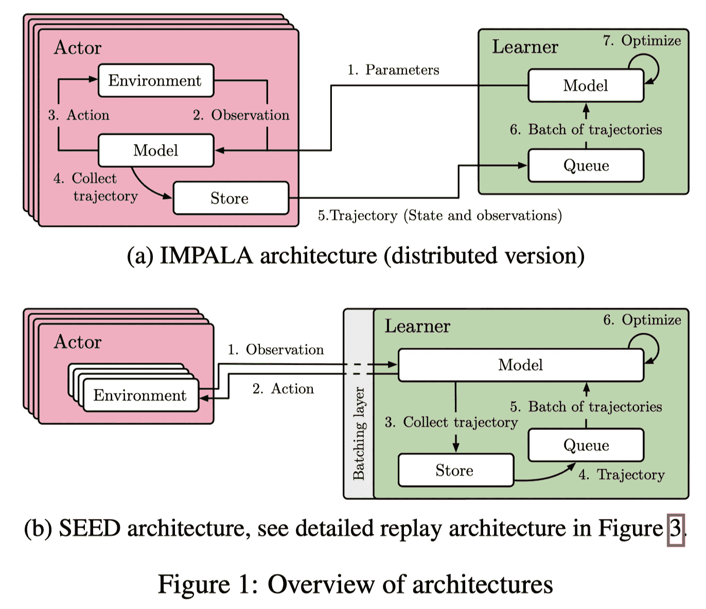
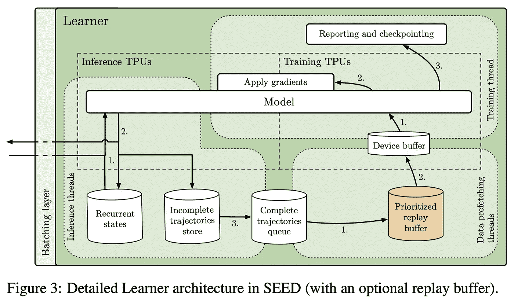
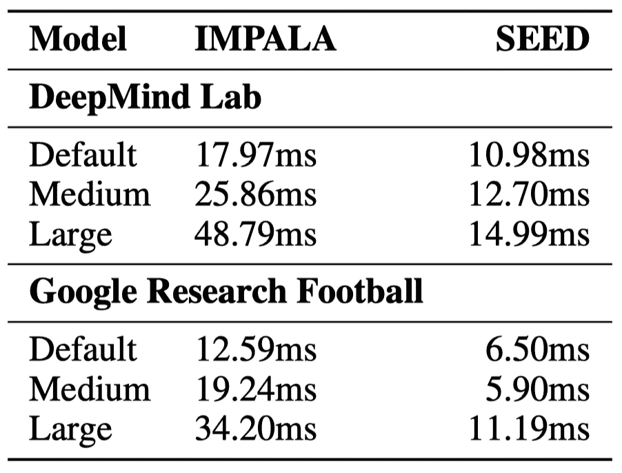

# 可扩展高效 Deep-RL

> 原文：<https://pub.towardsai.net/scalable-efficient-deep-rl-ea67c0a5f4b2?source=collection_archive---------0----------------------->

## 一种更有效的方法来扩展强化学习算法

照片由[达维德·扎维亚](https://unsplash.com/@davealmine?utm_source=unsplash&utm_medium=referral&utm_content=creditCopyText)在 [Unsplash](https://unsplash.com/s/photos/dandelion?utm_source=unsplash&utm_medium=referral&utm_content=creditCopyText) 上拍摄

# 介绍

传统的可扩展强化学习框架，如[英帕拉](https://arxiv.org/abs/1802.01561)和 [R2D2](https://openreview.net/forum?id=r1lyTjAqYX) ，并行运行多个代理来收集转换，每个代理都有自己的来自参数服务器(或学习者)的模型副本。这种架构强加了高带宽要求，因为它们需要模型参数、环境信息等的传输。在本文中，我们讨论了一个现代的可扩展 RL 代理，称为 SEED(Scalable Efficient Deep-RL)，由 Google Brain 团队的 espe Holt&Marinier&Stanczyk 等人提出。它利用现代加速器来加快数据收集和学习过程，并降低运行成本(在谷歌云上测量，与 IMPALA 相比降低了 80%)。

种子和黑斑羚的比较。来源:SEED RL:具有加速中央推理的可扩展且高效的深度 RL

## 传统分布式 RL 的不足

这里我们比较种子和黑斑羚。IMPALA 架构，在 Ape-X、OpenAI Rapid 等中也以各种形式使用。主要由两部分组成:大量行动者周期性地复制学习者的模型参数，并与环境交互以收集轨迹，而学习者异步地接收来自行动者的转换并优化其模型。

这种架构的不足之处有很多原因:

1.  **使用 CPU 进行神经网络推理**:演员通常使用 CPU 进行推理，然而，众所周知，这对于神经网络来说是计算效率低下的。
2.  **低效的资源利用**:参与者在两个任务之间交替:环境步骤和推理步骤。这两个任务的计算需求通常不相似，这导致利用率低或速度慢。例如，一些环境本质上是单线程的，而神经网络很容易并行化
3.  **带宽需求**:模型参数、循环状态和转换在参与者和学习者之间传递，这会给网络带宽带来巨大的负担。

# 种子的结构

SEED 旨在解决上述问题。如图 1b 所示，推理和转换集合被移动到学习者，这使得它在概念上成为具有远程环境的单机设置。对于每一个单独的环境步骤，观察结果被发送给学习者，学习者运行推理并将动作发送回参与者

来源:SEED RL:具有加速中央推理的可扩展且高效的深度 RL

学习者架构由三种类型的线程组成:

*   **推理**:推理线程接收来自不同行动者的一批变迁(如状态、奖励、完成信号)，加载对应的递归状态，做出动作。然后将动作发送回参与者，同时存储最新的循环状态。
*   **数据预取**:当轨迹完全展开时，它会被添加到 FIFO 队列或重放缓冲区，稍后由数据预取线程进行采样
*   **训练**:训练线程获取存储在设备缓冲区的预取轨迹，使用训练 TPU(或 GPU)主机应用梯度。

这个模型在参与者等待来自学习者的响应时引入了一些参与者的浪费。为了减少演员的空闲时间，SEED 采用了两种策略:

1.  它让每个参与者运行多个环境。因此，在等待学习者的动作时，演员可以自由地进入另一个环境。
2.  它求助于一个使用 gRPC 的简单框架— —一个高性能的 RPC 库。具体来说，他们采用流 RPC，演员和学习者之间的连接保持开放，元数据只发送一次。此外，该框架包括一个批处理模块，可以有效地将多个参与者推理调用批处理在一起。如果参与者和学习者可以在同一台机器上运行，gRPC 会使用 Unix 域套接字，从而减少延迟、CPU 和系统调用开销。总的来说，包括网络和推理在内的端到端延迟对于我们下面考虑的一些模型来说更快

不同环境和模型下 IMPALA 和 SEED 的端到端推理延迟

## 成本比较

下图比较了在 Google Cloud 上不同环境下训练 SEED 和 IMPALA 的成本。我们可以看到，随着网络变得越来越大，SEED 节省了更多的成本。

# 参考

埃斯佩霍尔特、拉塞、拉斐尔·马里尼尔、彼得·斯坦奇克、王柯和马尔钦·米哈尔斯基。2019.“SEED RL:具有加速中央推理的可扩展且高效的深度 RL”，1–19。[http://arxiv.org/abs/1910.06591](http://arxiv.org/abs/1910.06591)。