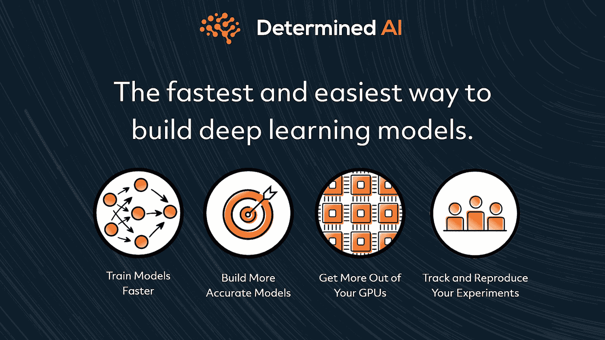

# 抱面变压器的定尺训练

> 原文：<https://pub.towardsai.net/scaling-training-of-huggingface-transformers-with-determined-c0f3783747f5?source=collection_archive---------4----------------------->

[**加入铁了心 AI 的第三次午餐学习会**](https://mktg.best/y2e0x) ，学习如何用铁了心缩放拥抱脸变形金刚的训练。

## [事件](https://towardsai.net/p/category/events)

## [参加由我们的朋友在](https://mktg.best/y2e0x) [Determined AI](https://www.determined.ai/) 举办的激动人心的午餐学习活动

T 由于 HuggingFace，训练复杂的最先进的自然语言处理(NLP)模型现在变得轻而易举——使其成为数据科学家和机器学习工程师实现变形金刚模型并通过简单的库调用将它们配置为最先进的 NLP 模型的必要开源工具。因此，该库对于训练 NLP 模型变得至关重要，就像在百度或阿里巴巴一样，并在几个 NLP 任务中贡献了最先进的结果。

我们在决绝人工智能的朋友们正在举办一场令人兴奋的午餐学习活动，内容包括使用 [**决绝**](https://github.com/determined-ai/determined) 大规模培训拥抱脸变形金刚！学习使用分布式训练、超参数搜索和廉价的 spot 实例来训练变压器——所有这些都不需要修改代码。

请考虑 [**加入**](https://mktg.best/y2e0x) 太平洋时间 6 月 30 日周三上午 10 点，由决胜人工智能的高级机器学习工程师 Liam Li 和决胜人工智能的产品经理 Angela Jiang 提供实践指导(**午餐包括在内！**)。

这个神奇的实践教程将涵盖坚定的变形金刚的基础知识，并通过分布式训练和现场实例，通过如何使用大型变形金刚语言模型来构建聊天机器人。

[**加入**](https://mktg.best/y2e0x) 并了解如何通过分布式训练、实验和工件跟踪以及资源管理来大规模训练变形金刚，所有这些都不需要修改代码。

请务必 [**注册 Meetup 活动**](https://mktg.best/y2e0x) 、zoom 会议，如果您空闲，请考虑加入坚决的 [**空闲社区**](https://mktg.best/determinedslack) ！

 [## 赞助商|了解如何成为面向人工智能的赞助商

### 无论你是想以一种吸引读者的方式突出你的产品，吸引高度相关的利基受众，还是…

sponsors.towardsai.net](https://sponsors.towardsai.net/)  [## 店铺↓ |走向 AI

### 发布最好的技术、科学和工程|社论→https://towardsai.net/p/editorial |订阅→…

ws.towardsai.net](https://ws.towardsai.net/shop)  [## 加入我们吧↓ |面向人工智能成员|数据驱动的社区

### 向着 AI 加入。通过成为会员，你不仅将支持人工智能，但你将有机会…

members.towardsai.net](https://members.towardsai.net/)