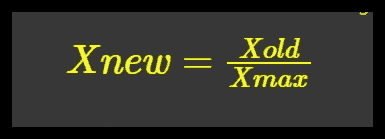
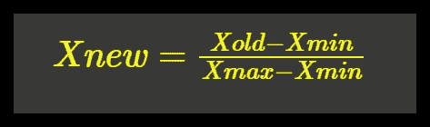
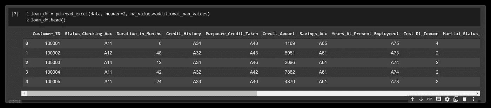
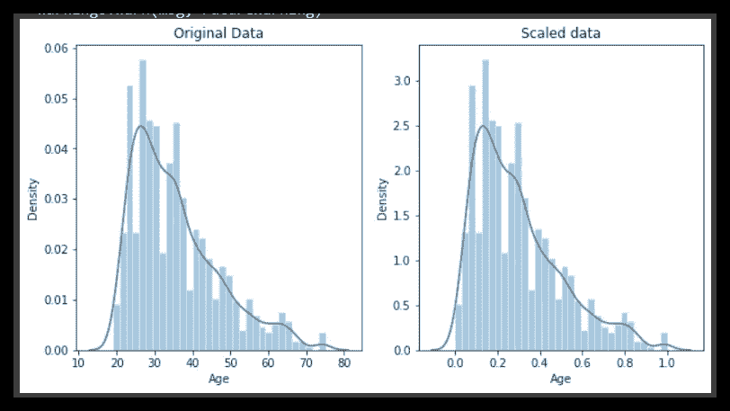
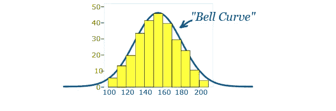
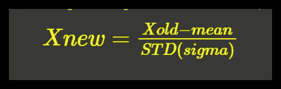
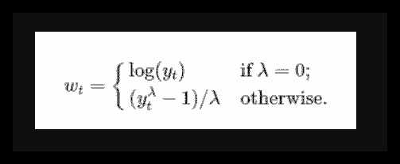
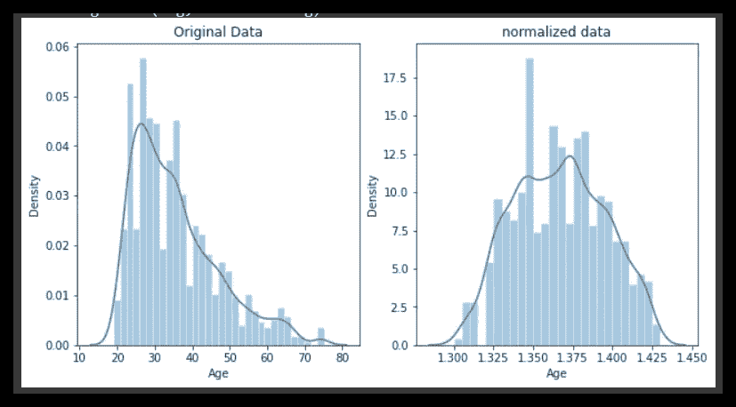
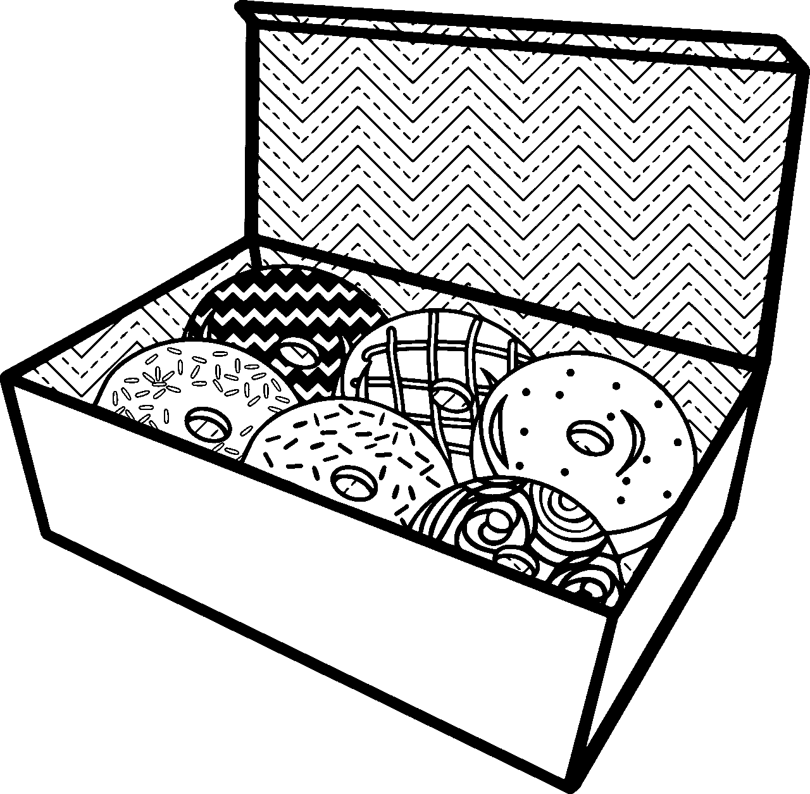
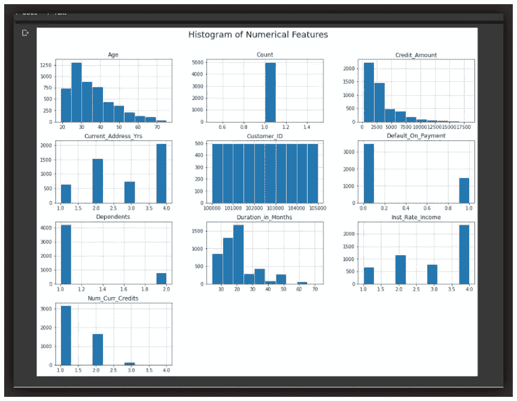

# 缩放与规范化数据

> 原文：<https://pub.towardsai.net/scaling-vs-normalizing-data-5c3514887a84?source=collection_archive---------0----------------------->

## [数据科学](https://towardsai.net/p/category/data-science)

## 了解何时应用一种或另一种…

来自 [pixabay](https://pixabay.com/images/id-154516/) 的免费图片

# 简介:

当涉及到数据探索和模型构建时，有多种方法来执行某些任务，并且通常都归结于数据科学家的目标、经验或天赋。

> 例如，您可能希望通过 **L1** (曼哈顿距离)或 **L2** (欧几里德距离)或甚至两者的组合来规范化数据。

交换数据科学中的某些术语是常见的做法。*方法*经常与*功能*互换，反之亦然。它们有相似的含义，但是根据行为，函数接受一个或多个参数，而方法通常在对象上被调用…

**打印(' hello')** #功能

**df.head()** #方法

我们在单词 ***中看到同样的相互作用，意思是*** 和 ***平均*** …

> “**表示**”和“**平均**”这两个词经常互换使用。用一个词代替另一个词是常见的做法。技术术语是“算术平均值”，“平均”在技术上是一个中心位置。然而，在实践中，在非统计人员中，“平均值”通常被认为是“算术平均值”([openstax.org](https://openstax.org/books/introductory-statistics/pages/1-1-definitions-of-statistics-probability-and-key-terms))

# 概述:

缩放和规范化经常互换使用。更有趣的是，缩放和规范化非常相似！

# 相似之处:

来自 [pixabay](https://pixabay.com/images/id-941625/) 的免费图片

在缩放和规范化中，您都在转换数值变量的值，以便转换后的数据点具有特定的有用属性。可以利用这些属性来创建更好的特征和模型。

# 差异:

来自 [pixabay](https://pixabay.com/images/id-580333/) 的免费图片

在缩放中，我们改变了数据分布的**范围**…而在归一化中，我们改变了数据分布的**形状**。

> 范围是分布中最小和最大元素之间的差值。

缩放和归一化非常相似，因此它们通常可以互换使用，但是正如我们从定义中看到的，它们对数据有不同的影响。作为数据专业人员，我们需要了解这些差异，更重要的是，知道何时应用一个而不是另一个。

# 我们为什么要扩展数据？

请记住，在缩放时，我们会转换数据，使其符合特定的比例，如 0-100 或 0-1。通常是 0-1。您希望缩放数据，尤其是当您使用基于数据点之间距离的测量方法时。

> 例如，当使用[支持向量机(SVM)](https://en.wikipedia.org/wiki/Support_vector_machine) 或聚类算法如[k-最近邻(KNN)](https://en.wikipedia.org/wiki/K-nearest_neighbors_algorithm) …

利用这些算法，任何数字特征中的“1”的变化被赋予相同的重要性。让我们举一个来自 [Kaggle](https://www.kaggle.com/alexisbcook/scaling-and-normalization) 的例子。

> 假设您正在查看一些产品的日元和美元价格。一美元大约值 100 日元，但是如果你不调整你的价格，像 SVM 或 KNN 这样的算法会认为 1 日元的差价和 1 美元的差价一样重要！

这显然不符合我们对世界的直觉。因此，一般来说，我们可能需要为机器学习问题缩放数据，以便所有变量都具有非常相似的分布范围，以避免此类问题。

> 通过调整变量，你可以平等地比较不同的变量...(****)****

# **一些常见的缩放类型:**

## ****1。简单特征缩放:****

****

**该方法简单地将每个值除以该特征的最大值…结果值在零(0)和一(1)之间**

**简单特征缩放是用于图像数据的实际缩放方法。当我们通过将每个图像除以 255(最大图像像素强度)来缩放图像时**

**让我们定义一个简单的特征缩放函数…**

**我们可以看到，上面的分布范围[1，10]通过简单特征缩放很容易地缩放到范围[0.1，1]。**

## **2.最小-最大缩放:**

****

**这比简单特征缩放更受欢迎。该缩放器获取每个值，减去最小值，然后除以范围(最大-最小)。
结果值的范围在零(0)和一(1)之间。**

**让我们定义一个最小-最大函数…**

**与之前一样，最小-最大缩放采用范围为[1，10]的分布，并将其缩放到范围[0.0，1]。**

# ****对分布应用缩放:****

**让我们获取一个数据集，并对一个数字特征进行缩放。我们将使用*信用-一家银行* [*信用贷款客户数据集*](https://github.com/Lawrence-Krukrubo/Machine_Learning/blob/master/Loan_Data%20for%20Classification.xlsx?raw=true) *。***

**这一次，我们将使用来自 *mlxtend.preprocessing 的 *minmax_scaling* 函数。*让我们看看数据集的头部。**

****

**好了，为了便于练习，让我们缩放数据的“年龄”栏**

**缩放数据后，我们可以从下图中看到，原始数据集的最小年龄为 19 岁，最大年龄为 75 岁。并且，缩放数据集的最小值为[0。]且最大值为[1。]**

****

> **当我们缩放数据时，唯一改变的是分布的范围…形状和其他属性保持不变。**

# **我们为什么要标准化数据？**

> **正常化是一种更激进的转变。标准化的要点是改变你的观察，使它们可以被描述为正态分布… ( [Kaggle](https://www.kaggle.com/alexisbcook/scaling-and-normalization) )**

**[**正态分布:**](https://en.wikipedia.org/wiki/Normal_distribution) 又名“钟形曲线”，是一种大致相等的观测值落在均值上下，均值和中位数大致相同，越接近均值的观测值越多的特定统计分布。正态分布也称为高斯分布。**

****

**来自[堆栈](https://i.stack.imgur.com/zhYBJ.png)的图像**

**一般来说，如果要使用假设数据呈正态分布的机器学习或统计技术，您需要对数据进行规范化。其中的一些例子包括*线性判别分析* (LDA)和*高斯朴素贝叶斯*。**

****(亲提示:任何名称中带有“高斯”的方法，大概都是假设正态的。)****

> **请注意，在一些统计期刊中，规范化也被称为标准化。标准化的目的是通过考虑每个观察值离平均值的标准差有多远来标准化分布。Z 分数就是一个例子。**

# **一些常见的标准化类型:**

## **1.z 分数或标准分数:**

**对于分布中的每个值，我们减去平均值或均值…
，然后除以标准差。这给出了从大约负 3 到 3 的范围，可能更多或更少。**

****

**我们可以很容易地编码它，让我们定义一个 Z-score 方法…**

**Z 分数标准化的简单定义**

## **2.Box-Cox 归一化；**

****

**图片来源| [链接](https://towardsdatascience.com/box-cox-transformation-explained-51d745e34203)**

**Box-Cox 变换是将非正常[因变量](https://www.statisticshowto.com/dependent-variable-definition/)的[变换](https://calculushowto.com/transformations/)为正常形状。博克斯-考克斯变换是以统计学家乔治·博克斯和大卫·罗克斯比·科克斯的名字命名的，他们在 1964 年合作发表了一篇论文并开发了这项技术……([链接](https://www.statisticshowto.com/box-cox-transformation/#:~:text=A%20Box%20Cox%20transformation%20is,a%20broader%20number%20of%20tests.))**

## **它是如何工作的…**

**box-cox 归一化的核心是一个指数 *lambda (* λ)，它在-5 到 5 之间变化。考虑λ的所有值，并为您的数据选择最佳值；*最佳值*是产生正态分布曲线最佳近似值的值。**

> **对于我们这些有一些 ML 技能的人来说，这个过程类似于调整学习率α(**α)**，以便更好地拟合数据**

**默认情况下，Box-Cox 只适用于正值，但也有一个变量可以逼近负值。见此[链接](https://www.statisticshowto.com/box-cox-transformation/#:~:text=A%20Box%20Cox%20transformation%20is,a%20broader%20number%20of%20tests.)。更多信息请看这篇[文章](https://towardsdatascience.com/box-cox-transformation-explained-51d745e34203)。**

# **对分布应用标准化:**

**让我们继续使用*信用-一个*银行[*信用贷款客户数据集*](https://github.com/Lawrence-Krukrubo/Machine_Learning/blob/master/Loan_Data%20for%20Classification.xlsx?raw=true) *。*这一次，我们将 box cox 变换应用于相同的*年龄*列。我们将使用来自 *scipy.stats* 的 *boxcox()* 函数。**

**所以我们使用 *stats.boxcox()* 函数，该函数返回一个元组，其中规范化的序列作为第一个元素。原始数据集最小值为 19，最大值为 75。而标准化数据集的最小值是 1.300，最大值是 1.4301**

****

**请注意，除了改变年龄分布的范围之外，归一化方法还从根本上将分布的形状转变为大致呈钟形的曲线。**

# **关键要点**

****

**来自 [pixabay](https://pixabay.com/images/id-5846155/) 的免费图像**

1.  **一直看数据，注意数据的分布和形态。使用统计图或散点图，甚至是折线图。**
2.  **一般来说，如果要使用假设数据呈正态分布的机器学习或统计技术，您需要对数据进行规范化。一些例子包括*线性判别分析* (LDA)和高斯朴素贝叶斯。事实上，任何名字中带有*【高斯】*或*【正态】*的方法都可能假设正态性。这也包括像 *PCA* 这样的降维技术。**
3.  **当您使用基于数据点相距多远的测量方法时，您想要缩放数据，如 [*支持向量机(SVM)*](https://en.wikipedia.org/wiki/Support_vector_machine) 或[*k-最近邻(KNN)*](https://en.wikipedia.org/wiki/K-nearest_neighbors_algorithm) 。或者你只是想让你的变量停留在一个统一的范围内，这样一个变量就不会支配另一个变量。**
4.  **通过缩放您的变量，您可以在平等的基础上比较不同的变量。**
5.  **如果你不知道对一个变量使用缩放还是归一化，一个简单的方法是看看你的分布形状…**

****

**例如，查看上面的数值变量的历史图，看起来几乎对称或看起来大致呈钟形弯曲的变量，即使钟形可能是右偏或左偏的，所有这些变量都可以被归一化。这些是变量，如'*年龄'，'信用金额'，'持续时间 _ 月'。***

**而其他看起来相当不统一、相当独特、单峰且不对称的变量，如*‘计数’，*，*‘利率收益’，*，可能会被缩放。**

> **可视化是 EDA 中的关键…如果您通过 *distplot* 或 *histplot，*观察到一些分布是对称的或大致正态的，您可以将这些特征归一化，除非您有充分的理由不这样做。而具有单峰或非对称形状的特征通常可以通过最小-最大或简单特征缩放来缩放。**

# **干杯…**

****鸣谢:** [*IBM 数据分析与 Python 课程*](https://www.coursera.org/learn/data-analysis-with-python/home/welcome) *和* [*数据清洗课程关于 Kaggle*](https://www.kaggle.com/learn/data-cleaning)**

# ***关于我:***

***劳伦斯是技术层的数据专家，对公平和可解释的人工智能和数据科学充满热情。我持有 IBM 的* ***数据科学专业*** *和* ***高级数据科学专业*** *证书。以及****uda city AI nano degree****。我已经使用 ML 和 DL 库进行了几个项目，我喜欢尽可能多地编写函数代码，即使现有的库比比皆是。最后，我从未停止学习、探索、获得认证，并通过有见地的文章分享我的经验……***

**请随时在以下网址找到我**

**[**Github**](https://github.com/Lawrence-Krukrubo)**

**[**Linkedin**](https://www.linkedin.com/in/lawrencekrukrubo/)**

**[**碎碎念**](https://twitter.com/LKrukrubo) *。***