# 扫描 LinkedIn 帖子，使用人工智能分析情绪、观点和趋势

> 原文：<https://pub.towardsai.net/scan-linkedin-posts-to-analyze-emotions-sentiments-and-trends-using-ai-7e9663d612d3?source=collection_archive---------0----------------------->

## 学习如何用几行 Python 代码分析 LinkedIn 帖子，获得有用的见解。

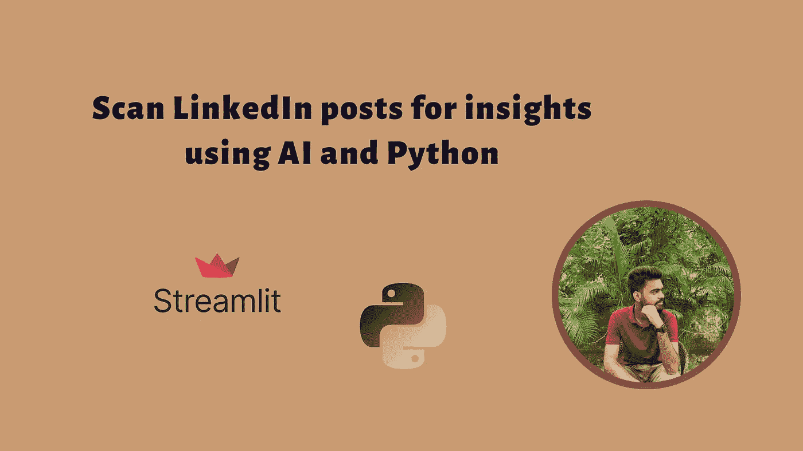

# 介绍

令人难以置信的是，数字世界是如此的动态和不断变化。每隔一天就有新的令人兴奋的事情发生。这从每天都有一些新话题引起人们的兴趣并在社交媒体上引发讨论这一事实中显而易见。今天可能流行的东西明天可能就过时了！

我们先来了解一下什么是潮流话题。社交媒体上的热门话题是比平时谈论得更多的话题。它可以是人们此刻感兴趣的任何事情，基于世界上正在发生的事情。

毫无疑问，社交媒体已经改变了我们相互交流和联系的方式。随着这么多人使用社交媒体，它成为热门话题的温床也就不足为奇了。无论是一个新的迷因，一个有争议的新闻故事，还是一个温暖人心的时刻，社交媒体都是人们分享和讨论世界上发生的事情的地方。由于社交媒体的工作方式，这些话题可以像野火一样传播，从名人到普通人的每个人都参与到对话中。

# 热点趋势分析:为什么重要？

在过去，创建内容的意图是永恒的。这意味着它通常是在没有参考当前趋势或事件的情况下创建的。然而，今天的内容更侧重于实时事件和新闻。营销人员现在利用趋势为自己创造优势，创造更有可能被更广泛的受众分享和看到的内容。这也使他们能够了解品牌目前在客户中的定位，从而使他们能够相应地即兴制作他们的产品和内容。

此外，他们还利用趋势来锁定他们知道更有可能对其内容/产品感兴趣的特定人群。这使得营销资源得到了更有效的利用，内容创作者的投资回报率也更高。

我特别想在这里引用 [Amul 的](http://www.amul.com/index.php)营销策略，以及他们是如何赢得这场游戏的！

在过去，Amul 依靠简单的策略，在墙上和巨大的广告牌上画一个吉祥物，这个吉祥物很容易被画出来，看起来也很有亲和力。然而，为了适应这种不断发展的环境，Amul 对当前的趋势有着敏锐的眼光。

他们通过在热门话题上做广告和吸引大众来利用这些机会。例如，有一次 Amul 在 Twitter 上挖苦 Elon Musk 试图收购。

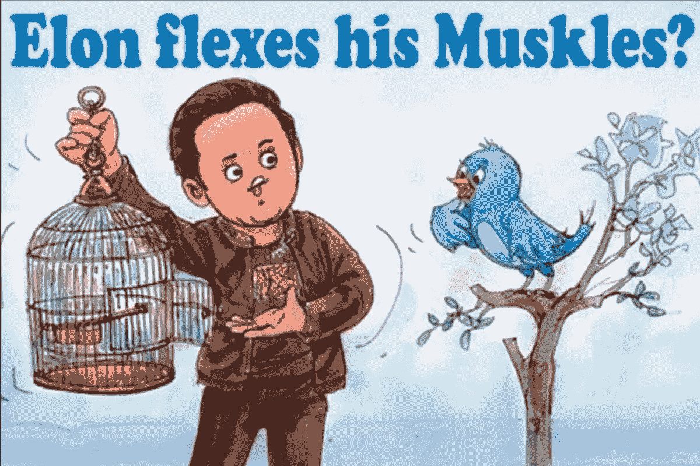

来源: [Amul Instagram](https://www.instagram.com/p/Cc3NL-oocYB/?utm_source=ig_web_copy_link)

或者当你在社交媒体上读到的每一个词都是关于乌贼游戏的时候。

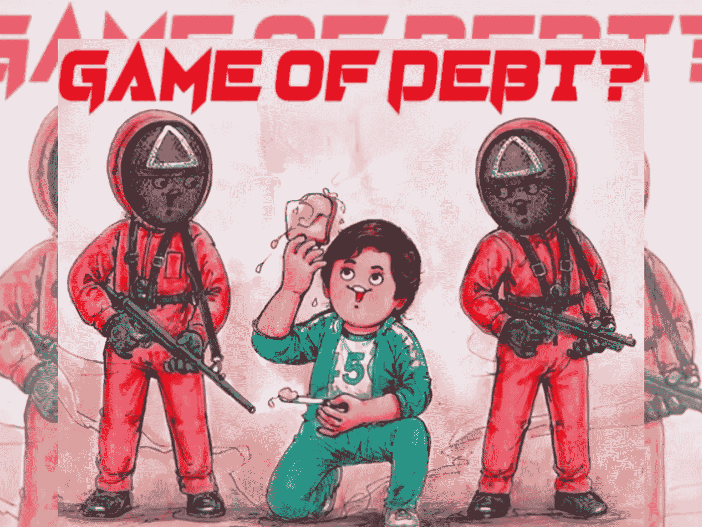

来源: [Amul Instagram](https://www.instagram.com/p/CUwimybIRBL/?utm_source=ig_web_copy_link)

好吧，现在我们明白了监控社交媒体上的热门话题有多重要，我们都知道持续监控有多困难。社交媒体平台上每天产生的海量信息是最大的挑战。如何筛选所有这些信息来识别趋势？此外，社交媒体上的趋势变化非常快，很难跟上它们。最后，社交媒体用户通常是匿名的，这使得识别和接触他们变得困难。那么如何始终保持相关性呢？！

> **如果我告诉你人工智能和几行 Python 代码就能帮你完成这项工作，你会怎么想？🤯**

# OneAI 工作室介绍！

[One AI](https://studio.oneai.com/?utm_source=social&utm_medium=medium&utm_campaign=daniel&utm_term=saboo_pub-towardsai-net-scan-linkedin-posts-to-analyze-emotions-sentiments-and-trends-using-ai-7e9663d612d3) 是一种语言 AI 服务，其中各种预先训练的 NLP 模型被打包并通过 API 提供，支持在上下文中理解语言，并将任何来源的文本转换为结构化数据。一个人工智能工作室能够执行广泛的任务，包括但不限于:

*   转录音频文件
*   生成输入的突出显示
*   主题抽取
*   情感以及情感检测
*   关键词的识别
*   识别行动项目
*   将数据基础技能聚类为参数，如关键词或情感等。

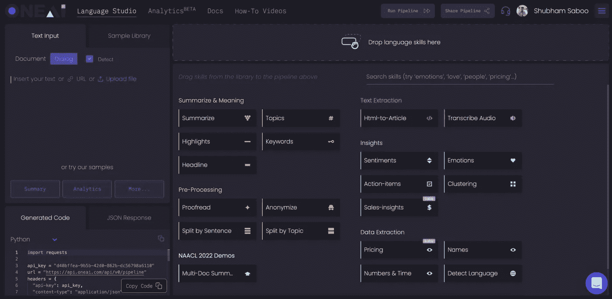

一个 AI 工作室界面

查看我在[上发表的前一篇博文，从利用 OneAI API 的客户支持对话](/detect-business-insights-from-customer-support-conversations-using-ai-b09759144c00)中发现业务洞察。

让我们看看如何使用一个人工智能和 Python 构建一个 streamlit 应用程序来扫描 LinkedIn 帖子，以分析主题、情绪和观点。你所需要的是:

*   Python 的基础知识
*   [流线型](/streamlit-revolutionizing-data-app-creation-e269177d9112)
*   [一个 AI API](https://studio.oneai.com/?utm_source=social&utm_medium=medium&utm_campaign=daniel&utm_term=saboo_pub-towardsai-net-scan-linkedin-posts-to-analyze-emotions-sentiments-and-trends-using-ai-7e9663d612d3)

# 应用程序演练

我们将使用 Streamlit 框架在 python 本身中构建一个漂亮的前端。以下是构建用于分析社交媒体帖子的 Python 应用程序的分步演练:

1.  导入必要的库并从用户处获取 API 密钥。

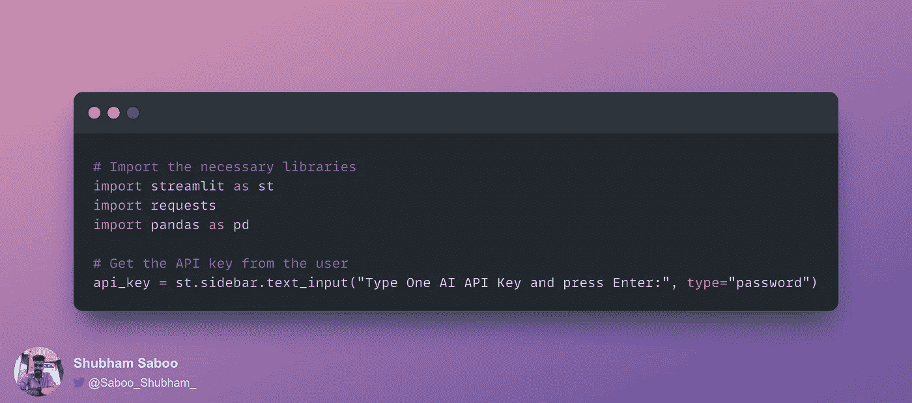

2.从用户处获取 LinkedIn 帖子 URL，并使用 [OneAI API 的](https://studio.oneai.com/?utm_source=social&utm_medium=medium&utm_campaign=daniel&utm_term=saboo_pub-towardsai-net-scan-linkedin-posts-to-analyze-emotions-sentiments-and-trends-using-ai-7e9663d612d3)***“Html-to-Article”***端点提取文本信息。

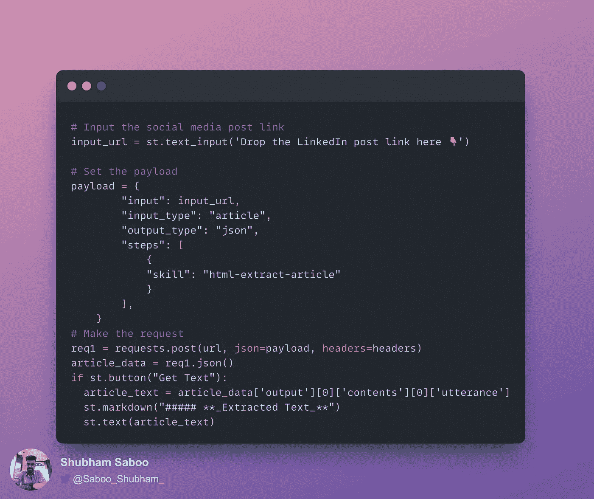

3.创建允许用户在不同智能特性之间进行选择的功能，并将它们作为技能添加到 API 中。

4.设置要发送给 API 的头、API 端点地址和有效负载。使用请求库来访问 API 端点，并获得以 JSON 格式返回的输出。

5.处理 JSON 文件并向最终用户显示输出！

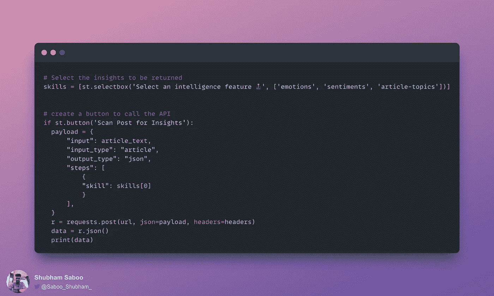

🌟下面是获取源代码的 GitHub 库:

 [## GitHub-Shubhamsaboo/ai-LinkedIn-后扫描仪

### 令人难以置信的是，数字世界是如此的动态和不断变化。有一些新的和令人兴奋的事情正在发生…

github.com](https://github.com/Shubhamsaboo/ai-linkedin-post-scanner) 

这是我们最终应用程序的样子👇

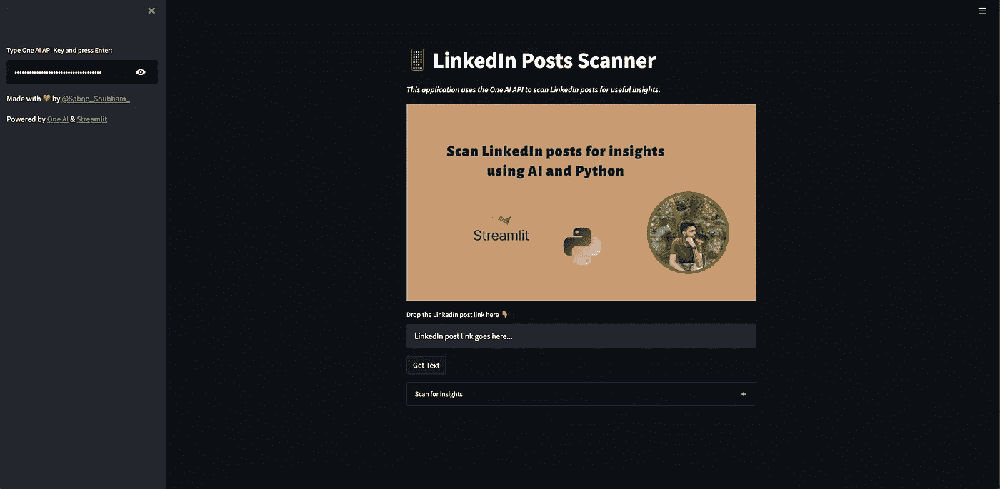

# 🕹人工智能驱动的 LinkedIn 帖子扫描仪正在运行

现在，让我们看看如何在现实世界中使用上述应用程序:

第一步:首先，你必须输入 API 密钥进行认证。复制你的 [One AI API](https://studio.oneai.com/?utm_source=social&utm_medium=medium&utm_campaign=daniel&utm_term=saboo_pub-towardsai-net-scan-linkedin-posts-to-analyze-emotions-sentiments-and-trends-using-ai-7e9663d612d3) Key 并粘贴到侧边栏。

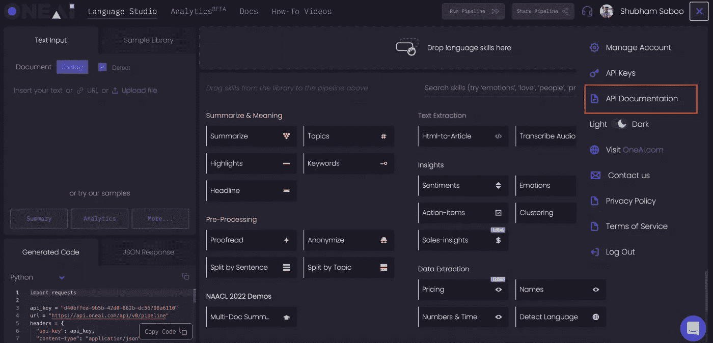

获取 API 密钥(屏幕 1)

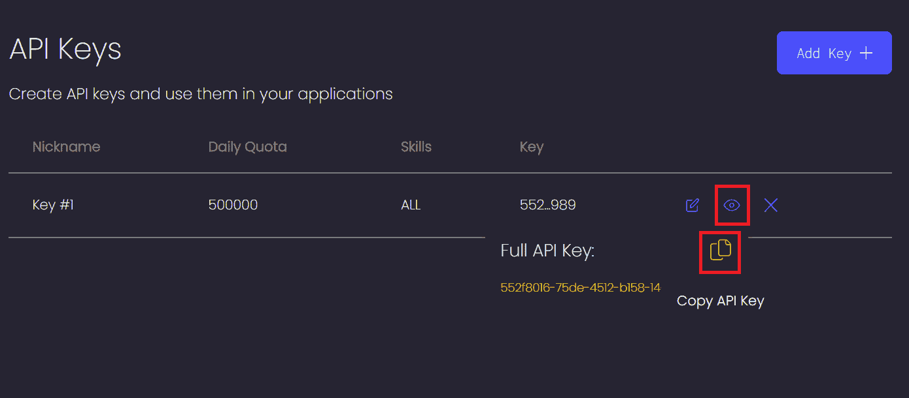

获取 API 密钥(屏幕 2)

将 API 键粘贴到应用程序侧栏中。

第二步:让我们开始行动吧。输入您要扫描的 LinkedIn 帖子的链接。进入链接后，点击 ***获取文本*** 按钮，从文章中提取文本数据。我贴了我下面的 [LinkedIn 帖子](https://www.linkedin.com/posts/shubhamsaboo_indiaat75-future-aheadtogether-activity-6964848055120461825-B5it?utm_source=share&utm_medium=member_desktop)的网址。

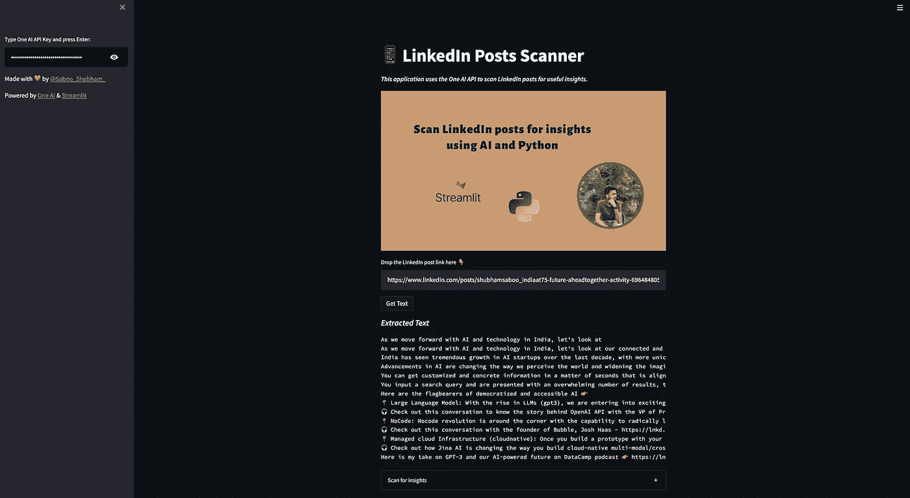

**步骤 3:** 从 LinkedIn 帖子中提取文本数据后，下一步是对这些数据执行一些智能 NLP 任务，以获得有用的见解。您可以对提取的文本执行以下任务。

一. ***情绪检测***

二。 ***情绪检测***

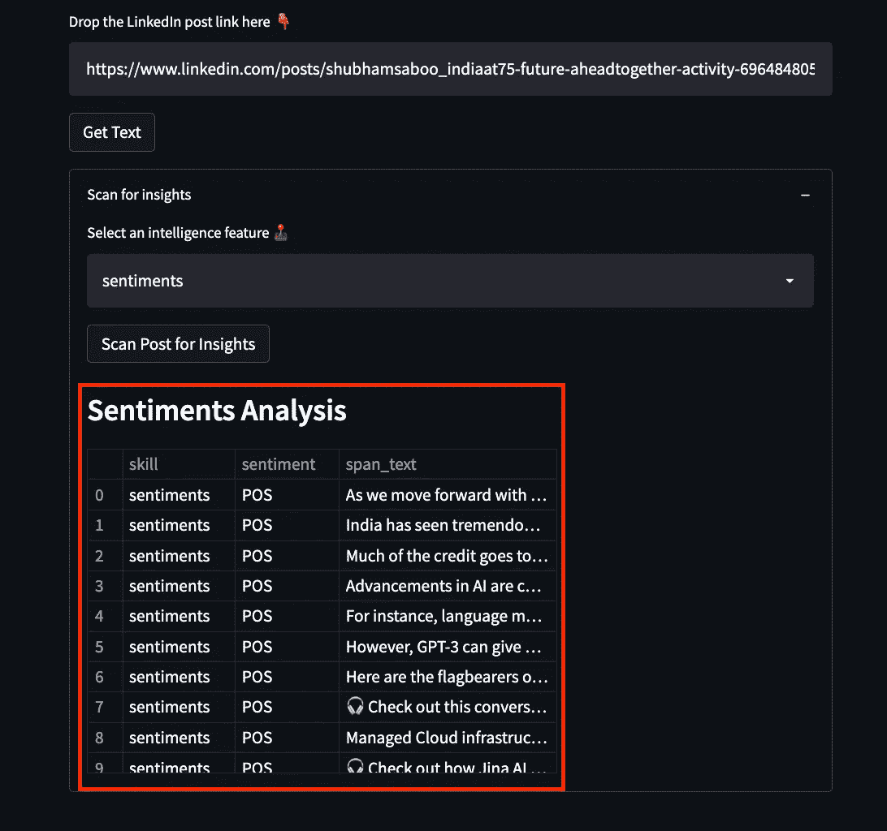

三。 ***话题检测***

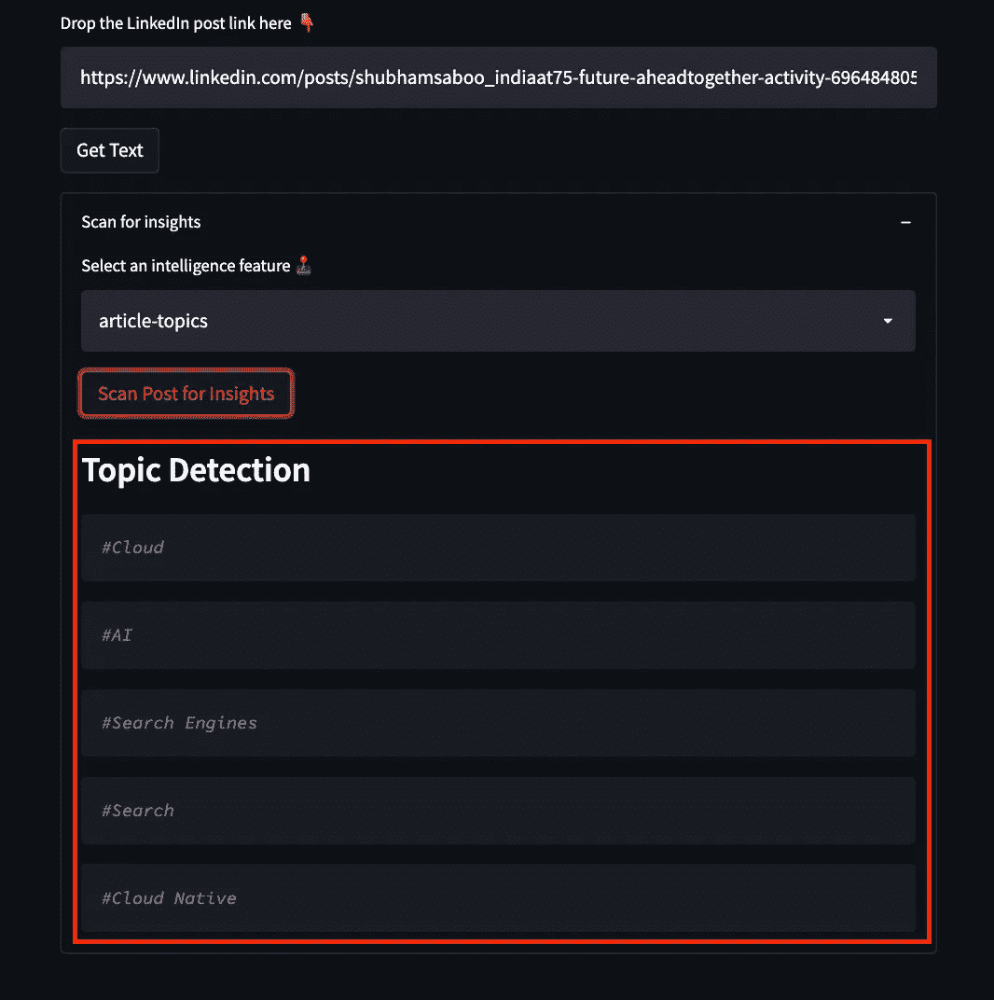

**自己尝试一下**👉[简化应用](https://linkedin-post-scanner.streamlitapp.com/)

# 结论

社交媒体塑造和改变世界的力量显而易见，因为它甚至可以让最平凡的话题成为趋势。无论是一个新的迷因还是一个温暖人心的时刻，社交媒体都有能力让任何事情传播开来。这就是为什么了解社交媒体上发生的趋势和对话如此重要，因为它们可以提供关于人们感兴趣和思考的有价值的见解。

如果你想了解更多或者想让我写更多关于这个主题的东西，请随时联系我们。

我的社交链接:[LinkedIn](https://www.linkedin.com/in/shubhamsaboo/)|[Twitter](https://twitter.com/Saboo_Shubham_)|[Github](https://github.com/Shubhamsaboo)

如果你喜欢这篇文章或觉得它有帮助，请花一分钟按一下拍手按钮，它会增加这篇文章对其他媒体用户的可见性。