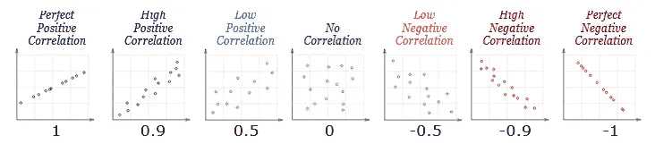
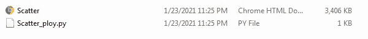
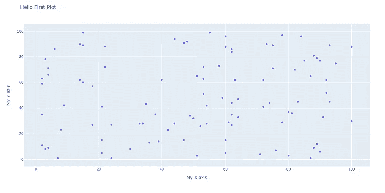
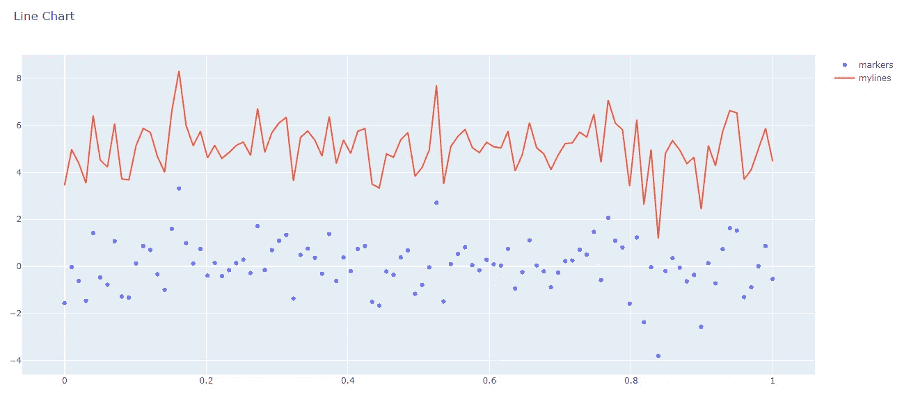

# 使用 Python 在 Plotly 中实现散点图和折线图仪表板

> 原文：<https://pub.towardsai.net/scatter-plot-and-line-chart-dashboard-in-plotly-with-python-4e886ea5f3e6?source=collection_archive---------0----------------------->

## [数据可视化](https://towardsai.net/p/category/data-visualization)

## 用 Plotly 可视化


由[马库斯·温克勒](https://unsplash.com/@markuswinkler?utm_source=medium&utm_medium=referral)在 [Unsplash](https://unsplash.com?utm_source=medium&utm_medium=referral) 上拍摄

为了了解数据的洞察力，我们需要出色的可视化工具。Python 是一种非常有用的编程，可以用预定义的库来可视化数据。有许多有用的可视化库，如:

*   海生的
*   Matplotlib
*   Plotly

matplotlib 是一个基础库，其他库都是在它的基础上构建的。Matplotlib 的想法来自 Matlab 的可视化绘图。它给我们静态图像。matplotlib 包含了几乎所有的情节。

Seaborn 旨在创建一个交互式统计图。它使用 matplotlib 作为后端。使用 python 中的 seaborn 进行可视化非常简单，并且用 python 中较少的行数进行绘图。

Plotly 是一个开源库，创建交互式可视化。Plotly 不仅有 python 语言的库包，还有 R、React、javascript 和其他语言的库包。

[](https://medium.com/towards-artificial-intelligence/become-a-data-scientist-in-2021-with-these-following-steps-5bf70a0fe0a1) [## 按照以下步骤，在 2021 年成为一名数据科学家

### 走上数据科学家之路需要具备的基本点

medium.com](https://medium.com/towards-artificial-intelligence/become-a-data-scientist-in-2021-with-these-following-steps-5bf70a0fe0a1) 

plotly 的另一个特点是 dash，它是一个非常交互式的绘图工具，可以作为 web 应用程序中的仪表板。Dash 是一个开源库，用于创建功能齐全的仪表板。

要了解更多的情节和图表类型，可以访问网站如果[情节](https://plotly.com/python/)。

***额外说明:*** [Power BI](https://medium.com/towards-artificial-intelligence/powerbi-introduction-of-a-visualization-tool-f71c0f81eaf8?source=friends_link&sk=0bc7db343d20e2cbc7ae8d5d851b7bae) 是一款商业智能工具，有助于分析数据，清理数据，并将数据转换为可视化格式。PowerBI 由微软公司开发，2014 年首次发布。

**散点图:**散点图用于两个数值变量之间的相关性，帮助我们从图表中发现洞察力和模式。在下图中，我们可以看到两个特征之间的相关类型。



不同类型数据的相关关系。来自 [mathisfun](https://www.mathsisfun.com/data/correlation.html/) 的照片

让我们看一个使用 python 的散点图和折线图的实际例子。

为此，我对 anaconda 发行版中的代码使用了 spyder IDE。

```
#import the necessary libraries
import numpy as np
import plotly.offline as pyo
import plotly.graph_objs as go
```

如果您的 anaconda 中没有安装 plotly，那么在 anaconda 提示符下通过 ***pip install plotly 进行安装。***

NumPy: [NumPy](https://medium.com/towards-artificial-intelligence/numpy-zero-to-hero-with-python-d135f57d6082?source=friends_link&sk=45c0921423cdcca2f5772f5a5c1568f1) 是一个用于多维数组计算的 python 库包。NumPy 进程比 list 更快，因为它的同构类型在内存中密集打包并执行矢量化。

**Plotly offline** 用于创建一个独立的 HTML 文件，我们可以将其保存在本地，以便在我们的网络浏览器中查看。

**Plotly graph_objs** 用于导入 Plotly 中的所有图形对象。

```
# to generate the data with random number for x and  y axes
np.random.seed(42)
random_x = np.random.randint(1,101,100)
random_y = np.random.randint(1,101,100)
```

Random 用于在 ***randint*** 方法中获取给定范围的随机数。

```
data = [go.Scatter(x = random_x, y = random_y, mode = ‘markers’)]layout = go.Layout(title=’Hello First Plot’,
 xaxis = dict(title=’My X axis’),
 yaxis = dict(title=’My Y axis’),
 hovermode = ‘closest’
 )
```

这里，我们选择散点图对象，因为我们提供了输入数据并选择模式作为标记。标记表示点将显示在图表中。

```
fig = go.Figure(data= data, layout = layout)
pyo.plot(fig, filename = ‘Scatter.html’)
```

图形法用于以适当的图形格式制作数据和布局。plot 方法用于将绘图保存在 HTML 文件中。



保存的 HTML 文件。作者的照片

打开 HTML 文件后，绘图将如下所示。



散点图。作者的照片

折线图是用线条连接标记的一系列数据。这方面的 python 代码如下所示:

```
import numpy as np
import plotly.offline as pyo
import plotly.graph_objs as gonp.random.seed(50)
random_x = np.linspace(0,1,100)
random_y = np.random.randn(100)data0 = go.Scatter(x = random_x, y = random_y, mode = 'markers', name='markers')data1 = go.Scatter(x = random_x, y = random_y+5, mode = 'lines', name='mylines')data = [data0, data1]layout = go.Layout(title='Line Chart')

fig = go.Figure(data= data, layout = layout)
pyo.plot(fig, filename = 'line_chart.html')
```



Plotly 中的折线图。作者的照片

以上是用 python 实现 plotly 的基本剧情可视化。

> ***结论:***

plotly 是一个很棒可视化工具，内嵌了一个 HTML 仪表板。如今，由于世界上海量的数据流，对交互式可视化的需求正在蓬勃发展。

我希望你喜欢这篇文章。通过我的 [LinkedIn](https://www.linkedin.com/in/data-scientist-95040a1ab/) 和 [twitter](https://twitter.com/amitprius) 联系我。

# 推荐文章

1.  [NLP —用 Python 从零到英雄](https://medium.com/towards-artificial-intelligence/nlp-zero-to-hero-with-python-2df6fcebff6e?sk=2231d868766e96b13d1e9d7db6064df1)

2. [Python 数据结构数据类型和对象](https://medium.com/towards-artificial-intelligence/python-data-structures-data-types-and-objects-244d0a86c3cf?sk=42f4b462499f3fc3a160b21e2c94dba6)

3. [MySQL:零到英雄](https://medium.com/towards-artificial-intelligence/mysql-zero-to-hero-with-syntax-of-all-topics-92e700762c7b?source=friends_link&sk=35a3f8dc1cf1ebd1c4d5008a5d12d6a3)

4.[Python 时间序列基础知识](https://medium.com/towards-artificial-intelligence/basic-of-time-series-with-python-a2f7cb451a76?source=friends_link&sk=09d77be2d6b8779973e41ab54ebcf6c5)

5. [NumPy:用 Python 零到英雄](https://medium.com/towards-artificial-intelligence/numpy-zero-to-hero-with-python-d135f57d6082?source=friends_link&sk=45c0921423cdcca2f5772f5a5c1568f1)

6.[用 python 编写的熊猫系列和数据框架基础](https://medium.com/towards-artificial-intelligence/fundamentals-of-series-and-data-frame-in-pandas-with-python-6e0b8a168a0d?source=friends_link&sk=955350bf43c7d1680be6e37b15b6628b)