# 维基百科上收集温室气体数据的友好指南

> 原文：<https://pub.towardsai.net/scraping-a-wikipedia-table-about-greenhouse-gas-600f2990af56?source=collection_archive---------1----------------------->

## [网页抓取](https://towardsai.net/p/category/web-scraping)

## 如何用八元分析法提取表格内容并应用聚类分析

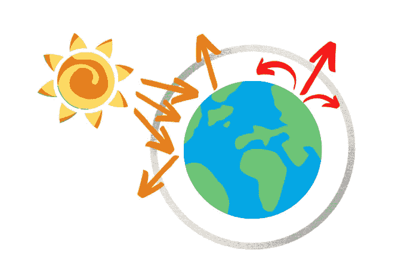

作者插图

***免责声明:*** *本文仅作教育用途。我们不鼓励任何人抓取网站，尤其是那些可能有条款和条件反对此类行为的网站。*

*这篇文章是建造铲运机系列教程的第二篇。下面，是全系列:*

1.  [*网页抓取的 HTML 基础*](https://betterprogramming.pub/understanding-html-basics-for-web-scraping-ae351ee0b3f9)
2.  *用 Octoparse 进行网页抓取(本帖)*
3.  [*用硒刮网*](https://www.analyticsvidhya.com/blog/2021/08/an-intuitive-guide-to-web-scraping-using-selenium/)
4.  [网刮配美汤](https://www.analyticsvidhya.com/blog/2021/08/a-simple-introduction-to-web-scraping-with-beautiful-soup/)

*本系列的目的是学习从网站中提取数据。网站中的大部分数据都是 HTML 格式的，那么第一个教程解释这种标记语言的基础知识。第二个指南展示了使用直观的 web 抓取工具轻松抓取数据的方法，这不需要任何 HTML 知识。相反，上一期教程的重点是使用 Python 从 web 上收集数据。在这种情况下，你需要掌握直接与 HTML 页面进行交互，你需要一些以前的知识。*

气候变化和全球变暖是你每天都能找到的常用词。而这些概念都是和某个东西有联系的。510 亿吨温室气体。所有这些气体都是世界上所有国家产生的。你可以在维基百科页面上找到这些数据。这个表格叫做[温室气体排放国家名单](https://en.wikipedia.org/wiki/List_of_countries_by_greenhouse_gas_emissions)。

你可能会问自己为什么搜集温室气体的数据。我认为数据科学可以有利于获取更多的知识，我们可以直接接触大多数人避免思考的东西。评估我们排放的影响对于未来取得进展至关重要。

实际上，我正在读比尔·盖茨写的《如何避免气候变化》这本书，我开始意识到，与气候变化相比，covid 似乎是一个笑话。很难接受我们的生活方式每天产生 510 亿吨温室气体。怎么可能呢？我建议你阅读这本书，深入了解原因，以及如何找到解决这一紧急情况的建议方案。

无论如何，在这篇文章中，我将使用 [Octoparse](https://www.octoparse.com/) 来提取维基百科中温室气体排放的国家列表。这是一个强大的数据提取软件，使用直观，允许无编码的抓取。我认为，当你以前没有网络抓取的经验，并且你有严格的截止日期要遵守时，它会很有用。一旦我们从维基百科搜集了内容，我们将通过 k-means 算法根据温室气体排放量对国家进行分组，以查看各州之间的相似性/差异。

```
**Table of Contents:**1\. [Check robots.txt](#8dfb)2\. [Let's begin to scrape](#f49c)3\. [Manual Workflow](#0ab7)4\. [Save table data](#dd53)5\. [Cluster analysis](#4021) 
```

# 1.Check robots.txt

在开始刮之前，我们应该在你感兴趣的网站上做一个检查。为了避免不必要的法律影响，查看 robots.txt 文件很重要，它可以在任何网站上找到。这个名字代表机器人排除协议。一个例子是位于 https://it.wikipedia.org/robots.txtT2 的维基百科的 robots.txt 文件。有三种主要情况需要区分。

*表示网站对所有机器人开放，可以完全访问内容。

```
User-agent: *
Disallow: 
```

另一种情况可能是相反的情况，即不可能访问网站的所有数据。在这个例子中，网站屏蔽了对 Googlebot 搜索引擎的所有访问。

```
User-agent: Googlebot
Disallow: /
```

在大多数情况下，只有部分网站不允许。在本例中，它不允许从/media/目录中抓取包含特定参数和数据的搜索结果。

```
User-agent: *
Disallow: /media/
Disallow: /search?q=
```

正如您所推断的，您必须在 URL 的末尾添加“/robots.txt”来检查 robots.txt 文件。

# 2.让我们开始刮吧

要使用[网页抓取工具](https://www.octoparse.com/)，需要下载并在网站注册。注册后，你必须登录到该软件，并在白色栏中复制你的网址，然后点击“找到 1 个有效网址”。

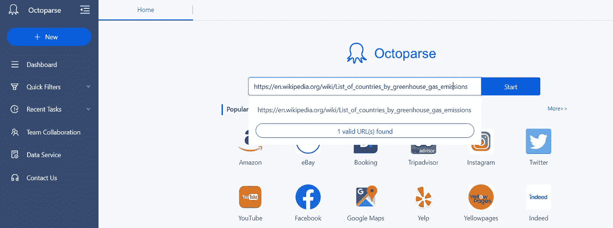

Voilà: Octoparse 将向您展示一个页面，上面列出了 2016 年各国及其相应的温室气体年排放总量。该软件将检测网页，并向您显示数据预览。

在大多数情况下，它会自动识别表格数据，但在这种情况下，表格包含许多空元素，并且它只返回数据预览中第一列的元素。因此，**自动检测器没有收集到所有数据，我们需要手动设置任务**。

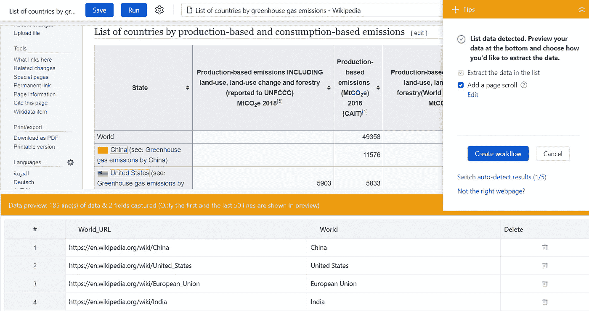

# 3.手动工作流程

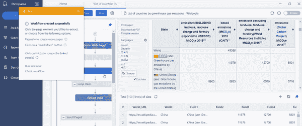

在这种情况下，自动检测失败，我们需要做一个额外的步骤。首先，我们按下“创建工作流”按钮，并选择表格的第一个单元格。我们点击提示面板右下角的图标后，**展开选择区域**。

我们选择第一行的所有单元格，它们将被涂成绿色。这样，Octoparse 将自动选择表格的所有其他行。我们还需要重命名表中的字段。这可以通过直接从数据预览部分进行修改来完成。

我们还可以删除表中不必要的列，并交换列的位置。一旦我们固定了表格，我们可以点击提示面板中的**提取数据**。

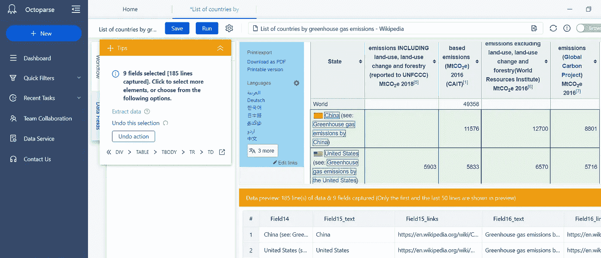

在您按下“提取数据”按钮并更改标题行后，您应该得到以下结果:

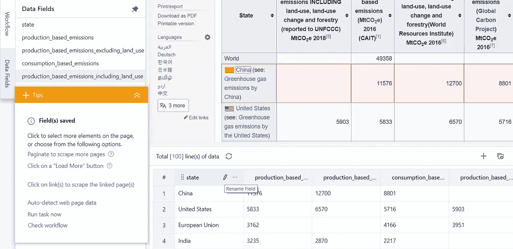

# 4.保存表格数据

要存储软件中显示的数据，我们必须单击顶部与“保存”按钮相邻的“运行”按钮。我们需要进入**运行→在你的设备上运行**。

将会打开一个窗口，Octoparse 将在其中执行我们设置的工作。一旦提取完数据，我们就可以点击底部的“导出数据”了。可用的格式有。xlsx，。csv，。在我的例子中，我选择了. xlsx 格式。

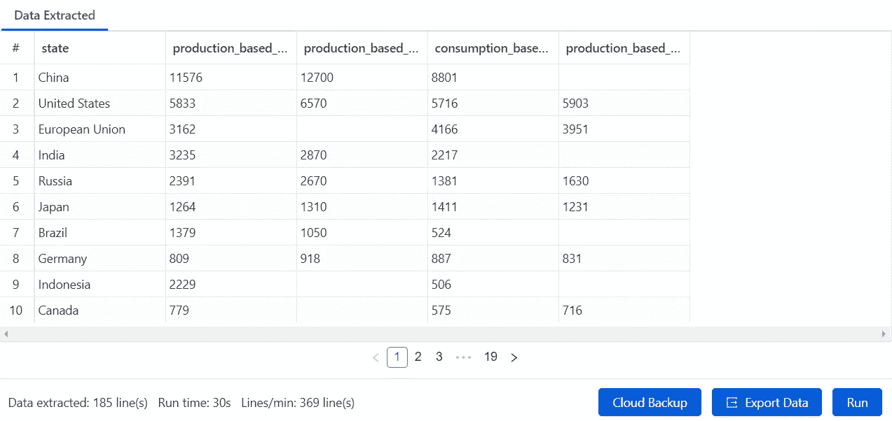

# 5.聚类分析

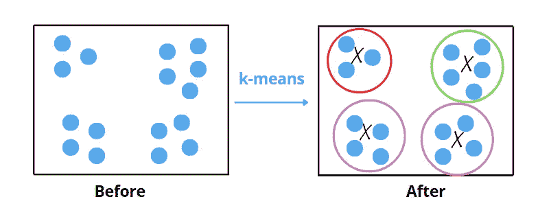

作者插图。

从这些数据中获取更多信息的一个有效方法是将相似的国家分组，同时考虑到温室气体的排放水平。集群的形成也将基于关于**纬度**、**经度、**的轨迹信息，这些轨迹信息可以间接影响 GHG 排放。

我们将应用 **k-means 聚类**，这是最简单也是最常见的无监督方法之一。该算法的名称源自使用**质心**的每个聚类的表示，该质心通常是平均值或加权平均值，在图中表示为“X”。

为了很好地工作，该方法需要先验知识，即 k 的值，即聚类的数量。因此，该算法的目标是找到最小化准则函数的 k 个聚类。它被称为**惯性**或**类内平方和标准**，用于测量类内观察值的可变性。标准越低，聚类越好。

首先，让我们导入在上一步中导出的库和数据集。我将进一步解释与温室气体排放相关的四个领域的含义。基本上，数据集包含了 2016 年每个国家的温室气体年排放总量的信息。二氧化碳是 GHG 中最常见的。其他温室气体是甲烷和一氧化二氮。

该数据集提供了考虑到生产的排放量，包括每个国家的商品和服务消费。最后一栏提供了土地利用、土地利用变化和林业的排放量。你想知道这些特征的单位是什么。这是**百万吨二氧化碳当量** (MtCO2e)。二氧化碳当量的目的是找到一种比较不同温室气体排放量的方法。这种比较是通过将其他气体的量转换成具有相同全球变暖潜能的二氧化碳的当量来实现的[1]。

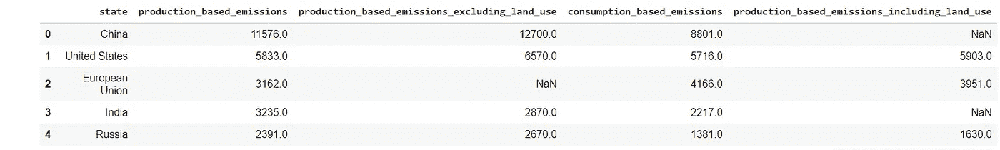

该数据集包含欧洲的单个国家和整个欧盟。此外，我们有多种形式的温室气体排放，彼此高度相关。存在需要移除的冗余特征或行。

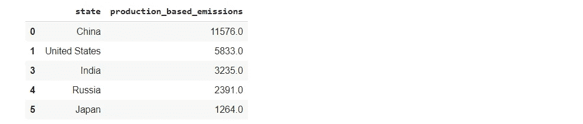

为了识别集群，我想添加国家的地理特征、纬度和经度。用于提取这些坐标的 python 包叫做 [geopy](https://pypi.org/project/geopy/) 。它为地理编码服务提供了类，比如 OpenStreetMap 提名和 Google 地理编码。

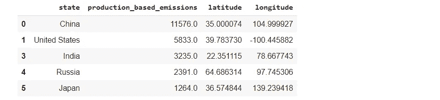

在开始使用 K-means 之前，我们需要缩放我们的特征。我们需要小心缩放纬度和经度，它们分别在-90°和 90°之间以及-180°和 180°之间。解决这个问题的一个方法是**将经纬度映射成 x，y，z 坐标**。使用余弦和正弦，我们可以缩放这些特征[2]。这样，这三个新维度的范围将在-1 和 1 之间。为了具有相同的值范围，我也将在-1 和 1 之间缩放 production_based_emission 变量。

现在，我们终于可以应用 sklearn 库中的 K 均值算法了。我们需要考虑标准函数来选择聚类的数量 k。正如我之前说过的，函数越低，集群内的观测就越不均匀。

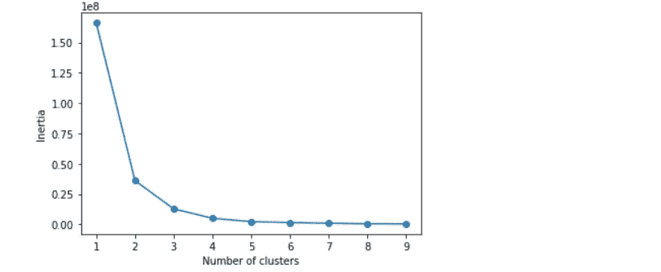

从不同 k 值的失真图来看，很明显 k=4 是算法的一个好选择。

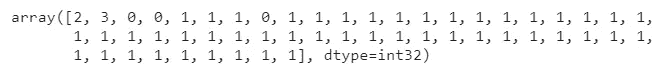

为了快速了解使用 kmeans 获得的结果，我们可以使用图形工具，例如条形图:


我们可以观察到，有一个包含大多数国家的集群，两个由单个观察形成的集群，分别由**中国**和**美国**组成，还有一个集群包含**印尼**、**印度**和**俄国**。但有趣的是，我们可以通过 3D 散点图来了解这些群体的起源:

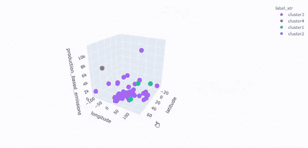

很容易看出，相对于所有剩余的点，聚类 2 和聚类 4 的点确实很远。蓝点和红点分别对应世界上最大的排放国中国和美国。这两个国家在地理位置上也非常遥远，区分得很清楚。与中国和美国相比，类组 3 由排放量较少的国家组成，但其排放量高于类组 4，而类组 4 中的大多数国家属于欧洲联盟。

使用 plotly.express 库中的地理散点图可以获得更清晰的表示。函数 px.scatter_geo 不会通过仅指定国家的名称来自动绘制散点图中的点，但是它还需要通过参数 lon 和 lat 来设置经度和纬度。此外，点数的大小将与温室气体排放量成正比。

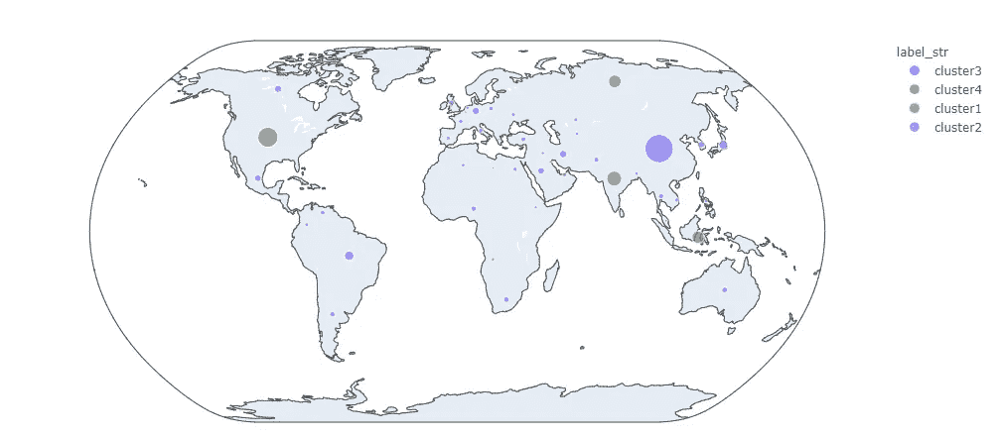

Voilà:我们可以看到由 k-means 算法提取的所有特征的世界地图。

# 最终想法:

恭喜你！你已经发现了八解的潜力。用多了就真的很直观了。在大多数情况下，它会自动检测网站的功能，无需手动步骤。

我希望您也喜欢聚类分析，它为您概述了与气候变化相关的数据的可能的数据科学应用。应该注意的是，这是一个复杂的问题，肯定有更合适的数据集和技术可以使用。我的目标是激发好奇心，打开你的思维。Github 的代码在这里是。

如果你对更完整的全球排放历史感兴趣，我建议你访问网站 [climatewatchdata](https://www.climatewatchdata.org/ghg-emissions?end_year=2018&start_year=1990) 。这是一个免费的平台，提供关于气候变化的公开数据和可视化。

感谢阅读。祝你有愉快的一天。

# 参考资料:

[1][https://EC . Europa . eu/Eurostat/statistics-explained/index . PHP/Glossary:Carbon _ CO2 _ equivalent](https://ec.europa.eu/eurostat/statistics-explained/index.php/Glossary:Carbon_dioxide_equivalent)

[2][https://data science . stack exchange . com/questions/13567/ways-to-deal-with-longitude-latitude-feature](https://datascience.stackexchange.com/questions/13567/ways-to-deal-with-longitude-latitude-feature)