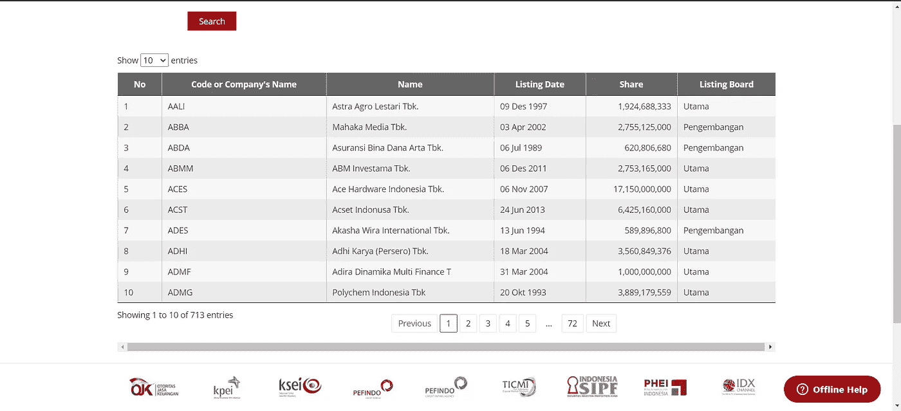
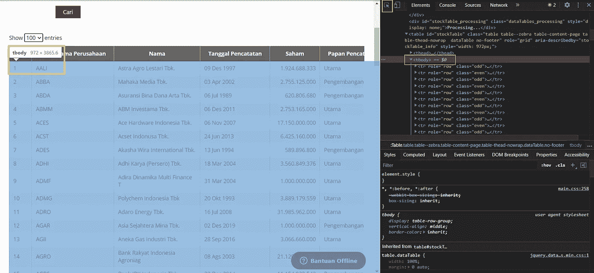
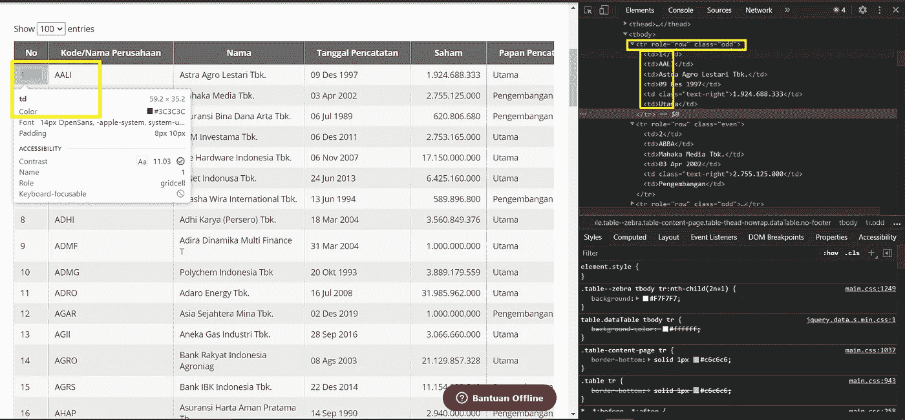
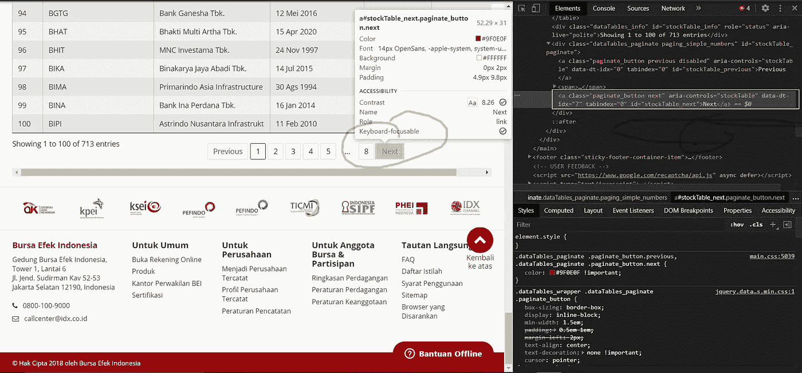
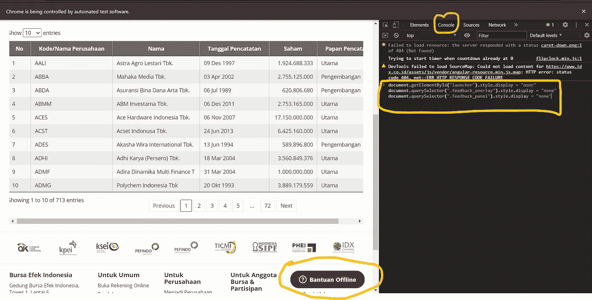
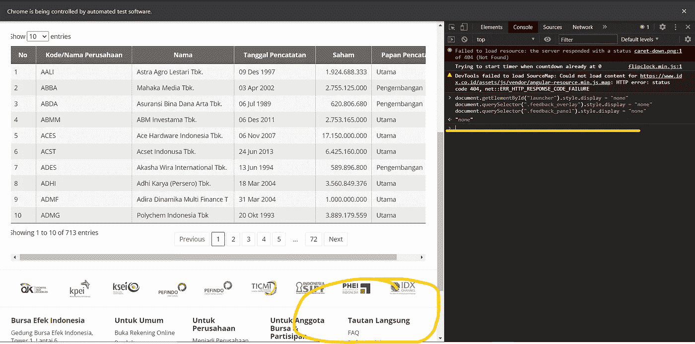

# 抓取印尼股票列表

> 原文：<https://pub.towardsai.net/scraping-the-list-of-indonesian-stocks-4bdb32ffe88?source=collection_archive---------1----------------------->

## [数据挖掘](https://towardsai.net/p/category/data-mining)，[编程](https://towardsai.net/p/category/project-management)

## 用 Python 中的 Selenium 从印尼 IDX 抓取数据


[马约菲](https://unsplash.com/@mayofi?utm_source=unsplash&utm_medium=referral&utm_content=creditCopyText)在 [Unsplash](https://unsplash.com/s/photos/stock-market?utm_source=unsplash&utm_medium=referral&utm_content=creditCopyText) 上的照片

# A.介绍

投资是一种明智的储蓄方式。近十年来，我国股票投资发展迅速。我不会输，想办法找到可以投资股票的地方。最后，我在谷歌上搜索了一下，在 [IDX](https://www.idx.co.id/) ( [印尼证券交易所](https://medium.com/u/8323fa571c12?source=post_page-----4bdb32ffe88--------------------------------))平台上找到了一个股票列表。所以，我找了一份开放股票市场的公司名单，并得到了股票列表。这是表格的样子:



图片截图来自这个[站点](https://www.idx.co.id/en-us/market-data/stocks-data/list-of-stocks/)

好，从表中我们发现有 713 家公司开放了股票市场。我试着收集这些数据来保存它们。这是我关于如何抓取股票列表的步骤。如果你想尝试，请遵循以下大纲:

1.  [先决条件](#19ff)
2.  [导入库](#c884)
3.  [刮削步骤](#722a)
4.  [保存到 CSV](#7562)
5.  [总结](#912e)

# B.讨论

让我们从第一步开始收集数据。

> 1.先决条件

在这些先决条件下，您需要两个库来成功地抓取数据。那里有熊猫和硒。你必须全部安装。这是如何安装在 Jupyter 笔记本。

要安装在 Jupyter 笔记本电脑上的代码

哦，是的。不要忘记下载网络驱动程序。在这里，我们使用的是 chrome 版本的驱动程序。请在此下载[。](https://chromedriver.storage.googleapis.com/index.html?path=88.0.4324.27/)

如果您已经拥有所有这些库，您可以立即按照下面的步骤操作。

> 2.导入库

这是导入库的代码:

导入库的代码

> 3.刮削步骤

> **a .用 python 的 webdriver 打开 URL**

执行下面的代码，用 web 驱动程序打开 URL。这里，我使用 chrome 驱动程序。

在 chrome 驱动程序中打开 URL

> **b .显示 100 行自动档**

*   **在 HTML 语言中搜索关键字，编码到显示 100 行。**

打开网址后，请在你的 chrome 驱动上看到，然后在你的键盘上按下**“ctrl”+“shift”+“I”****。你会发现网页显示了一些 HTML 语言。注意“元素”，下一次点击光标符号。之后，将鼠标悬停在显示的选项上。您将看到元素名称为" **stockTable_length** "我们选择 100 行来显示表格。**


注意红色标志

要通过 Python 显示 100 行，请遵循以下代码:

在 web 上以 100 行显示表格

> **c .获取库存清单表上的值**

*   **在 HTML 语言中搜索显示每个值的关键字**

a.寻找表体的键

我们必须寻找包含该表上所有值的键。好的，再次进入 chrome 驱动程序，将光标悬停在一些值上，搜索包含所有值的键。它看起来像是:



覆盖表中所有值的“tbody”键

太好了，我们成功地找到了包含所有表值的 HTML 键。那个键是" *tbody* "因此，我们可以编写代码来查找标记名，并将它们保存到名为“table_data”的变量中代码如下所示:

```
table_data = driver.find_element_by_tag_name("tbody")
```

b.寻找每个值的键

看下图:



“tr”覆盖行，“td”是值路径

从那张照片上。我们发现“tr”覆盖了行的值和“ *td* ”键上的每个值。所以，我们必须用方法找到这些行。find_elements_by_tag_name('tr ')”。这是代码:

```
table_data.find_elements_by_tag_name("tr")
```

而“tr”则是将“ *td* ”覆盖到每一个值上。我们通过按标记名查找元素来获取值。像这样:

```
find_elements_by_tag_name("td")
```

c.在“下一页”中自动点击

在我们理解了覆盖行上每个值的键之后。我们想自动获取值。我们必须让自动点击下一步。看下图:



“class”HTML 键下的按钮。

从图片中，我们看到 HTML 键上的“下一步”按钮带有“类”的名称。这就是为什么我们必须用下面类似的代码来实现自动化。

```
next_button = driver.find_element_by_class_name("next")
next_button.click()
```

d.将所有代码放入一个循环中，这样就可以将代码刮入 713 中

好的，让循环自动刮擦我们使用 while 循环。在这一节中，我已经组合了代码来查找每一行中的值。因此代码如下所示:

代码循环抓取

*   **删除网站上的启动器反馈**

哦，是的，伙计们，不要忘记删除发射器的反馈。请复制下面的代码，从该网站删除反馈功能。如果我们不删除它，我们将在几种情况下得到错误。

```
document.getElementById("launcher").style.display = "none"
document.querySelector(".feedback_overlay").style.display = "none"
document.querySelector(".feedback_panel").style.display = "none"
```

这是移除反馈启动器的方法。

1.  转到你的 chrome 驱动，它会打开桌面库存列表的 URL。
2.  然后按**“ctrl”+“shift”+“I”，**你会看到有 HTML 语言的元素。请点击菜单栏上的【T2 控制台】。在控制台上，您准备复制+粘贴代码以删除反馈菜单。这个样子是这样的:



注意黄色标志

在底部，你会看到黄色圆圈标志。

当你输入代码时，结果是这样的。哇哦，恭喜你，你成功地移除了像黄色圆圈标志这样的反馈。在那个标志处，我们没有发现反馈“*班团下线*”的样子。



反馈启动器已被移除。

> 4.保存到 CSV

这是保存到 CSV 的代码:

```
df.to_csv('stocks_list.csv', index = **False**)
```

# C.摘要

太好了，我们成功地理解了如何用 selenium 抓取数据。我们可以了解所有在印尼开设股票市场的公司。如果你想看代码的摘要。如果您遇到一些错误，不要忘记删除反馈启动器。

抓取数据的所有代码

希望这对我们有用。我还要感谢我的朋友 Dimas Wihandono，他想和我一起讨论这个话题。

快乐学习！

# D.参考资料:

【1】[白菊木图卡丹](https://medium.com/u/36202a988979?source=post_page-----4bdb32ffe88--------------------------------)，[硒与蟒](https://selenium-python.readthedocs.io/index.html)

【2】[印度尼西亚证券交易所](https://medium.com/u/8323fa571c12?source=post_page-----4bdb32ffe88--------------------------------)，[股票清单](https://www.idx.co.id/en-us/market-data/stocks-data/list-of-stocks/)

[3] [迪马斯·维汉多诺](https://medium.com/u/522f63a5fff8?source=post_page-----4bdb32ffe88--------------------------------)， [idx_selenium_scrap](https://gist.github.com/daimessdn/3f5afd61af481c2bf387367d99701cb7)

[4] [罗尼·法鲁丁](https://medium.com/u/29225fb13c63?source=post_page-----4bdb32ffe88--------------------------------)，[刮数据](https://github.com/ronnyfahrudin/Scraping_data)

# 我的另一个作品:

1.  [ANTM 股票可视化与 Plotly](/antm-stocks-visualization-with-plotly-and-mplfinance-5044dfe73146) & Mplfinance
2.  [机器学习用低码](https://medium.com/towards-artificial-intelligence/machine-learning-with-low-code-75d152172e4b)
3.  [如何轻松安装 Apache Kafka Windows？](https://medium.com/analytics-vidhya/how-to-installing-apache-kafka-on-windows-easily-305ba14502b0)
4.  D [正确检测和处理异常值](https://medium.com/analytics-vidhya/detect-and-handling-outliers-53723d8ec17a)
5.  [Unix 上的 Shell 脚本](https://medium.com/analytics-vidhya/basic-tutorial-shell-scripting-on-unix-65a5051e2e8f)