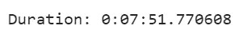
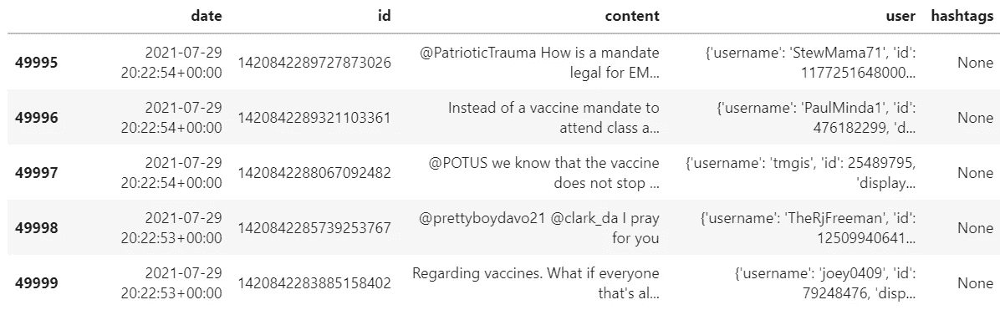
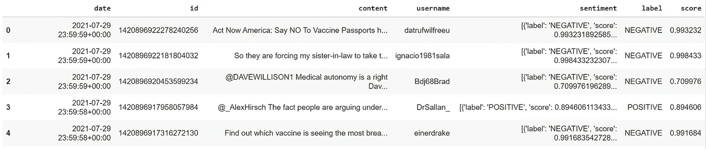
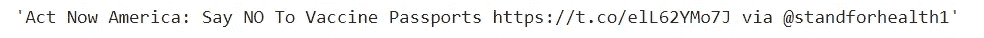
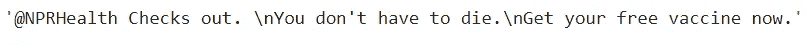
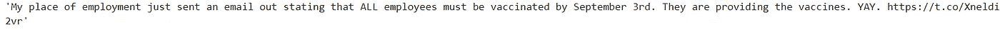
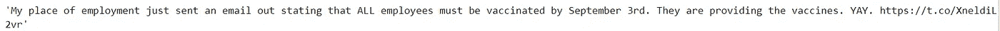
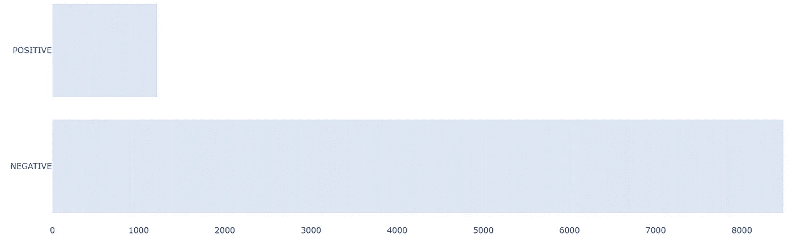

# 使用 snscrape 抓取推文并构建情感分类器

> 原文：<https://pub.towardsai.net/scraping-tweets-using-snscrape-and-building-sentiment-classifier-13811dadd11d?source=collection_archive---------0----------------------->


由[aaron Blanco Tejedor](https://unsplash.com/@innernature?utm_source=unsplash&utm_medium=referral&utm_content=creditCopyText)在 [Unsplash](https://unsplash.com/s/photos/sentiment?utm_source=unsplash&utm_medium=referral&utm_content=creditCopyText) 拍摄

## [自然语言处理](https://towardsai.net/p/category/nlp)

## 使用 snscrape 提取推文，使用拥抱面部管道进行情感分析

最近，我为我的学习做了一些个人项目，需要分析 Twitter 上关于疫苗接种的推文，并找到相同的观点。由于我的全职工作，我不能花太多时间，所以我决定在两周内完成这个项目。我在这个项目中面临的主要挑战是提取推文。

开始这个项目的第一步是从 Twitter 中提取所需的 tweets，然后找到相同的情绪。我决定收集大约 100，000 条推文，并使用名为 **snscrape** 的 python 库进行提取，并使用拥抱面部管道建立情感分析。

在本文中，我将用一行简单的代码向您展示如何使用 snscrape 抓取推文，以及如何使用 HuggingFace 管道进行情感分析。在这里，我将收集一些以#vaccine 为例的推文来撰写这篇文章。

如果我想抓取推文，我会记住两件事:Tweepy 和 Twint。然而，Tweepy 有 3200 条推文的抓取限制，并且不允许提取历史推文。至于 Twint，这是一个很棒的库，我计划用它来收集历史上的推文。然而，我最终面临安装问题，因此，无法这样做。

令人欣慰的是，很快，我遇到了 **snscrape，**一个非常有用的库，它允许用一行相当简单的代码轻松抓取推文。它不需要 API，抓取也没有限制。更多详情请查看 [Github](https://github.com/JustAnotherArchivist/snscrape) 。

`snscrape`需要 Python 3.8 以上版本。

## 装置

我们可以直接用`pip install snscrape`或者用开发者版本`pip install git+https://github.com/JustAnotherArchivist/snscrape.git`安装这个库。最初，我尝试直接安装，但我无法获得一些必要的属性(例如:用户名)。因此，我建议使用开发人员版本安装这个库。创作者在他们的 [Github](https://github.com/JustAnotherArchivist/snscrape) 中也推荐了同样的内容。

```
!pip3 install git+[https://github.com/JustAnotherArchivist/snscrape.git](https://github.com/JustAnotherArchivist/snscrape.git)
```

导入必要的库

```
#Importing necessary library
import snscrape.modules.twitter as sntwitter
import pandas as pd
```

我们将在下面给出的一行简单代码的帮助下提取推文。你也可以[检查](https://github.com/MartinBeckUT/TwitterScraper/blob/master/snscrape/python-wrapper/snscrape-python-wrapper.ipynb)这个用于提取推文的 python 包装器。

```
df = pd.DataFrame(itertools.islice(sntwitter.TwitterSearchScraper(
    '"#vaccine"').get_items(),100))
```

sntwitter。TwitterSearchScraper 是一个生成器，使用 itertool 模块进行提取。我只提取了 100 条 tweets 来检查属性，并将它们存储在一个名为 df 的数据帧中。

```
# Reading the column names from the dataframe to check the attributesdf.columns
```


一般来说，它总共给出了 27 个属性。我只需要日期，ID，推文，用户名和标签。为了保持这篇文章的简洁，我将只收集 2021 年 5 月 1 日至 2021 年 7 月 30 日期间的 5 万条推文。此外，我正在计算获取这些推文所需的时间。

```
**#Importing the datetime to calculate the time for scraping the 50000 tweets**from datetime import datetimestart_time = datetime.now()**#Creating dataframe called 'data' and storing the tweets from May 1st 2021 to 30th Juy 2021 for 'Vaccine'**data = pd.DataFrame(itertools.islice(sntwitter.TwitterSearchScraper(
    '"#vaccine since:2021-05-01 until:2021-07-30"').get_items(), 50000))
end_time = datetime.now()**#Printing the time duration for scraping these tweets**print('Duration: {}'.format(end_time - start_time))
```



作者图片

用了 7 分 51 秒就刮到了 5 万条推文。让我们获取所需的列，并将它们存储在名为“df”的数据帧中。

```
#keeping only date, id, content, user, and hashtag and stored into dataframe called 'df'
df = data[['date', 'id', 'content', 'user', 'hashtags']]
```



作者图片

好了，我们现在有微博了。下一步是弄清楚公众对疫苗的看法。情感分析是找出给定文本是正面的、负面的还是中性的过程。我用拥抱脸变形金刚库做了情绪分析，只有两到三行代码。变压器模型非常大，训练起来也很昂贵，因此，我使用了拥抱面部管道的预训练模型，而不是训练你自己的模型。此外，它有助于更好地理解文本的语义。

让我们看看代码

## 装置

```
!pip install transformers
```

Hugging Face 没有导入整个 transformer 库，而是在库中提供了一个管道，为各种任务(如情感分析、文本生成、摘要等)的各种预训练模型提供一个 API。管道使我们的工作更加顺利。

## 从变压器导入管道

```
#Importing the pipeline from Transformers.
from transformers import pipelinesentiment_classifier = pipeline('sentiment-analysis')
```

当您第一次运行给定的代码时，一个预先训练好的模型及其标记器将被下载并存储在一个名为“情绪分类器”的对象中。默认情况下，情感分析管道使用 [DistillBert](https://huggingface.co/transformers/model_doc/distilbert.html) 模型，并使用斯坦福情感树库 v2 (SST2)数据集进行微调。更多详情，请点击查看[。我们可以使用来自拥抱面](https://huggingface.co/distilbert-base-uncased-finetuned-sst-2-english)[模型中枢](https://huggingface.co/models)的其他模型，绕过管道中的模型参数。

下一步是将我们的推文(内容)传递到管道，并提取分数和情感标签。为了节省计算时间，我将数据集大小减少到 10，000 条记录。

```
**#Taking only 10,000 records and creating new dataframe called df1**df1 = df.head(10000)**# Passing the tweets into the sentiment pipeline and extracting the sentiment score and label**df1 = (df1.assign(sentiment = lambda x: x['content'].apply(lambda s: sentiment_classifier(s))).assign(label = lambda x: x['sentiment'].apply(lambda s: (s[0]['label'])),score = lambda x: x['sentiment'].apply(lambda s: (s[0]['score']))))df1.head()
```

## 输出



作者图片

看到管道有多酷了吧？我们得到了情感分数和标签。关于情绪分析管道，需要注意的一点是，它只提供了两个标签(正面和负面),没有中性标签。我们随机查看一下推文，分析一下情绪。

#检查第一条推文，它被归类为“负面”

```
df1['content'][0]
```



作者图片

它被正确地归类为阴性。

#查看第十条推文，被归类为“正面”。它被正确地分类为阳性



作者图片



作者图片

下面给出的推文被归类为负面。在我看来，应该是正面的或者中性的。



作者图片

这是情感管道中的一个问题，因为特征预训练模型仅用两个类训练:正面和负面。中性缺失。

让我们想象一下这种情绪

```
#Visualizing the sentimentsfig = go.Figure()fig.add_trace(go.Bar(x = df1["score"],y = df1["label"],orientation = "h")) #set orientation to horizontal because we want to flip the x and y-axisfig.update_layout(plot_bgcolor = "white")fig.show()
```



作者图片

似乎 80%的推文表明了对疫苗的负面情绪。我相信大多数中性推文都被加入了负面类别，这是这种预训练模型的一个限制。我们需要详细了解原因，但这完全超出了本文的范围，因为我的主要动机是抓取#vaccine 来演示 snscrape 库的用法。我们可以用我们的数据微调预训练的模型，并检查其准确性。

上面提到的方法，尤其是使用 snscrape 抓取推文，帮助我非常快速地完成了我的项目，而使用 Twitter API 则不费吹灰之力，并且您一定已经观察到了拥抱面部管道是多么强大，让预先训练的模型用一行简单的代码进行情感分析。

你可以在我的 [GitHub repo](https://github.com/sdhilip200/Twitter-Scraping-Sentiment-Analysis) 中找到完整的代码和数据。

感谢阅读。请继续学习，并关注更多内容！

***免责声明:*** *我搜集推文仅出于教育目的。我不鼓励任何人出于任何商业目的抓取 Twitter。*