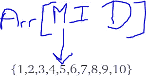
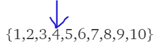

# 使用 Python 中的二分搜索法算法更快地搜索排序后的数据

> 原文：<https://pub.towardsai.net/search-sorted-data-faster-with-the-binary-search-algorithm-in-python-699e82ae8560?source=collection_archive---------0----------------------->

## [编程](https://towardsai.net/p/category/programming)


# 目录

一.解释二分搜索法

二。示例代码

## 一、解释二分搜索法教:

让我们取一组排序后的数据点。请注意，该搜索仅在对数组进行排序时有效:

{1,2,3,4,5,6,7,8,9,10}

这里有 10 个元素。这些的指数从 0 到 9。

假设我们在这个数组中搜索元素 4。如果找到元素，算法应该返回 1。

二分搜索法算法本质上是使用(最高索引+最低索引)//2 的下限划分，在中点将数据集分成两部分

例如(9+0)//2 将等于 4。arr[4]元素是 5。



如果索引 4 处的元素等于我们正在搜索的元素，那么算法将返回答案并停止运行。在这种情况下，5 不是我们要搜索的元素，因此，算法必须继续。为了做到这一点，我们必须检查我们正在搜索的元素是小于还是大于 arr[mid]。在本例中，我们搜索的是小于 5 的 4。因为二分搜索法只对排序后的数组起作用，这意味着我们可以丢弃 5 右边的所有索引，现在只对数组的左半部分起作用。为此，我们将 high 变量更新为 mid-1。我们知道 mid 是前面(低+高)//2 给出的索引号 4。一旦我们将高点更新到 1 中，那么新的高点将是 3。在这一点上，该算法将通过执行(低+高)//2 或(0+3)//2(即 1)来重复自身。

该算法现在将再次检查 arr[1]是否小于或大于我们正在搜索的给定数字 4。在这种情况下，arr[1]是小于 4 的 2。

因为 2 小于 4，所以下限将更新为 mid+1，因为我们知道我们要搜索的数字不能在 mid 的左边。现在低将是 2。算法会再次计算 mid，即(低+高)//2 或(2+3)//2 等于 2。因为 arr[2]是 3，而 3 小于我们正在寻找的数字 4，所以算法会将 low 更新为 mid+1，这意味着 low 现在将是 2+1 = 3。



如您所见，arr[3]是 4，这是我们正在寻找的数字。此时，当我们找到要找的数字时，算法将停止并返回我们想要的结果。

请注意，如果找不到该数字，最终低不会小于或等于高。当下限大于上限时，循环也应该终止，这意味着我们要寻找的数字不在数组中。

## 二。示例代码

好的，让我们用一个例子来做一些编码。

给定一个排序的数组，检查一个整数 K 是否在数组中。如果整数在数组中，输出 1，否则输出-1。数组的大小为 n。

以下是我的解决方案:

```
class Solution:
    ##Complete this function
    def searchInSorted(self,arr, N, K):
        #Your code here
        high = len(arr)-1
        low = 0
        while low<=high:
            mid=(low+high)//2
            if arr[mid]==K:
                return 1
            elif arr[mid]<K:
                low = mid+1
            else:
                high = mid-1
        return -1
```

让我们走一遍。我们有一个数组名为 arr，大小为 n。我们必须找到其中的整数 K。

首先，我们将 high 变量设置为 len(arr)-1。Python 使用从零开始的索引。

这就是它的工作原理。如果数组是{1，2，3}，我键入 len(arr)，python 将返回 will 3，这是数组中元素的个数。但是，数组中的最后一个索引实际上是 12，因为索引是从零开始的。既然高位应该等于最后一个指数，我们必须做:

```
high = len(arr)-1
```

同时，low=0 也可以，因为索引从 0 开始。

让我们设置循环条件:

```
while low<=high:
```

以上将终止循环，因为当 low 变得大于 high 时，我们就找不到元素了。

一旦进入循环，我们就通过进行楼层划分来设置 mid，然后对 3 个条件执行三个 if 语句，如下所示:

```
mid=(low+high)//2
            if arr[mid]==K:
                return 1
            elif arr[mid]<K:
                low = mid+1
            else:
                high = mid-1
        return -1
```

任何时候，我们找到元素 K，它将返回 1，否则，如果小于 K，那么 low 将更新到 mid+1，如果> K，low 将更新到 mid-1。

最后，如果没有发现任何东西，即低变得大于高，它将返回-1。

感谢阅读，

灰

继续阅读我关于旅行推销员问题的文章，这是欧几里得版本唯一已知的数学解决方案:[https://pub . toward sai . net/how-to-shortest-loop-any-euclidean-traveling-Salesman-Problem-c13c 08841 f94？source = friends _ link&sk = 71ea 64847 d6c 2664 b 0 b 4868d 59 f 58188](/how-to-shortest-loop-any-euclidean-travelling-salesman-problem-c13c08841f94?source=friends_link&sk=71ea64847d6c2664b0b4868d59f58188)

参考资料:

1-geeksforgeeks.org