# 正在搜索语义相似度！

> 原文：<https://pub.towardsai.net/searching-for-semantic-similarity-cfbff2388d04?source=collection_archive---------1----------------------->

这篇博文讲的都是我们在交朋友时寻找的东西！除了笑话，在这个项目中，我们将学习如何计算搜索查询和文本数据库之间的相似度。我们还将根据相似性得分对所有数据进行排序，并检索最相似的文本及其索引。

# 背景

在我们开始研究这个项目的工作原理之前，最重要的是理解它的应用和用途。实际上，我们整天都会遇到相似性算法，有些是高级的，有些是非常基础和有用的，比如余弦相似性。技术-法律领域的数据，比如专利，在这个任务声明中起了很大的作用，用来搜索重叠的技术或发明。

虽然搜索方法可以是基于*语料库的*，即依靠更大的信息语料库来绘制概念之间的语义，或者是基于*深度学习的*，即使用神经网络来计算嵌入和距离。[1]

在这篇博客中，我们将讨论这两种方法中的一个例子，因为我们了解余弦相似性如何帮助我们利用这两种不同嵌入方法之间的距离信息。

# 数据集和预处理

在我们的实验中，我们查看了[堆栈溢出问题数据集](https://www.kaggle.com/code/heyytanay/stack-overflow-qa-classification-87-acc/data?scriptVersionId=41836410)，试图找到与我们的查询相似的问题。该数据集包含 2016 年至 2020 年的 60，000 个堆栈溢出问题。

我们使用函数 **read_sc** 来读取我们的搜索标准，该标准可以作为字符串输入，也可以作为包含它的文本文件的路径输入，函数 **clean** 将输入文件加载到 dataframe 中。

对于基于语料库的嵌入，如 Word2Vec 和 fastText，文本预处理起着关键作用。虽然特定领域的处理技术(如引入文本的缩写或缩写的扩展)改进了算法，但我们的数据相对干净，因此我们选择标准的 NLP 预处理技术。

下面的函数接受一个字符串作为输入，删除标点符号和停用词，并返回一个标记列表。

既然我们已经了解了如何获取输入并对其进行预处理，现在让我们讨论如何在特征空间中保护这些数据，也就是说，创建嵌入！

# 探索嵌入

## 句子-伯特

该算法使用 HuggingFace 的 *paraphrase-MiniLM-L6-v2* 来生成嵌入，该嵌入用于聚类或语义搜索等任务，因为它将短语和段落映射到 384 维的密集向量空间。我们没有使用在部署模型时增加段大小的句子转换器，而是将我们的输入传递给转换器模型，然后在上下文化的单词嵌入之上应用正确的池操作。这个变压器模型也是 DVC 版本。

[](https://huggingface.co/sentence-transformers/paraphrase-MiniLM-L6-v2) [## 变形金刚/释义-迷你版-L6-v2 拥抱脸

### 这是一个句子变形模型:它将句子和段落映射到一个 384 维的密集向量空间，并且可以…

huggingface.co](https://huggingface.co/sentence-transformers/paraphrase-MiniLM-L6-v2) 

## 快速文本

但是当我们已经有了所有优秀的基于 BERT 的嵌入时，为什么还要使用 fastText 呢？谈到长格式文档，没有什么能比得上传统的 fastText！

句子-Bert 嵌入具有 512 个单词片段的共同限制值，并且该长度不能增加。但是当我们使用基于语料库的嵌入时，比如 Word2Vec 或 FastText，我们没有任何这样的限制。FastText 使用字符 n 元语法在更精细的级别上运行，其中单词由字符 n 元语法向量的总和表示，这与 Word2Vec 相反，word 2 vec 在内部利用单词来预测单词。因此，对于 FastText，我们从来不会遇到经典的“词汇表之外”的错误，对于词汇表中没有单词的几种语言，它都工作得很好。

# 用**余弦相似度**计算相似度

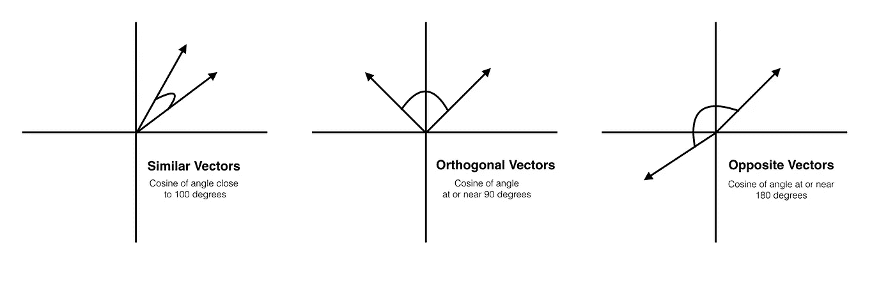

理解余弦相似性([来源](https://www.oreilly.com/library/view/mastering-machine-learning/9781785283451/ba8bef27-953e-42a4-8180-cea152af8118.xhtml))

如上图所示，在余弦相似性的情况下，我们测量两个向量(或嵌入)之间的角度。

还有许多其他的相似性度量，例如欧几里德距离和雅克卡相似性。然而，余弦距离比这些更好，因为它不仅仅是常用词或概念重叠幅度的度量，而且考虑了嵌入空间中向量的方向，因此即使文档大小不可比，它也可以精确地计算它们的相似性。

以上是计算两个向量 *a* 和 *b* 之间余弦相似度的基本函数，供大家参考。我们在代码中探索了基于 *Pytorch* 和 *Scipy 的*余弦相似度函数。

我们计算搜索文本以及我们的数据集中的句子的嵌入，对于句子-bert，我们利用[*util . py torch _ cos _ sim*](https://www.sbert.net/docs/package_reference/util.html)函数，对于 fastText，我们使用[*scipy . spatial . distance . cosine*](https://docs.scipy.org/doc/scipy/reference/generated/scipy.spatial.distance.cosine.html)来计算它们之间的相似度。

# **构建代码**

我们有一个 main.py 文件，它接受模型名称、搜索标准、包含所有数据的文件、要从中搜索相似文本的列的名称等参数。main 函数根据您选择的参数调用为基于 BERT 的嵌入和快速文本嵌入定义的两个类之一。

我们还可以从下面的数据管道中了解结构，DVC 正在跟踪数据和模型。相似性计算文件从*数据*目录获取输入，并使用来自*src*目录的帮助函数。

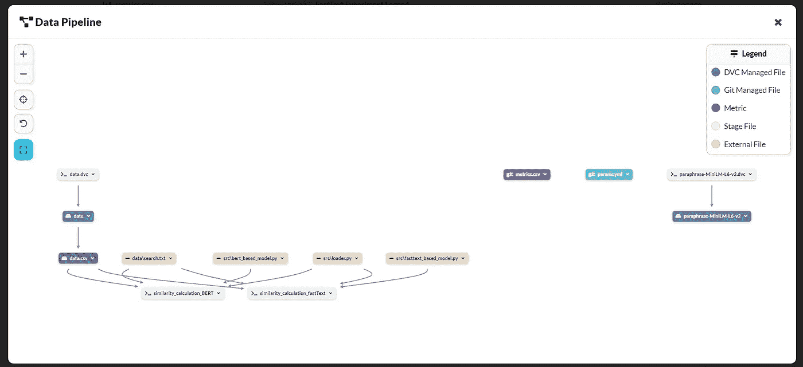

[数据管道](https://dagshub.com/ShambhaviCodes/Semantic_Similarity)

# **分析算法**

由于我们不是在处理传统的监督学习问题，我们训练我们的模型来记录准确性和超参数，因此一个挑战是决定如何记录和评估性能。虽然模型按照与搜索文本的相似性的顺序返回一个排序的输出文件，但我还决定记录两个模型分别评分的最相似的句子及其索引，以了解模型是否以相似的方式捕获语义。一个有趣的比较参数也可能是计算时间。

我们来取个词组，查查结果！

短语:*为什么 Java 选项是不可变的？*

两种算法返回相同的值，其中所选匹配具有几乎相同的分数。

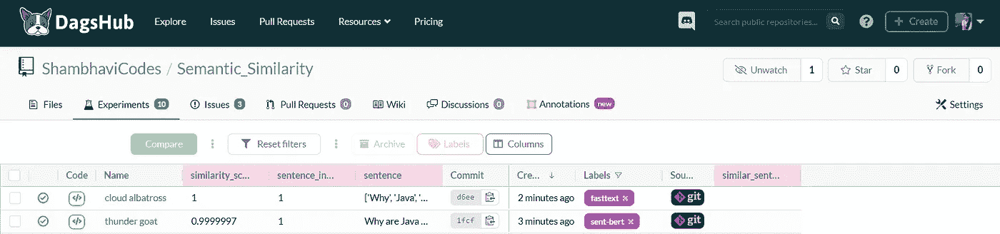

Sent-BERT 和 FastText 的日志

# 现在是 Streamlit 应用程序！

要自己尝试该项目，请克隆存储库并启动应用程序:

```
pip install -r requirements.txt
streamlit **run** app.py
```

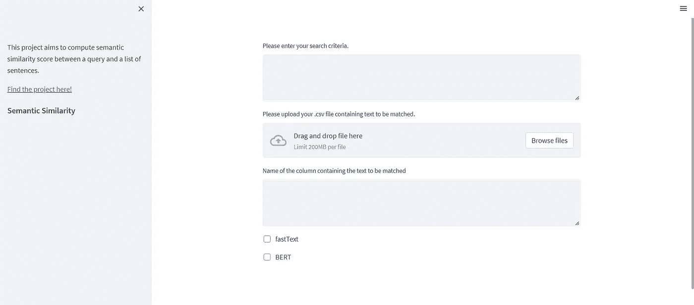

用于相似性计算的 Streamlit 应用程序

只需输入您想要查找的文本字符串和。“csv”文件，您要查看其中的内容。您将需要输入列的名称，并在两个模型之间做出选择！下面是输出的样子:

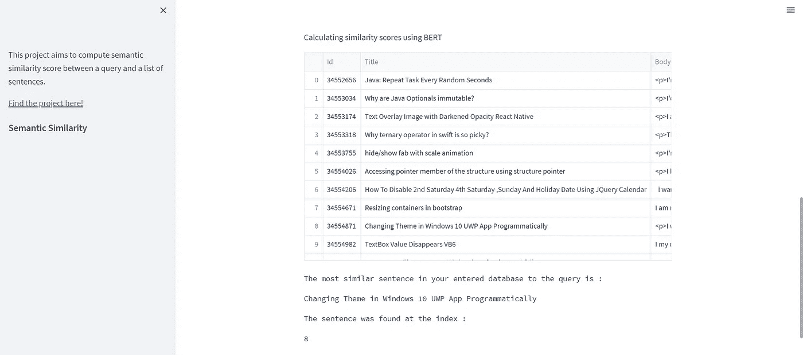

相似性结果:Streamlit WebApp

它易于使用，例如，为了输入数据和运行计算功能，我们使用:

您可以通过[组件](https://docs.streamlit.io/library/components/create)搜索您需要作为输入和输出的数据类型。

# 在 AWS EC2 实例上部署 WebApp

我们决定在 AWS EC2 实例中部署我们的应用程序，而[这个博客](https://towardsdatascience.com/nlp-mlops-project-with-dagshub-deploy-your-streamlit-app-on-aws-ec2-instance-part-2-eb7dcb17b8ba)是它的圣杯。启动 EC2 实例有 5 个步骤:

1.  选择 AMI (Amazon 机器映像)，我们选择符合条件的免费层！

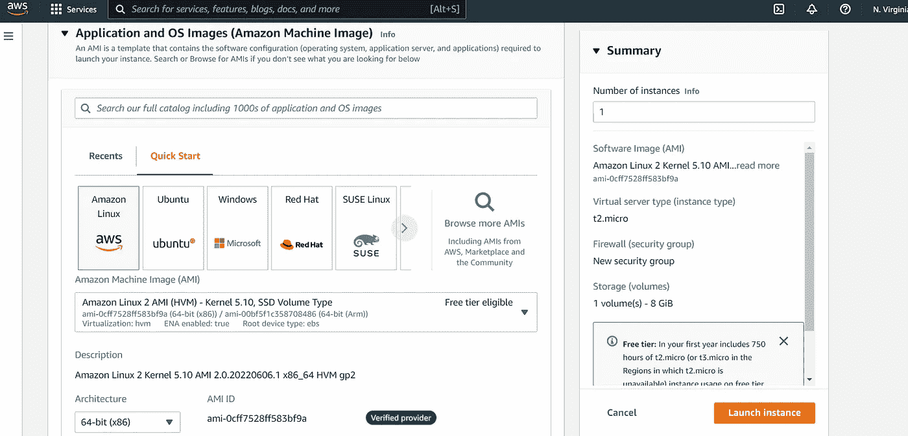

2.接下来，您需要选择一个实例类型。

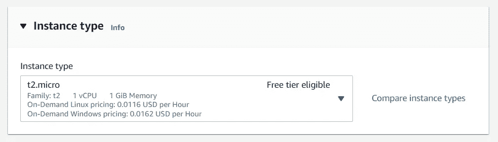

3.创建并下载 RSA 类型的密钥对。

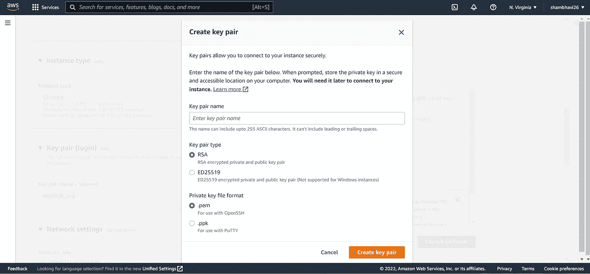

4.现在，我们需要修改网络设置并创建一个新的安全组。您需要命名您的安全组，然后添加两个“自定义 TCP”类型的新规则，并将一个规则的端口范围设置为 8501，另一个规则的端口范围设置为 8502。

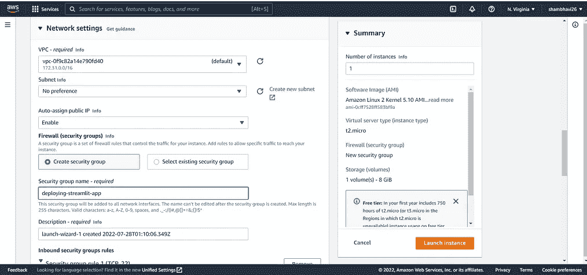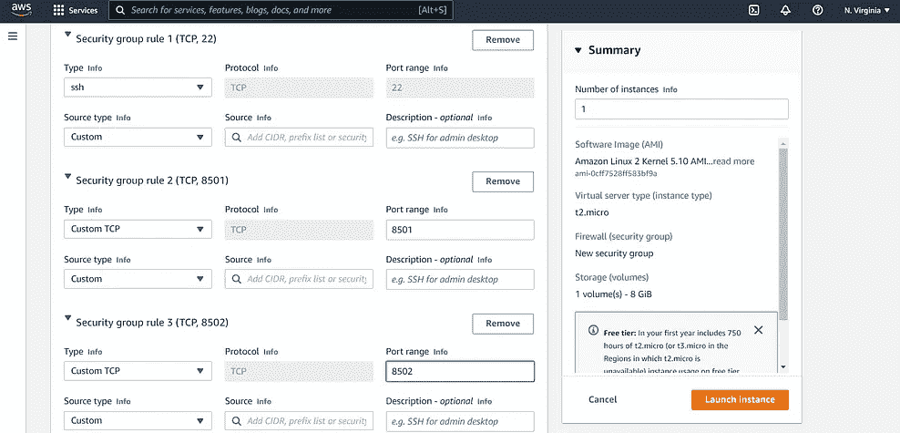

5.现在选择您需要的存储并启动实例！

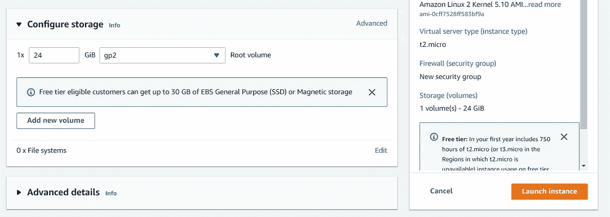

现在您的实例正在运行！

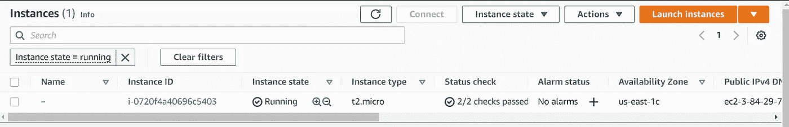

我按照最简单的方法连接到这个实例，您也可以跟着做。:)

只需选择上面的实例并点击连接，终端就在你面前了！

如果您已经完成了，那么您已经将您的模型和数据推送到 DVC(和 dagshub 存储库)，现在我们需要做的就是使用一个简单的脚本来拉模型，该脚本准备 EC2 实例并启动我们的应用程序。我遵循的脚本与上面提到的[博客](https://towardsdatascience.com/nlp-mlops-project-with-dagshub-deploy-your-streamlit-app-on-aws-ec2-instance-part-2-eb7dcb17b8ba)相同:

您还需要一个包含所有这些详细信息的. yaml 文件:

您已经做好了一切准备，这两个命令将启动您的应用程序:

`python prepare_ec2.py`

`streamlit run app.py`

瞧啊。您的端到端项目正在运行。别忘了玩玩这个应用程序。

[**点击这里查看 EC2 上的 app！**](http://3.84.29.70:8501/)

有关完整的代码，请查看该项目:

[](https://dagshub.com/ShambhaviCodes/Semantic_Similarity) [## 香巴拉编码/语义 _ 相似性

### Python 3.8+转换了文本文件中所有指定的需求。克隆此存储库。安装…

dagshub.com](https://dagshub.com/ShambhaviCodes/Semantic_Similarity) 

不要忘记查看问题并做出贡献，如果有任何问题和建议，请随时在 [LinkedIn](https://www.linkedin.com/in/shambhavi-codes/) 或 [Twitter](https://twitter.com/ShambhaviCodes) 上联系我。

参考资料:

1.  [https://arxiv.org/pdf/2004.13820.pdf](https://arxiv.org/pdf/2004.13820.pdf)
2.  [https://towards data science . com/NLP-mlops-project-with-dagshub-deploy-your-streamlit-app-on-AWS-ec2-instance-part-2-EB 7 dcb 17 b 8 ba](https://towardsdatascience.com/nlp-mlops-project-with-dagshub-deploy-your-streamlit-app-on-aws-ec2-instance-part-2-eb7dcb17b8ba)