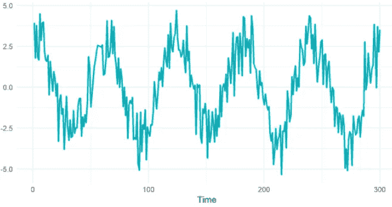
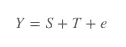
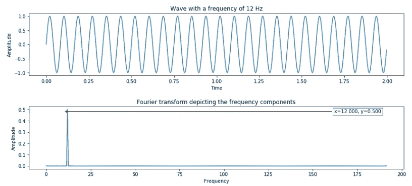
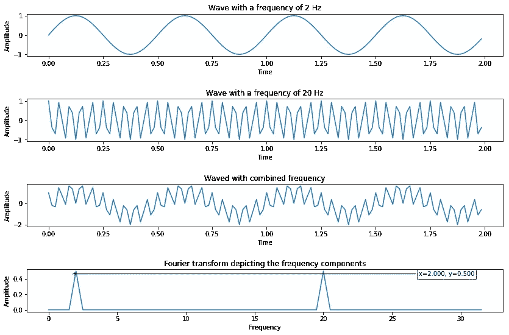
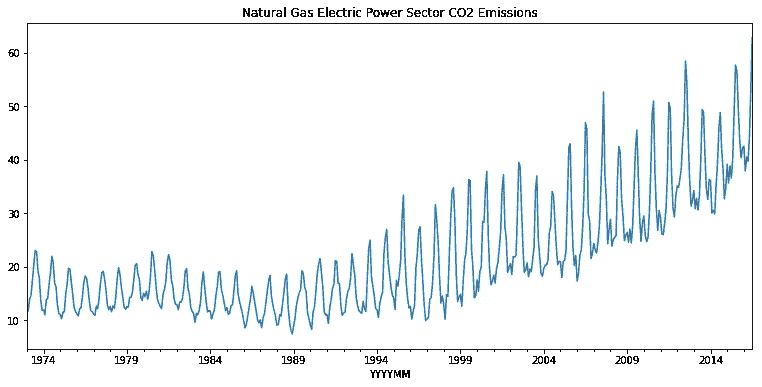
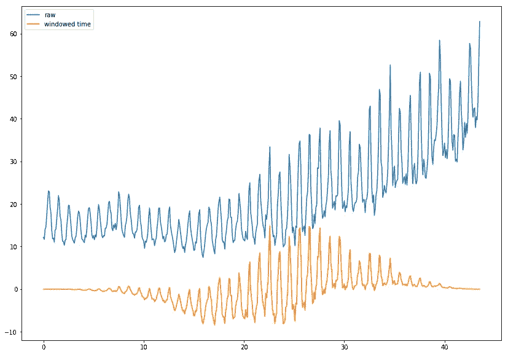
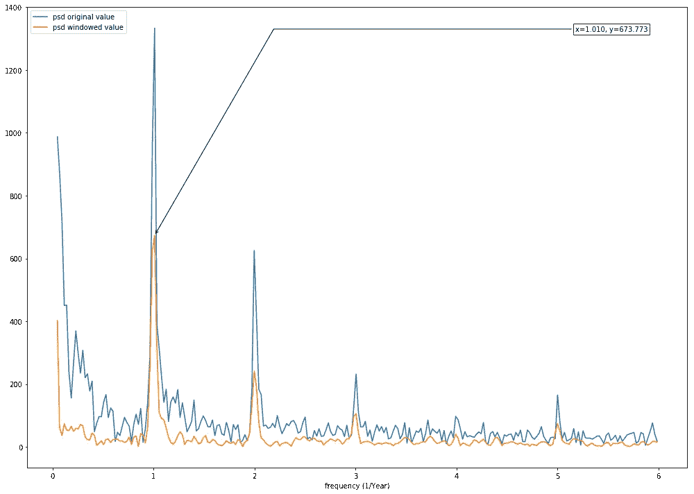

# 基于快速傅立叶变换和 Python 的季节性检测

> 原文：<https://pub.towardsai.net/seasonality-detection-with-fast-fourier-transform-fft-and-python-1021986d1e4f?source=collection_archive---------0----------------------->

## [机器学习](https://towardsai.net/p/category/machine-learning)

## 使用 Python 中的 FFT 快速检测季节性

由[艾萨克·史密斯](https://unsplash.com/@isaacmsmith?utm_source=unsplash&utm_medium=referral&utm_content=creditCopyText)在 [Unsplash](/s/photos/graph-seasonal?utm_source=unsplash&utm_medium=referral&utm_content=creditCopyText) 上拍摄的照片

# 预测

**预测**是根据过去和现在的数据预测未来的过程之一。大多数预测问题与时间序列数据有关(即下个月产品 A 的销售量是多少)。

有些问题可能比其他问题更容易预测。事件或数量的可预测性取决于几个因素，其中包括:

1.  了解对结果有贡献的因素；
2.  数据可用性；
3.  预测技术或学习算法。

通常，有许多方法可以准确地解决预测问题， ***好的预测捕捉到历史数据*** 中存在的真实模式和关系，但不会复制不会再次发生的过去事件。

# 季节性和使用案例

在时间序列数据中，季节性是指存在某些**特定的规则间隔，或取决于特定时间框架(即每周、每月)的可预测的周期性变化**。季节性的一些例子是圣诞节期间较高的销售额，假日期间较高的预订量。

季节性图示例

检测时间序列数据中的季节性可以改进预测，揭示一些隐藏的洞察力，并导致洞察力和建议。一般来说，时间序列数据预测可以表示为:

其中 Y 是度量单位；s 代表季节性；t 代表趋势；e 是误差项。

一些关键的使用案例如下:

*   充值行为；
*   特定页面或应用程序浏览行为；
*   销售和需求预测；
*   温度预报。

有许多方法可以检测时间序列数据中的季节性。然而，在这篇文章中，我们将重点讨论 FFT(快速傅立叶变换)。

# Python 中的 FFT

**快速傅立叶变换** ( **FFT** )是计算序列的离散傅立叶变换(DFT)的算法。它将信号从原始数据(在这种情况下是时间)转换为频域表示。

> 简而言之，傅立叶变换获取基于时间的数据，测量每个可能的周期，并返回总体“周期方案”(找到的每个周期的振幅、偏移和旋转速度)。

让我们用正弦波在 Python 实现中演示一下。

根据脚本，我生成了持续时间为 2 秒的正弦波，有 640 个点(以 32 倍过采样系数采样的 12 Hz 频率波，即 2 x 32 x 10 = 640)。然后，我们可以计算这些数据的 FT，并可视化输出。

12 Hz 正弦波及其 FFT 结果示例

从结果可以看出，FT 提供了正弦波中存在的频率成分。下图显示了我们如何将多个波叠加成一个波，并使用 FFT 来检测峰值。

为了进一步展示傅立叶变换如何帮助检测季节性，下图展示了如何组合两种不同的波，并使用傅立叶变换来检测季节性。FT 分别根据波形 Hz 产生两个峰值。

组合波(2 Hz 正弦波和 20 Hz 余弦波)及其傅立叶变换结果

现在，让我们看看真实用例上的实现。在本次演示中，我们将检测天然气 CO2 排放的季节性。

二氧化碳排放的时间序列图

然后，我们通过用`median()`方法减去并乘以`window`函数值(对该数据使用`blackman`)来标准化原始数据。请注意，窗口函数应与您拥有的数据集相适应，为了进一步研究可用的窗口函数，您可以参考[本](https://sites.google.com/site/stevedtran/course/intro-to-digital-signal-processing/notes2/windowing/type-of-windowing)探索不同类型的窗口函数。

原始数据和标准化数据的比较

现在，我们可以计算 FT 输出并绘制图表，前几个频率点被忽略，因为这些点代表基线，对分析没有用处。

财务测试结果的图形输出

根据输出，我们可以看到 x=1.010 处的强信号，我们可以将其转换为年，即 0.99 年(或 11.89 个月，取决于实施目标)。

# 结束注释

正如我们所见，FT 可以帮助我们捕捉季节性，并可用于分解时间序列数据。FFT 方法也内置在各种软件包中，可以方便地用于任何编程语言。

感谢阅读，快乐学习！！！你可以在这里查看完整代码实现的笔记本。

 [## netsatsawat/tutorial _ FFT _ 季节性 _ 检测

### permalink dissolve GitHub 是超过 5000 万开发人员的家园，他们一起工作来托管和审查代码，管理…

github.com](https://github.com/netsatsawat/tutorial_fft_seasonality_detection/blob/master/FFT%20Tutorial.ipynb)  [## 沙特瓦特·纳塔卡·恩基特库尔- AVP，渣打银行-暹罗商业银行| LinkedIn 高级数据科学家

### 我是一名数据爱好者，利用技术和业务知识来推动和传递对…

www.linkedin.com](https://www.linkedin.com/in/satsawat/)