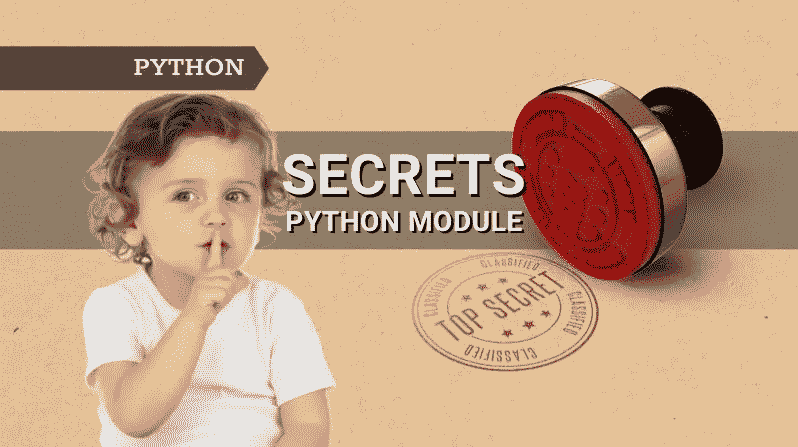

# 秘密——用于生成强随机数和令牌的 Python 模块

> 原文：<https://pub.towardsai.net/secrets-python-module-for-strong-random-number-and-token-generation-39af0392352b?source=collection_archive---------3----------------------->

## [编程](https://towardsai.net/p/category/programming)

## 生成加密的强密码和令牌



作者图片

# 介绍

你知道 Python 有一个名为 **secrets** 的内置模块，可以用来生成加密的强密码、令牌和其他相关的秘密吗？ **secrets** 模块最早是在 **Python 3.6** (PEP 506)中引入的。

在 Python 中引入 **secrets** 模块之前，大多数开发人员使用 **random** 模块来生成密码、令牌等。但是 **random** 模块生成的随机数是伪随机数，不具备密码安全性。因此，Python 3.6 以后引入了**秘密**模块。

你会在 [**随机**](https://docs.python.org/3/library/random.html) 模块官方文档页面看到下面的警告—“*本模块的伪随机发生器不应该用于安全目的。对于安全或加密用途，请参见* `[*secrets*](https://docs.python.org/3/library/secrets.html#module-secrets)` *模块。”*

# 秘密

秘密模块的功能可以分为两个部分——生成随机数的**和生成令牌的**和**。**

## **生成随机数**

**secrets . choice(*sequence*)—**从非空序列中返回随机元素。以下两个示例返回 A-Za-z 范围内的随机字符和 0-10 范围内的随机数。

```
>>> secrets.choice(seq=string.ascii_letters)
'B'>>> secrets.choice(seq=range(10))
2
```

**rand below(*n*)—**返回 0-n(不包括 n)范围内的随机整数。下面的示例返回一个 0-10 范围内的随机整数。

```
>>> secrets.randbelow(exclusive_upper_bound=10)
5
```

**randbits( *k* ) —** 返回一个 k 位随机整数。以下示例返回一个由 8 位组成的随机整数。

*   如果 k=4，那么随机整数将从 0 到 15。
*   如果 k=8，那么随机整数将从 0 到 255。
*   如果 k=16，那么随机整数将从 0 到 65，535，依此类推。

```
>>> secrets.randbits(k=8)
46
```

**SystemRandom() —** 每个操作系统都有一个生成安全且强随机数的来源。 **SystemRandom** 是在 **random** 模块中可用的一个类，该模块反过来使用 **os.urandom()** 函数来生成安全随机数。

在引入 **secrets** 模块之前， **SystemRandom** 类用于生成安全且加密性强的随机数/令牌。事实上，您可以使用 SystemRandom 对象访问所有随机模块函数/方法。

从下面的代码中可以看出，您可以使用 **SystemRandom** 类来访问随机模块函数。您可以尝试随机模块中可用的其他函数/方法。

```
>>> import secrets
>>> sys_random = secrets.SystemRandom()>>> sys_random.choice(seq=range(10))
6>>> sys_random.getrandbits(k=8)
88>>> sys_random.randrange(1, 100)
45>>> sys_random.sample(range(100), 5)
[85, 73, 31, 88, 48]
```

## **生成令牌**

**secrets** 模块还提供了可用于密码重置、难以猜测的 URL 等应用的功能。如下所述。

**token_bytes —** 返回安全随机字节字符串，其字节在 **nbytes** 参数中指定。如果 ***nbytes*** 为 *None* 或未提供，则使用合理的默认值。

```
>>> secrets.token_bytes(16)
b'\xe81\xedT\xfcOP\xe9\x9e\x87\xa4\xec\xa0\xffH9'
```

**token_hex —** 返回十六进制格式的安全随机字节字符串，其字节在 **nbytes** 参数中指定。如果 ***nbytes*** 为 *None* 或未提供，则使用合理的默认值。

```
>>> secrets.token_hex(16)
'6e8b324b58f0d94d5f6440b90c59d350'
```

**token_urlsafe —** 返回一个安全的随机 URL 安全文本字符串，其字节在 **nbytes** 参数中指定。

```
>>> secrets.token_urlsafe(16)
'kJkUOJIUZRAYkEgFR6X52w'
```

## 例子

基于我们从上述函数中获得的知识，我们现在可以创建加密的强密码、OTP、令牌等。让我们看几个用例。

**(1)生成 8 位字符的字母数字密码**

```
>>> import string
>>> import secrets>>> alphabet = string.ascii_letters + string.digits
>>> password = ''.join(secrets.choice(alphabet) for i in range(8))
>>> password
'ubHLOZY1'
```

**(2)生成 6 位数字的动态口令**

```
>>> import string
>>> import secrets>>> numbers = string.digits
>>> OTP = ''.join(secrets.choice(numbers) for i in range(8))
>>> OTP
'904447'
```

**(3)生成 10 个字符的密码，至少包含一个大写字母、一个小写字母、一个数字、一个特殊字符和至少 5 个字母。**

```
>>> import string
>>> import secrets
>>> alphabet = string.ascii_letters + string.digits + string.punctuation>>> while True:
...     password = ''.join(secrets.choice(alphabet) for i in range(10))
...     if (any(c.islower() for c in password)
...             and any(c.isupper() for c in password)
...             and any(c.islower() for c in password)
...             and any(c.isdigit() for c in password)
...             and any(c in string.punctuation for c in password)
...             and sum(c.isalpha() for c in password) >= 5):
...         break>>> password
"hMyo>'A5<="
```

**(4)生成用于密码重置的临时 URL 安全令牌** 假设您可能忘记了某个网站的密码。当您请求密码重置时，在通过用户 id、电子邮件 id 或其他身份验证方法进行身份验证后，您将获得一个用于密码重置的安全 URL。下面是使用 **token_urlsafe** ()的样例代码。

```
>>> print("Password Reset link:")
>>> SecureURL = "[https://mysite.com/user/chetanambi/passwordreset=](https://mysite.com/user/chetanambi/passwordreset=)"
>>> SecureURL += secrets.token_urlsafe(32)
>>> print(SecureURL)
Password Reset link:
[https://mysite.com/user/chetanambi/passwordreset=urtFK4CeJvJ0f7nVbPAAZw](https://mysite.com/user/chetanambi/passwordreset=urtFK4CeJvJ0f7nVbPAAZw)
```

# PRNG 对中国共产党

**PRNG** 代表伪随机数发生器 **CSPRNG** 表示密码强伪随机数发生器。

由任何软件生成的随机数本质上都是伪随机的，因为它们来自某种分布，并且如果种子是已知的，则可以预测。另一方面，真正的随机数使用一些外部来源，这对于随机数生成是不可预测的。Python 中的 CSPRNG 是一个真正的随机数生成器。

# 结论

在本文中，已经向您介绍了 Python **secrets** 模块。secrets 模块用于生成加密性强且安全的密码、OTP、令牌和其他相关机密。Python 中的 **random** 模块也可以用来生成随机数，但是不安全。最后，我希望上面的例子可以帮助你开始使用 secrets 模块。

*原载于 2021 年 11 月 4 日 pythonsimplifed.com***。**

# *进一步阅读*

*   *[Python 中 a=a+b 和 a+=b 的区别](/the-difference-between-a-a-b-and-a-b-in-python-a7338d96e408)*
*   *[用 Faker 和 Python 生成假数据](https://pythonsimplified.com/generate-fake-data-using-faker-and-python/)*
*   *[Python 中 sort()和 sorted()的区别](https://pythonsimplified.com/difference-between-sort-and-sorted-in-python/)*
*   *[最有争议的 Python 的海象算子](https://pythonsimplified.com/the-most-controversial-python-walrus-operator/)*
*   *[了解 Python 中的索引和切片](https://pythonsimplified.com/understanding-indexing-and-slicing-in-python/)*
*   *[理解 Python 中的可迭代项和迭代器](https://pythonsimplified.com/making-sense-of-python-iterables-and-iterators/)*
*   *[理解 Python 中的生成器](https://pythonsimplified.com/understanding-generators-in-python/)*

*我希望你喜欢阅读这篇文章。如果你喜欢我的文章并想订阅 Medium，你可以在这里订阅:*

*[](https://chetanambi.medium.com/membership) [## 通过我的推荐链接加入媒体- Chetan Ambi

### 作为一个媒体会员，你的会员费的一部分会给你阅读的作家，你可以完全接触到每一个故事…

chetanambi.medium.com](https://chetanambi.medium.com/membership)* 

# *参考*

*[1].[https://docs.python.org/3/library/secrets.html](https://docs.python.org/3/library/secrets.html)*

*[2].[https://www.python.org/dev/peps/pep-0506/](https://www.python.org/dev/peps/pep-0506/)*

*[3].https://pynative.com/python-secrets-module/*