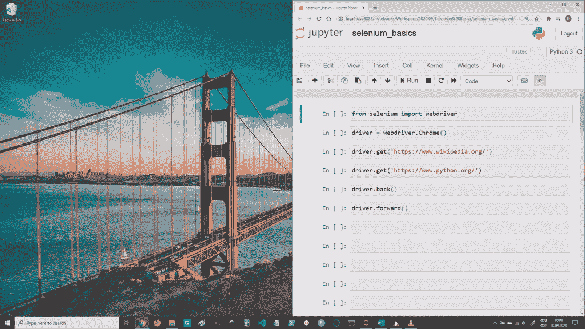
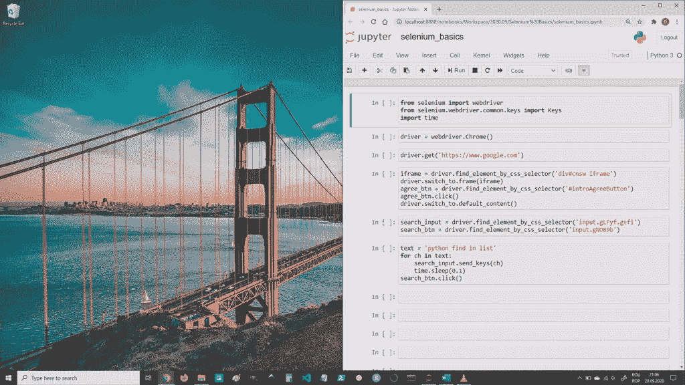

# Selenium WebDriver:用代码浏览网页

> 原文：<https://pub.towardsai.net/selenium-webdriver-browse-the-web-with-code-f064d3556a8?source=collection_archive---------3----------------------->

## [编程](https://towardsai.net/p/category/programming)

## 如何与网站互动并提取数据


背景图片由来自 [Pixabay](https://pixabay.com/?utm_source=link-attribution&utm_medium=referral&utm_campaign=image&utm_content=5290463) 的[马库斯·温克勒](https://pixabay.com/users/viarami-13458823/?utm_source=link-attribution&utm_medium=referral&utm_campaign=image&utm_content=5290463)拍摄

自动化与 Web 浏览器的交互——这就是 Selenium WebDriver 让您做到的。而且这个东西可以有很多用例；其中包括:web 应用程序测试和 web 抓取——这最后一件事是数据科学家最关心的。

Selenium 是一个更强大的 web 抓取工具。其他工具，如 Beautiful Soup，只用于解析静态 HTML 文件并从中提取数据。如果您想要从中提取数据的 web 页面需要您的一些交互来使其数据可用，比如登录或向下滚动，那么这样的解析工具是没有用的。

但是 Selenium 不仅仅是一个解析器。当你请求一个网页时，它实际上打开了你选择的一个浏览器，并进入那个地址。然后你可以从代码中做你通常可以在网络浏览器上做的事情:点击东西，在文本字段中输入，滚动，提取数据，等等。

Selenium WebDriver 可用于更多编程语言:Ruby、Java、Python、C#、JavaScript、+其他非官方支持的语言。但是在本文中，我们将只使用 Python 版本。

现在，让我们来看看如何使用 Selenium 来做这些事情，我们将从它的安装开始。

## 装置

像大多数 Python 包一样，安装非常简单:

```
pip install selenium
```

…或者:

```
conda install selenium
```

但是除了安装 python 包，我们还需要下载一个浏览器驱动程序。浏览器驱动只是由浏览器开发者提供的可执行文件，Selenium 使用它。浏览器驱动可用于以下网络浏览器: [Chrome](https://sites.google.com/a/chromium.org/chromedriver/) 、 [Firefox](https://github.com/mozilla/geckodriver/) 、 [Edge](https://developer.microsoft.com/en-us/microsoft-edge/tools/webdriver/) 、 [Opera](http://choice.opera.com/developer/tools/operadriver/) 和 [Safari](https://developer.apple.com/documentation/webkit/testing_with_webdriver_in_safari) 。

在 Selenium 中使用浏览器之前，我们首先需要下载所需的浏览器驱动程序，将其放入一个文件夹中(如`C:\Users\username\browser_drivers`)，并将该文件夹添加到 PATH 环境变量中。

## 打开浏览器并四处导航

我们首先需要导入 Selenium，然后，要打开特定的 Web 浏览器，只需构建相应的对象:

```
from selenium import webdriver chrome_driver = webdriver.Chrome()firefox_driver = webdriver.Firefox()edge_driver = webdriver.Edge()opera_driver = webdriver.Opera()safari_driver = webdriver.Safari()
```

例如，当我们运行`driver = webdriver.Chrome()`时，Chrome 窗口会立即打开。

如果我们只想抓取一些数据，而不想打开浏览器窗口，我们可以在无头模式下打开浏览器:

```
from selenium import webdriverfrom selenium.webdriver.chrome.options import Options chrome_options = Options()chrome_options.add_argument('--headless')driver = webdriver.Chrome(options=chrome_options)
```

上面的代码将在没有用户界面的情况下打开 Chrome，所以我们不会在屏幕上看到任何东西。

打开浏览器后，我们可以导航到一个网址，就像调用驱动对象上的`.get(“https://www.example.com”)`方法一样简单。

```
driver = webdriver.Chrome()driver.get('https://www.google.com')
```

我们可以使用`.back()`和`.forward()`方法在我们的历史中来回导航。

例如:



作者图片

## 与网页交互

为了与网页交互，我们首先需要定位我们想要的元素，然后我们可以向它发送命令。

Selenium 有一系列方法可以用来识别页面上的元素。

列举其中一些，它们是:

```
element = driver.find_element_by_id(‘…’)element = driver.find_element_by_name(‘…’)element = driver.find_element_by_tag_name(‘…’)element = driver.find_element_by_class_name(‘…’)element = driver.find_element_by_css_selector(‘…’)
```

…以及:

```
elements = driver.find_elements_by_id(‘…’)elements = driver.find_elements_by_name(‘…’)elements = driver.find_elements_by_tag_name(‘…’)elements = driver.find_elements_by_class_name(‘…’)elements = driver.find_elements_by_css_selector(‘…’)
```

第一组方法只返回找到的第一个匹配标准的元素。如果没有这样的元素，则产生一个`NoSuchElementException`。

第二组方法返回所有匹配元素的列表，如果没有这样的元素并且没有引发异常，则返回一个空列表。

这些方法可以在一个驱动对象(由`webdriver.BrowserName()`返回)或另一个元素上调用。

在这些方法中，在我(以及其他了解 CSS 的人)看来最方便的是`.find_element(s)_by_css_selector`。这是因为在 CSS 选择器中，我们可以打包识别页面上的元素所需的所有信息，我们可以用所有其他方法一次完成。也就是说，在 CSS 选择器中，我们可以使用标签名、id、类名、属性和许多其他东西。这里的[是一个关于 CSS 选择器的备忘单，如果你需要的话。](https://www.freecodecamp.org/news/css-selectors-cheat-sheet/)

在我们识别了页面上的一个元素之后，我们可以向它发送几个信号。列举几个，我们可以用`element.click()`点击它，可以用`element.send_keys(…)`在上面按键盘键，也可以用`element.clear()`清除一个文本输入。

`.send_keys(…)`可用于一次发送更多文本数据(`element.send_keys(‘Selenium is cool.’)`)或发送单个按键，如向上/向下箭头(`element.send_keys(Keys.ARROW_DOWN)`)。

以下是使用箭头键滚动的示例:


作者图片

下面是一个在谷歌上搜索东西的例子:



作者图片

现在你可能想知道上面代码中的`driver.switch_to.frame(iframe)`和`driver.switch_to.default_content()`是怎么回事。当您使用 Selenium 在页面中搜索元素时，它会忽略 iframes 中的内容。因此，您需要使用`driver.switch_to.frame(iframe)`来搜索 iframe 中的元素。然后，在您找到您要寻找的内容之后，需要调用`driver.switch_to.default_content()`以便能够找到您先前选择的 iframe 之外的元素。

上面的循环看起来像有人在文本域中输入，但是我们可以用`search_input.send_keys(‘python find in list’)`一次输入所有的文本。

顺便说一下，`.send_keys()`方法也允许通过使用类似 backspace: `search_input.send_keys(Keys.BACKSPACE)`的键来删除文本。

## 从网页中提取数据

当我们在页面上找到一个元素后，主要有三种方法可以从中提取数据:

*   通过`element.text`属性返回 HTML 元素中的文本
*   通过使用`element.get_attribute(attr_name)`我们可以得到一个属性的值，例如 href，class，name。如果没有给定名称的属性，它返回`None`。
*   通过用`element.screenshot(filename)`截屏元素。文件名应该是图像文件的完整路径，包括。png 扩展名。如果有一个`IOError`，该方法返回 False。如果一切正常，则返回 True。

例如，下面我们将提取上面看到的 google 搜索的页面标题和 URL，并将它们放入 pandas 数据框中。

本文到此为止。我希望它让您对 Selenium WebDriver 的能力有了一个很好的了解。

*我希望这些信息对您有用，感谢您的阅读！*

这篇文章也贴在我自己的网站[这里](https://www.nablasquared.com/selenium-webdriver-browse-the-web-with-code/)。随便看看吧！