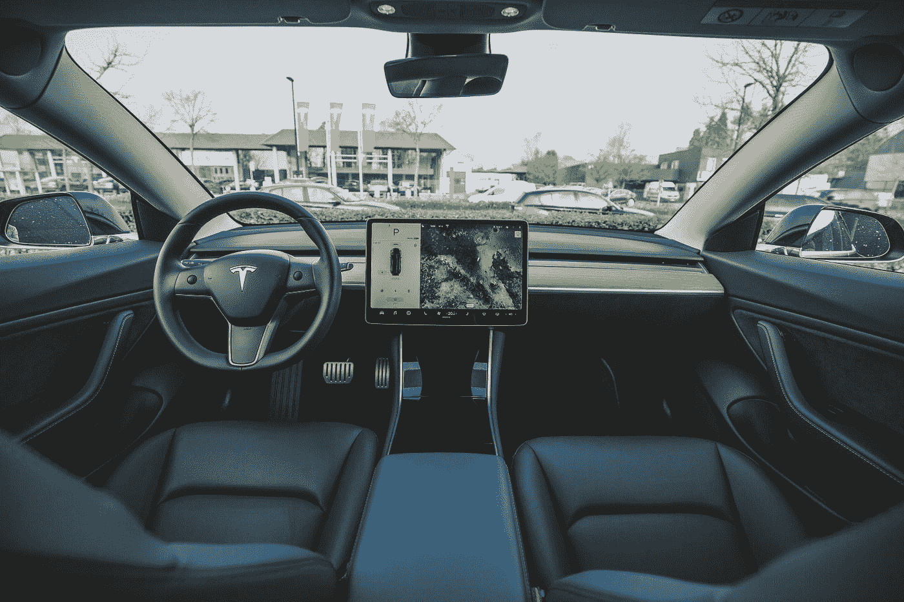
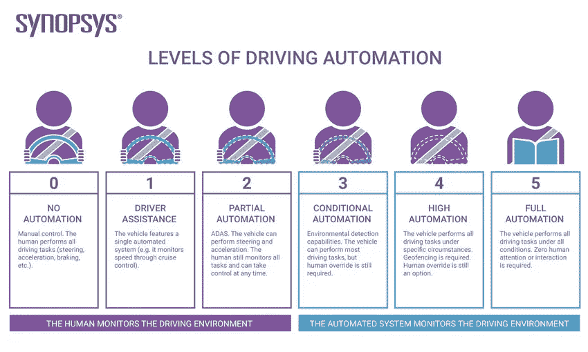
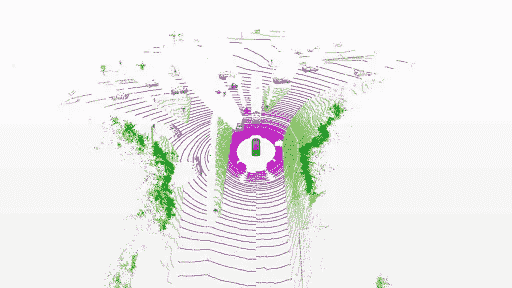

# 自动驾驶汽车简介

> 原文：<https://pub.towardsai.net/self-driving-cars-also-called-autonomous-cars-are-capable-of-driving-with-little-or-no-input-from-4613c7409fdc?source=collection_archive---------0----------------------->

## [自动驾驶汽车](https://towardsai.net/p/category/self-driving-cars)

在 [Unsplash](https://unsplash.com?utm_source=medium&utm_medium=referral) 上由 [Bram Van Oost](https://unsplash.com/@ort?utm_source=medium&utm_medium=referral) 拍摄的照片

**自动驾驶汽车**也称为自主汽车，能够在驾驶员很少或没有输入的情况下驾驶。看到一辆完全自动驾驶的汽车投入使用是人们长久以来的梦想之一。最近，由于人工智能和计算资源领域的进步，“自动驾驶汽车”成为科技界的热门词汇之一。

许多汽车公司，如宝马、博世，以及科技巨头，如 waymo(之前谷歌的自动驾驶汽车项目)、特斯拉、英伟达、高通，都开始投资自动驾驶汽车。

## **那么，为什么要这样炒作呢？为什么需要自动驾驶汽车？**

从每天的事故和死亡来看，大多数时候都是由人为错误造成的。作为一台机器，自动驾驶汽车不太可能犯错误，因此减少了事故。

另一个原因，我认为是舒适惬意的生活方式。想象一下，在办公室完成繁重的工作后，你的车送你回家，而你在车里休息。好极了。

正如一句著名的谚语所说“罗马不是一天建成的”，自动驾驶汽车不可能在给定的时间内发展成那样。多年来，汽车制造商试图改善人们的驾驶和安全，

*   自适应巡航控制
*   驾驶监控
*   高级驾驶员辅助系统
*   车道检测
*   物体探测和接近警报系统
*   速度调节和控制

这些都是一些已经到位的系统，帮助司机提高驾驶体验。这些系统现在将成为完全自动驾驶汽车的子模块。车辆的自主能力由嵌入在车辆/汽车中的系统以及发生任何故障时的后备功能决定。在此基础上，汽车工程师协会(SAE)定义了 6 个不同级别的自动驾驶汽车。

自动驾驶汽车的等级([来源](https://www.synopsys.com/content/dam/synopsys/solutions/automotive/levels-of-driving-automation.jpg.imgw.850.x.jpg)

0、1、2 等较低级别将需要人工监控和驾驶。在 3 级中，车辆可以自己完成一些任务，但在关键情况下仍然需要人工干预。虽然第 4 级和第 5 级是自主的，但第 4 级为驾驶员提供了可选的手动控制，以便在紧急情况下接管。要详细了解自动驾驶汽车的水平，请访问我之前的博客[这里](/levels-of-autonomous-vehicles-b985db67806b)。

# **自动驾驶汽车的模块/系统**

主要有三个系统帮助自动驾驶汽车在环境中行驶。他们是，

*   感觉
*   规划
*   控制

## **感知:**

这个系统负责环境感知。意识到环境。由于来自单一传感器或单一类型传感器的数据不可靠，该系统包含多个传感器，如相机、激光雷达、雷达、声纳等。**摄像头、激光雷达和雷达**是自动驾驶汽车中使用最广泛的传感器。

> **有趣的事实**:一些像 waymo 这样的公司开始使用麦克风作为自动驾驶汽车的耳朵，以听到来自车辆的声音。

## 照相机

摄像头是自动驾驶汽车的眼睛，类似于人类驾驶员的眼睛，对理解环境有重大作用。使用对象检测和分割算法，相机数据用于检测汽车的无障碍路径。相机是一个被动传感器，这意味着它只捕捉来自环境的光线，而不是相反。这使得摄像机很难在夜晚或黑暗中像在白天一样高效地工作。立体相机是一种适合自动驾驶汽车的相机，与单色相机相比，它可以提供一些关于距离和环境 3D 视图的见解。

## 雷达

雷达已经被广泛应用了一段时间。它有助于使用 3d 点云查看环境的三维视图。它是一个有源传感器，这意味着它发出光，并在返回时捕获它们，基于这些光进行计算。

激光雷达图像样本(作者: [SemanticKitti](http://semantic-kitti.org/)

由于激光雷达是一种主动传感器，波长接近可见光谱，因此它与日光有很多干扰，并降低了性能。并且它对发射光的强度也有自己的措施，以避免对人眼造成伤害。

最后，由于尺寸和价格的原因，激光雷达传感器在自动驾驶汽车中的使用存在很多争议。虽然像 waymo 这样的公司非常依赖激光雷达数据，甚至开始建立自己的激光雷达传感器，但像特斯拉这样的公司认为，即使没有激光雷达传感器，自动驾驶汽车也是可能的。

更多模块的细节可以在以后的博客中讨论