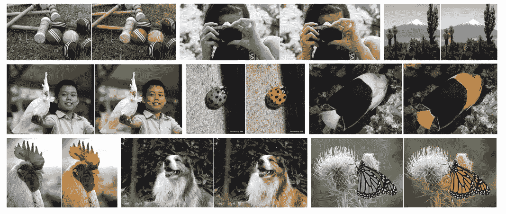
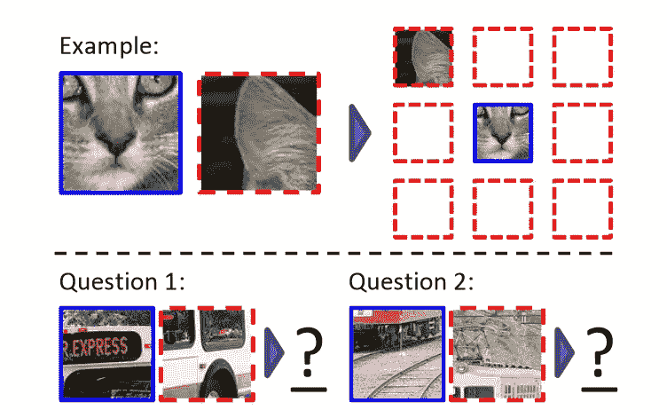
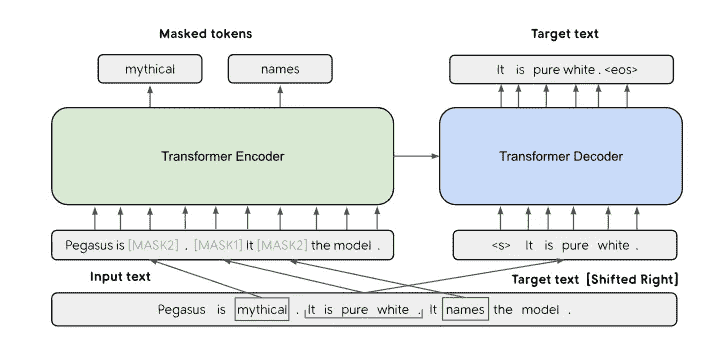
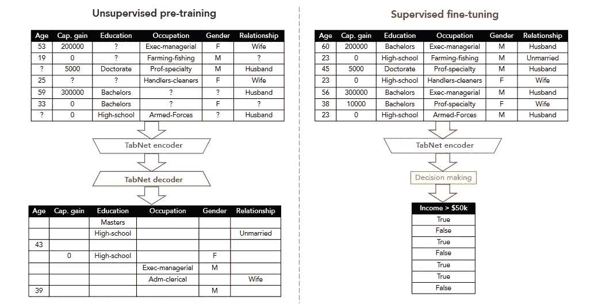
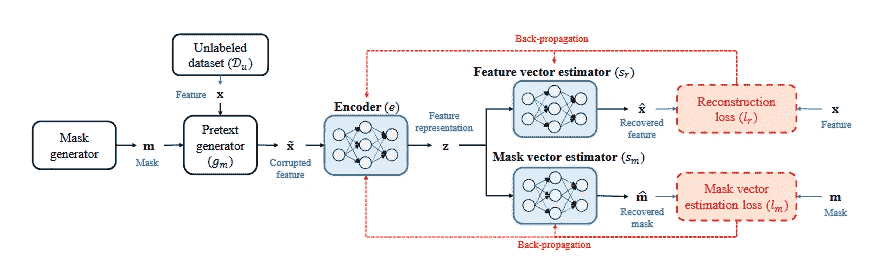

# 自我监督学习

> 原文：<https://pub.towardsai.net/self-supervised-learning-b65fc6d560ad?source=collection_archive---------2----------------------->

## [机器学习](https://towardsai.net/p/category/machine-learning)

## 从其他事物中预测所有事物

[的照片由](https://unsplash.com/@itshoobastank?utm_source=medium&utm_medium=referral) [Unsplash](https://unsplash.com?utm_source=medium&utm_medium=referral) 上的代罗田友

机器学习大致分为监督、非监督、半监督和强化学习问题。机器学习通过解决监督学习问题获得了大部分成功。监督学习任务中的数据被标记，因此为最先进的模型提供了更多的性能增强机会。

最近，通过监督学习的深度学习也取得了巨大的成功。从图像分类到语言翻译，它们的性能一直在提高。然而，在一些领域，如罕见疾病的医学数据集，收集大的标记数据集是昂贵且不可能的。这些类型的数据集为自我监督算法提供了充分的机会，以进一步提高预测模型的性能。

自监督学习旨在从未标记数据中学习信息表示。通常，在这种情况下，标记数据集比未标记数据集相对较小。自我监督学习使用这些未标记的数据，并执行托词任务和对比学习。

在一篇关于自我监督学习的精彩文章中，Jeremey Howard 将监督学习定义为两个阶段:“*我们用于预训练的任务被称为借口任务。我们随后用于微调的任务被称为下游任务*。自我监督学习的例子包括未来单词预测、屏蔽单词预测修补、彩色化和超分辨率。

# 计算机视觉的自我监督学习

自监督学习方法依赖于数据的空间和语义结构。对于图像来说，空间结构学习是极其重要的。包括[旋转](https://arxiv.org/pdf/1803.07728.pdf?ref=hackernoon.com)、[拼图](https://link.springer.com/chapter/10.1007/978-3-319-46466-4_5)和[着色](https://link.springer.com/chapter/10.1007/978-3-319-46487-9_40)在内的不同技术被用作从图像中学习表征的借口任务。对于彩色化，灰度照片作为输入给出，并且生成照片的彩色版本。张等人[1]的论文解释了产生鲜明和逼真的彩色化的彩色化过程。

图 1:该图摘自张等人的论文[1]

另一种广泛用于计算机视觉的自我监督学习的方法是放置图像补片。这方面的一个例子包括 Doersch 等人的论文。在这项工作中，提供了一个大的未标记的图像数据集，并从中提取随机对的补丁。在初始步骤之后，卷积神经网络预测第二个面片相对于第一个面片的位置。图 2 展示了这个过程。

图 2:图片取自 Doersch 等人的论文[2]

有不同的其他方法用于自我监督学习，包括[修补](https://arxiv.org/abs/1604.07379)和[分类损坏的图像](https://openaccess.thecvf.com/content_cvpr_2018/papers/Jenni_Self-Supervised_Feature_Learning_CVPR_2018_paper.pdf)。如果你对这个话题感兴趣，请查阅参考文献[3]。它提供了一个关于上述主题的文献综述。

# 自然语言处理的自我监督学习

在自然语言处理任务的情况下，自我监督学习方法是最常见的。 [Word2Vec](https://arxiv.org/abs/1301.3781) 论文的“**连续单词袋**”方法是自我监督学习最著名的例子。

类似地，存在用于自我监督学习的其他不同方法，包括相邻单词预测、相邻句子预测、自回归语言建模和屏蔽语言建模。在[伯特](https://arxiv.org/abs/1810.04805)、[罗伯塔](https://arxiv.org/abs/1907.11692)和[艾伯特](https://arxiv.org/abs/1909.11942)的论文中已经使用了屏蔽语言建模公式。在这项任务中，预测了一小组屏蔽词。

文本自我监督学习的最新例子包括张等人的论文。作者提出了一种间断句生成机制。这种机制用于摘要的下游任务。

图 3:该图摘自张等人的论文[4]

刘写了一篇关于这个话题的非常有趣的博客。更多见解请阅读。

# 表格数据的自我监督学习

对图像和文本的自我监督学习已经取得了进展。然而，现有的自监督方法对于表格数据并不有效。表格数据没有下划线空间或语义结构，因此依赖于空间和语义结构的现有技术是无用的。

大多数表格数据涉及分类特征，这些特征不具有有意义的凸组合。即使对于连续变量，也不能保证数据流形是凸的。这一挑战为研究人员提供了一个新的研究方向。我将简要说明在这方面所做的一些工作。

由 Vincent 等人[5]完成的工作 T11 提出了一种去噪自动编码器的机制。借口任务是从损坏的样本中恢复原始样本。在另一篇[论文](https://arxiv.org/pdf/1604.07379.pdf)中，Pathak 等人【6】提出了一种上下文编码器，其借口任务是从被破坏的样本和掩码向量中重建原始样本。

对[Tabnet](https://arxiv.org/pdf/1908.07442.pdf)【7】和[TaBERT](https://arxiv.org/abs/2005.08314)【8】的研究也是一项朝着自我监督学习的进步工作。在这两项研究中，借口任务是恢复损坏的表格数据。TABERT net 侧重于注意机制，并在每一步选择特征进行推理，另一方面，TABERT 学习自然语言句子和半结构化表格的表示。

图 4:该图摘自 TabNet 论文[7]

最近的一项工作([VIME](https://vanderschaar-lab.com/papers/NeurIPS2020_VIME.pdf))【9】提出了一种新颖的托辞任务，利用新颖的损坏样本生成技术来恢复掩码向量和原始样本。作者还提出了一种新的表格数据扩充机制，该机制可以与对比学习相结合，以扩展表格数据的监督学习。正如我在之前的[博客](https://towardsdatascience.com/data-transformation-methods-deep-neural-networks-for-tabular-data-8d9ebdeacc16)::*中所解释的，一个被破坏的样本是使用生成二进制掩码向量和输入样本的掩码生成器创建的。注意，输入样本是从未标记的数据集*中生成的。

图 5:该图摘自 Yoon 等人的论文[9]

自我监督学习是深度学习的新规范。图像和文本数据的自我监督学习技术是惊人的，因为它们分别依赖于空间和序列相关性。但是，表格数据中没有通用的相关结构。这使得表格数据的自我监督学习更具挑战性。

感谢阅读我的文章。直到下一次…

快乐阅读！

# 参考资料:

[1]张曦轲、菲利普·伊索拉和阿列克谢·a·埃夫罗斯，[彩色图像着色](https://arxiv.org/pdf/1603.08511.pdf) (2016)，欧洲计算机视觉会议

[2] Carl Doersch、Abhinav Gupta 和 Alexei A. Efros，[通过上下文预测进行无监督视觉表示学习](https://arxiv.org/pdf/1505.05192.pdf) (2015)，IEEE 计算机视觉国际会议论文集

[3]景龙龙，田英丽，[深度神经网络的自监督视觉特征学习:综述](https://arxiv.org/pdf/1902.06162.pdf) (2020)，IEEE 模式分析与机器智能汇刊

[4]张，，默罕默德萨勒，[帕伽索斯:用提取的间隔句进行抽象概括的预训练](https://arxiv.org/pdf/1912.08777.pdf) (2020)，机器学习国际会议

[5] Pascal Vincent、Hugo Larochelle、Yoshua Bengio 和 Pierre-Antoine Manzagol，[用去噪自动编码器提取和合成鲁棒特征](https://www.cs.toronto.edu/~larocheh/publications/icml-2008-denoising-autoencoders.pdf) (2008)，载于第 25 届机器学习国际会议论文集

[6] Deepak Pathak，Philipp Krahenbuhl，Jeff Donahue，Trevor Darrell 和 Alexei A. Efros，[上下文编码器:通过修补进行特征学习](https://arxiv.org/pdf/1604.07379.pdf) (2016)，IEEE 计算机视觉和模式识别会议论文集

[7]塞尔詹。Arik 和 Tomas Pfister，Tabnet: [专注的可解释表格学习](https://arxiv.org/pdf/1908.07442.pdf) (2021)，AAAI 人工智能会议论文集

[8]尹鹏程，Graham Neubig，Wen-tau Yih，Sebastian Riedel， [TaBERT:联合理解文本和表格数据的预处理](https://arxiv.org/abs/2005.08314) (2020)，计算语言学协会第 58 届年会会议录

[9]尹金松、张尧、詹姆斯·乔登和米哈埃拉·范德沙尔、维梅:[将自我和半监督学习的成功扩展到表格域](https://vanderschaar-lab.com/papers/NeurIPS2020_VIME.pdf) (2020)，神经信息处理系统进展