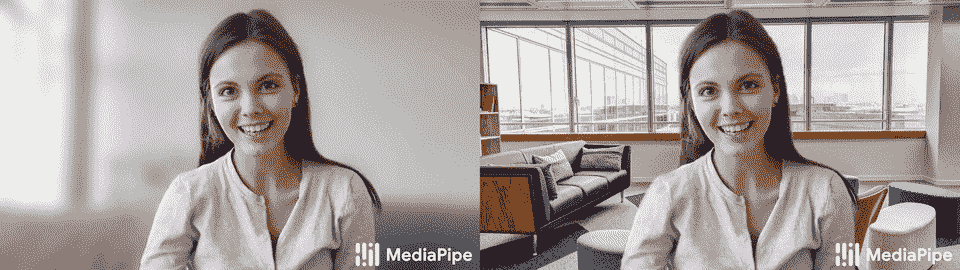
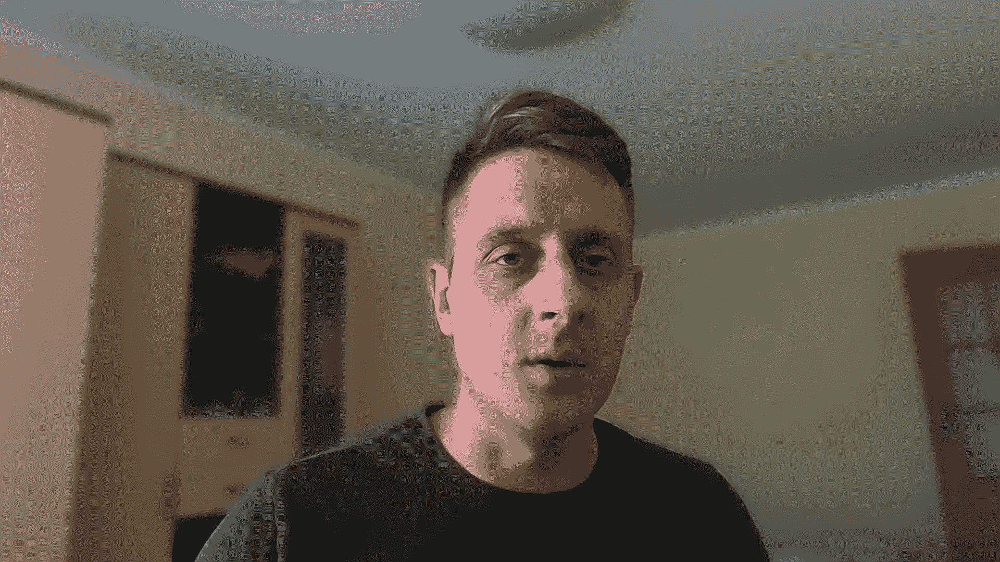

# 使用 Python 移除或模糊自拍背景

> 原文：<https://pub.towardsai.net/selfie-background-remove-or-blur-with-python-cfba827e3c78?source=collection_archive---------1----------------------->

## 在本文中，我将演示如何使用 Python 模糊或更改我们的自拍背景，就像 Zoom、MS Teams、Google Meet 或 Skype 一样。

**您见过的最先进的数据科学路线图！附带数以千计的免费学习资源和 ChatGPT 集成！**

**你有没有想过 Zoom、MS Teams、Google Meet 或 Skype 中的“自定义背景”或“模糊背景”功能是如何工作的？没有深度捕捉技术或绿色屏幕，机器如何理解人和背景之间的差异？**

**这就是图像分割发挥作用的地方。图像分割是机器学习目前为我们提供的最有价值的功能之一。图像分割仍在积极研究中，因此，我们有许多 [SOTA 机器学习方法](https://paperswithcode.com/task/semantic-segmentation)来提供精确的像素级分割。**

**这些模型可以有各种大小，有数百万个参数。在电池寿命和计算资源有限的边缘设备上实时运行这些模型可能具有挑战性。当我们想要测试一些新东西或尝试新东西以获得乐趣时，预先训练的模型可以将我们从繁琐的优化中拯救出来，我们需要执行这些优化来使这些模型变得精简和超快。**

**有许多预训练的自拍分割模型，但我选择了本教程中的 [MediaPipe 自拍分割](https://google.github.io/mediapipe/solutions/selfie_segmentation.html)解决方案。以下是他们描述中的引文:**

> **MediaPipe 自拍分割分割场景中的突出人物。它可以在智能手机和笔记本电脑上实时运行。预期的使用案例包括自拍效果和视频会议，其中人很近(< 2m) to the camera.**

****

**Source: [Google AI 博客:Google Meet 中的背景功能，由 Web ML(googleblog.com)提供支持](https://ai.googleblog.com/2020/10/background-features-in-google-meet.html)**

**该 MediaPipe 解决方案为我们提供了基于 MobileNetV3 的 ML 模型，有两种模型(通用和横向):**

*   **通用模型对 256×256×3(HWC)张量进行操作，并输出表示分割掩模的 256×256×1 张量；**
*   **景观模型类似于一般模型，但是在 144x256x3 (HWC)张量上操作。它比普通型号的 FLOPs 少，运行速度更快。**

> **注意。通用车型也为 [ML 套件](https://developers.google.com/ml-kit/vision/selfie-segmentation)提供动力，风景车型的一个变种为 [Google Meet](https://ai.googleblog.com/2020/10/background-features-in-google-meet.html) 提供动力。请在[型号卡](https://google.github.io/mediapipe/solutions/models.html#selfie-segmentation)中找到更多有关型号的详细信息。**

## **设置项目(windows):**

**所以，如果你看过我的 YouTube 视频，你可能会注意到如何使用这个模型非常简单。但是为了简化事情，我在 [GitHub](https://github.com/pythonlessons/background_removal) 上做了一个“背景 _ 移除”的项目。你需要做的第一件事是从以下链接克隆或下载我的项目:[https://github.com/pythonlessons/background_removal.git](https://github.com/pythonlessons/background_removal.git)。**

**我给出了如何在 windows 上快速测试它的说明，因为如果你使用的是 Linux，我想你应该足够了解如何安装所有的要求:**

*   **安装 Python 虚拟环境:`python -m venv venv`；**
*   **激活 Python 虚拟环境:`venv\Script\activate`；**
*   **安装所有要求:`pip install -r requirements.txt`；**
*   **(如果有 Nvidia GPU 可选):安装有 GPU 支持的`onnxruntime`:`pip install onnxruntime-gpu`；**

**此时，当你阅读这篇文章时，我可能已经用更多的特性更新了这个项目，但是如果你只想在你的网络摄像头上运行一个快速测试，用下面的代码替换`main.py`:**

**您可以通过在终端中键入`python main.py`来运行它。**

**您应该会看到类似于“我的网络摄像头”视图的模糊背景:**

****

**来源:作者图片**

**简而言之，为了简单起见，我们使用三个(FPSmetric，MPSegmentation，Engine)不同的对象；FPSmetric 并不重要，但很有价值。简而言之，我们用 MPSegmentation 对象定义了 MediaPipe 分段模型，我们只需向它提供帧就可以接收结果。FPSmetric 对象为自己说话—计算每次调用迭代的 FPS。而做所有艰苦工作的主要对象是发动机；有了它，我们可以处理图像、视频和网络摄像头输入。有关更多信息，请查看下面详细的代码块概述。**

# **详细的代码块概述:**

## **发动机:**

**如您所见，引擎对象是完成所有繁重工作的主要对象。这个想法是，我们可以在不改变引擎代码的情况下添加自定义对象。应将附加处理添加到“`custom_objects`”列表参数中。这些 custom_objects 在每个帧迭代中被调用；这意味着对象必须有一个“`__call__`”功能。以下是完整的引擎代码:**

**为了避免解释代码的每一行，我记录了代码的关键部分。但是，仍然有一些你可能不清楚的功能。例如，“`custom_processing`，这个函数被调用每一帧。在这里，我们循环遍历给定的"`self.custom_objects`"列表对象，并将这些对象应用于框架。这里的想法是，我们可以提供一个图像路径，视频路径，或网络摄像头 _id，引擎将开始处理它，当我们调用“`run()`”函数。**

**还有一个是“`display`”功能；这更适合在玩网络摄像机并希望看到结果时使用。此外，还编写了一些自定义代码来处理带有“`a`”和“`d`”键盘按钮的背景图像。**

**主要功能有:**

*   **“`process_image`”-仅当我们在创建引擎对象时定义了一个“`image_path`”时，才会调用该函数。它将处理后的图像保存在与原始图像相同的路径中；**
*   **“`process_webcam`”——这个函数每次都会被调用，并试图从我们用“`webcam_id`”参数定义的网络摄像头中读取帧。它没有创造任何视频；它只是处理来自网络摄像头的画面并显示出来。您可以根据自己的需要随意更改此功能；**
*   **“`process_video`”-这个函数处理视频文件，路径由“`video_path`”参数定义。这个功能我用的最多。甚至我的 YouTube 视频也是在这个功能的帮助下，在去除背景的同时进行修改。**

## **FPSmetric:**

**另一个有用的对象用于测量推理速度，无论我们是处理保存的视频还是实时视频流，如网络摄像头流。下面的 FPSmetric 对象就是为此而使用的:**

**如你所见，我们很少尝试计算单帧推断的 FPS。通常，我们用 range_average 参数为这个对象中定义的某个范围执行此操作。其他的"`__init__`"参数有待定义。"`cv2.putText`"函数参数，用于样式框架中的文本。乍一看，您可以理解如果我们用“框架”输入调用这个对象，它是否会添加带有对象定义参数的文本。否则，该对象将返回计算出的 FPS 浮点值。我喜欢这个对象，因为我们不需要在代码内部手动实现任何自定义函数来计算 FPS，每次迭代调用这个对象就足够了。**

## **MP 分段:**

**这个物体负责自拍图像分割。具体来说，我为[媒体管道](https://google.github.io/mediapipe/solutions/selfie_segmentation.html)解决方案创建了它。但是，如果您想要使用不同的自拍分段模型或实现，请修改或创建此对象的副本，并根据需要重新实现它。**

**创建这个对象时，我们可以定义几个不同的参数，比如我们是使用通用推理模型还是景观类型。我们可以指定使用什么样的背景图像，甚至是图像列表，而不是模糊背景。阈值是一个边界参数，在分离背景和前景时给我们信心。为了获得最佳效果，有必要调整这个值。**

**主要逻辑保存在`__call__`功能中。首先，我们将帧馈送给这个对象，其中定义的模型返回一个自拍分割 1D 遮罩。因为我们的图像是 3D (RGB)的，所以我们将遮罩转换成相同的形状。接下来，我们检查我们是否已经定义了背景图像或背景颜色；如果没有，我们将使用模糊的背景，否则-给定的图像。在最后一步中，我们将原始图像中与分割掩模重叠的部分放在背景图像上。**

# **结论:**

**我希望你喜欢这个简短的自拍分割教程，并且明白把我们从背景中分离出来并不是火箭科学；当我们知道使用什么工具以及如何应用它们时，事情就更容易管理了。在这一部分中，我写了一个引擎框架，我们可以很容易地使用它和自定义对象来处理图像、视频或网络视频流！**

**我向您展示了如何创建对象来测量推理速度，最重要的是，如何使用媒体管道自拍分割模型，获得自拍分割结果并应用它们来模糊或改变我们的背景！**

**在下一个教程中，我将创建另一个媒体管道人脸检测对象，我们将使用它来实时检测人脸。**

**感谢阅读！一如既往，本教程给出的所有代码都可以在我的 [GitHub](https://github.com/pythonlessons/background_removal) 页面找到，并且免费使用！**

***原载于*【https://pylessons.com/remove-background】**