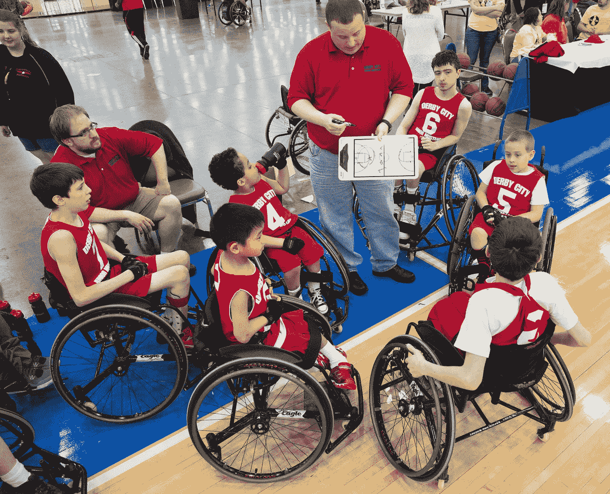
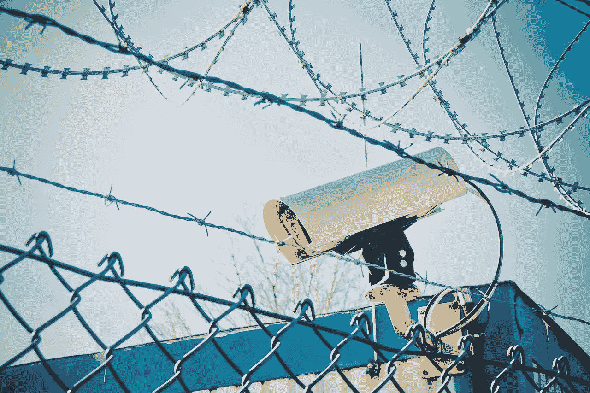
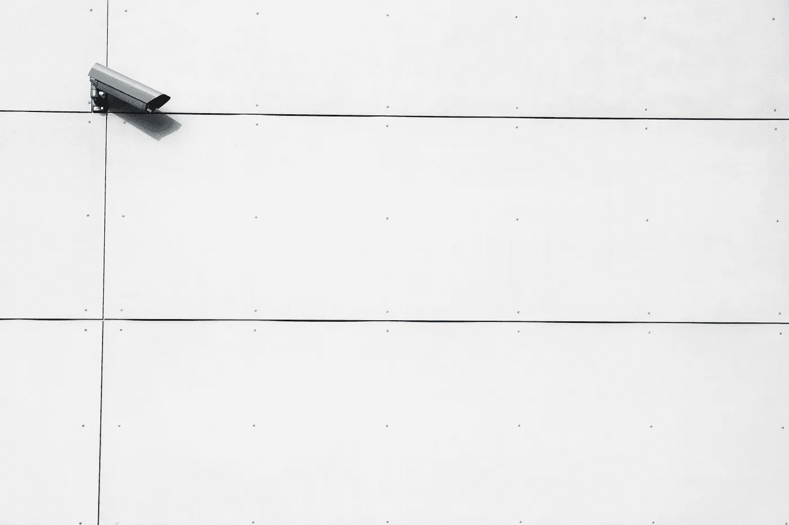
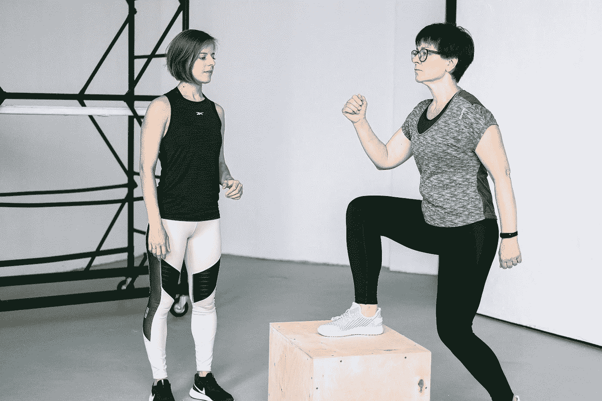
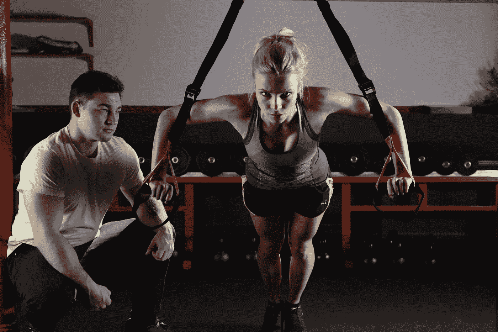
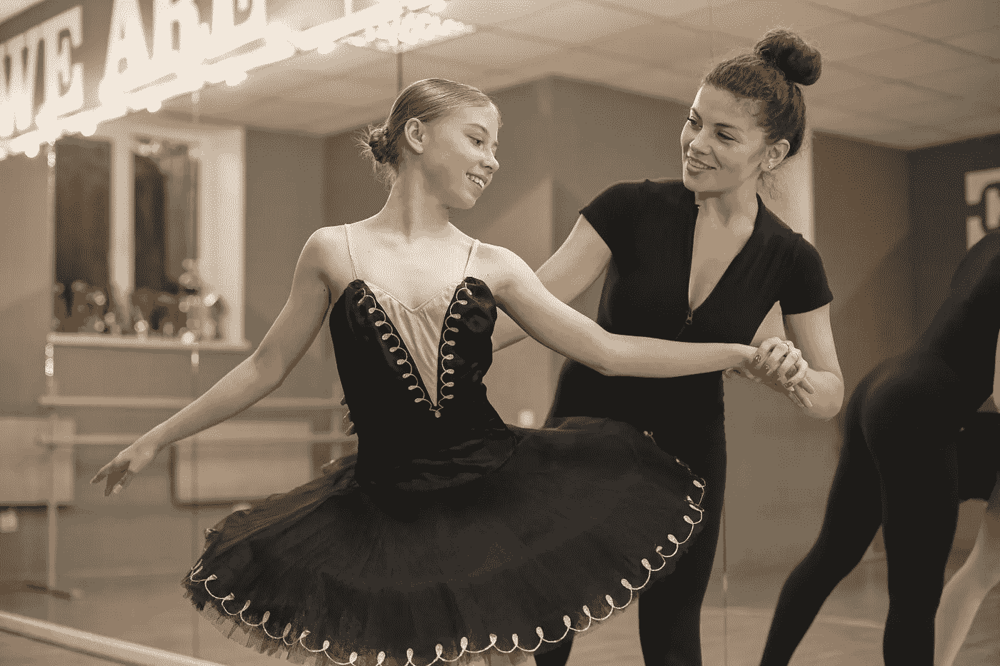

# 半监督学习指南；3 款车型拔得头筹

> 原文：<https://pub.towardsai.net/semi-supervised-learning-guide-3-models-rise-on-top-4b03f86cdd52?source=collection_archive---------2----------------------->

## 我揭示了半监督学习的挑战、最佳实践、9 种技术、16 种基本模型，以及 3 种特定模型为何是当今的必学之物

来自 Pexels 的安德鲁·麦克默特里

# 半监督学习的介绍性定义

半监督学习是一种机器学习，其中一些训练数据被标记，一些没有被标记。这允许算法从两种数据中学习。因此，半监督学习使用标记和未标记的数据来训练模型。

更多技术定义

半监督学习是一种学习类型，其中学习者可以访问标记和未标记的数据。当没有足够的标记数据来训练模型时，这种访问级别可能是有益的。然而，在未标记的数据中仍然有足够的信息允许模型学习。

# 什么是半监督模型？

半监督学习模型是一种结合了监督和非监督学习技术的机器学习算法。这些模型通常使用少量的已标记数据来训练模型，然后利用该模型来标记额外的未标记数据。当没有足够的已标记数据来训练监督模型，但未标记数据中仍有足够的信息可供学习时，这可能是一种实用的方法。半监督学习的目标可以是从未标记的数据中学习，以提高模型在标记数据上的性能。

作者 Pixabay

# 3 半监督学习面临的挑战

半监督学习是机器学习的一个子领域，旨在从标记和未标记的数据中学习。挑战在于，获得标记数据通常比获得未标记数据更容易。解决这个问题的一种方法是使用生成模型，它可以生成像训练数据这样的新数据。另一种方法是使用聚类算法对相似的数据点进行分组。

**简单 3**

1.某些模型的训练数据量可能不足。

2.训练数据可能缺乏多样性。

3.训练数据可能有噪声或包含不可靠的标签

由来自 Pexels 的[皮克斯贝](https://www.pexels.com/@pixabay/)

**越技 3**

1.标签的可用性:在许多现实世界的应用程序中，只有有限数量的标签可用。这为训练监督模型带来了挑战，监督模型通常需要大量的标记数据。

2.获得好的特征的困难:在许多问题中，挑战是找到从数据中提取的正确特征，并设计对手头的任务有用的特征，并且可以从有限数量的标记数据中学习。

3.高维度的诅咒:在高维度的数据集中，大部分点距离较远，很难找到它们之间的相似性。这使得很难从有限的标记数据中学习，因为没有附近的数据可以进行归纳。

来自 Pexels 的[百万像素股票](https://www.pexels.com/@megapixelstock/)

# 半监督学习大放异彩

半监督学习在有有限数量的标记数据和大量的未标记数据时是有效的。当存在大量标签噪声时，它还可以用于提高监督学习模型的性能。例如，它可以用于以下情况:文本分类、图像分类和语音识别。

3 个例子:

1)一个组织有一个小的已标记客户数据数据集，但有一个大得多的网站日志数据集(未标记)。半监督学习可以用来预测哪些客户可能会购买。

2)医疗保健组织有一个最小规模的已标记患者数据集，但有一个更大的未标记数据集(如健康记录)。半监督学习可以预测哪些患者有患某些疾病的风险。

3)一个城市有一个小的已标记交通数据数据集，但它的摄像机镜头是一个更大的未标记数据数据集。我们可以部署半监督学习来预测交通模式和识别拥堵热点。

来自 Pexels 的 [Flex Point Security](https://www.pexels.com/@flex-point-security-37073483/)

# 何时使用半监督学习需要考虑的 3 种方法

1.一种方法是使用生成模型，如深度玻尔兹曼机器，为手头的任务预先训练神经网络的参数。第一种方法是学习数据分布，然后使用学习的模型来初始化神经网络的参数。

2.另一种方法是使用自学习算法，如赢家通吃算法[1]，从未标记的数据中学习可用于初始化神经网络的特征。

3.最后，可以使用生成式对抗网络来生成类似于训练数据的样本。生成的样本可以以半监督的方式训练神经网络。

来自佩克斯的阿纳斯塔西娅·舒拉耶娃

# 9 种半监督学习技术

1.主动学习

主动学习是一种半监督学习技术，通常在标记数据成本高或耗时时使用。主动学习算法创建了一个模型，可用于对新数据进行预测。然后，该模型用于从未标记的数据中选择应该标记的实例。目标是使用尽可能少的标签，同时实现预测任务的高准确性。

2.标签传播

标签传播是一种半监督学习技术，它将标签从有标签的数据点传播到无标签的数据点。这个想法是，如果两个数据点相似，它们很可能有相同的标签。标签传播从一组种子标签开始，然后将这些标签传播到数据集中的其他点。该过程继续进行，直到所有的点都被[2]标记或者没有进一步的标记可以传播。

来自 Pexels 的 Anna Shvets

3.自我训练

自训练是一种半监督学习技术，可以在有小数据和大数据时使用，小数据被标记，大数据未被标记。这个想法是在标记的数据上训练一个模型，然后使用这个模型来标记未标记的数据。然后，在标记和未标记的数据上重新训练该模型。重复这个过程，直到收敛。

4.合作培训

联合训练是一种半监督学习技术，它依赖于两种数据视图，每种视图包含不同的信息。例如，您可以让一个视图包含文本数据，另一个视图包含图像数据。在每个视图上分别训练一个模型[3]，然后将这些模型组合起来标记未标记的数据。

5.三元训练

Tri-training 是一种半监督学习技术，它使用三个数据视图，每个视图包含不同的信息。例如，您可能有一个包含文本数据的透视图，另一个包含图像数据的视图，以及另一个包含音频数据的视图。在每个视图上分别训练一个模型，然后将这些模型组合起来标记未标记的数据。

由来自 Pexels 的 [Pixabay](https://www.pexels.com/@pixabay/)

6.生成对抗网络

GANs 是用于无监督[4][7]和半监督学习的神经网络。gan 有两部分:一个发生器和一个鉴别器[10]。生成器产生合成的例子，而鉴别器试图将它们分类为真或假。训练过程使生成器和鉴别器在对抗游戏中相互竞争。随着训练的进行，生成器会产生越来越真实的例子，直到鉴别器无法将它们与真实的例子区分开来。

7.自动编码器

自动编码器是一种用于无监督和半监督学习的神经网络[5]。自动编码器获取输入数据，并尝试在输出层准确地重建数据。为此，自动编码器学习在称为潜在层的中间层将输入数据压缩成更小的表示形式。潜在层由比输入层更少的单元组成，因此它可以有效地对输入数据进行降维。一旦自动编码器学会了压缩输入数据，它就可以使用该知识来重建在训练期间看不到的新输入。

8.受限玻尔兹曼机器

RBM 是一种用于无监督和半监督学习的神经网络[7]。RBM 获取输入数据，并尝试使用称为“神经元”的隐藏单元在输出层重建数据。每个神经元都与所有的输入输出单元相连，但神经元只允许与相邻层的其他神经元相连(因此得名“受限”)。在训练期间，RBM 通过调整神经元之间的权重来学习近似输入数据分布，使得相似的输入在每个隐藏层神经元处具有相似的激活。

来自 Pexels 的足球妻子

9 支持向量机

支持向量机有监督的机器学习[6][8]算法用于分类任务。SVM 在特征空间中找到一个超曲面，该超曲面最大化类别之间的间隔(即，具有不同类别标签的点集)。换句话说，支持向量机试图找到一个接近所有训练数据点的决策边界，而不跨越来自不同类别的任何点。

# 15 个基本的半监督模型

1.深度信念网络[15]:可用于半监督学习的概率图形模型。它们由一堆受限的玻尔兹曼机组成，是概率模型。该算法旨在学习数据的潜在表示，并可用于分类或特征学习。

2.神经网络自回归模型:它们使用标记和未标记的数据来学习数据的底层结构[16]。该模型由一个根据标记数据训练的自动编码器和一个根据未标记数据训练的第二网络组成。第二个网络用于预测未标记数据的标签。

3.多模态深度学习:这种神经网络架构使用多种输入模态来学习数据表示。它的动机是观察到[11]许多现实世界的问题涉及各种来源的数据，一个单一的模式可能不足以学习一个好的表现。例如，在图像分类中，如果背景混乱或对象被遮挡，仅使用视觉信息可能是不够的。在这种情况下，添加音频或文本数据可以帮助网络学习更好的表示。

4.生成随机网络:这个网络包括一个编码器和一个解码器[17]。编码器获取输入数据并将其映射到潜在空间，而解码器获取潜在空间向量并重建原始输入数据[18]。这种类型的网络是通过让编码器和解码器相互竞争来训练的[19]:编码器试图将数据映射到易于解码的潜在空间向量。相反，解码器试图从这些向量中重建数据。

由 pexels 的 [MART 生产](https://www.pexels.com/@mart-production/)

5.变分自动编码器:变分自动编码器(VAE)是一个生成模型，可以从标记和未标记的数据中学习[20]。VAE 的目标是学习可用于生成新数据点的数据的潜在表示。VAEs 建立在编码器-解码器网络之上[21]。编码器网络接收输入数据点并输出潜在向量。解码器网络接收潜在向量并输出输入数据点的重构。VAE 的训练过程包括优化两个损失函数:重建损失和正则化损失。重建损失就是重建和原始输入之间的误差。正则化损失促使潜在向量接近标准正态分布。

6.对抗性自动编码器:用于无监督或半监督学习的自动编码器[22]。对抗性自动编码器建立在两个组件上:将输入数据压缩到潜在空间的编码器网络和从潜在空间重构输入数据的解码器网络[23]。此外，对抗性自动编码器还有第三个组成部分:一个鉴别器网络，它被训练来区分真实数据和生成数据的潜在表示。对抗性自动编码器旨在学习一种潜在的表示，这种表示既能提供信息，又无法与真实数据区分开来。

7.CycleGAN:这是一种半监督学习模型，由朱俊彦等人在 2017 年发表的题为“使用循环一致的对抗网络进行不成对的图像到图像的翻译”的论文中提出[9]。该模型被设计成在没有成对训练数据的情况下学习图像到图像的翻译。CycleGAN 背后的基本思想是使用两个生成器 G 和 F 在两个域 X 和 Y 之间进行翻译[24]。g 将图像从域 X 映射到域 Y，而 F 将图像从域 Y 映射到域 X。对抗性损失确保翻译的图像看起来逼真[25]，而循环一致性损失确保翻译的一致性。例如，如果一个梨的图像被翻译成一个香蕉的图像，那么将香蕉翻译回一个梨应该会给出原始的梨图像。CycleGAN 可用于多种应用，如图像风格转换、物体变形和照片增强[26]。

来自 Pexels 的 Gustavo Fring

8.Pix2Pix:图像到图像翻译的模型[27]。该模型是在成对的图像上训练的，例如一个人的图像和具有不同物理外观的那个人的图像。给定第一图像，模型学习生成第二图像。

9.上下文条件 GAN:上下文条件 GAN (CCGAN)是一种半监督学习模型，它将 GAN 与上下文条件分类器相结合，以产生更真实的图像[28]。CCGAN 应用 GAN 的生成网络来生成图像，然后使用上下文条件分类器来标记生成的图像。这种方法可以提高生成图像的质量，使它们更加逼真。

10.使用 GANs 进行插补:使用生成式对抗网络(GAN)对数据集中缺失的数据点进行插补[29]。然后，在完整的数据集上训练 GAN，并使用生成的数据点来替换丢失的数据点。这允许模型从完整的数据集学习，同时仍然使用不完整的数据集进行训练。

11.集成方法:集成方法是一种结合多个模型预测的机器学习技术[30]。它们用于通过组合多个模型的估计值来提高预测模型的准确性。集成方法通常用于半监督学习，其目标是组合在不同数据子集上训练的多个模型的预测。例如，常见的方法是在已标记的数据集上训练一个模型，在未标记的数据集上训练另一个模型。然后可以将两个模型的预测结合起来，形成更准确的预测。

由 Pexels 的 [Kampus 生产](https://www.pexels.com/@kampus/)

12.共同训练:一种半监督学习方法，由两个在不同数据视图上训练的分类器组成[31]。视图可以由不同的特征表示或不同的特征子集生成。这两个分类器对未标记的数据进行预测，并且由这两个分类器预测的标记被添加到训练集[32]。重复这个过程，直到分类器收敛。

13.分裂标记:分裂标记是一种半监督学习技术，其中训练数据被随机分成两组，A 和 B [13]。集合 A 被标记并用于训练模型，而集合 B 未被标记。然后将该模型应用于集合 B 以预测标签。类似地，首先在少量已标记数据上训练模型，然后使用模型来标记更大量的未标记数据。然后，在标记和未标记的数据上重新训练该模型。这个过程可以重复多次。

14.直推式 SVM:直推式 SVM 是一种半监督学习模型，它使用线性 SVM 来预测数据点的标签。该模型在标记数据集[12]上训练，然后用于预测未标记数据点的标记。直推式 SVM 既可以用于分类，也可以用于回归。另一种(更技术性的)解释是，该算法首先将数据转换到高维空间中。接下来，使用支持向量机对数据点进行分类。最后，算法返回到原始空间，并将点映射回它们的原始标签。

15.流形正则化:这种技术增加了损失函数的惩罚，并鼓励模型学习接近低维流形的表示。这有助于防止过度拟合并提高泛化能力。此外，该技术在基于流形学习的模型(例如支持向量机和 k-最近邻)的训练期间向损失函数添加了惩罚。惩罚鼓励模型找到接近训练数据的数据的低维表示；这种方法可以提高模型的泛化性能，使其更能抵抗过拟合。

来自 Pexels 的米哈伊尔·尼洛夫

# 3 个模型拔得头筹:现在要学习的关键模型

它们是基于能量的生成模型[33]和图形模型。

生成模型是一种无监督学习算法，旨在学习输入数据的联合概率分布[37]。隐式或显式密度估计都可以做到这一点。隐式密度估计包括从一组给定的数据点直接学习基本分布的参数。相反，显式密度估计首先估计每个数据点的密度，然后将它们组合起来形成总体分布。

基于能量的模型是一种无监督学习算法，定义了输入数据的能量函数[34]。能量函数表示输入数据的配置的稀有性，训练目标是找到具有最低能量的配置。基于能量的模型可用于密度估计、聚类和生成敌对网络(GANs) [35]。

图形模型是一种概率模型，将随机变量之间的关系表示为图形[36]。最流行的图形模型是贝叶斯网络，一个有向无环图(DAG ),其中每个节点代表一个随机变量[38],每个边代表两个变量之间的依赖关系。图形模型可用于监督、非监督和半监督学习。

来自 Pexels 的[米哈伊尔·尼洛夫](https://www.pexels.com/@mikhail-nilov/)

# 六大最佳实践

1.选择正确的模型:并非所有的机器学习模型都是平等的，有些模型比其他模型更适合半监督学习。一定要选择一个能够有效地从有标签和无标签数据中学习的模型。

2.预处理数据:原始数据通常不是训练机器学习模型的理想格式。为了最大限度地利用半监督学习算法，有必要对数据进行预处理，使其符合算法可以处理的格式。半监督学习算法通常需要预处理才能正确工作。这可能涉及数据标准化、去除异常值或维度缩减。

3.调整您的超参数:机器学习模型有许多不同的超参数，可以通过调整来提高性能。在调整这些参数时，使用标记数据和未标记数据，以便模型可以从这两种类型的数据中学习。

4.使用交叉验证:交叉验证是一种通过在多个数据子集上训练机器学习模型并在每个子集上测试它来评估机器学习模型的技术。这在半监督学习中尤其重要，因为[39]允许模型从标记和未标记的数据中学习。

5.集成方法:集成方法是用于组合多个机器学习模型的预测的技术。这在半监督学习中是有益的，因为它允许模型相互学习并提高它们的性能。

6.避免负迁移[38]:当使用数据的多个视图时，避免负迁移至关重要，负迁移是指从一个角度学到的知识被负迁移到另一个视图。例如，当两个视图不兼容或标签不正确时，就会发生负迁移。

如果您有任何编辑/修改建议或关于进一步扩展此主题的建议，请考虑与我分享您的想法。

# 另外，请考虑订阅我的每周简讯:

 [## 周日报告#1

### 设计思维与 AI 的共生关系设计思维能向 AI 揭示什么，AI 又能如何拥抱…

pventures.substack.com](https://pventures.substack.com/) 

# **我写了以下与这篇文章相关的内容；他们可能与你有相似的兴趣:**

我在这个链接写了关于**监督学习**的文章:

 [## 监督学习:31 个最重要的模型:5 是必须学习的

### 我概述了 31 个关键的监督学习模型，并揭示了必须学习的前 5 个模型。

pub.towardsai.net](/supervised-learning-31-of-the-most-important-models-5-are-a-must-learn-9c62444905fa) 

我之前提到过**无监督学习**:

 [## 无监督学习:14 种最重要的算法

### 14 种算法及其使用案例的细分。

pub.towardsai.net](/unsupervised-learning-14-of-the-most-important-algorithms-b3e9e07350c9) 

如果你对我的 **NLP 指南**感兴趣，可以在这里找到:

 [## 16 个用于情感分析的开源 NLP 模型；一个在顶端升起

### 介绍 16 款车型，深入了解风格。

pub.towardsai.net](/16-open-source-nlp-models-for-sentiment-analysis-one-rises-on-top-b5867e247116) 

就是这样，伙计们；我轻轻地划了一下这个区域的表面。我不喜欢撰写占用不必要空间的冗长介绍或结论。如果你对进一步拓展这个话题有任何问题或建议，请与我分享你的想法。

*参考文献:*

*1。*[*https://ml . informatik . uni-freiburg . de/former/_ media/documents/teaching/ss11/ml/06 _ wtan . PD*](https://ml.informatik.uni-freiburg.de/former/_media/documents/teaching/ss11/ml/06_wtan.pd)

*2。分析学进展:整合动态数据挖掘与模拟。*[*https://Leeds-faculty . Colorado . edu/glover/article % 20-% 20 IBM % 20 dynamic % 20 data % 20 mining % 20 sim % 20 opt . pdf*](https://leeds-faculty.colorado.edu/glover/article%20-%20IBM%20Dynamic%20Data%20Mining%20Sim%20Opt.pdf)

*3。在多视图中选择视图的堆叠惩罚逻辑回归。*[*https://arxiv.org/abs/1811.02316*](https://arxiv.org/abs/1811.02316)

*4。生成对抗网络深度学习。*[*https://at cold . github . io/py torch-Deep-Learning/en/week 09/09-3/*](https://atcold.github.io/pytorch-Deep-Learning/en/week09/09-3/)

*5。自动编码器的类型-机器学习概念。*[*https://www . ml-concepts . com/2022/03/31/types-of-auto encoders/*](https://www.ml-concepts.com/2022/03/31/types-of-autoencoders/)

*6。支持向量机在磁共振脑图像分类中的应用。*[*https://topics.hails.info/svm.html*](https://topics.hails.info/svm.html)

*7。墨菲，K. P. (2012 年)。机器学习:概率观点(第 1 版。).麻省理工出版社。*

*8。使用多代理系统的异常检测。*[*https://users . encs . Concordia . ca/~ abdelw/papers/Khosravifar _ MSc _ s 2018 . pdf*](https://users.encs.concordia.ca/~abdelw/papers/Khosravifar_MSc_S2018.pdf)

*9。*[*https://arxiv.org/abs/1703.10593*](https://arxiv.org/abs/1703.10593)

*10。无任何标签的脑肿瘤语义分割。*[*https://www.lfb.rwth-aachen.de/bibtexupload/pdf/WEN19a.pdf*](https://www.lfb.rwth-aachen.de/bibtexupload/pdf/WEN19a.pdf)

*11。*

*12。如何为计算机视觉用例创建训练数据？[*https://appen . com/blog/how-to-create-training-data-for-computer-vision-use-cases/*](https://appen.com/blog/how-to-create-training-data-for-computer-vision-use-cases/)*

**13。脑磁图自适应解决了人脸的时空特征。*[*https://www.jneurosci.org/content/35/45/15088*](https://www.jneurosci.org/content/35/45/15088)*

**14。S4L:自我监督半监督学习。*[*https://open access . the CVF . com/content _ ICCV _ 2019/papers/翟 _ S4L _ 自我监督 _ 半监督 _ 学习 _ICCV_2019_paper.pdf*](https://openaccess.thecvf.com/content_ICCV_2019/papers/Zhai_S4L_Self-Supervised_Semi-Supervised_Learning_ICCV_2019_paper.pdf)*

*15。[*https://www . research gate . net/publication/321394780 _ Improved _ class ification _ with _ Semi-supervised _ Deep _ Belief _ Network*](https://www.researchgate.net/publication/321394780_Improved_Classification_with_Semi-supervised_Deep_Belief_Network)*

*16。[*https://ai . Facebook . com/blog/ar-net-a-simple-auto regressive-neural-network-for-time-series/*](https://ai.facebook.com/blog/ar-net-a-simple-autoregressive-neural-network-for-time-series/)*

*17。[*https://arxiv.org/abs/1611.07119*](https://arxiv.org/abs/1611.07119)*

**18。*[*https://arxiv.org/abs/1503.05571?context=cs*](https://arxiv.org/abs/1503.05571?context=cs)*

**19。*[*https://proceedings . neur IPS . cc/paper/2020/file/e 586 a4 f 55 FB 43 a 540 c 2e 9 dab 45 e 00 f 53-paper . pdf*](https://proceedings.neurips.cc/paper/2020/file/e586a4f55fb43a540c2e9dab45e00f53-Paper.pdf)*

*20。[*https://bjlkeng . github . io/posts/semi-supervised-learning-with-variable-auto encoders/*](https://bjlkeng.github.io/posts/semi-supervised-learning-with-variational-autoencoders/)*

**21。**

**22。[*https://adversarial-auto encoder-classif . readthe docs . io/en/latest/semi _ supervised . html*](https://adversarial-autoencoder-classif.readthedocs.io/en/latest/semi_supervised.html)**

***23。*[*https://arxiv.org/abs/1907.06078*](https://arxiv.org/abs/1907.06078)**

***24。*[【https://arxiv.org/abs/1908.11569】T21](https://arxiv.org/abs/1908.11569)**

**25。[*https://link . springer . com/article/10.1007/s 11548-021-02490-2*](https://link.springer.com/article/10.1007/s11548-021-02490-2)**

***二十六。*[*https://github . com/arnab 39/Semi-supervised-segmentation-cycle gan*](https://github.com/arnab39/Semi-supervised-segmentation-cycleGAN)**

**27。[*https://machine learning mastery . com/semi-supervised-generative-adversarial-network/*](https://machinelearningmastery.com/semi-supervised-generative-adversarial-network/)**

***28。*[*https://arxiv.org/abs/1611.06430*](https://arxiv.org/abs/1611.06430)**

***29。*[*https://ieeexplore.ieee.org/document/9815858*](https://ieeexplore.ieee.org/document/9815858)**

**30。[*https://www . science direct . com/science/article/pii/s 0950705121000010*](https://www.sciencedirect.com/science/article/pii/S0950705121000010)**

***31。*[*https://arxiv.org/abs/2107.04795*](https://arxiv.org/abs/2107.04795)**

***32。*[*https://arxiv.org/abs/1803.05984*](https://arxiv.org/abs/1803.05984)**

***33。***

****34。*[*https://arxiv.org/abs/2010.13116*](https://arxiv.org/abs/2010.13116)***

**35。[*https://www . bmvc 2021-virtual conference . com/assets/papers/0451 . pdf*](https://www.bmvc2021-virtualconference.com/assets/papers/0451.pdf)**

**36。[*https://arxiv.org/abs/2102.13303*](https://arxiv.org/abs/2102.13303)**

***37。*[*https://arxiv.org/abs/2007.00155*](https://arxiv.org/abs/2007.00155)**

***38。马尔可夫链和隐马尔可夫模型——普渡大学。*[【https://www.stat.purdue.edu/~jianzhan/notes/HMM.pdf】T21](https://www.stat.purdue.edu/~jianzhan/notes/HMM.pdf)**

**39。数据流形上的局部高阶正则化。[*https://www.arxiv-vanity.com/papers/1602.03805/*](https://www.arxiv-vanity.com/papers/1602.03805/)**