# 基于注意的序列对序列模型的句子校正

> 原文：<https://pub.towardsai.net/sentence-correction-using-attention-based-sequence-to-sequence-model-95cf21cdacf?source=collection_archive---------1----------------------->

## [深度学习](https://towardsai.net/p/category/machine-learning/deep-learning)

照片由 [Dim 侯](https://unsplash.com/@dimhou?utm_source=unsplash&utm_medium=referral&utm_content=creditCopyText)在 [Unsplash](https://unsplash.com/s/photos/text?utm_source=unsplash&utm_medium=referral&utm_content=creditCopyText)

# 概观

社交媒体总是有自己的规则。例如，首字母缩写词和缩写词已经成为社交平台上独特语言的一部分。如果你一直在观察社交媒体的对话，你可能会遇到大量的行话或首字母缩略词，让你需要一段时间才能弄明白。像 TFW、TBH 和 LMK 这样的社交媒体首字母缩略词很随意地出现在评论、标题和人们之间的对话中。语法错误是原始文本中经常发现的另一个大问题。无论语言是口语还是书面语，自然语言处理都使用人工智能来获取现实世界的输入，对其进行处理，并以计算机可以理解的方式理解它。NLP 使计算机能够像人类一样理解自然语言。但是在它被任何基于人工智能的系统使用之前，它需要被转换成一种干净的格式。数据预处理包括准备和清理文本数据，以便机器能够对其进行分析。预处理将数据置于可工作的形式，并突出算法可以处理的文本中的特征。

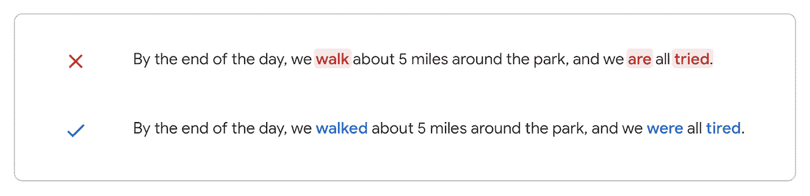

深度学习特别是自然语言处理的最新发展促使研究人员将句子纠正技术应用于解决机器翻译、自动语法检查等挑战性问题。在这个项目中，我们使用基于编码器-解码器的序列到序列递归神经网络和长短期记忆单元来解决英语句子校正的问题。通过将神经机器翻译模型应用于语法纠正，我们可以纠正更多我们在写作时可能犯的语法错误。

# 商业问题

这个项目是一个大型文本数据库项目的子模块，其目标是创建一个系统，将原始的野生文本转换为标准的英语文本，同时保留文本的语义。

像 [Google Docs](https://www.google.com/docs/about/) 这样的应用程序使用神经机器翻译来纠正语法错误。

图片作者:[谷歌云](https://cloud.google.com/)

# 问题陈述:深度学习视角

该项目旨在创建一种预处理方法，用于将包含可能错误或通配符/互联网首字母缩写词/文本缩写词/消息缩写词的原始文本转换为标准英语格式的干净文本。我们的系统目标是将损坏的输入句子转换成目标句子，输出的目标是保留输入文本的潜在属性(情感、命名实体等)。)但在某种程度上发生了变异，将这些属性嵌入到其他自然语言处理系统所熟悉的表示中。

文献调查显示，相关工作已在这一领域使用各种机制，从基于规则的模型到随机模型。隐马尔可夫模型已经显示出捕捉自然英语语言的许多高级动态的强大能力；然而，这种模型在模拟关键的长期依赖关系时会崩溃。另一方面，递归神经网络和 LSTM 更擅长捕捉这些长期动态。因此，在我们的工作中，我们转向最近神经网络在自然语言处理领域的成功来获得模型灵感。

## **性能指标:**

以交叉熵作为损失函数来衡量性能，由下式给出:

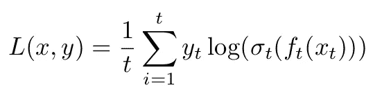

# 数据集详细信息

**数据集 1:** [**国大社交媒体文本规范化与翻译语料库**](https://www.comp.nus.edu.sg/~nlp/corpora.html)

对相关文献的详细回顾产生了一个由新加坡国立大学的 2000 篇文章组成的英语语料库。语料库是为社交媒体文本规范化和翻译而创建的。它是通过从新加坡国立大学英语短信语料库中随机选择 2000 条消息来构建的。这些信息首先被规范化成正式的英语，然后被翻译成正式的汉语。从我们的评论来看，这似乎是唯一公开可用的文本规范化语料库。

该数据集包含社交媒体文本及其规范化文本和规范化文本的中文翻译。对于我们的问题，我们只需要社交媒体文本及其规范化的英语文本。

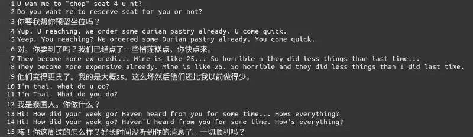

样本数据集 1

**数据集 2:** [**NAIST Lang-8 学习者语料库**](https://sites.google.com/site/naistlang8corpora/)

该语料库包含从 Lang-8 中提取的英语学习者的文本。它有 29，012 个活跃用户写的 100，051 个英语条目，并且包括自动时态/体注释。

提取数据集 1 的 2000 个数据点和数据集 2 的 100000 个数据点，合并得到最终数据集。最终数据集包含 102000 个数据点。数据集包含 165 个重复行，删除后产生 101835 个数据点。

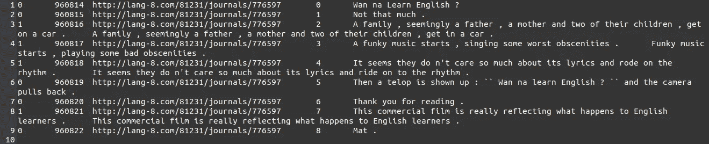

样本数据集 2

# 探索性数据分析

在统计学中，探索性数据分析是一种分析数据集以总结其主要特征的方法，通常使用统计图形和其他数据可视化方法。

## 1.字符级的输入文本可视化

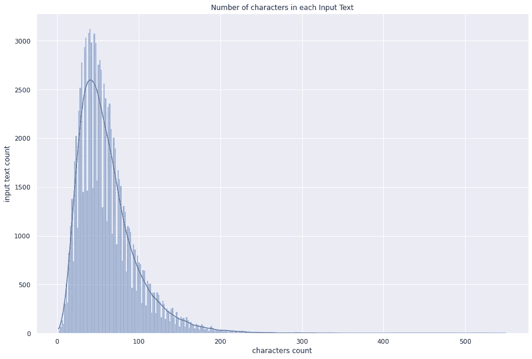

每个输入文本中的字符数

## 观察结果:

*   输入文本的最大字符长度:550
*   输入文本中字符的平均长度:61
*   输入文本中字符的最小长度:2
*   文本的大部分是 25 到 200 个字符(包括空格)。
*   一小部分文本的字符长度大于 302。
*   第 90 百分位是 108，而第 100 百分位是 550。差别巨大。
*   第 99 百分位是 189，而第 100 百分位是 550。
*   第 99.8 百分位是 260，而第 99.9 百分位是 302。差别巨大。因此输入文本的最大长度可以被认为是 260。

## 2.单词级的输入文本可视化

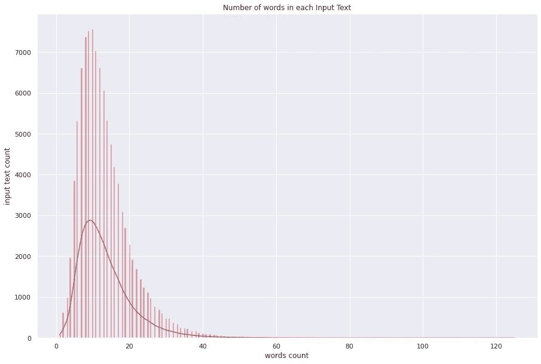

每个输入文本中的字数

## **观察值:**

*   输入文本中的最大长度单词:125
*   输入文本中单词的平均长度:13
*   输入文本中单词的最小长度:1
*   正文的大部分是 10 到 50 个单词。
*   很少一部分文字的字数超过 60 个。
*   第 90 百分位是 23，而第 100 百分位是 125，差别很大。
*   第 99 百分位是 39，而第 100 百分位是 125。
*   第 99.9 百分位是 63，而第 100 百分位是 125。差别巨大。因此，输入文本的最大单词可以被认为是 63。

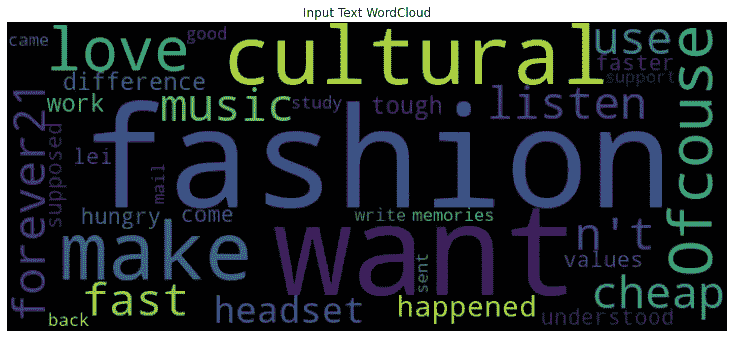

输入文本单词云

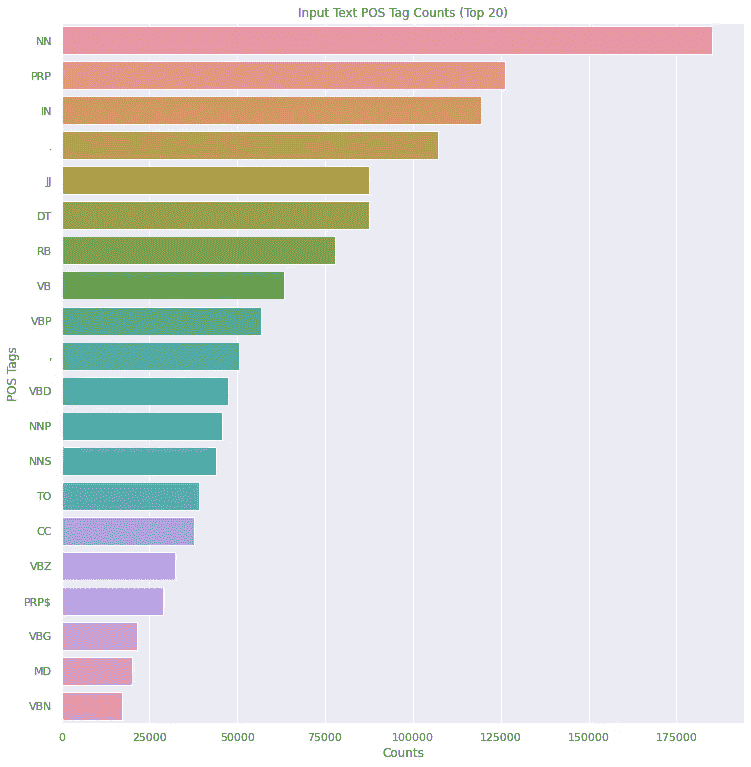

输入文本位置标签计数(前 20 位)

## 3.在字符级别输出文本可视化

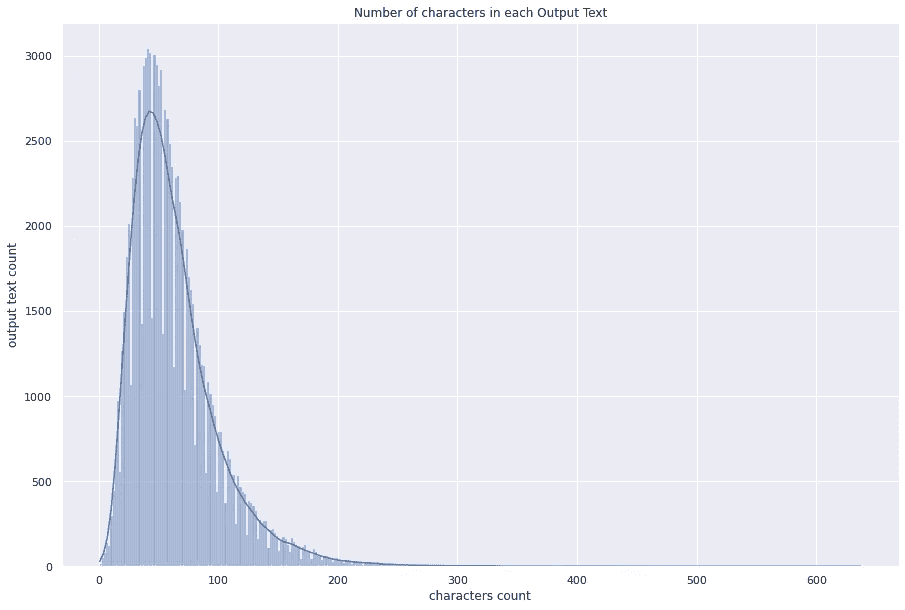

每个输出文本中的字符数

## **观察结果:**

*   输出文本的最大字符长度:637
*   输出文本中字符的平均长度:64
*   输出文本中的最小字符长度:1
*   文本的大部分是 27 到 250 个字符(包括空格)。
*   一小部分文本的字符长度大于 262。
*   第 90 百分位是 111，而第 100 百分位是 637。差别巨大。
*   第 99 百分位是 193，而第 100 百分位是 637。
*   第 99.8 百分位是 262，而第 99.9 百分位是 303。很少有句子的长度超过 262。因此，输出文本的最大长度可以认为是 262。

## 4.在单词级别输出文本可视化

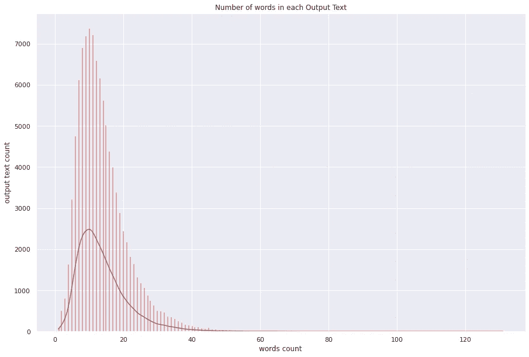

每个输出文本中的字数

## **观察结果:**

*   输出文本中最大长度单词:131
*   输出文本中单词的平均长度:13
*   输出文本中单词的最小长度:1
*   正文的大部分是 10 到 50 个单词。
*   一小部分文本的字符长度大于 50。
*   第 90 百分位是 23，而第 100 百分位是 131。差别巨大。
*   第 99 百分位是 40，而第 100 百分位是 131。
*   第 99.9 百分位是 63，而第 100 百分位是 131。因此，输出文本的最大字数可以被认为是 63。

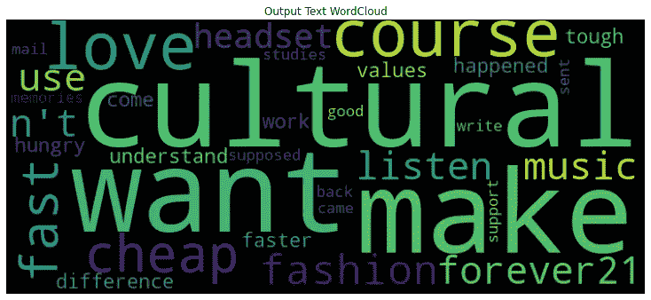

输出文本单词云

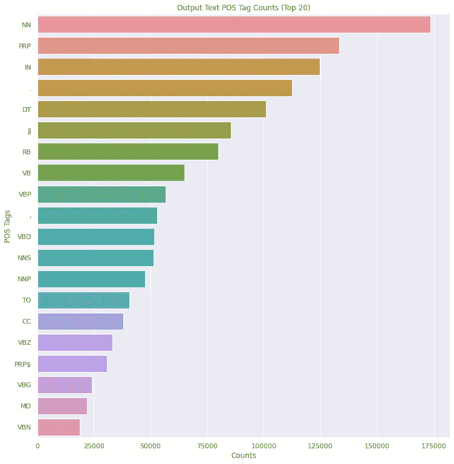

输出文本位置标签计数(前 20 名)

## 5.在字符级别识别异常值

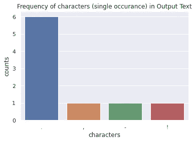

输出文本中字符的频率

## 观察结果:

*   很少有句子的最小字符数只有 1，并且这种字符数少于 3。这样的点可以被认为是异常值，可以被去除。

## 6.在单词级别识别异常值

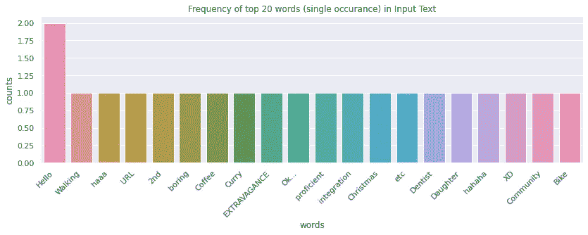

输入文本中前 20 个单词的频率

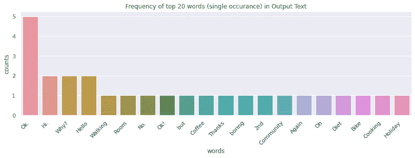

输出文本中前 20 个单词的频率

## 观察结果:

*   很少有句子的最小单词数只有 1，而许多这样的单词数也只有 1。这样的点可以被认为是异常值，可以被去除。

# 预处理

数据预处理是建立任何基于机器学习的模型的基本步骤。它通过消除冗余、不必要的数据，帮助我们将原始数据转换成可读的格式。这样的数据只能应用于建立任何模型。还通过应用某些数据清理步骤对可用数据进行预处理。这些步骤包括删除基本的非字母和数字。文本不会转换为小写，因为某些首字母缩略词或字母可能代表互联网速记文本中流行的表达式或短语。

## 检查缩写

原始数据尤其是互联网文本通常包含首字母缩写词和缩略语。这样的词往往代表一些隐藏的意思或短语。我们数据集的输入和输出文本也包含这样的缩写。输入和输出文本中最常见的 20 个缩写如下所示。

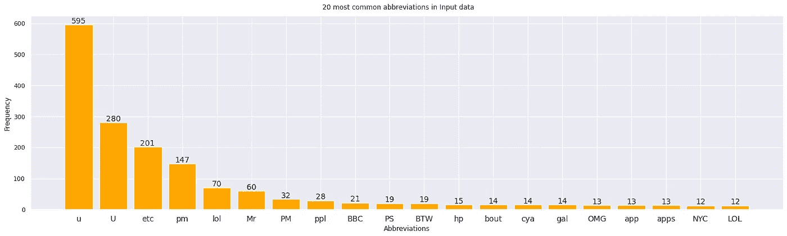

输入文本中最常见的 20 个缩写

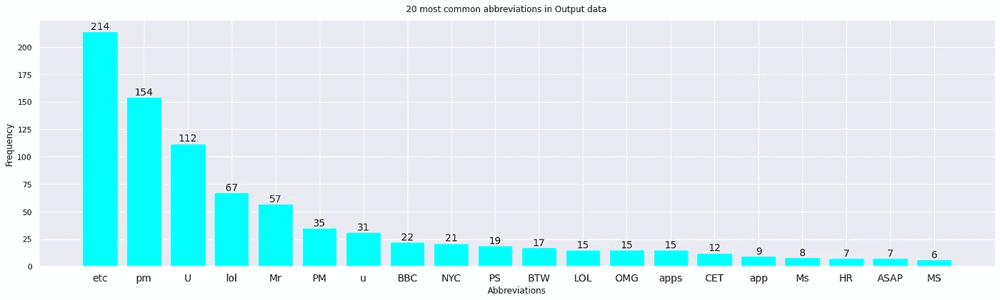

输出文本中最常见的 20 个缩写

## 观察结果:

*   在输入文本中总共发现 75 个缩写，在输出文本中总共发现 64 个缩写。

# 数据准备

## 1.在字符级别

在建立字符级的基线模型之前，我们已经根据字符长度过滤了句子。根据 EDA，输入文本的最大长度可以被认为是 260，输出文本的最大长度可以被认为是 262。但是由于计算的限制，我们选择输入和输出文本的最大长度为 110。

下一步，在过滤句子之后，我们将数据按照 9:1 的比例分成训练和测试。之后，创建一个 tokenizer 对象，将 char_level 设置为 True，并根据训练数据进行调整。这导致创建大小为 75 的输入词汇表和大小为 68 的输出词汇表。

还创建了一个训练和测试数据加载器，批量大小为 512，最大长度为 110。

## 2.在单词级别

在构建单词级别的基线模型之前，我们已经基于单词长度过滤了句子。根据 EDA，输入文本的最大长度可以被认为是 63，输出文本的最大长度可以被认为是 63。但是由于计算的限制，我们选择输入和输出文本的最大长度为 25。

下一步，在过滤句子之后，我们将数据按照 9:1 的比例分成训练和测试。之后，创建一个 tokenizer 对象，将 char_level 设置为 False，并根据训练数据进行调整。这导致创建大小为 35510 的输入词汇表和大小为 29350 的输出词汇表。

还创建了一个训练和测试数据加载器，批量大小为 512，最大长度为 25。

# 基线模型

假设我们的原始表示是字符，我们现在可以转向对英语本身建模的问题。我们选择使用简单的编码器-解码器作为我们的基线模型，因为最近的文献已经显示了它在捕捉流利英语的许多动态方面的有效性。

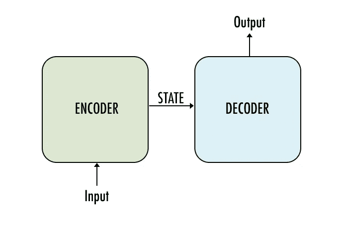

简单编码器-解码器模型

## 在字符级别

我们选择利用长短期记忆(LSTM)单元作为神经网络中的隐藏单元，因为 LSTM 单元具有特殊的“门控”机制，允许它们在许多时间步长上传播误差信号；我们推断，考虑到我们决定对字符而不是单词建模，这种选择是合乎逻辑的，这导致了作为字符链的非常长的句子分解，以及更细粒度、更难以捕捉的字符级语言动态。

1.  **可训练嵌入的 1 层 LSTM:**该模型通过保持编码器和解码器的嵌入层为可训练的，嵌入维数为 300 来训练。编码器和解码器单元被选择为 100。这导致 loss 和 val_loss 都是 nan。

字符级模型在翻译过程中引入了更多的变化，其中字符通常被映射到空格。因为源单词和目标单词经常不对齐，所以字符的映射会导致无意义的结果。

## 在单词级别

我们选择利用门控循环单元(GRU)、长短期记忆(LSTM)单元和双向 LSTM 单元作为我们的神经网络中的隐藏单元，在单词级别，每个单元都具有可训练的嵌入层、手套嵌入和快速文本嵌入。手套嵌入加载有长度为 400000 的单词向量和 300 的嵌入维度。Fasttext 嵌入加载了长度为 999995 的单词向量和 300 的嵌入维数。可训练嵌入层维度也被选择为 300，并且编码器和解码器单元被选择为 100。每个模型用 adam 优化器的默认值训练 20 个时期。

1.  **具有可训练嵌入的 1 层 GRU:**该模型导致 train loss 为 1.38，val_loss 为 1.69。该模型实现了 0.44 的平均训练 BLEU 分数和 0.41 的平均测试 BLEU 分数。
2.  **具有手套嵌入的 1 层 GRU:**该模型导致 1.59 的 train 损失和 1.67 的 val_loss。该模型已经实现了 0.45 的平均训练 BLEU 分数和 0.43 的平均测试 BLEU 分数。
3.  **具有快速文本嵌入的 1 层 GRU:**该模型导致 1.64 的 train 损失和 1.69 的 val_loss。该模型实现了 0.46 的平均训练 BLEU 分数和 0.44 的平均测试 BLEU 分数。
4.  **具有可训练嵌入的 1 层 LSTM:**该模型导致 train loss 为 1.38，val_loss 为 1.67。该模型实现了 0.44 的平均训练 BLEU 分数和 0.44 的平均测试 BLEU 分数。
5.  **具有手套嵌入的 1 层 LSTM:**该模型导致 1.63 的 train 损失和 1.68 的 val_loss。该模型实现了 0.44 的平均训练 BLEU 分数和 0.43 的平均测试 BLEU 分数。
6.  **具有快速文本嵌入的 1 层 LSTM:**该模型导致 1.71 的 train 损失和 1.72 的 val_loss。该模型实现了 0.43 的平均训练 BLEU 分数和 0.46 的平均测试 BLEU 分数。
7.  **具有可训练嵌入的 1 层双向 LSTM:**该模型导致 1.18 的 train 损耗和 1.54 的 val_loss。该模型实现了 0.43 的平均训练 BLEU 分数和 0.42 的平均测试 BLEU 分数。
8.  **具有手套嵌入的 1 层双向 LSTM:**该模型导致 1.26 的 train 损耗和 1.44 的 val_loss。该模型实现了 0.42 的平均训练 BLEU 分数和 0.42 的平均测试 BLEU 分数。
9.  **具有快速文本嵌入的 1 层双向 LSTM:**该模型导致 1.38 的列车损失和 1.46 的 val_loss。该模型实现了 0.42 的平均训练 BLEU 分数和 0.41 的平均测试 BLEU 分数。

我们基线的单词级模型在翻译中取得了更好、更有意义的结果。

# 基于注意力的模型

进一步，为了提高模型的性能，我们选择利用基于注意力的编码器-解码器作为我们的神经翻译模型。注意模型或注意机制是神经网络的输入处理技术，允许网络专注于复杂输入的特定方面，一次一个，直到整个数据集被分类。目标是将复杂的任务分解成更小的注意力区域，然后依次处理。这类似于人类的大脑如何通过将一个新问题分成更简单的任务并逐个解决它们来解决它。

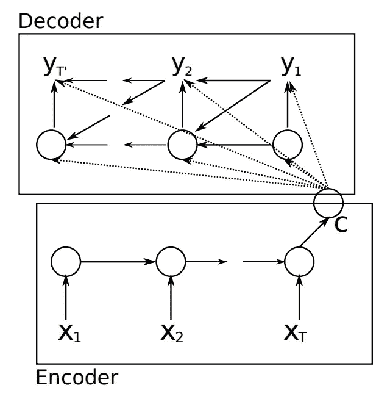

编码器-解码器递归神经网络模型。
摘自《使用统计机器翻译的 RNN 编码器-解码器学习短语表示》

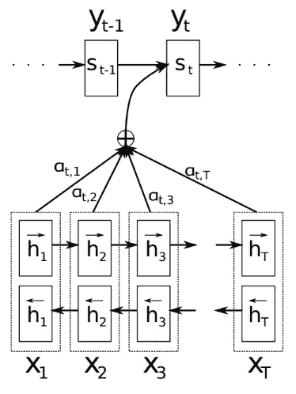

注意力示例
摘自《联合学习对齐和翻译的神经机器翻译》，2015。

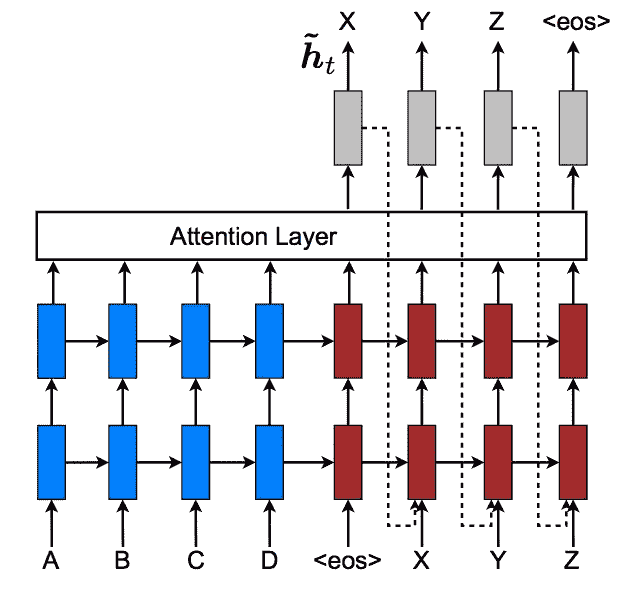

将隐藏状态作为输入提供给解码器
摘自《基于注意力的神经机器翻译的有效方法》，2015 年。

## 在字符级别

我们选择利用长短期记忆(LSTM)单元作为我们基于注意力的神经网络中的隐藏单元。在注意力层，我们使用了“点”评分函数，其他函数如“一般”和“串联”也可以进行实验。该模型使用嵌入维数 300 和批量大小 512 进行训练。编码器单元、解码器单元和注意单元被选择为 64。使用默认值的 adam 优化器对该模型进行总共 80 个时期的训练。

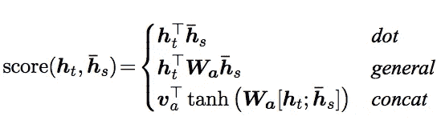

注意力评分功能

1.  **具有可训练嵌入的 1 层 LSTM:**通过保持编码器和解码器的嵌入层为可训练的来训练该模型。这导致了 0.354 的损失和 0.359 的 val_loss。该模型在 80 个历元时达到了 0.01 的平均训练 BLEU 分数和 0.03 的平均测试 BLEU 分数。

基于注意力的字符级模型在翻译过程中引入了更多的变化，其中字符通常被映射到空格。因为源单词和目标单词经常不对齐，所以字符的映射会导致不准确的结果。

## 在单词级别

我们选择利用 1 层和 2 层长短期记忆(LSTM)单元和 1 层双向 LSTM 单元作为我们的基于注意力的神经网络中的隐藏单元，在单词级别。使用的嵌入是可训练嵌入层和快速文本嵌入。Fasttext 嵌入加载了长度为 999995 的单词向量和 300 的嵌入维数。可训练嵌入层维度也被选择为 300。在关注层，我们使用了“点”评分功能。使用 adam 优化器和 512 的批量大小为不同的时期训练每个模型。

1.  **具有可训练嵌入的 1 层 LSTM:**编码器单元、解码器单元和注意单元被选择为 64。该模型经过 100 个历元的训练，得到 train loss 为 0.26，val_loss 为 0.27。该模型实现了 0.74 的平均训练 BLEU 分数和 0.44 的平均测试 BLEU 分数。
2.  **具有快速文本嵌入的 1 层 LSTM:**编码器单元、解码器单元和注意单元被选择为 256。该模型被训练 110 个时期，并导致 0.197 的训练损失和 0.194 的 val_loss。该模型在 90°历元达到了 0.69 的平均训练 BLEU 分数和 0.49 的平均测试 BLEU 分数。
3.  **具有可训练嵌入的 2 层 LSTM:**编码器单元、解码器单元和注意单元被选择为 256。该模型被训练 70 个时期，并导致 0.198 的训练损失和 0.193 的 val_loss。该模型在 70 个历元上取得了 0.81 的平均训练 BLEU 分数和 0.47 的平均测试 BLEU 分数。
4.  **具有快速文本嵌入的 1 层双向 LSTM:**编码器单元、解码器单元和注意单元被选择为 256。该模型被训练 80 个时期，并导致 0.12 的训练损失和 0.10 的 val_loss。该模型在 80 个历元时达到了 0.84 的平均训练 BLEU 分数和 0.50 的平均测试 BLEU 分数。

与简单的编码器-解码器模型相比，基于注意力的单词级模型在翻译中取得了更好、更有意义的结果。

# 预测结果

下面列出了使用注意力模型(1 层-双向 LSTM 和快速文本嵌入)的一些最终预测结果。

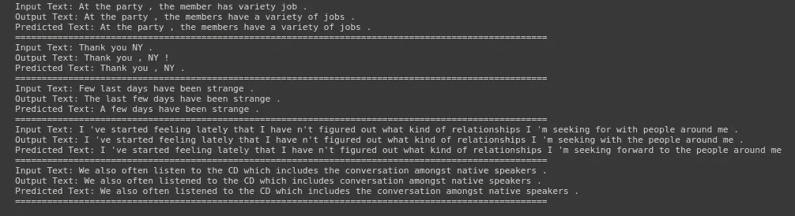

使用注意力模型训练集结果(1 层-双向 LSTM 和快速文本嵌入)

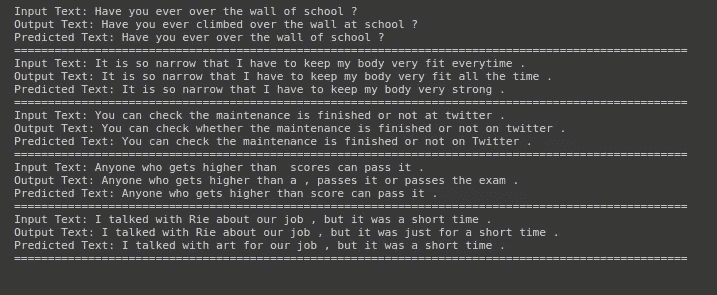

使用注意力模型的测试集结果(1 层-双向 LSTM 和快速文本嵌入)

# 比较摘要

## 基线模型

**概要:**

下面列出了具有最佳训练 BLEU 分数和最佳测试 BLEU 分数的每个基线模型的比较总结。

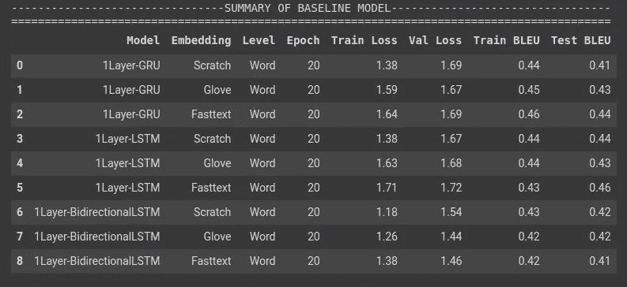

**BLEU 评分:**

具有最佳训练 BLEU 分数和最佳测试 BLEU 分数的每个基线模型的比较条形图如下所示。

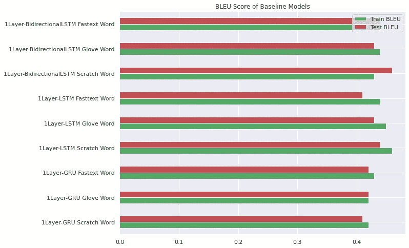

基线模型的 BLEU 分数

**损失值:**

各基线模型与列车损失值和测试损失值的对比柱状图如下所示。

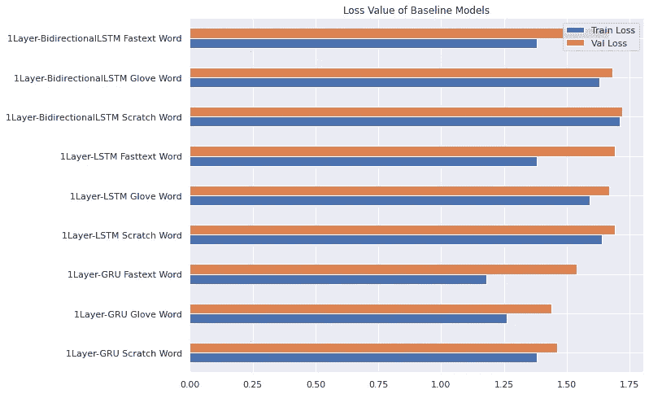

基线模型的损失值

## 注意力模型

**总结:**

下面列出了在不同时期值具有最佳训练 BLEU 分数和最佳测试 BLEU 分数的每个基于注意力的模型的比较总结。

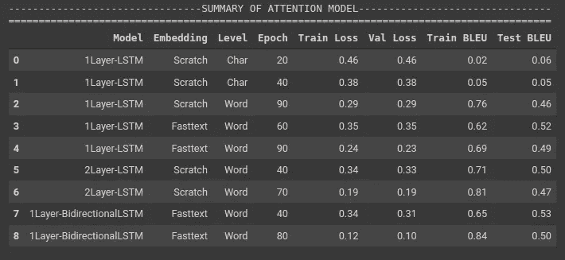

**BLEU 评分:**

具有最佳训练 BLEU 分数和最佳测试 BLEU 分数的每个注意力模型的比较条形图如下所示。

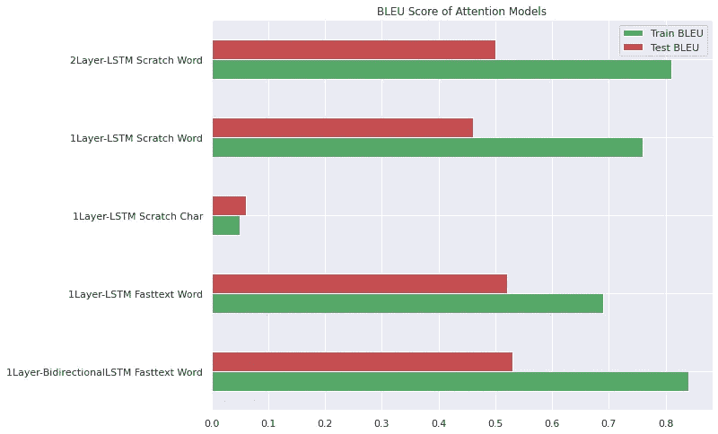

注意力模型的 BLEU 评分

**损失值:**

每个注意力模型与训练损失和测试损失值的对比条形图如下所示。

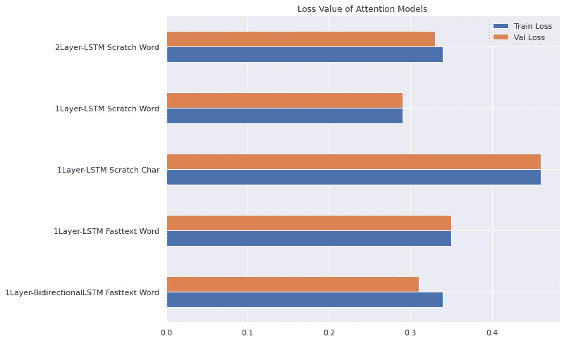

注意力模型的损失值

# 结论和未来工作

*   我们发现使用字符级模型在翻译过程中引入了更多的变化，其中字符通常被映射到空格。因为源单词和目标单词经常不对齐，所以字符的映射会导致不准确的结果。因此，我们基线的单词级模型在翻译中取得了更好、更有意义的结果。
*   单词级基线模型已经显示了其在捕捉流利英语文本的许多动态方面的有效性。另一方面，基于注意力的模型被证明更善于捕捉这些长期的动态。
*   在未来的工作中，基于注意力的模型的不同变体可以用于改进模型性能。
*   可以采用更健壮的模型，如 Transformers，它利用注意力来提高这些模型的训练速度。
*   最后，我们非常有兴趣探索我们的文本校正模型在其他语言中的应用，并评估其性能；如果文本校正方案可以扩展到其他语言，该模型可以是机器翻译管道中重要的预处理和后处理步骤。

# 参考

*   [使用递归神经网络的句子校正](https://cs224d.stanford.edu/reports/Lewis.pdf)
*   [使用用于统计机器翻译的 RNN 编码器-解码器学习短语表示](https://arxiv.org/abs/1406.1078)
*   [基于注意力的神经机器翻译的有效方法](https://arxiv.org/abs/1508.04025)
*   [联合学习对齐和翻译的神经机器翻译](https://arxiv.org/abs/1409.0473)
*   [NAIST Lang-8 学习者语料库](https://sites.google.com/site/naistlang8corpora/)
*   [新加坡国立大学自然语言处理组](https://www.comp.nus.edu.sg/~nlp/corpora.html)

## Github:

[https://github.com/shekhartz/sentence-correction](https://github.com/shekhartz/sentence-correction)

## LinkedIn:

[https://www.linkedin.com/in/shekhartz/](https://www.linkedin.com/in/shekhartz/)