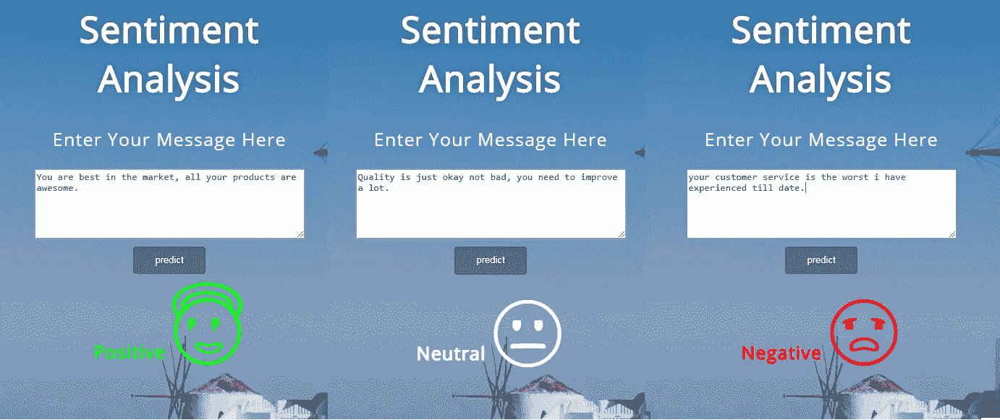
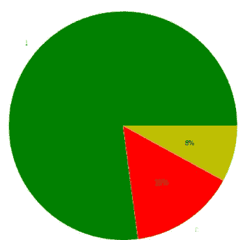
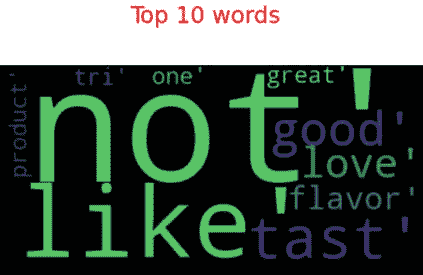
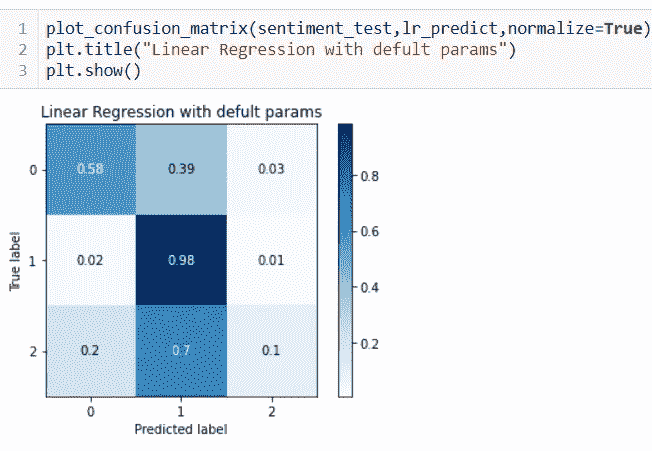
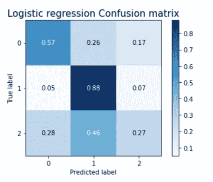
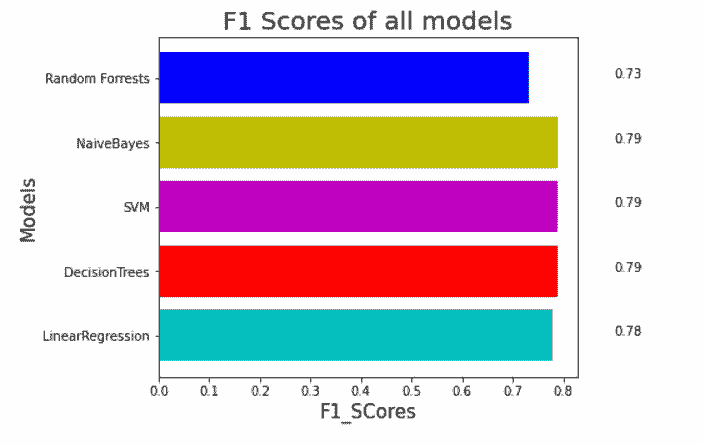
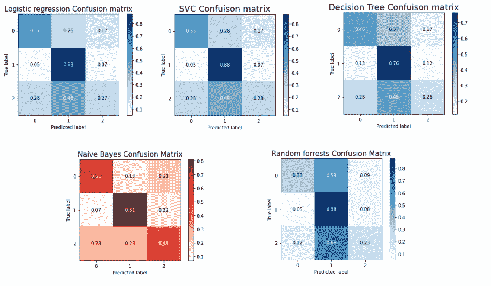
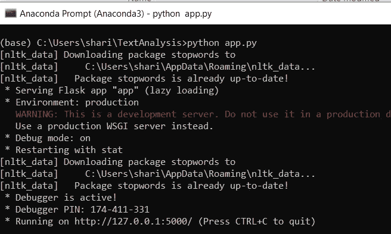
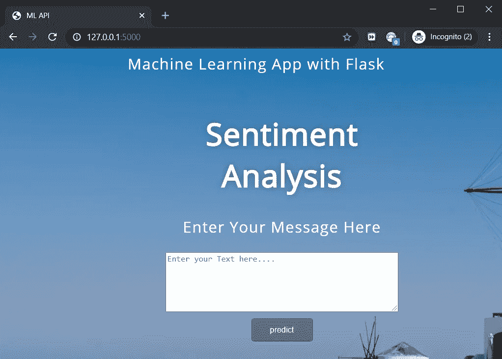
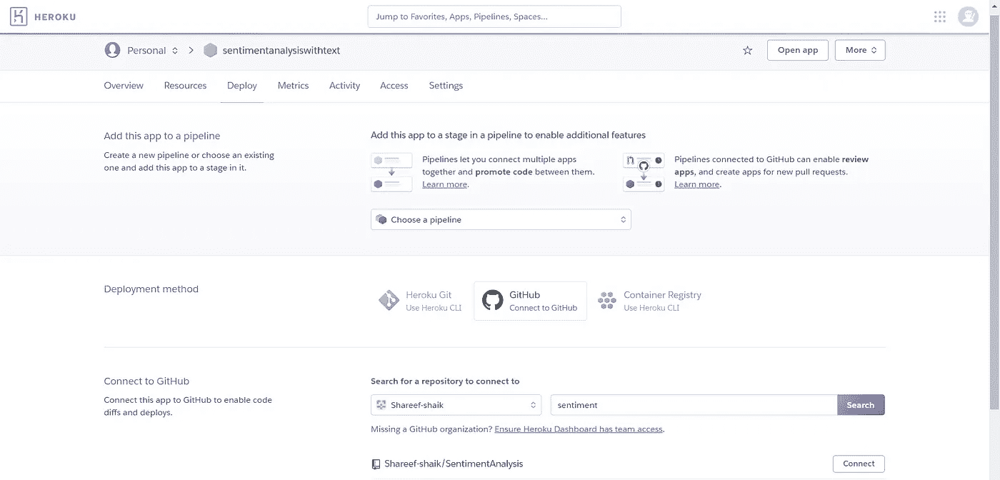

# 情感分析—从无到有的 ML 项目(Web 应用程序)

> 原文：<https://pub.towardsai.net/sentiment-analysis-from-scratch-to-production-web-api-3382f19748e8?source=collection_archive---------0----------------------->

## [自然语言处理](https://towardsai.net/p/category/nlp)



我们将要构建的应用程序的一瞥。

# 背景:

W 当我开始学习数据科学时，我总是迷失在它提供的大量资料中。学了一段时间后，我会忘记它，然后回来看视频或参考博客。然后我意识到，像其他技能一样，你需要练习和解决现实世界的问题。牢记这一点，我开始着手一个简单的项目。在开发一个端到端项目的过程中，你会了解到很多简单学习所不能获得的东西。实际上，当你被一个问题困住时，你搜索它，你尝试多种调整来让它工作。这是真正的学习。

# 动机:

当我在搜索一篇涵盖从零开始到部署应用程序的机器学习项目的文章时，我发现很少有这样的文章涵盖端到端。所以我想我应该借此机会写一篇博客，涵盖我自己的项目，以最简单的方式从获得数据到部署。所以我来了。

**好吧，我们开始吧。**

> 免责声明:如果你正在寻找代码，你可以在结论部分找到它

# 本文讨论的主题:

1.  问题陈述
2.  数据采集
3.  工具和指标
4.  数据清理
5.  探索性数据分析
6.  建模和调整数据
7.  评估模型
8.  部署模型

# 1.问题陈述:

这是开始一个项目前的关键步骤之一，如果你不明白你真正想要的是什么，相信我，你会遇到比你想象的更多的问题。


如今，一切都变得数字化，过去每个人都去购物中心购买产品的日子已经一去不复返了，现在一切都只需点击一下鼠标。随着互联网公司的蓬勃发展，行业竞争激烈，因此为了留住客户，公司迫切需要分析反馈并随着时间的推移不断发展。面对数百万的客户，手动审查客户情绪几乎是不可能的。这就是我们的问题所在，我们需要找到最合适的分类器，根据客户对某个产品的评论来判断他们的情绪。

> 因此，我们的目标是由客户给出一个评论，我们的模型必须预测评论的情绪是积极或消极或中立。

# 2.数据采集:

这是你需要获得正确数据的关键阶段之一，你的模型和你的数据一样好。就这么简单。


在实时环境中，我们可能需要处理很多复杂的事情来获得正确的数据。你可以通过抓取网页来获取数据，但在此之前，我建议你先从现有的数据集入手。Kaggle 是一个很好的起点，它有一些不错的数据集。

在这个项目中，我们将研究取自 Kaggle 的亚马逊美食评论。

在我们的数据中，每个评论都包含其 Id、ProductId、UserId、ProfileName、有用性分子、有用性分母、分数、时间、摘要、文本。

尽管有很多专栏，我们将只考虑评论 T **ext** 和他们的**分数**。

文本包含实际的评论，分数包含评分值，如 1、2、3、4、5。我们会将评分为< 3 as Negative and reviews with rating=3 as Neutral and reviews with ratings > 3 的评论视为正面评论。

然后我们要从复习课文中预测情绪。

# 3.工具和指标:


为您的模型定义正确的度量是一项具有挑战性的任务。

## 使用的指标:

**F1_score** (加权)，**混淆矩阵。**

*F1 = 2 *(精度*召回)/(精度+召回)*

F1_score 可以解释为精确度和召回率的调和平均值。这里有一篇关于它的有趣的[文章](https://towardsdatascience.com/multi-class-metrics-made-simple-part-ii-the-f1-score-ebe8b2c2ca1)。

混淆矩阵将帮助我们发现我们的模型能够多好地预测每个类别。这里有一个关于它的有趣的博客。

**需要的工具:** Python，Github 账号，Heroku 账号。

# 4.数据清理:

据称，数据科学家将几乎 70%的时间花在数据清理上。这是最乏味的任务之一。模型的性能与数据的整洁程度成正比。这里的清理包括删除重复数据、不必要的元素和处理丢失的数据。

在对文本进行预处理之前，我们将执行一些标准的清理技术。

**4.1。处理缺失数据和重复数据**

```
# drop the missing values.
reviews_df[[“Text”,”Score”]].isnull().any()
reviews_df.dropna(subset=["Text","Score"])
```

为了处理缺失值，我们可以简单地删除它们，或者如果您不想丢失信息，您可以使用一些插补技术来填充这些缺失值。在我们的例子中，**文本**(我们的数据)和**分数**(我们的标签)没有任何缺失值，所以我们可以继续下一步删除重复项。

```
#dropping the duplicate values.
reviews_df = reviews.drop_duplicates(subset={"UserId","ProfileName","Time","Text"},keep='first')
```

我们删除了所有具有相同用户 id、名称、时间和文本的评论。

4.2。文本预处理:

我们得到的评论有很多不必要的字符，一些常规的常用词，并没有真正增加模型的性能。我们需要在建模之前消除这些因素。

I)使用漂亮的 soap 删除所有 HTML 标签

ii)使用 re 删除所有特殊字符和数字。

iii)将评论符号化并转换为小写

iv)使用 PorterStemmer 执行词干分析

v)删除所有停用词。

```
def text_Preprocessing(reviews):

    *""" This will clean the text data, remove html tags, remove special characters and then tokenize the reviews to apply Stemmer on each word token."""* 
    pre_processed_reviews=[]

    for review in tqdm(reviews.values):
        review= BeautifulSoup(review,'lxml').getText()*#remove html tags*

        review=re.sub('[^A-Za-z]+',' ',review) *#remove special chars*
        review=re.sub("n't","not",review)
        review=word_tokenize(str(review.lower())) *#tokenize the reviews into word tokens*review=' '.join(PorterStemmer().stem(word) for word in review if word not in stop_words)
        pre_processed_reviews.append(review.strip())
    return pre_processed_review
```

## 4.2.特色化:

虽然我们从评论中删除了所有噪音和不必要的字符，但是想想我们的评论仍然是字符串格式(文本)，我们的计算机不能处理字符串，这些需要转换成一些数字表示。将该文本转换成数字/矢量形式通常被称为特征化。

有许多可用的特征化技术，其中我们将使用一个简单的 TFIDF 矢量器将这些文本转换成矢量。在此之前，我们将把数据分成训练和测试数据集，以避免数据泄漏。

我们将在 TFIDF 中使用单字和双字。二元模型认为两个连续的单词是一个单词，而一元模型认为是一个单词。

产品质量不好。

对于这个词，单词将是['质量'，'的'，'产品'，'是'，'不是'，'好']

二元模型:['质量'，'的'，'产品'，'产品是'，'不是'，'不好']

```
#split the data into train and test datasets
reviews_train,reviews_test,sentiment_train,sentiment_test=train_test_split(preprocessed_reviews.text,preprocessed_reviews.sentiment)#Applying TFIDF
tfidf_model=TfidfVectorizer(ngram_range=(1,2),min_df=10, max_features=6000)
tfidf_model.fit(reviews_train,sentiment_train)
reviews_train_tfidf=tfidf_model.transform(reviews_train)
reviews_test_tfidf=tfidf_model.transform(reviews_test)
```

# 5.EDA:

在对数据应用任何建模之前，让我们先了解我们的数据。知道你的数据想要告诉你什么是一个很好的实践。

1.  在预处理和删除重复和缺失值后，我们能够保留 93%的实际数据。



2.从饼图中，我们可以观察到类别 1 几乎占了总类别标签的 77%,类别 0 占了 15%,类别 2 占了 8%。显然，我们可以说这是一个不平衡的数据集。这可能会给我们的模型的性能带来问题，我们将在建模过程中解决这个问题。

3.让我们使用 IDF 权重找出前 10 个单词。



从词云来看，前 10 个关键词分别是**喜欢、不喜欢、好、很棒、喜欢、味道、风味、**等。这些话有道理。所以我们的数据看起来没问题。

好了，现在我们有了开始构建模型所需的一切。

# 6.建模和调整:


建模就是应用模型(ML 算法)从数据中学习潜在的模式。

为此，让我们从一个简单的基础模型开始，逻辑回归。我们将使用逻辑回归的 sklearn 实现。

```
#Applying Logistic Regressionfrom sklearn.linear_model importLogisticRegression lr=LogisticRegression(max_iter=1000)
lr.fit(reviews_train_tfidf,sentiment_train)
lr_predict=lr.predict(reviews_test_tfidf)
plain_lr_f1=f1_score(sentiment_test,lr_predict,average=None)
plain_lr_f1
```

在使用默认参数应用逻辑回归后，我们得到了 82%的 f1_score，让我们看看它的混淆矩阵:



> 理想混淆矩阵的经验法则是在矩阵的对角元素中有一个最佳值。对角线元素表示我们的模型预测实际标签的有效程度。

在这里，我们可以观察到，即使我们的模型的 f1_score 为 82%，当我们从混淆矩阵检查类的准确性时，我们可以观察到我们的模型能够以 58%预测类 0，以 98 %预测类 1，以 10%预测类 2，这确实非常差。

**为什么你认为我们的模型能够预测正面评价，比如正面评价和负面评价，但却很难预测中性情绪？**

> 还记得我们之前讨论的一个问题，阶级失衡。我们的模型有更多正面评价的数据，然后是负面评价。中性的数据最少。这也是我们这款表现不好的原因之一。

1.  阶层失衡问题。
2.  另一个问题是，我们没有用最佳参数训练我们的模型，我们只是用默认参数训练。

让我们解决这两个问题，看看我们是否可以提高模型性能。

**处理不平衡数据集:**当我们处理不平衡数据集时，有两种常见的方法来解决它。

***欠采样*** :在采样方法下删除**或**合并多数类中的例子。我们不打算使用这种技术，因为这种技术有可能会丢失信息。

***过采样* :** 过采样方法复制**或**在少数类中创建新的合成示例，我们将使用一种称为 **Smote 的过采样技术。**

```
from imblearn.over_sampling import SMOTE# Resample the minority class.
sm = SMOTE(sampling_strategy='auto', random_state=7)oversampled_trainX, oversampled_trainY = sm.fit_resample(reviews_train_tfidf,sentiment_train)
oversampled_trainY.value_counts()
```

之后，我们得到了新的 X 和 Y 值。让我们使用更新后的 X 和 y 应用逻辑回归模型。这一次，我们将使用 RandomizedSearchCV 找到逻辑回归的最佳参数。

**超参数调整的逻辑回归。**

```
lr_params={"penalty":["l1","l2"],
           "C":[10**i for i in range(-5,5)]}
lr=LogisticRegression()lr_rndm_clf=RandomizedSearchCV(lr,lr_params)
lr_rndm_clf.fit(reviews_train_tfidf,sentiment_train)
lr_rndm_clf.best_params_#passing the best pararms and creating a new model
lr_model=LogisticRegression(**lr_rndm_clf.best_params_,solver="liblinear")
lr_model.fit(reviews_train_tfidf,sentiment_train)
lr_predict=lr_model.predict(reviews_test_tfidf)
f1_score(sentiment_test,lr_predict,average=None)
```

这里我们得到加权 f1_score 为 89。但是让我们看看我们的模型能够多好地预测每一类。



后置过采样和参数调整

正如我们可以看到的，现在我们的模型比以前的模型略有改进。中性阶层的预测正确率为 27%，几乎是之前 10%的三倍。

虽然有所改进，但仍然不是很好，我们可以尝试一些其他的方法。但是为了简单起见，让我们继续讨论这个问题，因为中性阶级并没有给商业问题增加太多，我们更倾向于找出正确的积极和消极情绪。

# 7.评估:

> “**没有免费的午餐**”**定理**指出，没有一个模型能最好地解决所有问题。


到目前为止，我们只试验了一种模式，我们永远不应该停止它。我们需要尝试多种算法来找出最佳模型。为此，我试验了其他算法，如 SVC、决策树、朴素贝叶斯、随机森林。

由于不可能在这里逐一介绍每个模型，我尝试用下面的可视化表示来总结模型的性能。

> **注意:**你只需要遵循我们对其他模型的逻辑回归所遵循的相同方法。唯一的变化将是算法和他们的超参数休息是相同的。不要担心，我会留下一个链接到我的代码，你可以通过它。



所有型号的性能

如果你在这里观察，我们可以看到几乎所有的模型都有相同的分数，而随机森林是最少的，并且**朴素贝叶斯**比其他模型略好。

让我们看看混淆矩阵，找出最佳模式。



所有模型的混淆矩阵

如果你观察上面的混淆矩阵，**朴素贝叶斯**在预测第 0 类和第 2 类以及预测第 1 类时表现优于所有其他模型，具有相当不错的准确性。

> 因此，在评估了多个模型之后，我们选择了朴素贝叶斯作为我们的模型。

我们将以 pickle 格式保存朴素贝叶斯模型，以便以后使用。

# 8.部署模型:

部署模型是交付 ML 模型的关键步骤之一。有许多方法可以部署模型。我将使用 **Heroku** 和 **Github** 来托管我的模型。

***现在我们只是有了一个模型，还需要什么来部署模型呢？***

1.  我们将使用 Flask 创建一个 web 应用程序。
2.  需要为我们的应用程序创建一个脸。为此，我们将使用简单的 HTML 和 CSS。

烧瓶是微框架。实际上，flask 有很棒的文档，你可以在这里查看。

```
# -*- coding: utf-8 -*-
from flask import Flask,render_template,url_for,request
import pickle
import preprocessing# load the model from disk
clf = pickle.load(open('nb_clf.pkl', 'rb'))
cv=pickle.load(open('tfidf_model.pkl','rb'))
app = Flask(__name__)[@app](http://twitter.com/app).route('/')
def home():
 return render_template('home.html')[@app](http://twitter.com/app).route('/predict',methods=['POST'])
def predict():
    if request.method == 'POST':
        message = request.form['message']
        if(len(message)>2):
            text = [message]
            data = preprocessing.text_Preprocessing(text)
            vect = cv.transform(data)
            my_prediction = clf.predict(vect)
        else:
            my_prediction=3

    return render_template('home.html',prediction = my_prediction)if __name__ == '__main__':
 app.run(debug=True)
```

在上面的代码中，首先，我们使用 pickle load 加载了我们之前保存的模型和 TFIDF 模型。然后创建了一个名为 **app** 的 flask app。

然后我们使用`[**route()**](https://flask.palletsprojects.com/en/1.1.x/api/#flask.Flask.route)`装饰器告诉 Flask 哪个 URL 应该触发我们的函数。在`render_template`的帮助下，我们将渲染我们的 home.html，这是我们应用程序的主页。

在前端，当用户在文本字段中输入一些文本并点击**预测**按钮时，我们的 URL 将被追加**/预测、**和[@app](http://twitter.com/app) 。route('/predict '，methods=['POST'])被触发，用户输入的文本将使用 request.form 获取。

该文本将像我们对训练数据所做的那样进行预处理，然后我们用加载的模型预测结果。

现在转到终端，转到项目目录，键入 **python app.py.** 如果一切正常，您一定会看到类似这样的内容。



末端的

复制 URL (http://127.0.0.1:5000/)并粘贴到浏览器中，然后您一定会看到类似这样的内容。



浏览器中的应用

> 万岁！！！我们刚刚成功创建了我们的 web 应用程序。

> 注意:我没有在这里分享 html，因为它已经很长了，html 只是一个简单的形式，你可以参考下面分享的代码。

如果你观察到我们仍然在本地服务器上运行，我们的目标是确保每个人都可以访问它。所以 Heroku 来拯救我们了。

首先，我们应该将所有这些文件转移到 github，因为你可以简单地复制粘贴你的文件，也可以从终端上完成。我们将从终端这样做，只是为了避免在上传拖放时经常遇到的一些限制问题。

之后，在我们转移到 Heroku 之前，我们需要添加几个文件， **Requirements.txt** 和**Procfile**with text "**web:guni corn app:app**

Requirements.txt 将包含运行项目所需的所有库，Heroku 将首先安装所有这些库，然后运行项目。



Heroku 应用程序页面

一旦上传完成。下一步是登录 Heroku。

> 创建新应用程序。打开应用程序。在部署方法下选择 GitHub。(**注**:这里 Heroku 会要求你连接你的 github 账号)。

完成后，输入包含我们刚刚上传的文件的存储库的名称。向下滚动并点击**部署分支**。等待一段时间以查看成功消息。

**就这样**。**我们已经** **成功部署了我们的** [***情感分析***](http://sentimentanalysis.shareefshaik.me/) **应用。**

## 结论:

我们能够以相当高的 79%的准确率从文本中预测情感，我们需要理解我们的模型的性能是有限的，因为由于内存限制，我们只使用了 568k 评论中的 40k 评论。如果您有一个好的配置，尝试使用总数据集，总数据意味着模型可以学习更多的单词，从而提高性能。

> 这是部署 [**情绪分析**](https://sentimentanalysiswithtext.herokuapp.com/) **后的样子。**随时检查其性能。**这里** **可以得到完整的代码** [**。**](https://github.com/Shareef-shaik/SentimentAnalysis)

## 接下来是什么:

这只是一个分类问题，我们已经使用经典的机器学习算法来分析文本中的情感。下一步应该开始研究一些最先进的技术，如 RNN 和 LSTMs，它们可以提高模型的性能。我会试着在我的下一篇博客中讨论这个问题。

这是我的第**篇**帖子，如果你觉得缺少了什么或者有任何疑问，请通过评论让我知道，我将非常乐意帮助你。

**回头见！编码快乐！！！**

## 参考资料:

1.  【https://www.kaggle.com/snap/amazon-fine-food-reviews 
2.  [https://towards data science . com/multi-class-metrics-made-simple-part-ii-the-f1-score-ebe 8 b 2c a1](https://towardsdatascience.com/multi-class-metrics-made-simple-part-ii-the-f1-score-ebe8b2c2ca1)
3.  [https://towards data science . com/multi-class-metrics-made-simple-part-ii-the-f1-score-ebe 8 b 2c a1](https://towardsdatascience.com/multi-class-metrics-made-simple-part-ii-the-f1-score-ebe8b2c2ca1)
4.  [https://www.youtube.com/watch?v=UbCWoMf80PY](https://www.youtube.com/watch?v=UbCWoMf80PY)
5.  [https://towards data science . com/hyperparameter-tuning-the-random-forest-in-python-using-scikit-learn-28 D2 aa 77 DD 74](https://towardsdatascience.com/hyperparameter-tuning-the-random-forest-in-python-using-scikit-learn-28d2aa77dd74)