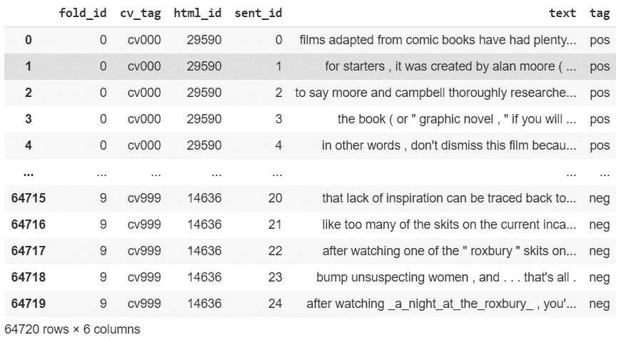
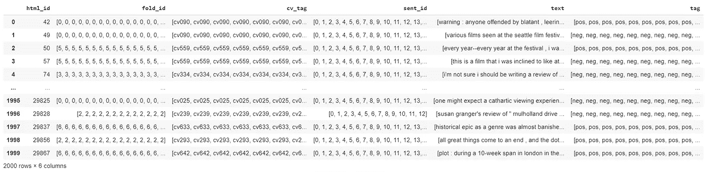
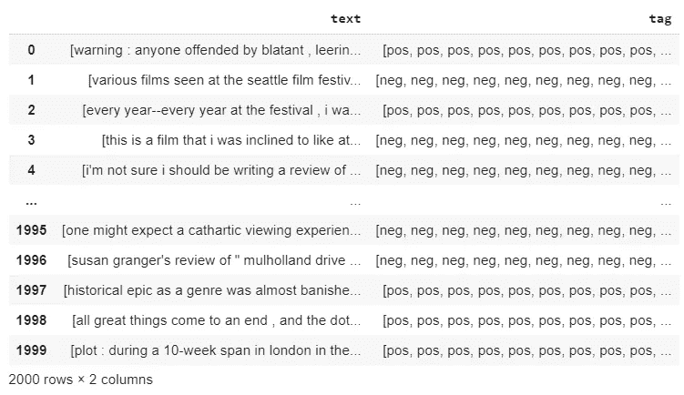
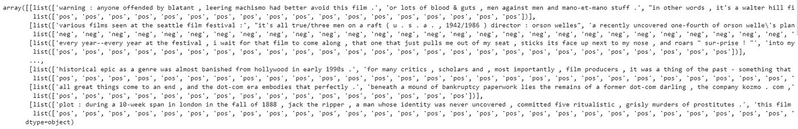
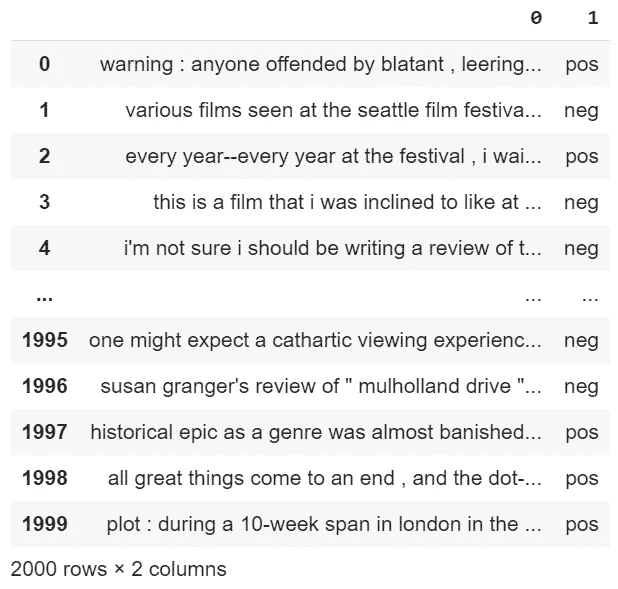
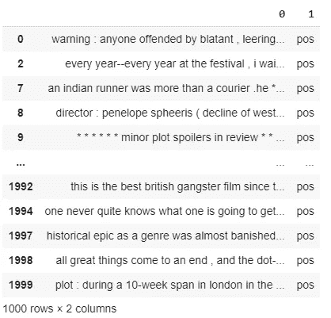
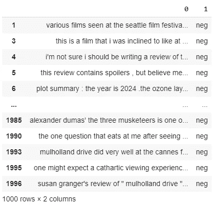
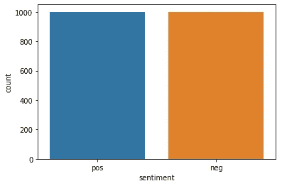

# 基于自然语言处理的电影评论情感分析准确率达到 95%

> 原文：<https://pub.towardsai.net/sentiment-analysis-on-movie-reviews-with-nlp-achieving-95-accuracy-91eef597e0f7?source=collection_archive---------1----------------------->

## 自然语言处理

## 在我的 Github 库中可以找到完整的代码。一手货源在 [Kaggle](https://www.kaggle.com/nltkdata/movie-review?select=movie_review.csv) 上有

几天前，我发表了一篇文章，使用相同的机器学习模块对推特数据集进行了[情感分析，准确率达到 96%](https://medium.com/towards-artificial-intelligence/sentiment-analysis-on-tweets-with-nlp-achieving-96-accuracy-8b63f0bcee99)。现在是增加复杂性和处理更复杂问题的时候了。这个实验的一个完美数据集是电影评论数据集，你可以在 Kaggle 上下载(见上面的链接)。


死亡池 2，2018，漫威

## 机器学习与深度学习

为什么我没有使用深度学习来完成这些任务？如果我必须使用 Tensorflow，我会使用嵌入式神经网络。不幸的是，这个数据集只包含 2000 条评论。与 Keras 中包含 50，000 条评论的标准电影评论相比，可能没有足够的数据供神经网络在其顶端执行。只有当数据量足够大时，深度学习的表现才会优于机器学习。

# nltk 模块

我将使用专门用于 NLP 的机器学习库，称为 nltk。我更喜欢使用 scikit-learn 来创建机器学习模型，但它是一个专门用于表格数据的库，而不是自然语言处理。

# 步伐

在本文中，我将遵循以下步骤。与上一篇文章的 Twitter 情感分析相比，数据的预处理会麻烦很多。

1.  导入模块
2.  看着这些数据
3.  创建要素和标签(编码)
4.  创建训练和测试(分割)
5.  使用模型:朴素贝叶斯分类器
6.  性能赋值

我将使用一种特殊的编码:不是将单词转换成数字，而是将它们存储到字典中。然后，我将把这个字典提供给模型。

# 1.导入模块

```
!pip install nltk
import nltk
#per risolvere un bug, altrimenti da errore
nltk.download('punkt')
```

除了我将使用的主要模块(不仅用于机器学习，还用于设置分词器)，我还必须创建我的分词工具。这个函数将把评论的每个句子分解成单独的字符串，并将每个单词放入 python 字典中。

```
#tokenizer
def format_sentence(sent):
  return({word: True for word in nltk.word_tokenize(sent)})#example
format_sentence('how are you')
{'are': True, 'how': True, 'you': True}
```

# 2.看着这些数据

```
import pandas as pd
total = pd.read_csv('/content/drive/My Drive/Colab Notebooks/Projects/20200602_Twitter_Sentiment_Analysis/movie_review.csv')
total
```

正如我们在导入数据集后可以立即看到的，我们遇到了一个大问题。这些评论是按句子存储的，同一篇评论的许多部分存放在不止一行中。我将需要从文本块分组的评论，然后将它们标记为积极或消极。

* * *这可能不会对使用机器学习工具产生太大影响，但如果我们决定使用深度学习，我们可能希望将所有评论捆绑在一起。从两方面来看，这都是一个需要解决的有指导意义的问题。



我将使用 pandas 的函数 groupby 通过 html_id 聚集行，然后将它们转换成一个列表。

```
#group by html_id
total = total.groupby('html_id').agg(lambda x: x.tolist())
total = total.reset_index()
total
```



所有的评论都被合并在文本栏下。我现在将删除多余的列。

```
#drop other columns: only conserve text
total.columns
total = total.drop(['html_id', 'fold_id', 'cv_tag', 'sent_id'], axis=1)
total
```



```
#the result is a separated chunks for every reviews: 
#chunk1, chunk2, ..., sentiment
total.values
```



我现在将重新创建一个数据集，在一列中包含完整的评论，在另一列中包含一个观点，而不是每行一个观点列表。

```
#we merge the chunks together and we obtain: 
#review, sentiment
total_text = list()
for lists in total.values:
  combines_text = ''
  for _ in lists[0]:
    combines_text = combines_text + _
  total_text.append([combines_text, lists[1][0]])#total_text
total_text = pd.DataFrame(total_text)
total_text
```



这是最终的列表:一个数据集中所有正面和负面评论的组合。

## 隔离正面评论

```
total_positive = total_text.copy()
total_positive.columns
total_positive = total_positive.loc[total_positive[1] == 'pos']
#total_positive = total_positive.pop('text')
#total_positive = total_positive.drop(['fold_id', 'cv_tag', 'html_id', 'sent_id'], axis=1)
total_positive
```



## 隔离负面评论

```
total_negative = total_text.copy()
total_negative.columns
total_negative = total_negative.loc[total_negative[1] == 'neg']
#total_negative = total_negative.pop('text')
#total_negative = total_negative.drop(['fold_id', 'cv_tag', 'html_id', 'sent_id'], axis=1)
total_negative
```



# 3.创建要素和标签(编码)

为了训练一个监督学习的人工智能，我需要为朴素贝叶斯分类器模型准备好我的数据。

```
#   tokenizer
def create_dict(total_positive, total_negative):

  positive_reviews = list()
  #word tokenization
  for sentence in list(total_positive.values):
    positive_reviews.append([format_sentence(sentence[0]), 'pos'])
    #saves the sentence in format: [{tokenized sentence}, 'pos]

  negative_reviews = list()
  #word tokenization
  for sentence in list(total_negative.values):
    #print(sentence)
    negative_reviews.append([format_sentence(sentence[0]), 'neg'])
    #saves the sentence in format: [{tokenized sentence}, 'pos]

  return positive_reviews, negative_reviewsXy_pos, Xy_neg = create_dict(total_positive, total_negative)
```

让我看一下数据的结构。这是存储在正面评论列表中的第一个词典。

```
Xy_pos[0]
[{'!': True,
  '&': True,
  "'d": True,
  "'s": True,
  "'ve": True,
  ...
  '.women': True,
  'with': True,
  'without': True,
  'women': True,
  'words': True,
  'would': True,
  'you': True,
  'yourself': True},
 'pos']
```

我想看看数据集的图表，看看正面和负面评论的比例。

```
X = pd.concat([total_positive, total_negative], axis=0)
X.columns = ['text', 'sentiment']import seaborn as sns
sns.countplot(x='sentiment', data=X)y = pd.DataFrame(X.pop('sentiment'))
```



1000 个正面评价，1000 个负面评价

# 4.创建训练和测试(分割)

```
def split(pos, neg, ratio):
  train = pos[:int((1-ratio)*len(pos))] + neg[:int((1-ratio)*len(neg))]
  test = pos[int((ratio)*len(pos)):] + neg[int((ratio)*len(neg)):]
  return train, testXy_train, Xy_test = split(Xy_pos, Xy_neg, 0.1)
```

我现在可以准备训练和数据集的测试比例来训练 NLP 模型。

# 5.使用模型:朴素贝叶斯分类器

最后，我可以创建朴素贝叶斯分类器模型。我将使用数据集的 Xy_train 比例来填充模型。

```
from nltk.classify import NaiveBayesClassifier#training the model
classifier = NaiveBayesClassifier.train(Xy_train)
classifier.show_most_informative_features()
ost Informative Features                insulting = True              neg : pos    =     17.7 : 1.0                ludicrous = True              neg : pos    =     13.4 : 1.0                   avoids = True              pos : neg    =     12.3 : 1.0              outstanding = True              pos : neg    =     12.3 : 1.0                   regard = True              pos : neg    =     11.7 : 1.0                animators = True              pos : neg    =     10.3 : 1.0              fascination = True              pos : neg    =     10.3 : 1.0                    .yeah = True              neg : pos    =     10.3 : 1.0                     3000 = True              neg : pos    =     10.3 : 1.0                    sucks = True              neg : pos    =      9.8 : 1.0
```

该模型将一个值与数据集中的每个单词相关联。它将对每篇评论中包含的所有单词进行计算，然后做出评估:正面或负面。

# 6.性能赋值

```
from nltk.classify.util import accuracy
print(accuracy(classifier, Xy_test))
0.9477777777777778
```

我们的准确度是 94.7%，我们可以近似超过 95%。惊人的结果！