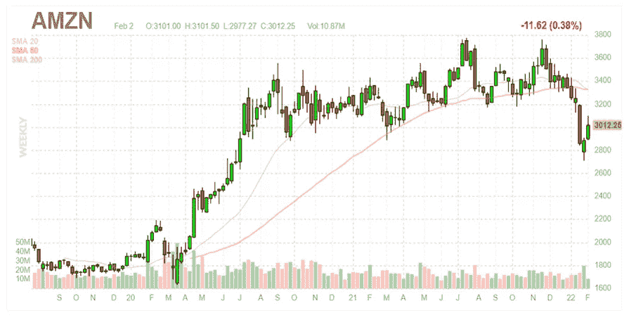
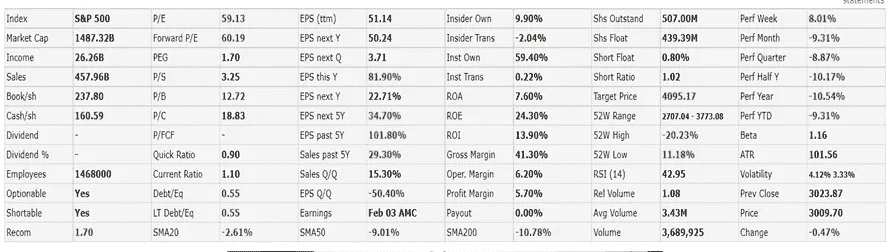
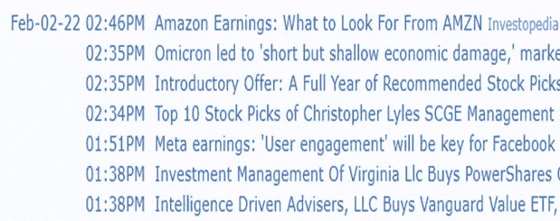
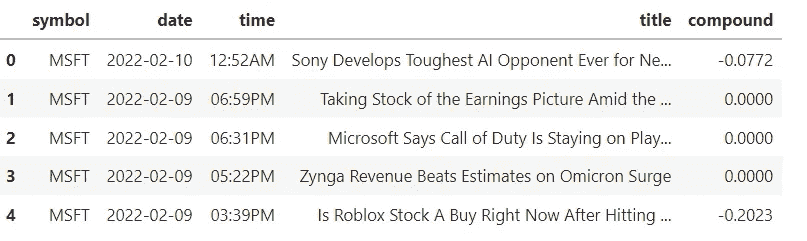
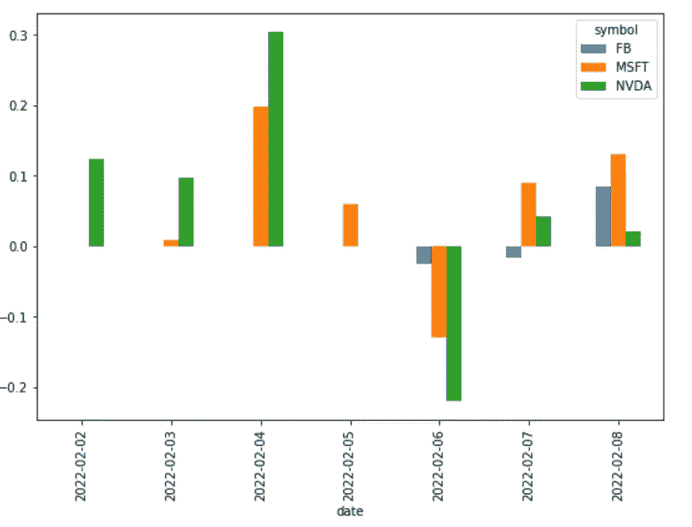
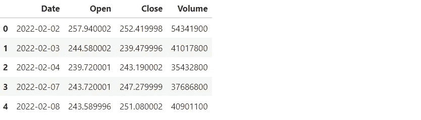
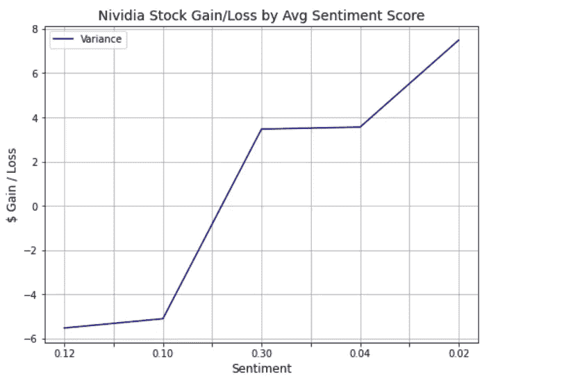

# 新闻标题与股票价格变化的情感分析

> 原文：<https://pub.towardsai.net/sentiment-analysis-on-news-headlines-and-stock-price-changes-69978b5bf2a6?source=collection_archive---------1----------------------->

## [机器学习](https://towardsai.net/p/category/machine-learning)

"在市场中，感知比现实更有力量."

纳维德·阿布达里


来自 [Pexels](https://www.pexels.com/photo/smartphone-on-the-table-7887815/?utm_content=attributionCopyText&utm_medium=referral&utm_source=pexels) 的 [Olya Kobruseva](https://www.pexels.com/@olyakobruseva?utm_content=attributionCopyText&utm_medium=referral&utm_source=pexels) 的照片

# **简介**

你有没有想过是什么驱动了股票市场，或者是什么因素影响了股票的价格？影响股价价值的变量有很多，包括但不限于经济、利率、市场情绪、内部购买、财务预测、收入增长和收益、股息和股票回购。这些变量使得任何个人或股市专业人士都极难准确预测股价的涨跌。

股票价格是由多种因素驱动的，但最终任何给定时刻的价格都是由市场中该时刻的供求关系决定的。供给是人们想要出售的股票数量，需求是人们想要购买的股票数量。如果买方的数量多于卖方，买方就会抬高股票价格，以鼓励卖方卖出更多股票。如果卖家比买家多，价格就会下降，直到达到吸引买家的水平。

Investopedia 的 David R. Harper 总结了推动股票上涨或下跌的力量。这些力量分为三类:基本面因素、技术面因素和市场情绪。

*   基本面因素推动股价的基础是公司生产和销售商品和服务的收益和盈利能力。
*   与市场中股票价格历史相关的技术因素，包括图表模式、动量以及交易者和投资者的行为因素。
*   市场情绪是指投资者对特定证券或金融市场的总体态度。它是一个市场的感觉或基调，或大众心理，通过该市场中交易的证券的活动和价格运动来揭示。从广义上讲，价格上涨表明市场情绪看涨，而价格下跌表明市场情绪看跌。

随着机器学习及其许多高级算法的引入，最近的市场研究和股票市场预测进步已经开始将机器学习方法包括在分析股票市场数据和预测未来股票价格中。

**路线图**

本文的剩余部分将介绍一个根据新闻标题来判断市场情绪的程序。然后，我们将某家公司的情绪与一段时间内的价格涨跌进行比较。以下步骤将使用机器学习和 Python 来执行。

1.导入所需的软件库。

2.收集和分析数据。

3.应用情感分析。

4.想象情绪。

5.比较情绪和价格差异。

6.得出结论。

**程序**

目标:根据新闻标题确定情绪，并将情绪与股票价格进行比较。

**导入所需软件库**

```
**from** urllib.request **import** urlopen, Request
**from** bs4 **import** BeautifulSoup
**from** nltk.sentiment.vader **import** SentimentIntensityAnalyzer
**import** nltk
nltk**.**download('vader_lexicon')
**import** pandas **as** pd
**import** matplotlib.pyplot **as** plt
```

**收集并解析数据**

FinViz 是一个免费网站，让投资者可以轻松获取股票数据。我们将从 FinViz 收集特定股票代码的股票数据。例如，下面显示的是一段时间内亚马逊(Amazon)价格的网页。



当你向下滚动时，你会看到亚马逊的新闻文章列表。



当您查看源代码时，您会看到包含股票文章名称和发表日期的 HTML 代码。

[亚马逊收益:从 AMZN 中寻找什么](”https://www.investopedia.com/amazon-q4-fy2021-earnings-report-preview-5217866?utm_campaign=quote-yahoo&utm_source=yahoo&utm_medium=referral")

我们现在将创建一个股票符号数组和 FinViz URL，从中解析数据。

```
symbols **=** ['MSFT', 'FB', 'NVDA']
finviz_url **=** 'https://finviz.com/quote.ashx?t='
```

我们将使用 Python 中的请求模块来发送 HTTP 请求。
HTTP 请求返回一个包含所有响应数据的响应对象。
响应对象然后被输入到 BeautifulSoup，在那里它将被解析。
id 为“news-table”的 HTML 元素包含所有的新闻文章，并且
我们将该元素保存到一个字典中。

Beautiful Soup 是一个 Python 库，用于 web 抓取目的，从 HTML 文件中提取数据。它从页面源代码中创建了一个解析树，可用于以层次化和可读性更强的方式提取数据。

```
news_tables **=** {}
**for** symbol **in** symbols:
    url **=** finviz_url **+** symbol

    request **=** Request(url**=**url, headers**=**{'user-agent': 'my-app'})
    response **=** urlopen(request)

    html **=** BeautifulSoup(response, features**=**'html.parser')
    news_table **=** html**.**find(id**=**'news-table')
    news_tables[symbol] **=** news_table
```

我们现在将使用上面保存的新闻表，并解析出我们需要的特定值。我们在新闻文章的表格中寻找所有的表格行，并收集每篇文章发表的标题、日期和时间。一旦我们有了这些值，我们就可以将每一段数据保存到我们解析的数据数组中。

```
parsed_data **=** []
**for** symbol, news_table **in** news_tables**.**items():
    **for** row **in** news_table**.**findAll('tr'):
        title **=** row**.**a**.**text
        date_data **=** row**.**td**.**text**.**split(' ')

        **if** len(date_data) **==** 1:
            time **=** date_data[0]
        **else**:
            date **=** date_data[0]
            time **=** date_data[1]

        parsed_data**.**append([symbol, date, time, title])
```

我们将把解析后的数据数组转换为 Pandas 数据框，并将日期列设置为 Python Datetime 格式。这将允许我们轻松地应用情感分析，并使用 MatPlotLib 可视化数据。

```
news **=** pd**.**DataFrame(parsed_data, columns**=**['symbol', 'date', 'time', 'title'])
news['date'] **=** pd**.**to_datetime(news**.**date)**.**dt**.**date
```

**应用情感分析**

情感分析是一种文本分析方法，它检测文本中的极性(正面或负面观点)。我们将使用 NLTK(自然语言工具包)子模块 VADER 进行文本情感分析。

VADER(情感推理的效价感知词典)是一个用于文本情感分析的模块，它对情感的极性(积极/消极)和强度(强度)都敏感。它直接应用于未标记的文本数据。

VADER 的 SentimentIntensityAnalyzer()接受一个字符串，并返回以下每个类别的得分字典:

*   否定的；消极的；负面的；负的
*   中立的
*   积极的
*   复合(通过标准化上述得分计算)

例如，以下文本将返回这些输出分数:
‘这是有史以来最好、最棒的电影！！!'
输出-{'neg': 0.0，' neu': 0.425，' pos': 0.575，' compound': 0.8877}

分数范围在-1 到 1 之间，其中-1 表示非常消极，+1 表示非常积极。我们将使用复合得分来确定一只股票的文章是正面还是负面的。

我们将创建一个 lambda 函数，它接受一个标题字符串，对其应用
vader.polarity_scores()函数以获得结果，然后
返回复合分数。使用 Pandas，
中的应用功能，我们可以在数据框中创建一个新的“复合”列，包含每个标题的所有复合分数。

```
# initialize the SentimentIntensityAnalyzer.
vader **=** SentimentIntensityAnalyzer()function **=** **lambda** title: vader**.**polarity_scores(title)['compound']
news['compound'] **=** news['title']**.**apply(function)
news**.**head(5)
```



**将情绪可视化**

我们将根据每行的符号和日期对数据框进行分组，然后可视化每天的平均复合得分。我们取“复合”行的横截面，翻转数据框，使日期在 x 轴上，然后将其绘制成条形图。

```
plt**.**rcParams['figure.figsize'] **=** [9, 6]
news_mean **=** news**.**groupby(['symbol', 'date'])**.**mean()**.**unstack()
news_mean **=** news_mean**.**xs('compound', axis**=**"columns")**.**transpose()
news_mean**.**plot(kind**=**'bar')
plt**.**show()
```



**比较情绪和价格差异**

现在让我们看看情绪得分(复合)，并将它们与每天的价格差异(收盘价和开盘价之间的差异)进行比较。回想一下，复合分数是通过标准化负分数、中性分数和正分数来计算的。价格差异代表当天的美元收益或损失。我们将选择 Nvidia 股票价格进行分析。我们将忽略 2022 年 2 月 5 日和 2022 年 2 月 6 日，因为这两天是周六和周日，市场关闭。

我们将使用雅虎！金融市场下载器获取 Nvidia 股票的数据。

```
# Install yfinance.
!pip install yfinance
**import** yfinance **as** yf# Get data for Nvidia.
nvidia **=** yf**.**download('NVDA',start**=**'2022-02-02',  end**=**'2022-02-09',progress**=False**)[['Open', 'Close', 'Volume']]
nvidia**.**reset_index(inplace**=True**)nvidia**.**head(5)
```



为包含每天的
收盘价和开盘价之差的方差创建一个新变量。

```
nvidia['Variance'] **=** nvidia['Close'] **-** nvidia['Open']
```

为复合变量创建一个新变量，并加载每天的复合得分。

```
compound **=** ['0.12', '0.10', '0.30', '0.04', '0.02']
nvidia['Compound'] **=** compound
nvidia**.**head(5)
```


通过平均情绪得分直观显示股票价格的美元收益/损失。每个情绪得分代表从 2022 年 2 月 2 日到 2022 年 2 月 8 日的一个交易日。2022 年 2 月 5 日和 2022 年 2 月 6 日不包括在内，因为它们发生在周六和周日闭市时。



观察结果:

*   当平均情绪得分稍为正值(0.12，0.10)时，损失略高于 5.00 美元。
*   当平均情绪得分为中度正值(0.30)时，有 3.47 美元的收益。
*   当平均情绪得分勉强为正(0.04)时，有 3.55 美元的收益。
*   当平均情绪得分勉强为正(0.02)时，有 7.49 美元的收益。

结论:对于英伟达来说，在比较平均情绪得分和每日股价涨跌时，结果是不一致的。当情绪得分稍微为正时，就有损失。当情绪得分是适度积极的时候。当情绪得分勉强为正时，收益相当可观。我认为需要更多的研究来更好地理解情绪和股票价格之间的关系。

非常感谢你阅读我的文章！如果您有任何意见或反馈，请在下面添加。

如果你喜欢阅读这样的故事，并想支持我成为一名作家，可以考虑报名成为一名媒体成员。会员资格让你可以无限制地接触媒体上的故事。你可以使用此链接[https://medium.com/@dniggl/membership](https://medium.com/@dniggl/membership)注册