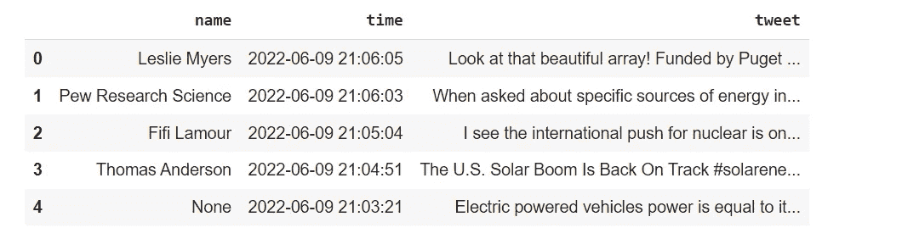
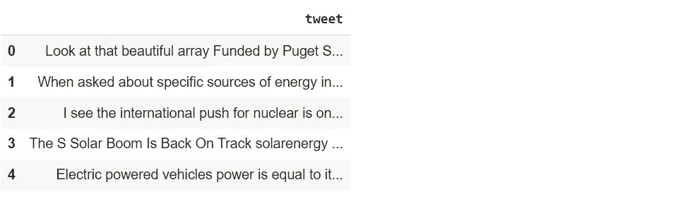
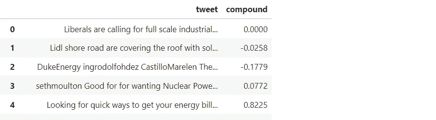
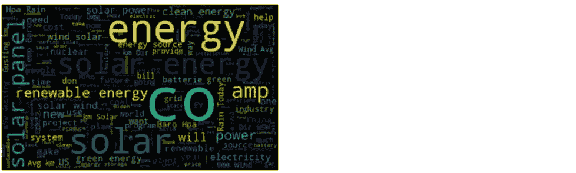
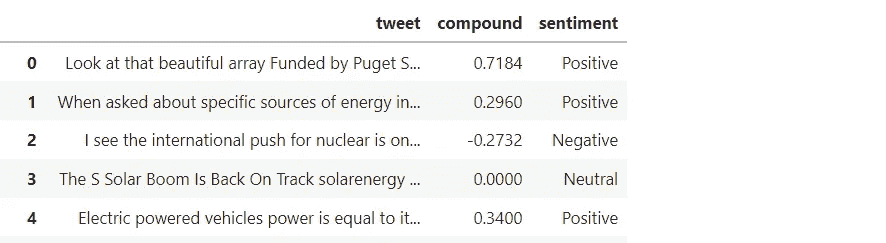
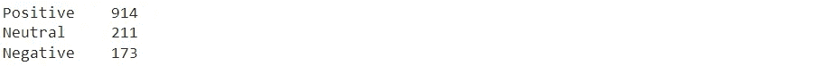
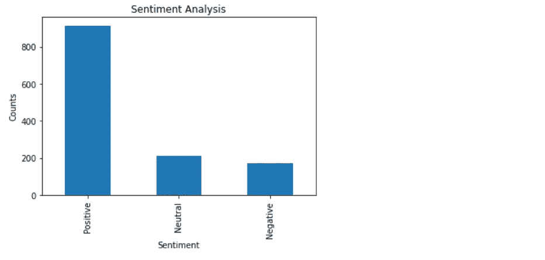
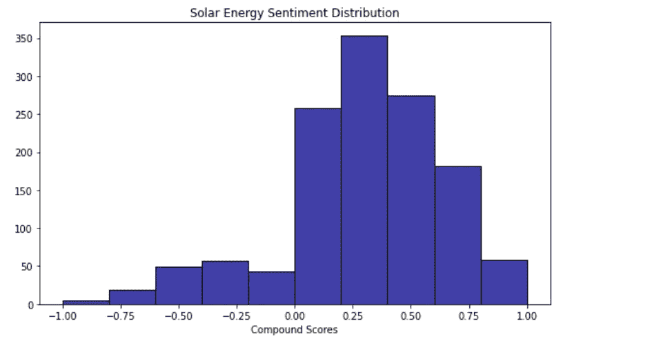

# 基于 NLP 和 Python 的太阳能情感分析

> 原文：<https://pub.towardsai.net/sentiment-analysis-on-solar-energy-with-nlp-and-python-1e6256194209?source=collection_archive---------3----------------------->

当以电子方式捕捉时，客户情绪——超越事实的表达，传达情绪、观点和情感——具有巨大的商业价值。我们谈论的是客户、潜在客户、患者、投票者和意见领袖的声音。”

*——塞思·格莱姆斯*


[摄于](https://unsplash.com/@vivintsolar?utm_source=unsplash&utm_medium=referral&utm_content=creditCopyText) [Unsplash](https://unsplash.com/s/photos/solar-panels-on-homes?utm_source=unsplash&utm_medium=referral&utm_content=creditCopyText) 上的

**简介**

迫切需要对气候变化采取行动。我们经常看到大范围的火灾、洪水、干旱、飓风和龙卷风。根据美国国家海洋和大气管理局的数据，2021 年美国的气候灾害造成了 1450 亿美元的损失，并导致 688 人死亡。显然，有必要做点什么。

作为个人，我们可以对气候变化采取行动的一种方式是使用太阳能电池板为我们的家庭发电，迟早会为我们的电动汽车发电。通过使用太阳能，我们可以降低或消除电力成本，通过减少碳排放来改善我们的环境，并增加我们房屋的价值。

**美国人对气候变化的看法**

皮尤研究中心进行了调查，以发现美国人对气候变化和可再生能源的看法。下面列出了他们的一些主要发现。您可以在此[链接](https://www.pewresearch.org/fact-tank/2022/04/22/for-earth-day-key-facts-about-americans-views-of-climate-change-and-renewable-energy/)查看他们的所有调查结果。

四分之三的美国人认为人类活动，如燃烧化石燃料，至少在一定程度上导致了气候变化，46%的人认为这是一个很大的原因。

美国人普遍认为旨在减少全球气候变化影响的政策对环境有益，但在是否有助于经济发展的问题上存在分歧。

当谈到具体政策时，69%的美国成年人支持美国采取措施在 2050 年实现碳中和——也就是说，释放到大气中的二氧化碳不会超过被清除的二氧化碳。

大约 70%的美国人(69%)优先发展替代能源，如风能和太阳能，而不是扩大石油、煤炭和天然气的生产。

四分之三的美国人支持美国参与国际努力，帮助减少气候变化的影响。

**情绪分析**

我认为分析与太阳能相关的情绪，发现人们的想法和/或情绪会很有趣。

情感分析是自然语言处理(NLP)方法的一种常见应用，其目标是分析文本的内容，并对情感做出预测，如负面、中性或正面。这样，情感分析可以被看作是一种用一些情感得分来量化定性数据的方法。虽然情绪在很大程度上是主观的，但情绪量化已经有了许多有用的实现，包括企业了解消费者对产品的反应或检测在线对话中的仇恨言论。

**进行情感分析的方法**

有三种主要的方法来实现情感分析。其中包括以下内容:

1.基于规则或词典的方法:这种方法依赖于手动创建的数据分类规则来确定情感。字典中的单词用正值或负值来表示它们的极性和情感强度。

2.自动化或机器学习方法:这种方法使用受监督的机器学习算法。用许多文本样本训练算法，直到它能够准确预测文本的情感。然后，更大的文本片段被输入到分类器中，它预测情绪为负面、中性或正面。

3.混合方法:这种方法利用了规则/词典方法和自动/机器学习方法。这是进行情感分析的最有效和最广泛使用的方法。

**路线图**

本文的剩余部分将展示一个分析与太阳能相关的情感的程序。我们将使用 Twitter 数据，并将推文分为积极、消极或中性情绪。以下步骤将使用 NLP 和 Python 来执行。

1.导入所需的库。

2.获取 Twitter 数据。

3.数据清理

4.应用情感分析。

5.想象情感。

6.得出结论。

**程序**

这个项目的目标是分析 Twitter 数据，发现与太阳能相关的情感。

您需要安装 Tweepy。Tweepy 是一个开源的 Python 包，为您提供了一种使用 Python 访问 Twitter API 的简单方法。

```
!pip install tweepy
```

**导入所需的库**

```
**import** os
**import** tweepy **as** tw
**import** numpy **as** np
**from** nltk.sentiment.vader **import** SentimentIntensityAnalyzer
**import** nltk
nltk**.**download('vader_lexicon')
**import** re
**import** pandas **as** pd
**from** wordcloud **import** WordCloud
**import** seaborn **as** sns
**import** matplotlib.pyplot **as** plt
```

**获取 Twitter 数据**

对于这个项目，我们将使用 Twitter API 从 Twitter 中提取数据。在使用他们的 API 之前，你需要设置一个 Twitter 开发者账户。我不会在这里介绍这个过程，但是你可以通过这个[链接](https://python.plainenglish.io/scraping-twitter-data-with-an-api-and-python-445a4de4b18)找到答案。

将您的 Twitter 开发人员 API 和访问令牌分配给变量。

```
api_key**=** 'API Key Here' 
api_secret**=** 'API Secret Key Here'
access_token**=** 'Access Token Here'
access_token_secret**=** 'Access Token Secret Here'
```

验证 API 和访问令牌。

```
auth **=** tw**.**OAuthHandler(api_key, api_secret)
auth**.**set_access_token(access_token, access_token_secret)
api **=** tw**.**API(auth, wait_on_rate_limit**=True**)
```

将搜索词和开始日期定义为变量。

```
search_words **=** "solar energy"
date_since **=** "2021-01-01"
```

使用搜索词和开始日期收集推文。

```
tweets **=** tw**.**Cursor(api**.**search,
              q **=** search_words,
              lang **=** "en",
              since **=** date_since)**.**items(3000)
```

定义一个函数来获取符合搜索条件的 Twitter 用户、tweet 时间和 tweet 文本，并创建一个新的数据框。

```
**def** get_related_tweets(key_word):
    twitter_users **=** []
    tweet_time **=** []
    tweet_string **=** [] 
    **for** tweet **in** tw**.**Cursor(api**.**search,q**=**key_word, count**=**3000)**.**items(3000):
             **if** (**not** tweet**.**retweeted) **and** ('RT @' **not** **in** tweet**.**text):
                **if** tweet**.**lang **==** "en":
                    twitter_users**.**append(tweet**.**user**.**name)
                    tweet_time**.**append(tweet**.**created_at)
                    tweet_string**.**append(tweet**.**text)

    df **=** pd**.**DataFrame({'name':twitter_users, 'time': tweet_time, 'tweet': tweet_string})
    df**.**to_csv(f"{key_word}.csv")
    **return** df
```

调用该函数来获取包含太阳能文本的 tweets，并显示一些 tweets。

```
df **=** get_related_tweets("solar energy")
df**.**head(5)
```



**数据清理**

tweets 中的文本包含许多俚语和标点符号。我们需要对推文中的文本进行预处理和清理，然后才能用于情感分析。文本预处理是自然语言处理中最重要的任务之一。例如，您可能希望在将标点符号用于文本分类之前，删除文本中的所有标点符号。

我们将使用正则表达式(Regex)来执行文本预处理任务。正则表达式是描述搜索模式的文本字符串，可以用最少的代码来匹配或替换字符串中的模式。Python 的重新打包将用于实现正则表达式。要了解更多关于正则表达式的内容，请点击这个[链接](https://stackabuse.com/using-regex-for-text-manipulation-in-python/)。

创建一个包含 tweets *的变量。*

```
tweets **=** df**.**iloc[:, 2]**.**values
```

通过用 Regex 预处理文本数据来清理文本数据。

```
processed_tweets **=** []

**for** sentence **in** range(0, len(tweets)):
    *# Remove all the special characters.*
    processed_tweet **=** re**.**sub(r'\W', ' ', str(tweets[sentence]))

    *# Remove all single characters as a result of removing the special characters.*
    processed_tweet**=** re**.**sub(r'\s+[a-zA-Z]\s+', ' ', processed_tweet)

    *# Remove single characters from the start.*
    processed_tweet **=** re**.**sub(r'\^[a-zA-Z]\s+', ' ', processed_tweet) 

    *# Replace multiple spaces with a single space.*
    processed_tweet **=** re**.**sub(r'\s+', ' ', processed_tweet, flags**=**re**.**I)

    *# Remove links from text.*
    processed_tweet **=** re**.**sub(r'http\S+', '', processed_tweet)

    *# Remove prefixed 'b'.*
    processed_tweet **=** re**.**sub(r'^b\s+', '', processed_tweet)

    processed_tweets**.**append(processed_tweet)
```

为已处理的推文创建新的数据框。

```
clean_tweets **=** pd**.**DataFrame({'tweet': processed_tweets})
clean_tweets**.**head(5)
```



**应用情感分析**

情感分析是一种文本分析方法，它检测文本中的极性(正面或负面观点)。我们将使用 NLTK(自然语言工具包)子模块 VADER 对文本进行情感分析。

VADER(情感推理的效价感知词典)是一个用于文本情感分析的模块，它对情感的极性(积极/消极)和强度(强度)都敏感。它直接应用于未标记的文本数据，并专门为社交媒体上表达的情感而设计。

VADER 的 SentimentIntensityAnalyzer()接受一个字符串，并返回以下每个类别的得分字典:

*   否定的；消极的；负面的；负的
*   中立的
*   积极的
*   复合(阳性、阴性和中性得分之和，然后在-1(强阴性)和+1(强阳性)之间标准化)。

例如，以下文本将返回这些输出分数:
‘这是有史以来最好、最棒的电影！！!'
输出-{'neg': 0.0，' neu': 0.425，' pos': 0.575，' compound': 0.8877}

分数范围在-1 到 1 之间，其中-1 表示非常消极，+1 表示非常积极。我们将使用复合得分来确定与太阳能相关的推文是正面还是负面的。

我们现在将初始化情绪强度分析器，并创建一个 lambda 函数，该函数接收一个文本字符串，并对其应用 Vader.polarity_scores()函数以获得结果，然后返回复合得分。使用 Pandas 中的 apply 功能，我们可以在数据框中创建一个新的复合列，其中包含每条 tweet 的所有复合得分。

```
vader **=** SentimentIntensityAnalyzer()

function **=** **lambda** title: vader**.**polarity_scores(title)['compound']
clean_tweets['compound'] **=** clean_tweets['tweet']**.**apply(function)
clean_tweets
```



**可视化情绪**

让我们看看情绪是如何分布的。通过绘制词云，我们可以更好地理解常用词。词云(也称为文本云)是一种可视化，其中特定的词在文本中出现的越多，它在词云中出现的就越大、越粗。

让我们用词云图将数据中的所有词可视化。



能源和太阳能是很突出的常用词。

创建一个函数来计算消极(-1)、中立(0)和积极(+1)情绪，并在数据框中添加一个名为“情绪”的新列。

```
**def** getAnalysis(score):
 **if** score **<** 0:
    **return** 'Negative'
 **elif** score **==** 0:
    **return** 'Neutral'
 **else**:
    **return** 'Positive'

clean_tweets['sentiment'] **=** clean_tweets['compound']**.**apply(getAnalysis)
clean_tweets
```



显示每种情绪的数量。

```
clean_tweets['sentiment']**.**value_counts()
```



总共有 1298 条推文。我们看到 914 条推文是正面的，211 条是负面的，173 条是中性的。

想象每种情绪的数量。

```
plt**.**title('Sentiment Analysis')
plt**.**xlabel('Sentiment')
plt**.**ylabel('Counts')
clean_tweets['sentiment']**.**value_counts()**.**plot(kind **=** 'bar')
plt**.**show()
```



基于复合分数可视化情感分布。

```
plt**.**figure(figsize**=**(8, 5))
sns**.**histplot(clean_tweets, x**=**'compound', color**=**"darkblue", bins**=**10, binrange**=**(**-**1, 1))
plt**.**title("Solar Energy Sentiment Distribution")
plt**.**xlabel("Compound Scores")
plt**.**ylabel("")
plt**.**tight_layout()
```



**结论**

绝大多数推文显示了对太阳能的积极态度。70%的情绪是正面的，16%是中性的，13%是负面的。这些观点与皮尤研究中心的调查结果一致。对于我们环境的未来来说，这是一个令人鼓舞的迹象。希望更多的人会将他们的想法付诸行动，开始使用太阳能为他们的家庭供电，并驾驶电动或混合动力汽车。

非常感谢你阅读我的文章！如果您有任何意见或反馈，请在下面添加。

如果你喜欢阅读这样的故事，并想支持我成为一名作家，可以考虑报名成为一名媒体成员。会员资格使你可以无限制地访问媒体上的所有报道。你可以通过这个链接[https://medium.com/@dniggl/membership](https://medium.com/@dniggl/membership)注册