# 使用 Python 进行情感分析(观点挖掘)——NLP 教程

> 原文：<https://pub.towardsai.net/sentiment-analysis-opinion-mining-with-python-nlp-tutorial-d1f173ca4e3c?source=collection_archive---------0----------------------->


来源: [Engin Akyurt](https://pixabay.com/photos/coffee-caffeine-beverage-table-2425303/) 在 [Pixabay](https://pixabay.com/photos/coffee-caffeine-beverage-table-2425303/) 上对原作的衍生

## [自然语言处理](https://towardsai.net/p/category/nlp)、[编辑](https://towardsai.net/p/category/editorial)、[编程](https://towardsai.net/p/category/programming)

## 使用 Python 深入进行情感分析(观点挖掘)的 NLP 教程

最后更新，2021 年 1 月 8 日

**作者:**萨妮娅·帕维斯，[罗伯托·伊里翁多](https://mktg.best/vguzs)

**本教程的代码可在**[**Github**](https://github.com/towardsai/tutorials/tree/master/sentiment_analysis_tutorial)**上获得，其完整实现也可在**[**Google Colab**](https://colab.research.google.com/drive/1eosolvfJqXi9xQHMLtmE91_pfq_RM8zF?usp=sharing)**上获得。**

> *🤖走向 AI 是一个讨论人工智能、数据科学、数据可视化、深度学习、机器学习、NLP、计算机视觉、相关新闻、机器人、自动驾驶汽车、编程、技术等的社区！*[](https://towardsai.net/backers)**🤖**

## *目录*

*   *[简介](#e550)*
*   *[什么是情感分析？](#2c46)*
*   *[情感分析的类型](#8e5e)*
*   *[情感分析架构](#1531)*
*   *[极性](#0c8b)*
*   *[情感分析方法](#a5cb)*
*   *[用于情感分析的基线机器学习算法](#4799)*
*   *[情感分析面临的挑战和问题](#497b)*
*   *[用于情感分析的数据预处理](#9d0a)*
*   *[用例:时尚情感分析，Python 实现](#c62a)*
*   *[著名的 Python 情感分析库](#e4b8)*
*   *[情感分析的应用](#8efc)*
*   *[结论](#afea)*
*   *[资源](#033d)*
*   *[参考文献](#0d6d)*

> *📚查看我们对[最佳机器学习书籍](https://towardsai.net/p/machine-learning/best-machine-learning-books-free-and-paid-ml-book-recommendations-40c9ab30b0c)的编辑推荐。📚*

# *介绍*

*“情绪”通常是观点的二元对立，并以情绪、态度、观点等形式表达感受。它可以表达很多观点。例如，“喜欢”或“不喜欢”，“好”或“坏”，“赞成”或“反对”，以及其他。*

*通过使用 [**机器学习**](https://mld.ai/mldcmu) 方法和 [**自然语言处理**](https://towardsai.net/p/nlp/natural-language-processing-nlp-with-python-tutorial-for-beginners-1f54e610a1a0) ，我们可以提取文档的个人信息，并尝试根据其极性对其进行分类，例如积极、中性或消极，从而使情感分析有助于确定对某一既定目标的总体看法，例如，某一特定公司的销售项目或股票市场预测。*

*情感分析具有挑战性，而且还远未解决，因为大多数语言都非常复杂(客观性、主观性、否定、词汇、语法等等)。然而，这正是从事[[1](https://www.cse.ust.hk/~rossiter/independent_studies_projects/twitter_emotion_analysis/twitter_emotion_analysis.pdf)工作令人兴奋的地方。*

*如今，**情感分析**在许多分析不同情况的应用中很普遍，例如:*

*   *自美国大选以来，Twitter 用户对当选总统的态度可能发生了怎样的变化？*
*   *这个客户的邮件是满意还是不满意？*
*   *这篇产品评论是正面的还是负面的？*
*   *人们对特定的新闻有什么反应？*
*   *消费者在购买前使用这些来研究产品和服务。*
*   *制作公司可以利用公众意见来确定他们的产品的接受程度和公众需求。*
*   *看电影的人在看过别人的影评后决定是否看电影。*
*   *根据民意对选举结果的预测。*
*   *来衡量社交媒体的表现。*
*   *和其他人一起。*

# *什么是情感分析？*

*基本上，我们可以**将情感分析**定义为对意见、想法、评估、评价、兴趣、观点、情感、主观性以及其他在文本中表达的内容的计算研究 [3](https://www.cs.uic.edu/~liub/FBS/NLP-handbook-sentiment-analysis.pdf) 。*

*它包括将文本中的观点分为“积极的”、“消极的”或“中立的”等类别情感分析也有不同的名称，如意见挖掘、评价提取、主观性分析等。*

*例如:*

*这部电影的故事很无聊，浪费时间*

*可以从上面的句子中提取以下术语来执行情感分析:*

*   ***意见所有者:**观众*
*   ***对象:**电影*
*   ***剧情:**剧情*
*   ***意见:**无聊又浪费时间。*
*   ***极性:**负极*

*其他示例:*

*   *“我喜欢我的智能手表，但不会向任何朋友推荐它。”*
*   *“我不喜欢爱情。这是浪费时间。”*
*   *"《泰坦尼克号》是有史以来最好的电影。"*
*   *"我不太喜欢鲜艳亮丽的衣服。"*

# *情感分析的类型*

*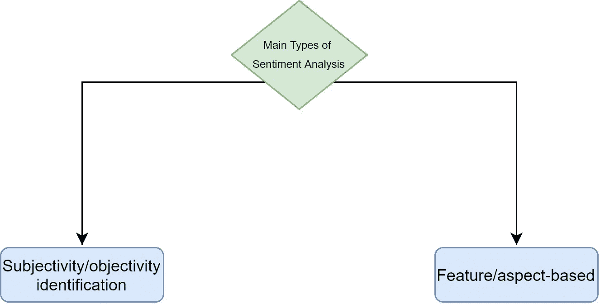*

*图 1:情感分析的主要类型。*

*有几种类型的情感分析，例如基于方面的情感分析、分级情感分析(正面、负面、中性)、多语言情感分析、情感检测等等[ [2](https://en.wikipedia.org/wiki/Sentiment_analysis) ]。*

*对于本教程，我们将重点关注**最相关的情感分析类型** [ [2](https://en.wikipedia.org/wiki/Sentiment_analysis) ]:*

*   ***主观性/客观性鉴定。***
*   ***基于特征/方面。***

## *主观/客观识别*

*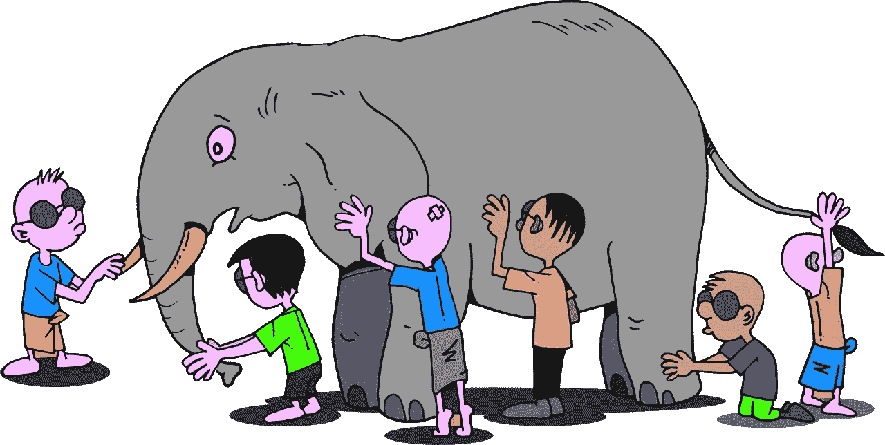*

*图 2:不同的人对一头大象的看法。|来源: [Pixabay](https://pixabay.com/tr/vectors/antik-k%C3%B6r-erkek-beyin-karikat%C3%BCr-2026111/)*

*在主观性或客观性识别中，给定的文本或句子被分为两个不同的类别:*

*   ***主观性**:表达一种观点，描述人们对某一特定话题的感受。*
*   *这个芒果的味道很好。*
*   ***客观**:表达事实。这个芒果是黄色的。*

*主观句表达个人的感情、观点或信念。情感分析对有个人联系的文本比对只有客观联系的文本更有效。*

*不同的人对大象的看法*

## *基于特征/方面*

**

*图 3:应用用户抽取。|来源: [Pixabay](https://pixabay.com/da/illustrations/smilies-hum%C3%B8rikoner-is%C3%A6r-s%C3%A6regenhed-1607163/)*

*基于特征或方面的情感分析分析产品的不同特征、属性或方面。它的主要目标是识别给定目标的方面以及对每个方面表现出的情绪。*

*例如:*

**“今天，我买了一部三星手机，我男朋友买了一部 iPhone。晚上我们互相打了电话。我手机的* ***语音*** *不清晰，但是* ***摄像头*** *还是不错的。我女朋友说她手机的***声音很清晰。所以，我决定买一部类似的手机，因为它的* ***语音*** *质量非常好。于是，我买了一部 iPhone，把三星手机退给了卖家。”***

**将方面提取应用于上面的句子:**

*   **声音。**
*   **相机。**
*   **声音。**

# **情感分析架构**

**下图展示了典型的情感分析架构，描述了将情感分析应用于电影数据的各个阶段。**

**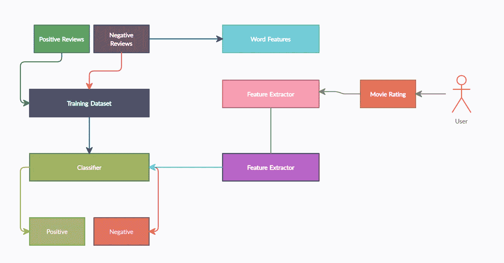**

**图 4:情感分析架构。**

**情感分析的控制流程:**

**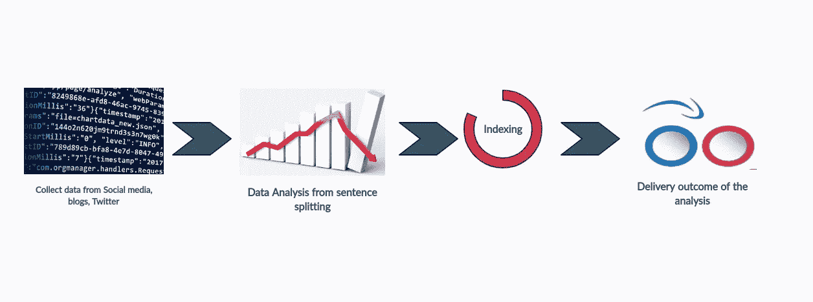**

**图 5:情感分析的典型控制流。**

**情感分析包括几个步骤:**

*   **数据收集。**
*   **数据分析。**
*   **索引。**
*   **送货。**

## **数据收集**

*   **消费者在公共论坛上表达的公众观点被收集，如 Twitter、脸书等。**
*   **观点或感觉/行为以不同的方式表达，写作的上下文、俚语的使用和简短的形式。**

## **数据分析**

**数据分析过程包括以下步骤:**

****1。文本准备****

*   **在做一些分析之前，数据被提取和过滤。**
*   **如果发现不相关，则识别并消除非文本内容和其他内容。**

****2。情感检测****

*   **每个句子和单词都非常明确地确定了主观性。**
*   **保留带有主观信息的句子，舍弃传递客观信息的句子。**

## **索引**

*   **情绪可以大致分为积极情绪和消极情绪两大类。**
*   **每一个主观句都被归类到一个人的喜恶中。**

## **交付**

*   **这是整个过程的最后一个阶段。**
*   **结果是将非结构化数据转换成有意义的信息。**
*   **它们显示为图形，以便更好地可视化。**

# **极性**

**在情感分析中，我们使用极性来识别书面句子中的情感倾向，如积极、消极或中性。从根本上来说，是用一句话表达的一种情感。**

**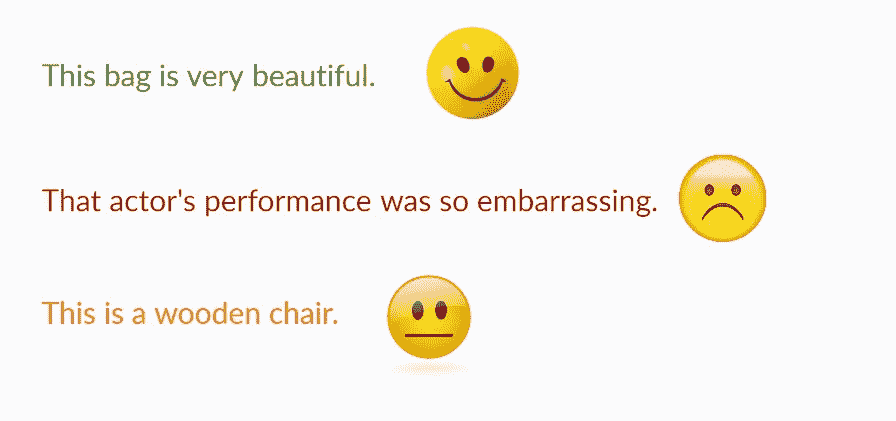**

**图 6:极性的一个例子。**

**根据评级,“评级极性”可计算如下:**

```
**df['Rating_Polarity'] = df['Rating'].apply(**lambda** x: 'Positive' **if** x > 3 **else**('Neutral' **if** x == 3  **else** 'Negative'))**
```

# **情感分析方法**

**本质上，情感分析发现不同文本中的情感极性，如积极、消极或中性。有两种不同的方法来执行情感分析:**

*   **基于词典的方法**
*   **机器学习方法**

## **基于词典的方法**

**基于词典的情感分析根据文本中存在的单词或短语的语义取向来计算情感。**

****基于词典的方法**有以下方式来处理情感分析:**

*   **词典**
*   **文集**

****字典****

**它创建了一个正面和负面单词的字典，并为每个单词分配正面和负面的情绪值。它的每个单词的正值和负值的字典可以定义为:**

**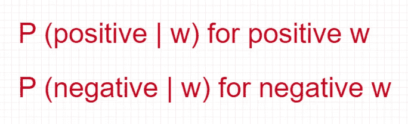**

**图 7:正负词词典。**

**因此，它创建了一个类似字典的模式，例如:**

**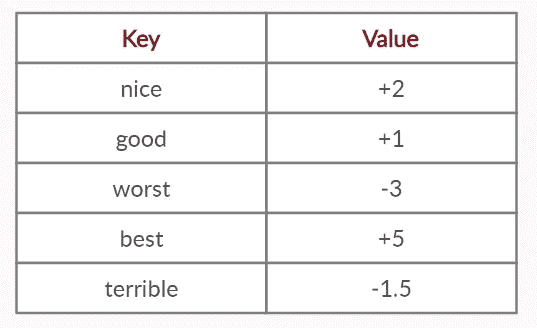**

**图 8:不同单词的字典表。**

**基于定义的字典，算法的工作是查找文本以找到所有熟知的单词，并准确地巩固它们的特定结果。有时它会应用语法规则，如否定或情绪修饰语。**

**例如，通过使用基于词典的方法对下面的句子应用情感分析:**

***“我不爱你，因为你是个可怕的家伙，但你喜欢我。”***

**因此，它会根据基于词典的词典找到以下单词:**

*   ****爱情** : +5**
*   ****像** : +2**
*   ****可怕** : -1.5**

****整体情绪** = +5 + 2 + (-1.5) = +5.5**

**因此，这种情绪表达了一种积极的情绪。
字典会以下列方式处理:**

*   **平的**
*   **用语义**

## **机器学习方法**

**机器学习方法优于基于词典的方法，但它需要带注释的数据集。它需要一个手动识别情感的训练数据集，并且它对数据和面向域的值是确定的，因此在预测时应该谨慎，因为算法很容易出现偏差。**

**如果该算法已经用服装项目的数据进行了训练，并用于预测食物和旅行相关的情绪，它将预测得很差。因此，情感分析是高度面向领域和以领域为中心的，因为为电影或餐馆等领域开发的模型不适用于旅游、新闻、教育等其他领域。**

# **用于情感分析的基线机器学习算法**

**以下 [**机器学习算法**](https://towardsai.net/p/machine-learning/machine-learning-algorithms-for-beginners-with-python-code-examples-ml-19c6afd60daa) 用于情感分析:**

*   **特征提取。**
*   **符号化。**
*   **SVM。**
*   **朴素贝叶斯。**
*   **麦克斯恩特。**

## **特征抽出**

**特征提取方法将文本作为输入，并以任何形式产生提取的特征，如词汇句法或文体、句法和基于话语。首先，它确定了客户正在评论的那些产品方面。**

## **标记化**

**标记化是将大量文本分割成较小的行或单词的过程。它通过分析单词的顺序来帮助解释文章的意思。**

**例如:**

**“这部电影真的很棒。”**

**应用令牌化后:**

**[这部电影真的很好]**

****注意:** MaxEnt 和 SVM 比朴素贝叶斯算法情感分析用例表现更好。**

# **情感分析面临的挑战和问题**

**情感分析对于真实世界的场景来说是很吸引人的。然而，它在实施过程中面临许多问题和挑战。**

**以下是情感分析中的挑战:**

*   **这是强硬的，如果与主题分类与一袋词的特点表现良好。**
*   **在许多情况下，单词或短语在不同的上下文和领域中表达不同的意思。**

**情感分析的其他挑战:**

*   **情感分析的主要挑战是语言的复杂性。**
*   **否定对观点词和语篇的语境极性有主要影响。否定短语如“从不”、“没有”、“什么都没有”、“都没有”和“其他”可以颠倒观点词的极性。**
*   **困惑的句子和复杂语言学。例句:“入院手续很复杂，但工作人员很友好，尽管他们忙得不可开交。”所以，这里→(否定→肯定→隐含否定)**

**以下是情感分析中的一些问题:**

*   **回答一个问题很有挑战性——这个问题突出了使用什么特征，因为它可以是单词、短语或句子。**
*   **如何解读特征？它可以是一个单词包、注释词典、句法模式或段落结构。**

# **面向情感分析的数据预处理**

**在应用任何机器学习或深度学习库进行情感分析之前，进行文本清理和/或预处理至关重要。为了提高准确率，降低文本中的噪声是非常必要的。借助于 [**自然语言处理**](https://towardsai.net/p/nlp/natural-language-processing-nlp-with-python-tutorial-for-beginners-1f54e610a1a0) 流水线处理数据。**

**这些步骤在数据预处理期间应用:**

*   **规范文字。**
*   **删除停用词。**
*   **标记句子。**
*   **向量化文本。**

# **用例:时尚情感分析，Python 实现**

**如今，网上购物很流行，因为不同的产品而出名，比如电子产品、衣服、食品等等。例如，电子商务销售产品，并提供对消费者的产品进行评级和撰写评论的选项，这是识别产品质量的便捷而重要的方式。基于这些，其他消费者可以决定是否购买某个产品。这也有利于销售者和制造商了解他们的产品情绪，以使他们的产品更好。**

**深度学习中的代码实现:**

****导入所有需要的包:****

```
**import pandas as pd
import numpy as np
import seaborn as sns
import re
import string
from string import punctuation
import nltk
from nltk.corpus import stopwordsnltk.download("stopwords")
import matplotlib.pyplot as plt
from sklearn.model_selection import train_test_split
from sklearn.feature_extraction.text import CountVectorizer
from sklearn.feature_extraction.text import TfidfTransformer
import tensorflow as tf
from tensorflow.keras.models import Sequential
from tensorflow.keras.layers import Dense, Activation, Dropout
from tensorflow.keras.callbacks import EarlyStopping**
```

****读取数据:****

```
**df = pd.read_csv('women_clothing_review.csv')df.head()**
```

**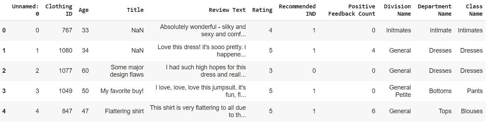**

**图 9:女性穿衣数据表。**

****删除不必要的列:****

```
**df = df.drop(['Title', 'Positive Feedback Count', 'Unnamed: 0', ], axis=1)df.dropna(inplace=True)**
```

**根据老年消费者对服装的评分计算评分极性:**

****应用以下规则:****

*   **如果现有额定值> 3，则 polarity_rating = " **正极****
*   **如果现有额定值== 3，则 polarity _ rating = "**Neutral****
*   **如果现有评级< 3 then polarity_rating = “**为负****

**基于上述规则计算极性额定值的代码实现:**

```
**df['Polarity_Rating'] = df['Rating'].apply(lambda x: 'Positive' if x > 3 else('Neutral' if x == 3  else 'Negative'))**
```

**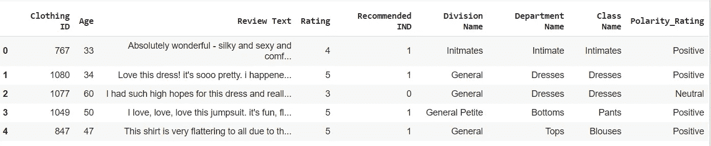**

**图 10:基于额定值的极性额定值。**

## **形象化**

**绘制评级计数可视化:**

```
**sns.set_style('whitegrid')sns.countplot(x='Rating',data=df, palette='YlGnBu_r')**
```

**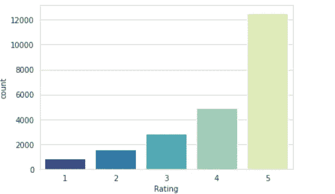**

**图 11:评级计数可视化。**

**绘制极性额定值计数图:**

```
**sns.set_style('whitegrid')sns.countplot(x='Polarity_Rating',data=df, palette='summer')**
```

**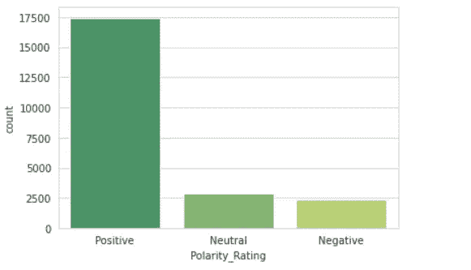**

**图 12:极性额定值计数。**

## **数据预处理**

```
**df_Positive = df[df['Polarity_Rating'] == 'Positive'][0:8000]df_Neutral = df[df['Polarity_Rating'] == 'Neutral']df_Negative = df[df['Polarity_Rating'] == 'Negative']**
```

**对阴性和中性数据集进行采样，并创建最终数据集:**

```
**df_Neutral_over = df_Neutral.sample(8000, replace=True)df_Negative_over = df_Negative.sample(8000, replace=True)df = pd.concat([df_Positive, df_Neutral_over, df_Negative_over], axis=0)**
```

**文本预处理:**

```
**def get_text_processing(text):
    stpword = stopwords.words('english')
    no_punctuation = [char for char in text if char not in string.punctuation]
    no_punctuation = ''.join(no_punctuation)
    return ' '.join([word for word in no_punctuation.split() if word.lower() not in stpword])**
```

**将方法“get_text_processing”应用于“审查文本”列:**

```
**df['review'] = df['Review Text'].apply(get_text_processing)df.head()**
```

**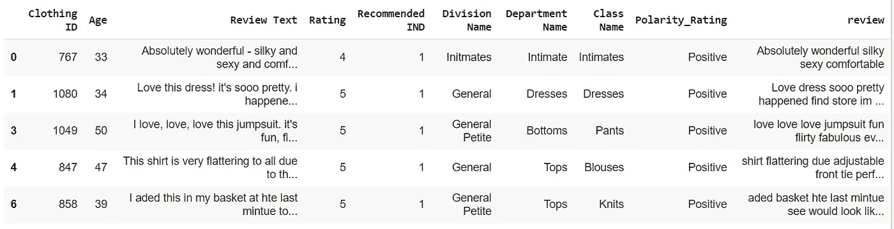**

**图 13:应用文本处理后的 Review 列。**

**它从句子中过滤出字符串标点符号。**

**用 Polarity_Review 列可视化文本审阅:**

```
**df = df[['review', 'Polarity_Rating']]df.head()**
```

**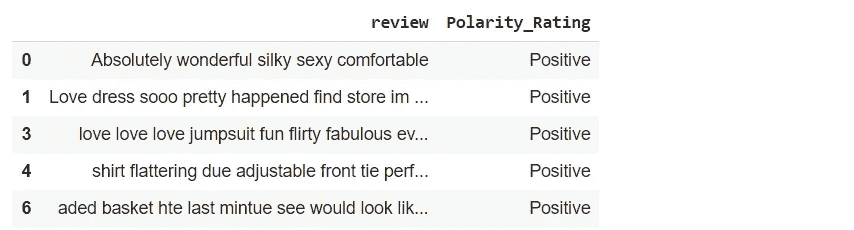**

**图 14:评审和极性评级表。**

**对阴性、神经和阳性应用一个热编码:**

```
**one_hot = pd.get_dummies(df["Polarity_Rating"])df.drop(["Polarity_Rating"], axis=1, inplace=True)df = pd.concat([df, one_hot], axis=1)df.head()**
```

**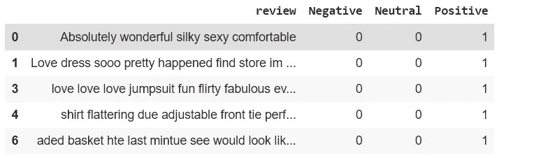**

**图 15:一个热编码。**

**应用列车测试分割:**

```
**X = df["review"].values
y = df.drop("review", axis=1).values
X_train, X_test, y_train, y_test = train_test_split(
    X, y, test_size=0.30, random_state=42
)**
```

**应用矢量化:**

```
**vect = CountVectorizer()
X_train = vect.fit_transform(X_train)
X_test = vect.transform(X_test)**
```

**应用频率，逆文档频率:**

```
**tfidf = TfidfTransformer()
X_train = tfidf.fit_transform(X_train)
X_test = tfidf.transform(X_test)
X_train = X_train.toarray()
X_test = X_test.toarray()**
```

## **用深度学习建立模型**

**向模型添加不同的层:**

```
**model = Sequential()
model.add(Dense(units=12673, activation="relu"))
model.add(Dropout(0.5))
model.add(Dense(units=4000, activation="relu"))
model.add(Dropout(0.5))
model.add(Dense(units=500, activation="relu"))
model.add(Dropout(0.5))
model.add(Dense(units=3, activation="softmax"))
opt = tf.keras.optimizers.Adam(learning_rate=0.001)
model.compile(loss="categorical_crossentropy", optimizer=opt, metrics=["accuracy"])
early_stop = EarlyStopping(monitor="val_loss", mode="min", verbose=1, patience=2)**
```

**符合模型:**

```
**model.fit(
    x=X_train,
    y=y_train,
    batch_size=256,
    epochs=100,
    validation_data=(X_test, y_test),
    verbose=1,
    callbacks=early_stop,
)**
```

**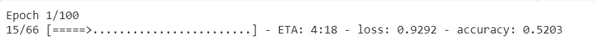**

**图 16:训练模型。**

## **模型评估**

**模型评估:**

```
**model_score = model.evaluate(X_test, y_test, batch_size=64, verbose=1)
print("Test accuracy:", model_score[1])**
```

**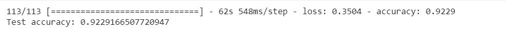**

**图 17:测试模型的准确性。**

## **结果预测**

```
**preds = model.predict(X_test)preds**
```

# **著名的用于情感分析的 Python 库**

**以下是一些著名的用于情感分析的 Python 库:**

*   **NLTK(自然语言工具包)。**
*   **斯帕西。**
*   **TextBlob。**
*   **斯坦福·科伦普。**

# **情感分析的应用**

**我们可以应用情感分析方法的应用有很多。其中一些是:**

*   **市场监测。**
*   **跟踪顾客的反馈。**
*   **帮助改善对客户的支持。**
*   **密切关注竞争对手。**
*   **用于推荐系统。**
*   **在网页上显示广告。**
*   **过滤垃圾邮件辱骂电子邮件。**
*   **心理评估。**
*   **在线电子商务，客户提供反馈。**
*   **Twitter 或脸书等社交网站的情感分析。**
*   **了解观众的广播频道相关 TRP 情绪。**

# **结论**

**情感分析旨在从数据中获取与情感相关的知识，尤其是现在，由于互联网上的信息量巨大。换句话说，我们通常可以使用情感分析方法来理解一组文档中的观点。**

**情感分析有时被称为意见挖掘，其中我们可以使用 NLP、统计或 [**机器学习方法**](https://towardsai.net/p/machine-learning/machine-learning-algorithms-for-beginners-with-python-code-examples-ml-19c6afd60daa) 来提取、识别或以其他方式表征文本单元的情感内容。**

**消费者可以在购买前使用情感分析来研究产品和服务。上市公司可以利用公众意见来决定其产品在高需求中的接受度。**

**例如，电影观众可以看一部电影的评论，然后决定是否要看一部电影。感知一种情绪对人类来说是很自然的。此外，情感分析可以用来理解一组文档中的观点。因此，**情感分析**是一个伟大的机制，它可以让应用程序理解一篇文章的潜在主观本质，其中 [**NLP**](https://towardsai.net/p/nlp/natural-language-processing-nlp-with-python-tutorial-for-beginners-1f54e610a1a0) 在这种方法中也发挥了重要作用。**

****免责声明:**本文表达的观点仅代表作者个人观点，不代表卡内基梅隆大学或其他(直接或间接)与作者相关的公司的观点。这些文章并不打算成为最终产品，而是当前思想的反映，同时也是讨论和改进的催化剂。**

****除非另有说明，所有图片均来自作者。****

**通过[向 AI](https://towardsai.net/) 发布**

# **资源**

**[Github 库](https://github.com/towardsai/tutorials/tree/master/sentiment_analysis_tutorial)。**

**[Google colab 实现](https://colab.research.google.com/drive/1eosolvfJqXi9xQHMLtmE91_pfq_RM8zF?usp=sharing)。**

# **参考**

**[1]马克·兰伯特。"项目报告推特情绪分析."香港科技大学，[www . CSE . ust . hk/~ ROS siter/independent _ studies _ projects/Twitter _ emotion _ analysis/Twitter _ emotion _ analysis . pdf](http://www.cse.ust.hk/~rossiter/independent_studies_projects/twitter_emotion_analysis/twitter_emotion_analysis.pdf.)**

**[2]“情感分析。”*情绪分析*，维基百科，【https://en.wikipedia.org/wiki/Sentiment_analysis】T2。**

**[3]刘，李冰。"情感分析和主观性。"*伊利诺伊大学芝加哥分校*，伊利诺伊大学芝加哥分校，2010 年[www . cs . UIC . edu/~ liub/FBS/NLP-handbook-perspective-analysis . pdf .](http://www.cs.uic.edu/~liub/FBS/NLP-handbook-sentiment-analysis.pdf.)**