# AWS ML 相关服务简介——AWS 情感分析

> 原文：<https://pub.towardsai.net/sentiment-analysis-with-aws-a-gentle-intro-to-aws-ml-related-services-e975a5592950?source=collection_archive---------2----------------------->

## 您将在几分钟内使用 AWS ML 相关服务进行情感分析。不需要预先的 ML 知识。

照片由[麦迪森·柳文欢](https://unsplash.com/@artbyhybrid?utm_source=unsplash&utm_medium=referral&utm_content=creditCopyText)在 [Unsplash](https://unsplash.com/s/photos/feeling?utm_source=unsplash&utm_medium=referral&utm_content=creditCopyText) 上拍摄

您将获得对 AWS Athena、AWS Glue、AWS comprehension 和 AWS QuickSight 的简单介绍。

# 内容

[简介 ](#b103)

[**演示案例**](#c86f)

[AWS S3](#b2a9)

[**AWS 领悟**](#c2e1)

[**AWS 胶水**](#92f1)

[**AWS 雅典娜**](#b516)

[**AWS 快速瞄准**](#d2f6)

[**结论**](#ce47)

# 介绍

在这个温和的介绍中，我们将通过使用几个 AWS ML 相关的服务进行基本的情感分析。

*   我们将从 S3 桶中获取客户数据，并用 AWS 的理解进行情绪分析。
*   然后，我们将通过使用 AWS Glue 获得理解文件的结果的模式。
*   我们将使用 AWS Athena 进行一个基本的 SQL 查询。
*   然后我们用 AWS QuickSight 做一个基本的仪表盘。

我们还将看到关于这些 AWS 服务的基本信息。

我们开始吧。

# 演示案例

你是咨询公司 z 的一名数据科学家。
蓝绿色零售店是 z 公司的客户之一。
他们的客户对他们的购买有许多意见。蓝绿零售店希望从这些评论中获得一些见解。

没什么复杂的:)

图片来源:[https://giphy.com/](https://giphy.com/)

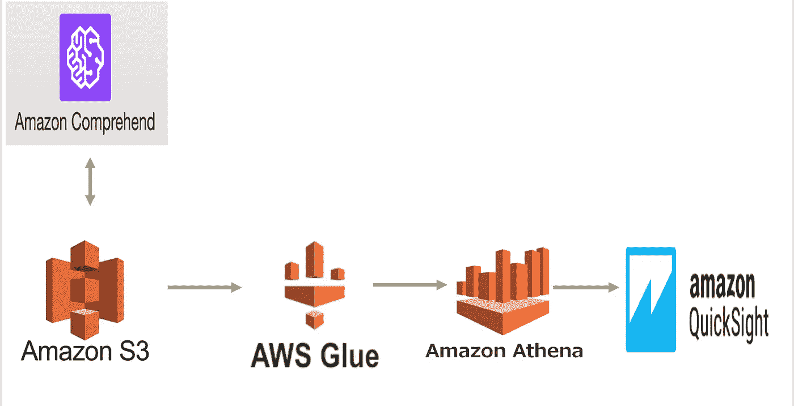

作者图片

# AWS S3 —云对象存储

“亚马逊简单存储服务(亚马逊 S3)是一种对象存储服务，提供行业领先的可扩展性、数据可用性、安全性和性能。”([https://aws.amazon.com/s3/](https://aws.amazon.com/s3/))

我们将从客户那里获得数据。

让我们得到 [**的数据**](https://raw.githubusercontent.com/kb1907/mlops-course-sample-data/main/review-2.csv) **。**

通过查看数据，我们可以看到客户对产品的评论。

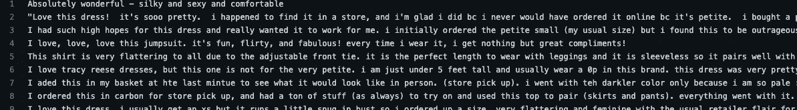

作者捕获的图像

让我们创建一个 S3 桶，并在桶下创建 4 个文件夹。

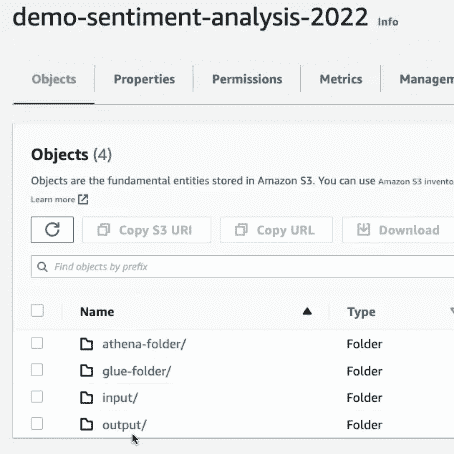

作者捕获的图像

然后将数据上传到输入文件夹。

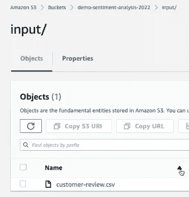

作者捕获的图像

# AWS 理解—情感分析

"从文档文本中获取并理解有价值的见解."

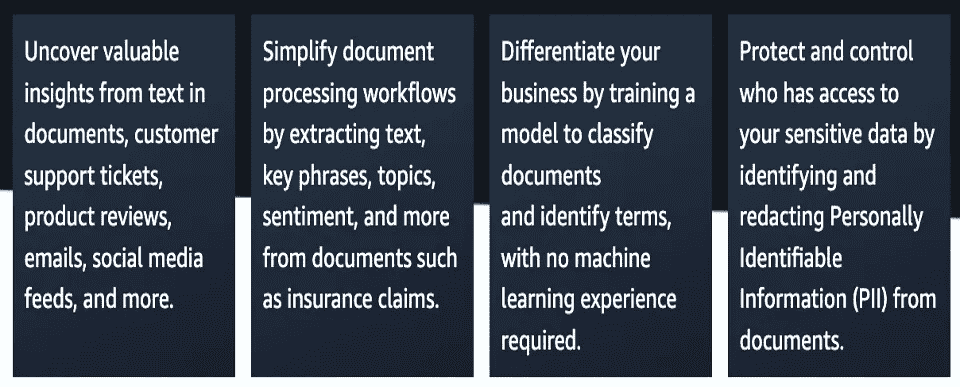

[https://aws.amazon.com/comprehend/](https://aws.amazon.com/comprehend/)

让我们通过使用 understand 从数据中获得并理解有价值的见解。

我们将创建一个分析作业。

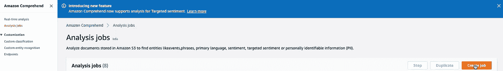

作者捕获的图像

我们将选择情感分析类型和英语语言选择。

作者捕获的图像

然后我们将选择数据位置和输出位置。

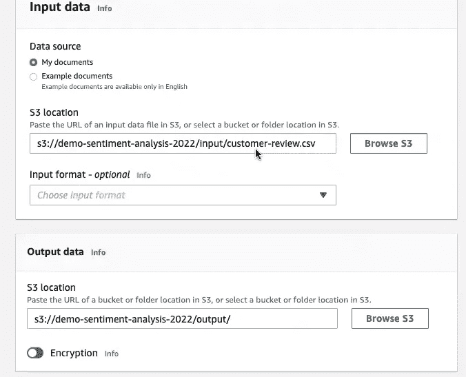

作者捕获的图像

最后，创建一个新的 IAM 角色。

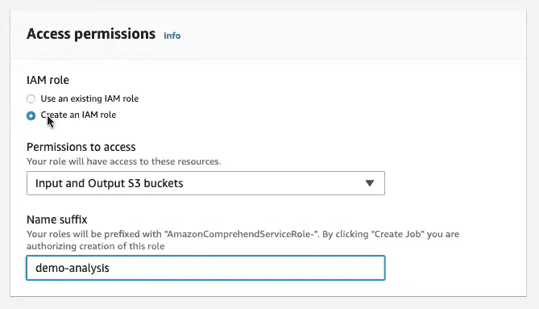

作者捕获的图像

几分钟后，分析将准备就绪。

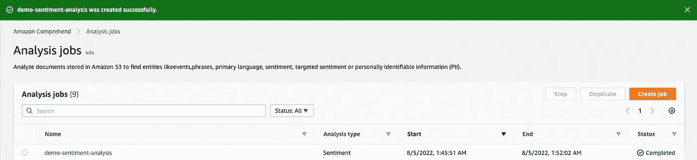

作者捕获的图像

让我们看看工作细节。

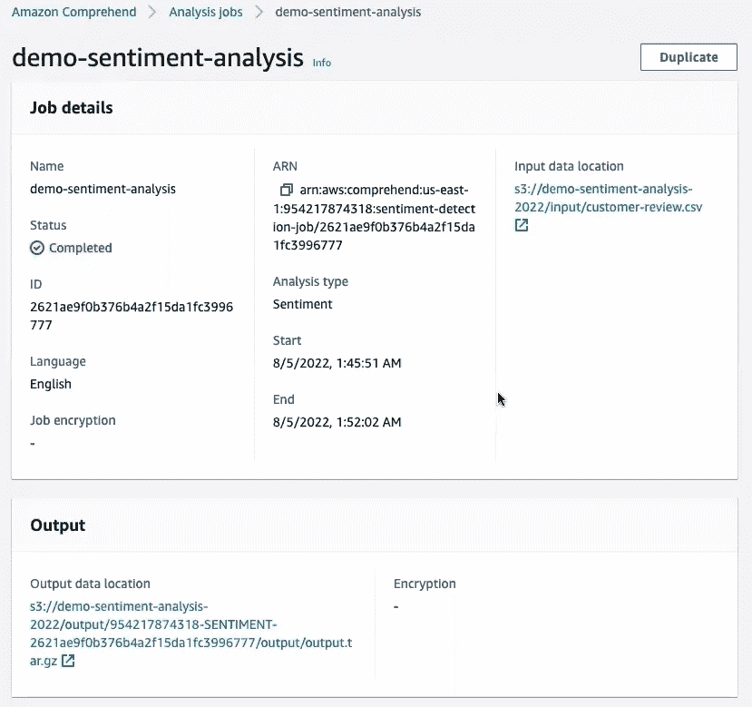

作者捕获的图像

如我们所见，我们有了分析的输出位置。让我们去 S3 桶，看看输出。

作者捕获的图像

让我们下载输出，看看里面有什么。

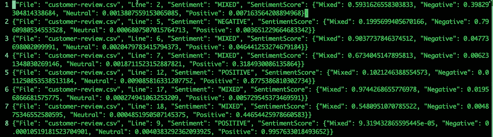

作者捕获的图像

好的。我们有情感分析。每一行都有一个情感结果和情感得分。

我们可以转到 SQL 查询。

# AWS GLUE —无服务器数据集成服务

“AWS Glue 是一种无服务器的数据集成服务，可以轻松发现、准备和组合用于分析、机器学习和应用程序开发的数据。AWS Glue 提供了数据集成所需的所有功能，因此您可以在几分钟内开始分析数据并投入使用，而不是几个月。”(www.amazon.com)

AWS Glue 通过 Glue 数据目录自动发现和分析数据。让我们使用这个特性并获得情感分析的模式。

首先，将文件上传到 S3 桶下的胶水文件夹中。

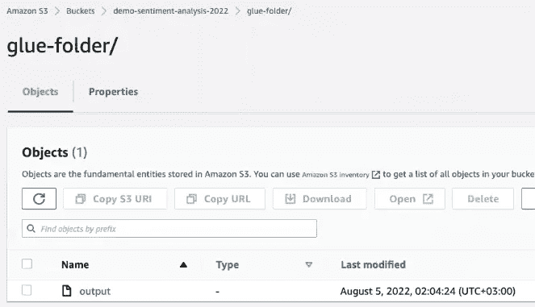

作者捕获的图像

让我们打开胶水，添加一个数据库。

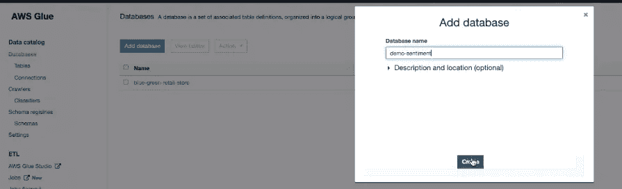

作者捕获的图像

并添加一个爬虫来确定数据的模式。

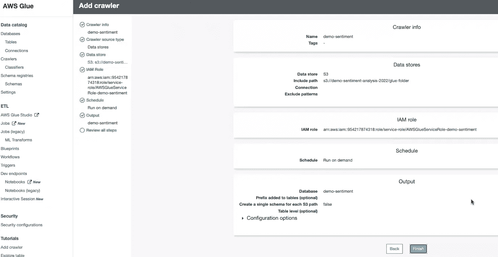

作者捕获的图像

并查看数据的模式。

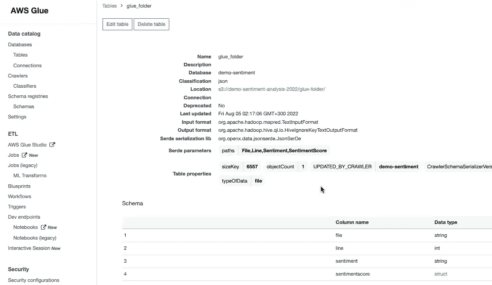

作者捕获的图像

现在我们已经准备好对数据进行 SQL 查询了。

# AWS ATHENA —无服务器交互式查询服务

“Amazon Athena 是一种交互式查询服务，使用标准 SQL 可以轻松分析亚马逊 S3 的数据。Athena 是无服务器的，所以不需要管理基础设施，您只需为运行的查询付费。”(www.amazon.com)

在进行 SQL 查询之前，我们需要为查询结果定义输出文件夹。

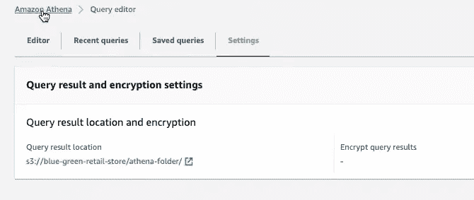

作者捕获的图像

通过使用以前定义的数据库和模式，我们可以进行 SQL 查询。让我们看看数据的前 10 行。

作者捕获的图像

情绪得分栏需要一些调整。

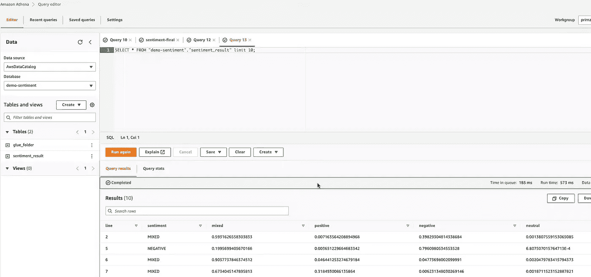

作者捕获的图像

好多了。我们已经准备好可视化我们的分析。

# AWS QUICKSIGHT —商业智能服务

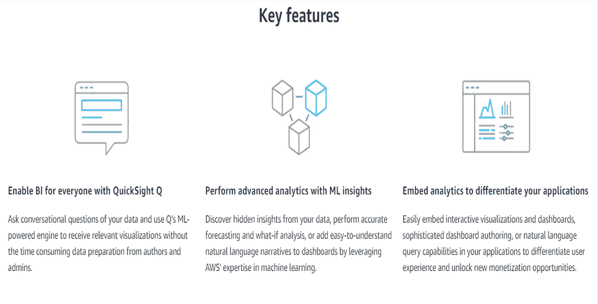

[https://aws.amazon.com/quicksight/](https://aws.amazon.com/quicksight/)

我们注册了 QuickSight，并允许访问 S3 和雅典娜服务，以获得可视化的数据和查询。

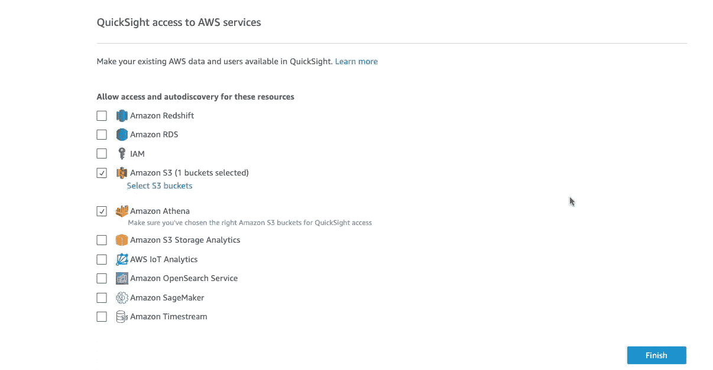

作者捕获的图像

然后，我们选择新的分析，为此，我们将创建新的数据集。

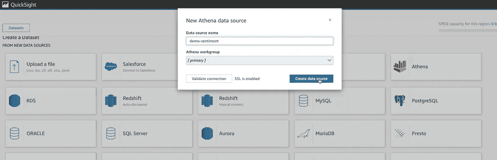

作者捕获的图像

我们选择桌子。

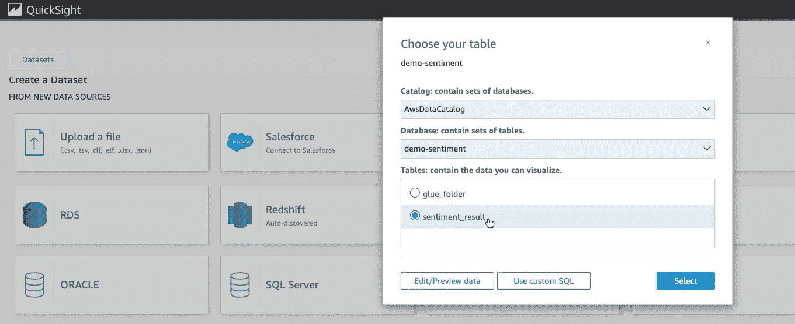

作者捕获的图像

我们已经准备好创建我们的控制面板来展示给我们的客户。

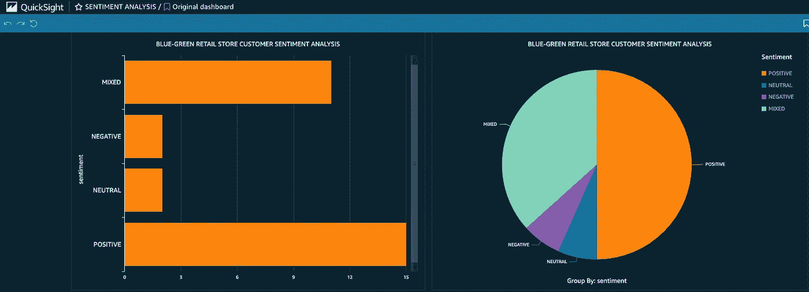

作者图片

仅此而已。

照片由[阿齐兹·阿查基](https://unsplash.com/@acharki95?utm_source=unsplash&utm_medium=referral&utm_content=creditCopyText)在 [Unsplash](https://unsplash.com/s/photos/feeling?utm_source=unsplash&utm_medium=referral&utm_content=creditCopyText) 上拍摄

# 结论

在本教程中，我们对几个 AWS ML 服务做了一个温和的介绍。

我们使用了 AWS S3、AWS 领悟、AWS 胶水、AWS 雅典娜和 AWS QuickSight。

我们与他们一起进行了情感分析，并准备了一个演示仪表板。

本文是 [**AWS-ML 列表**](https://medium.com/@kaanboke/list/awsml-3feffe7ec8ce) 的一部分。你可以在 这里找到 [**系列的其他文章。**](https://medium.com/@kaanboke/list/awsml-3feffe7ec8ce)

我希望它有所帮助。

对了，喜欢题目的时候可以通过支持**来展示👏**

欢迎发表评论。

# 万事如意🤘

如果你喜欢看我的内容， [*请考虑关注我*](https://medium.com/@kaanboke/membership) 。还有，你可以通过 [**订阅 Medium**](https://medium.com/@kaanboke/membership) 来支持其他作家和我。使用我的推荐链接不会额外花费你。