# 用逻辑回归进行情感分析

> 原文：<https://pub.towardsai.net/sentiment-analysis-with-logistic-regression-9df15e7d6daf?source=collection_archive---------2----------------------->

## [自然语言处理](https://towardsai.net/p/category/nlp)

由[马库斯·斯皮斯克](https://unsplash.com/@markusspiske?utm_source=medium&utm_medium=referral)在 [Unsplash](https://unsplash.com?utm_source=medium&utm_medium=referral) 上拍摄的照片

📌逻辑回归是一种用于解决二元分类问题的分类。在双精度情况的模型中，结果通常被定义为 0 或 1。

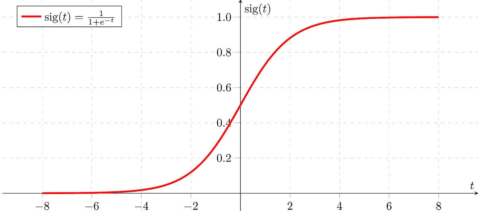

图片来自维基百科[1]

🩸Estimation 是通过对分配给下面数据集中的训练和测试数据的数据应用带有逻辑回归的二元分类而得到的。首先，将应用标准化预处理，然后用 **fit( )** 训练训练数据，然后用 **predict( )** 方法估计测试数据。

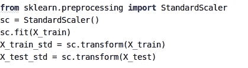

训练数据的训练

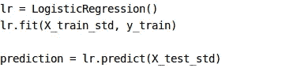

使用测试数据来预测

## 什么是逻辑回归情感分析？

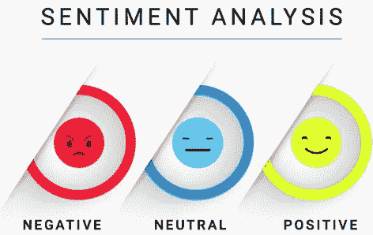

敏感性分析是根据某一件事来判断某人的感受或使其感受有意义的一种方法。它基本上是一个文本处理过程，旨在确定给定文本在情感上想要表达的类别。

✨是一个名字，指的是在单词的频率上挖掘想法，如单词数、名词、形容词、副词或动词，同时从文本中推导出想法。(Word2vec，TF / IDF)

✨在基于频率的思想挖掘中，首先，根据名词词组的长度、使用要求和正负极性找到名词词组并进行分类。

💣我在这个项目中使用的数据集是通过 Twitter API 免费提供的 [**【感知 140】**](https://www.kaggle.com/kazanova/sentiment140)数据。下面我会告诉你关于内容和特性类。

📌使用 Twitter API 创建的数据集包括 1，600，000 条推文。

数据集属性

**目标:**推文极性(0-负极，2-中性，4-正极)
**id:**推文 id
**日期:**推文日期
**标志:**查询。如果没有查询，则为 NO_QUERY。
**用户:**发
**文字的用户:**推文文字(内容)

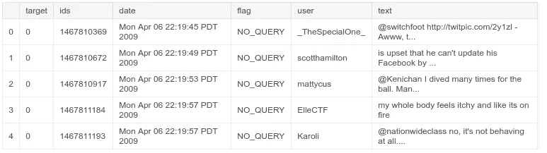

数据集要素类表示

## 用熊猫获取数据集🐼

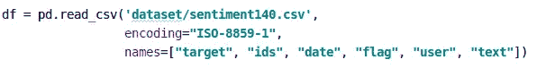

读取数据

✔️写 **read_csv( )** 命令中使用的编码字段的原因是数据被转换成基于 ASCII 的 1 字节拉丁字母字符。

✔️在情感分析中有 3 种类型的类别可以使用:消极的，中立的和积极的。Dataframe 中的键值(为其指定了 target 属性，如下面的 0、2 和 4 个标记)在逻辑回归中减少到两个。因为它使用二进制分类逻辑，所以中性类被忽略。

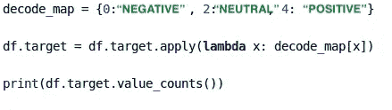

标签预处理

数据集中正负类之和为 800000 + 800000。

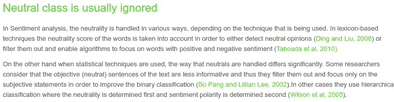

中性类忽略

**停字✋🏻**

将数据转换成计算机能够理解的过程称为预处理。预处理的主要形式之一是过滤掉不必要的数据。自然语言处理中不使用的词称为“停用词”。

停用词是搜索引擎在搜索索引和检索时经常忽略的词。

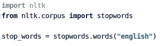

用 NLTK 检测停止词

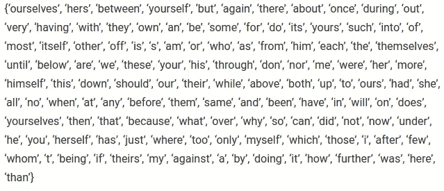

[英语停用词](https://www.geeksforgeeks.org/removing-stop-words-nltk-python/)

**用 NLTK(词干)阅读单词**

📌正则表达式库 **(re)** 需要在词干处理之前引入。然后，使用 **split( )** ，句子中的单词将被分成多个部分，使用 **sub( )** 命令，我们称之为正则表达式的正则模式将被搜索给定的迭代次数。

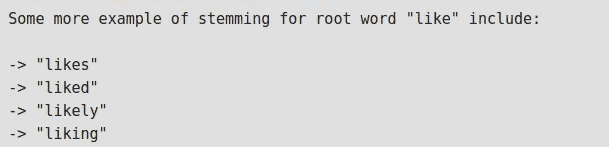

词干示例，变化的单词表达相同的意思

**用 NLTK 🥅停止单词过滤**

应通过在下面给出的模式中搜索正则表达式，使用数据清理删除停用词。在正则表达式库使用的 Substring 模块提供的字符串中搜索某些正则表达式模式。用给定的 repl 值搜索子序列的模式。

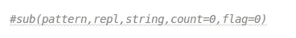

子模块语法视图

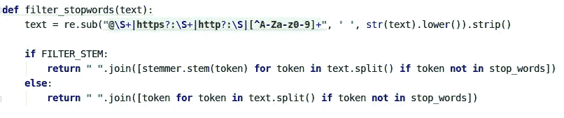

用 NLTK 停止单词过滤

**数据预处理**

1.  删除 URL 以删除文本中不需要的 URL，如 http、https 或类似的内容。
2.  { , .: ;}去掉标点符号如。
3.  **标记化:**对输入字符串的部分进行分离和分类。就是把句子里的每个单词分开。
4.  在文中，a、most 和等。按原样删除诸如停用词之类的词。因为这些词不包含有用的信息。

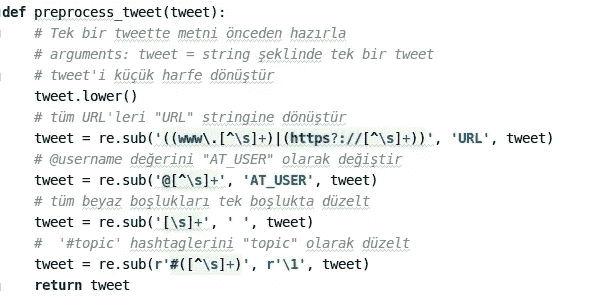

正则表达式子字符串转换

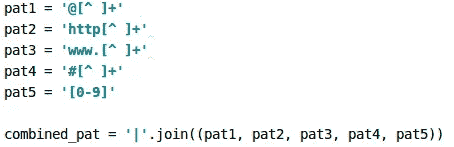

正则表达式路径规则

根据 Regex 规则，tweets 被转换成小写的 *lower( )* 如下所示。这个过程将以这种方式进行。然后，我在上面一行中展示的函数中的操作在下面的 stripped 和 tokens 变量中完成。单词通过用 *join( )* 组合在一起形成句子，单词之间有空格。在 Negations 变量中，使用正则表达式规则进行搜索，方法是将否定格更正为注释，而不是子字符串搜索中的单词**n**。

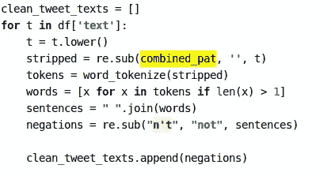

文本更改和正则表达式更正

**将数据集分割成训练和测试数据**

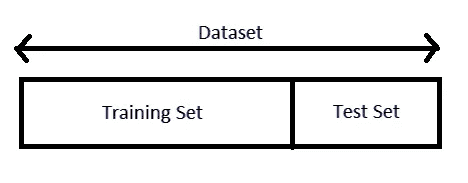

此示例中的数据根据 random_state 比率和指定的标准(TRAIN_SIZE = 0.75)进行分段，并且训练数据的大小被确定为 1200000(数据集的 75%)。在对这些数据进行训练后，测试集被确定为 400000 个(占数据集的 25%)待测试。

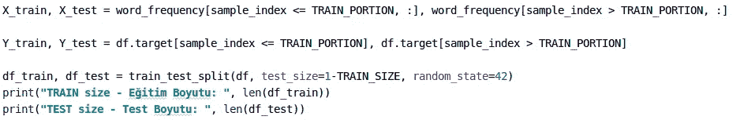

训练和测试数据集

**目标类(推文极性)**

下面是一些用户的推文。例如，让我们检查 id 为 1994986495 的用户的 tweet。

*好无聊。我今天感觉不舒服。不知道为什么…*

可以看到，目标类被指定为 0，因为它是一条含有负面内容的 tweet。

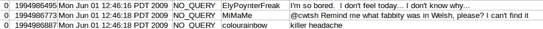

推文☹️上的负(0)检测

如果我们需要检查 id 为 1960159696 的用户的推文；

多美的星期五啊！阿雅星期五快乐！！！

由于检测到的内容是正面推文，因此将其指定为目标类别 4。

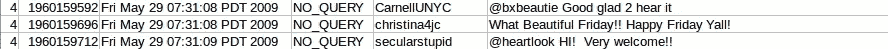

Tweet 上的阳性(4)检测🙂

已经创建了数据的目标类，即情感数据。除此之外，通过在没有 decode_map 的情况下定义正负数据，也可以对这些数据进行分析。

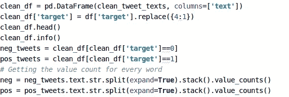

负面和正面数据收集

这对我非常有用。我希望这对你也很有帮助。过得愉快😇

# 参考

1.  [https://de.wikipedia.org/wiki/Datei:Sigmoid-function-2.svg](https://de.wikipedia.org/wiki/Datei:Sigmoid-function-2.svg)
2.  [https://www . geeks forgeeks . org/python-stemming-words-with-nltk/](https://www.geeksforgeeks.org/python-stemming-words-with-nltk/)
3.  [https://www . geeks forgeeks . org/removing-stop-words-nltk-python/](https://www.geeksforgeeks.org/removing-stop-words-nltk-python/)
4.  [https://kavita-ganesan . com/news-classifier-with-logistic-regression-in-python/](https://kavita-ganesan.com/news-classifier-with-logistic-regression-in-python/)
5.  [https://www.kaggle.com/kazanova/sentiment140](https://www.kaggle.com/kazanova/sentiment140)
6.  [https://machine learning mastery . com/logistic-regression-for-machine-learning/](https://machinelearningmastery.com/logistic-regression-for-machine-learning/)
7.  会议论文:使用逻辑回归方法将推文分类到选定的主题中，Liza Wikarsa，Rinaldo Turang，2016 年 10 月。