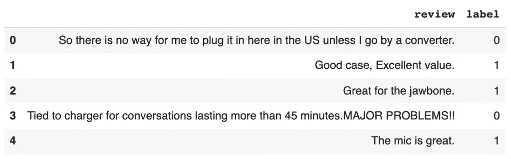

# 无建模的情感分析:文本斑点 vs. VADER vs .天赋

> 原文：<https://pub.towardsai.net/sentiment-analysis-without-modeling-textblob-vs-vader-vs-flair-657b7af855f4?source=collection_archive---------0----------------------->

情感预测准确度比较


[Guillaume bauduseau](https://unsplash.com/@gbaudusseau?utm_source=medium&utm_medium=referral)在 [Unsplash](https://unsplash.com?utm_source=medium&utm_medium=referral) 上拍摄的照片

情感分析可以在建立或不建立机器学习模型的情况下进行。本文将介绍 TextBlob、VADER 和用于非模型情感分析的 Flair 的 Python 实现。

读完这篇文章，你会了解到

*   什么是 TextBlob？
*   什么是 VADER？
*   什么是天赋？
*   如何使用 Python 库 TextBlob 进行情感分析？
*   如何使用 Python 库 VADER 进行情感分析？
*   如何使用 Flair 在 Python 中预先训练好的模型进行情感分析？
*   文本斑点与 VADER 和天赋的比较。

**本帖资源:**

*   [YouTube 上的视频教程](https://www.youtube.com/watch?v=NNe2OrRnhRc&list=PLVppujud2yJpx5r8GFeJ81fyek8dEDMX-&index=3)
*   Python 代码在帖子最后。点击[此处](https://mailchi.mp/a5a7c93dcb89/ikn9jq0hm8)获取笔记本。
*   关于 [NLP](https://www.youtube.com/playlist?list=PLVppujud2yJpx5r8GFeJ81fyek8dEDMX-) 的更多视频教程
*   在 [NLP](https://medium.com/@AmyGrabNGoInfo/list/nlp-49340193610f) 上的更多博文

我们开始吧！

# 步骤 1:安装并导入 Python 库

第一步是安装和导入 Python 库。我们需要为 VADER 安装`vaderSentiment`包，为 flair 安装`flair`包。

```
# Install vaderSentiment package for VADER
pip install vaderSentiment# Install flair
pip install flair
```

安装完包之后，让我们导入 Python 库。我们需要导入`pandas`和`numpy`进行数据处理。

为了进行情感分析，我们需要从`vaderSentiment`导入`TextBlob`，从`flair`导入`SentimentIntensityAnalyzer`，从`TextClassifier`。我们还需要从`TextClassifier`加载英语情感数据，并导入`Sentence`用于 flair 预训练模型的文本处理。

为了检查情感预测的准确性，我们需要从`sklearn`导入`accuracy_score`。

最后但同样重要的是，我们将`pandas`数据框的列宽设置为 1000，这将允许我们从评论中看到更多的内容。

```
# Data processing
import pandas as pd
import numpy as np# Import TextBlob
from textblob import TextBlob# Import VADER sentiment
from vaderSentiment.vaderSentiment import SentimentIntensityAnalyzer# Import flair pre-trained sentiment model
from flair.models import TextClassifier
classifier = TextClassifier.load**(**'en-sentiment'**)**# Import flair Sentence to process input text
from flair.data import Sentence# Import accuracy_score to check performance
from sklearn.metrics import accuracy_score# Set a wider colwith
pd.set_option**(**'display.max_colwidth', 1000**)**
```

# 第二步:下载并读入数据

第二步是下载和读取数据集。

imdb.com、Amazon.com 和 yelp.com 三个网站的评论数据都在 UCI 机器学习知识库中。在本教程中，我们将使用来自 Amazon.com 的综述数据。请按照这些步骤下载数据。

1.  转到:[https://archive . ics . UCI . edu/ml/datasets/情操+标签+句子](https://archive.ics.uci.edu/ml/datasets/Sentiment+Labelled+Sentences)
2.  点击“数据文件夹”
3.  下载“情绪标签句子. zip”
4.  解压“情绪标签句子. zip”
5.  将文件“amazon_cells_labelled.txt”复制到项目文件夹中

那些使用 Google Colab 进行分析的人需要安装 Google Drive 来读取数据集。如果你没有使用 Google Colab，你可以忽略下面的代码。

```
# Mount Google Drive
from google.colab import drive
drive.mount**(**'/content/drive'**)**# Change directory
import os
os.chdir**(**"drive/My Drive/contents/sentiment_analysis"**)**# Print out the current directory
!pwd
```

输出:

```
Mounted at /content/drive
/content/drive/My Drive/contents/sentiment_analysis
```

现在让我们将数据读入一个`pandas`数据框，看看数据集是什么样子。

```
# Read in data
amz_review = pd.read_csv**(**'sentiment labelled sentences/amazon_cells_labelled.txt', sep='\t', names=**[**'review', 'label'**])**# Take a look at the data
amz_review.head**()**
```



`.info`帮助我们获得关于数据集的信息。

```
# Get the dataset information
amz_review.info**()**
```

从输出中，我们可以看到这个数据集有两列，1000 条记录，没有丢失数据。“审查”栏为`object`型，“标签”栏为`int64`型。

```
<class 'pandas.core.frame.DataFrame'>
RangeIndex: 1000 entries, 0 to 999
Data columns (total 2 columns):
#   Column  Non-Null Count  Dtype
---  ------  --------------  -----
0   review  1000 non-null   object
1   label   1000 non-null   int64
dtypes: int64(1), object(1)
memory usage: 15.8+ KB
```

接下来，让我们检查标签的分布。

```
# Check the label distribution
amz_review**[**'label'**]**.value_counts**()**
```

数据集中有 500 个正面和 500 个负面评论，所以我们有一个平衡的数据集。对于平衡的数据集，我们可以使用准确性作为性能指标。

```
1    500
0    500
Name: label, dtype: int64
```

如果您对不平衡数据集分类感兴趣，请查看我的不平衡分类和异常检测文章。

*   [使用 Python 实现不平衡分类的四种过采样和欠采样方法](https://grabngoinfo.com/four-oversampling-and-under-sampling-methods-for-imbalanced-classification-using-python/)
*   [Keras 中不平衡分类的神经网络模型平衡权重](https://grabngoinfo.com/neural-network-model-balanced-weight-for-imbalanced-classification-in-keras/)
*   [用于异常检测的隔离林](https://grabngoinfo.com/isolation-forest-for-anomaly-detection-and-imbalanced-classification/)
*   [单类支持向量机(SVM)异常检测链接正文](https://grabngoinfo.com/one-class-support-vector-machine-svm-for-anomaly-detection/)
*   [使用 Tensorflow Keras 进行异常检测的自动编码器](https://grabngoinfo.com/autoencoder-for-anomaly-detection-using-tensorflow-keras/)

# 第三步:什么是 TextBlob？

TextBlob 是一个用于自然语言处理(NLP)的 Python 库。情感分析是 TextBlob 支持的许多 NLP 任务之一。

TextBlob 中的情感属性返回输入文本的极性得分和主观性得分。

*   极性分值范围从-1 到 1，其中-1 表示极负，1 表示高度正。接近 0 的分数表示中性情绪。
*   主观评分范围从 0 到 1，其中 0 表示非常客观，1 表示高度主观。

```
# Example text
text = 'GrabNGoInfo.com is a great machine learning tutorial website.'# TextBlob sentiment
textBlob_sentiment = TextBlob**(**text**)**.sentiment
textBlob_sentiment
```

在本例中，示例文本“GrabNGoInfo.com 是一个很好的机器学习教程网站。”极性得分为 0.8，主观性得分为 0.75，这意味着 TextBlob 将句子解释为具有主观积极情绪。

```
Sentiment(polarity=0.8, subjectivity=0.75)
```

我们可以使用`.polarity`来提取情感得分。

```
# Extract sentiment score
textBlob_sentiment.polarity
```

输出:

```
0.8
```

# 第四步:什么是 VADER？

VADER (Valence Aware 字典和情感推理机)是一个专注于社交媒体情感的 Python 库。它有一个内置的算法，可以根据标点符号、俚语、表情符号和首字母缩写来改变情绪强度。

VADER 的输出包括四个分数:复合分数、负分数、神经分数和正分数。

*   pos、neu 和 neg 表示属于每个类别的令牌的百分比，因此它们加起来是 100%。
*   复合分数是衡量文本情感的单一分数。类似于 TextBlob，范围从-1(极负)到 1(极正)。接近 0 的分数代表神经情绪分数。
*   复合得分不是 pos、neu 和 neg 得分的简单汇总。相反，它包含了基于规则的增强功能，如标点符号放大器。

```
# Example text
text = 'GrabNGoInfo.com is a great machine learning tutorial website.'# VADER Sentiment
vader = SentimentIntensityAnalyzer**()** vader_sentiment = vader.polarity_scores**(**text**)** vader_sentiment
```

VADER 给出了示例文本“GrabNGoInfo.com 是一个很棒的机器学习教程网站。”0.6249 的综合得分。句子中没有否定词，所以 neg 分值为 0。句子中有 63.1%的中性词和 36.9%的肯定性词。

```
{'compound': 0.6249, 'neg': 0.0, 'neu': 0.631, 'pos': 0.369}
```

VADER 的输出被保存为字典。我们可以通过关键字“复合”来提取复合情感得分。

```
# Extract sentiment score
vader_sentiment**[**'compound'**]**
```

输出:

```
0.6249
```

# 第五步:什么是天赋？

Flair 是建立在 PyTorch 基础上的最先进的 NLP 框架。它结合了最近的研究，并提供了一种简单的方法来结合不同的 NLP 任务的不同嵌入。预训练的情感模型提供了一种无需训练定制模型的情感分析工具。

与 TextBlob 和 VADER 输出-1 到 1 之间的情感得分不同，flair 情感输出带有置信度得分的预测标签。信心得分从 0 到 1，1 表示非常自信，0 表示非常不自信。

在预测文本的情感之前，需要对输入文本进行`Sentence()`标记。之后，我们可以看到样本文本被分成了九个标记。

```
# Example text
text = 'GrabNGoInfo.com is a great machine learning tutorial website.'# Flair tokenization
sentence = Sentence**(**text**)** sentence
```

输出:

```
Sentence: "GrabNGoInfo.com is a great machine learning tutorial website ."   [− Tokens: 9]
```

接下来，我们使用`.predict`来预测情绪。

```
# Flair sentiment prediction
classifier.predict**(**sentence**)** sentence
```

示例文本“GrabNGoInfo.com 是一个很好的机器学习教程网站。”具有正面的预测情绪和 0.9895 的置信度得分。由于 0.9895 接近 1，flair 对预测非常有信心。

```
Sentence: "GrabNGoInfo.com is a great machine learning tutorial website ."   [− Tokens: 9  − Sentence-Labels: {'label': [POSITIVE (0.9895)]}]
```

预测标签保存为一个值，预测置信度保存为一个分数。我们可以分别使用`sentence.labels[0].value`和`sentence.labels[0].score`来提取值。

```
# Extract sentiment prediction score
print**(**f'Flair classified the review as {sentence.labels[0].value} with the score of {sentence.labels[0].score:.2f}'**)**
```

输出:

```
Flair classified the review as POSITIVE with the score of 0.99
```

# 步骤 6:如何使用 TextBlob 进行情感分析

在第 6 步中，我们将把 TextBlob 应用到 Amazon review 数据集，看看它的表现如何。

我们首先获取每个评论的情感极性，并将值保存到名为“scores_TextBlob”的列中。然后检查极性得分是否为正。如果分数大于或等于零，则评论的预测情绪是积极的(标记为 1)。否则，评论的预测情绪是负面的(标记为 0)。

```
# Get sentiment score for each review
amz_review**[**'scores_TextBlob'**]** = amz_review**[**'review'**]**.apply**(**lambda s: TextBlob**(**s**)**.sentiment.polarity**)**# Predict sentiment label for each review
amz_review**[**'pred_TextBlob'**]** = amz_review**[**'scores_TextBlob'**]**.apply**(**lambda x: 1 if x **>**=0 else 0**)**amz_review.head**()**
```

从 TextBlob 获得预测后，让我们检查预测的准确性。

```
# Compare Actual and Predicted
accuracy_score**(**amz_review**[**'label'**]**,amz_review**[**'pred_TextBlob'**])**
```

将实际标签与 TextBlob 预测进行比较，我们得到 0.688 的准确度分数，这意味着 TextBlob 在 68.8%的时间里预测了评论情感。

# 步骤 7:如何使用 VADER 进行情感分析

在第 7 步中，我们将把 VADER 应用于亚马逊评论数据集，看看它的表现如何。

我们首先获得每个评论的情感复合得分，并将这些值保存到名为“scores_VADER”的列中。然后检查复合分数是否为正。如果分数大于或等于零，则评论的预测情绪是积极的(标记为 1)。否则，评论的预测情绪是负面的(标记为 0)。

```
# Get sentiment score for each review
vader_sentiment = SentimentIntensityAnalyzer**()** amz_review**[**'scores_VADER'**]** = amz_review**[**'review'**]**.apply**(**lambda s: vader_sentiment.polarity_scores**(**s**)[**'compound'**])**# Predict sentiment label for each review
amz_review**[**'pred_VADER'**]** = amz_review**[**'scores_VADER'**]**.apply**(**lambda x: 1 if x **>**=0 else 0**)**amz_review.head**()**
```

得到 VADER 的预测后，让我们检查一下预测的准确性。

```
# Compare Actual and Predicted
accuracy_score**(**amz_review**[**'label'**]**,amz_review**[**'pred_VADER'**])**
```

输出:

```
0.768
```

将实际标签与 VADER 预测进行比较，我们得到 0.768 的准确度分数，这意味着 VADER 在 76.8%的时间里预测了评论情绪。

对于相同的数据集，TextBlob 的预测精度为 68.8%，因此 VADER 比 TextBlob 预测提高了 8%。

# 步骤 8:如何使用天赋进行情感分析

在第 8 步中，我们将应用 flair 预训练情感模型来预测亚马逊评论的情感。

首先，让我们定义一个函数，将评论作为输入，将预测的标签和置信度作为输出。

```
# Define a function to get Flair sentiment prediction score
def score_flair**(**text**)**:
  sentence = Sentence**(**text**)** classifier.predict**(**sentence**)** score = sentence.labels**[**0**]**.score
  value = sentence.labels**[**0**]**.value
  return score, value
```

然后将该函数应用于数据集中的每个评论。

```
# Get sentiment score for each review
amz_review**[**'scores_flair'**]** = amz_review**[**'review'**]**.apply**(**lambda s: score_flair**(**s**)[**0**])**# Predict sentiment label for each review
amz_review**[**'pred_flair'**]** = amz_review**[**'review'**]**.apply**(**lambda s: score_flair**(**s**)[**1**])**# Check the distribution of the score
amz_review**[**'scores_flair'**]**.describe**()**
```

我们可以看到，汇总统计数据显示，大多数 flair 得分接近 1，这意味着 flair 情感模型总体上对预测非常有信心。

```
count    1000.000000
mean        0.988019
std         0.046841
min         0.533640
25%         0.996153
50%         0.999167
75%         0.999887
max         0.999999
Name: scores_flair, dtype: float64
```

标签的分布非常均衡。

```
# Check the counts of labels
amz_review**[**'pred_flair'**]**.value_counts**()**
```

输出:

```
POSITIVE    504
NEGATIVE    496
Name: pred_flair, dtype: int64
```

在检查预测准确性之前，我们需要将“负”值映射到 0，将“正”值映射到 1，因为 Amazon review 数据集具有 0 和 1 的真实标签。

```
# Change the label of flair prediction to 0 if negative and 1 if positive
mapping = **{**'NEGATIVE': 0, 'POSITIVE': 1**}** amz_review**[**'pred_flair'**]** = amz_review**[**'pred_flair'**]**.map**(**mapping**)**
```

将 flair 预测与实际情绪标签进行对比后，我们可以看到 flair 预测情绪的正确率为 94.8%！预测准确率从 VADER 提高了 18%，从 TextBlob 提高了 26%！

```
# Compare Actual and Predicted
accuracy_score**(**amz_review**[**'label'**]**,amz_review**[**'pred_flair'**])**
```

输出:

```
0.948
```

# 步骤 9:将所有代码放在一起

```
###### Step 1: Install And Import Python Libraries# Install vaderSentiment package for VADER
pip install vaderSentiment# Install flair
pip install flair# Data processing
import pandas as pd
import numpy as np# Import TextBlob
from textblob import TextBlob# Import VADER sentiment
from vaderSentiment.vaderSentiment import SentimentIntensityAnalyzer# Import flair pre-trained sentiment model
from flair.models import TextClassifier
classifier = TextClassifier.load**(**'en-sentiment'**)**# Import flair Sentence to process input text
from flair.data import Sentence# Import accuracy_score to check performance
from sklearn.metrics import accuracy_score# Set a wider colwith
pd.set_option**(**'display.max_colwidth', 1000**)**###### Step 2: Download And Read In Data# Mount Google Drive (only if you are using Google Colab)
from google.colab import drive
drive.mount**(**'/content/drive'**)**# Change directory (only if you are using Google Colab)
import os
os.chdir**(**"drive/My Drive/contents/sentiment_analysis"**)** # Change to your project directory# Print out the current directory (only if you are using Google Colab)
!pwd# Read in data
# Change the path to where your dataset is saved
amz_review = pd.read_csv**(**'sentiment labelled sentences/amazon_cells_labelled.txt', sep='\t', names=**[**'review', 'label'**])**# Take a look at the data
amz_review.head**()**# Get the dataset information
amz_review.info**()**# Check the label distribution
amz_review**[**'label'**]**.value_counts**()**###### Step 3: What is TextBlob?# Example text
text = 'GrabNGoInfo.com is a great machine learning tutorial website.'# TextBlob sentiment
textBlob_sentiment = TextBlob**(**text**)**.sentiment
textBlob_sentiment# Extract sentiment score
textBlob_sentiment.polarity###### Step 4: What is VADER?# Example text
text = 'GrabNGoInfo.com is a great machine learning tutorial website.'# VADER Sentiment
vader = SentimentIntensityAnalyzer**()** vader_sentiment = vader.polarity_scores**(**text**)** vader_sentiment# Extract sentiment score
vader_sentiment**[**'compound'**]**###### Step 5: What is Flair# Example text
text = 'GrabNGoInfo.com is a great machine learning tutorial website.'# Flair tokenization
sentence = Sentence**(**text**)** sentence# Flair sentiment prediction
classifier.predict**(**sentence**)** sentence# Extract sentiment prediction score
print**(**f'Flair classified the review as {sentence.labels[0].value} with the score of {sentence.labels[0].score:.2f}'**)**###### Step 6: How To Use TextBlob For Sentiment Analysis# Get sentiment score for each review
amz_review**[**'scores_TextBlob'**]** = amz_review**[**'review'**]**.apply**(**lambda s: TextBlob**(**s**)**.sentiment.polarity**)**# Predict sentiment label for each review
amz_review**[**'pred_TextBlob'**]** = amz_review**[**'scores_TextBlob'**]**.apply**(**lambda x: 1 if x **>**=0 else 0**)** amz_review.head**()**# Compare Actual and Predicted
accuracy_score**(**amz_review**[**'label'**]**,amz_review**[**'pred_TextBlob'**])**###### Step 7: How To Use VADER For Sentiment Analysis# Get sentiment score for each review
vader_sentiment = SentimentIntensityAnalyzer**()** amz_review**[**'scores_VADER'**]** = amz_review**[**'review'**]**.apply**(**lambda s: vader_sentiment.polarity_scores**(**s**)[**'compound'**])**# Predict sentiment label for each review
amz_review**[**'pred_VADER'**]** = amz_review**[**'scores_VADER'**]**.apply**(**lambda x: 1 if x **>**=0 else 0**)** amz_review.head**()**# Compare Actual and Predicted
accuracy_score**(**amz_review**[**'label'**]**,amz_review**[**'pred_VADER'**])**###### Step 8: How To Use Flair For Sentiment Analysis# Define a function to get Flair sentiment prediction score
def score_flair**(**text**)**:
  sentence = Sentence**(**text**)** classifier.predict**(**sentence**)** score = sentence.labels**[**0**]**.score
  value = sentence.labels**[**0**]**.value
  return score, value# Get sentiment score for each review
amz_review**[**'scores_flair'**]** = amz_review**[**'review'**]**.apply**(**lambda s: score_flair**(**s**)[**0**])**# Predict sentiment label for each review
amz_review**[**'pred_flair'**]** = amz_review**[**'review'**]**.apply**(**lambda s: score_flair**(**s**)[**1**])**# Check the distribution of the score
amz_review**[**'scores_flair'**]**.describe**()**# Check the counts of labels
amz_review**[**'pred_flair'**]**.value_counts**()**# Check sample records
amz_review.head**()**# Change the label of flair prediction to 0 if negative and 1 if positive
mapping = **{**'NEGATIVE': 0, 'POSITIVE': 1**}** amz_review**[**'pred_flair'**]** = amz_review**[**'pred_flair'**]**.map**(**mapping**)**# Check counts
amz_review**[**'pred_flair'**]**.value_counts**()**# Compare Actual and Predicted
accuracy_score**(**amz_review**[**'label'**]**,amz_review**[**'pred_flair'**])**
```

# 总结:文本斑点对 VADER 对天赋

在本文中，我们比较了 TextBlob、VADER 和 Flair 在情感分析方面的表现。

*   方法学
    - VADER 和文本块是基于词典和规则的。
    -天赋是基于模型的。
*   分数的含义
    ——VADER 和 TextBlob 的情绪分数在-1 到 1 之间，其中-1 表示非常负面，1 表示非常正面，0 表示中性。
    - Flair 的评分范围为 0 到 1，其中 0 表示对预测非常不自信，1 表示对预测非常有信心。
*   速度表现
    - Flair 比 TextBlob 和 VADER 慢，因为计算算法更复杂。
*   准确性表现
    -根据该项目的结果，flair 的预测准确性最好，VADER 次之，TextBlob 第三。

读完这篇文章后，你学会了

*   什么是 TextBlob？
*   什么是 VADER？
*   什么是天赋？
*   如何使用 Python 库 TextBlob 进行情感分析？
*   如何使用 Python 库 VADER 进行情感分析？
*   如何使用 Python 中的 flair 预训练模型进行情感分析？
*   文本斑点与 VADER 和天赋的比较。

如果你对 TextBlob 和 VADER 之间的细微差别感兴趣，请参考我的文章 [TextBlob VS VADER 使用 Python 进行情感分析](https://grabngoinfo.com/textblob-vs-vader-for-sentiment-analysis-using-python/)

如果你对教程的视频版本感兴趣，请查看下面的视频。访问 [GrabNGoInfo 网站](https://grabngoinfo.com/tutorials/)或 [GrabNGoInfo YouTube 频道](https://www.youtube.com/channel/UCmbA7XB6Wb7bLwJw9ARPcYg/playlists)获取更多机器学习教程。

# 推荐教程

*   [GrabNGoInfo 机器学习教程盘点](https://medium.com/grabngoinfo/grabngoinfo-machine-learning-tutorials-inventory-9b9d78ebdd67)
*   [用于异常检测的单级 SVM](https://medium.com/p/one-class-svm-for-anomaly-detection-6c97fdd6d8af)
*   [使用 Python 中的 Prophet 进行多时间序列预测的 3 种方式](https://medium.com/p/3-ways-for-multiple-time-series-forecasting-using-prophet-in-python-7a0709a117f9)
*   [使用 Python 实现不平衡分类的四种过采样和欠采样方法](https://medium.com/p/four-oversampling-and-under-sampling-methods-for-imbalanced-classification-using-python-7304aedf9037)
*   [利用 Python 中的 Prophet 进行具有季节性和假日效应的多元时间序列预测](https://medium.com/p/multivariate-time-series-forecasting-with-seasonality-and-holiday-effect-using-prophet-in-python-d5d4150eeb57)
*   [如何检测离群值|数据科学面试问答](https://medium.com/p/how-to-detect-outliers-data-science-interview-questions-and-answers-1e400284f6b4)
*   [利用 Python 中的 Prophet 进行时间序列异常检测](https://medium.com/p/time-series-anomaly-detection-using-prophet-in-python-877d2b7b14b4)
*   [如何配合谷歌 Colab 笔记本使用 R](https://medium.com/p/how-to-use-r-with-google-colab-notebook-610c3a2f0eab)

[](https://medium.com/@AmyGrabNGoInfo/membership) [## 通过我的推荐链接加入媒体-艾米 GrabNGoInfo

### 作为一个媒体会员，你的会员费的一部分会给你阅读的作家，你可以完全接触到每一个故事…

medium.com](https://medium.com/@AmyGrabNGoInfo/membership)