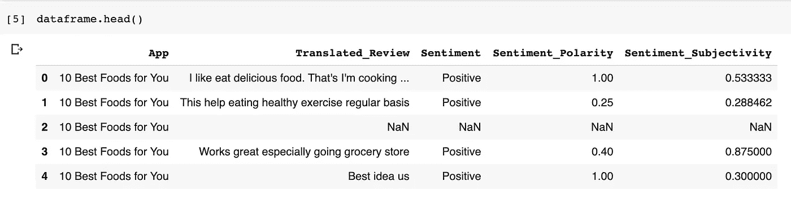

# 基于 Tensorflow 2.0 的谷歌 Play 商店评论情感预测

> 原文：<https://pub.towardsai.net/sentiment-prediction-of-google-play-store-reviews-with-tensorflow-2-0-4357d3b561c9?source=collection_archive---------2----------------------->

在 [Unsplash](https://unsplash.com?utm_source=medium&utm_medium=referral) 上由 [Austin Distel](https://unsplash.com/@austindistel?utm_source=medium&utm_medium=referral) 拍摄的照片

## 如何训练你自己的算法，从零开始对你的应用的评论进行情绪分类

你花了很多时间来创建你的应用程序，最后，你决定发布你的应用程序，以便让世界享受你不可思议的应用程序，但是你怎么知道你的客户是否真的喜欢你的应用程序呢？嗯，今天是你的幸运日，你手中有解决方案。

为你的应用程序创建客户评论的情感预测。

# 步骤:

1.  获取数据
2.  预处理数据
3.  预处理文本
4.  向量化数据
5.  创建模型
6.  训练模型

# 获取数据:

对于这种分析，我们将使用一个数据集，该数据集包含 play store 的不同应用程序(1074 个不同的应用程序)的不同评论以及由人类分类的不同评论的情感。这种分类被分为三类:积极的、中性的和消极的。

数据集总共包含五列，你可以从[这里](https://www.kaggle.com/lava18/google-play-store-apps/version/5#googleplaystore_user_reviews.csv)得到。

# 预处理数据:

第一步是查看数据作为数据框加载后的样子:

我们看数据的时候可以看到有 NaN 值，所以需要删除这样的数据。对于我们项目的主要目标，我们只需要两列，一列是“Translated_Review”，另一列是“perspective”

# 预处理文本

我们需要做一些转换，使我们的数据能够被我们的神经网络理解；我们必须应用三个主要的变换来达到这个目的。第一步是将所有的文本都用小写字母表示，第二步是删除所有的标点符号，并将所有在一起的单词转换成单独的单词，最后一步是删除所有的停用词；这些词本身没有意义，比如连词或介词；为此，我们将使用库链接。

对于这个转换，我们创建一个函数调用 preprocess_text:

最后，我们用这个函数创建一个 lambda 方法，用 apply 函数应用于“Translated_Review”列。

**注意:**理解并能够使用正则表达式是执行任何自然语言处理任务的先决条件。如果你不熟悉它们，也许可以从这里开始:[正则表达式教程](https://medium.com/factory-mind/regex-tutorial-a-simple-cheatsheet-by-examples-649dc1c3f285)

# 向量化数据:

本节的目的是将文本字符串转换成向量，以便神经网络可以处理它。首先，为了生成训练集和验证集，我们将数据框分成两个独立变量，以便我们可以分别处理它们，在此函数中，我们可以定义是要处理三个类(多类分类问题)还是只处理两个主要类(二分类任务):

# 创建模型:

最后，有趣的部分，模型。首先，为了能够评估我们的模型，我们需要将我们的数据分成训练集和验证集。我们将使用**sk learn**“train _ test _ split”的函数来实现这一点。我们定义了 20%数据的验证规模。

最后，在创建我们的网络之前，我们需要标记数据，记住模型通常只接收数字，所以我们首先需要将文本转换成数字。为此，我们将使用 Keras 的函数“Tokenizer”。在这一部分，我们需要定义我们要分析的评论的最大长度，以及我们要标记的字数。最后一个预处理步骤是用零填充生僻字；这种技术被称为“填充”

我们需要定义我们的模型，我们知道对于这类问题，最常用的算法是递归神经网络，特别是一种叫 LSTM 的 RNN。使用这种层是因为它们在数据中识别长模式的能力，而文本问题需要分析每个单词之间的所有关系。我们需要编译我们的模型，所以我们定义了三件事:

1.  损失函数:我们将使用“稀疏分类交叉熵”,因为我们有各种类。
2.  优化器:在这种情况下，我们使用 ***rmsprop*** ，因为它在这类问题上有很好的表现。
3.  度量:我们将通过准确性来评估我们的模型。

最后，我们只需要训练我们的模型，将我们的训练数据作为输入，通过三次(3 个时期)运行模型，并选择每个时期 128 个示例的批量大小。

最终注释:

*   感谢 Marc Munar 为我们展示了如何在真实案例中应用 LSTM，感谢 Juan Gabriel Gomila Salas 为我们展示了他精彩的课程
*   本教程中使用的所有代码以及补充代码都可以在这个 [Google Colab 中找到。](https://colab.research.google.com/drive/1YboQjFPc2An8QSXXtHQEY4Y-cNLcF4Nq)
*   如果你有任何问题或意见，请发电子邮件给我 jmcirot@unal.edu.co

# 感谢阅读