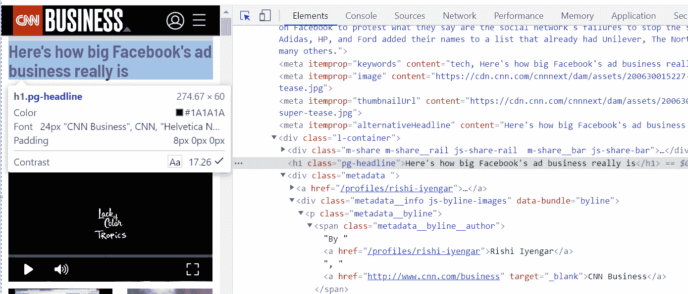
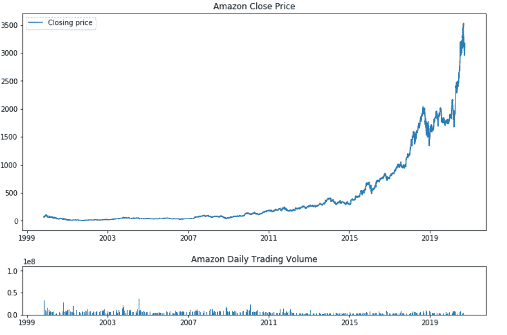
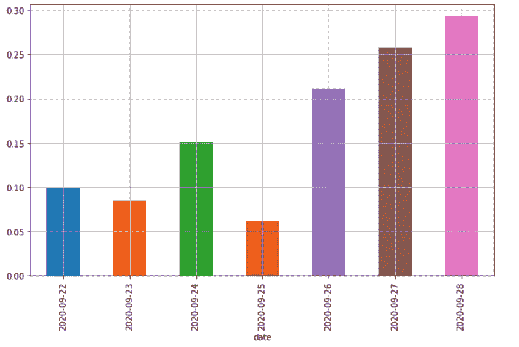

# 作为亚马逊股价指标的财经新闻情感分析

> 原文：<https://pub.towardsai.net/sentiments-analysis-of-financial-news-as-an-indicator-for-amazon-stock-price-26d60534a51f?source=collection_archive---------0----------------------->

## [自然语言处理](https://towardsai.net/p/category/nlp)

## 我们将使用新闻 API 来执行情绪分析，以便使用 Python 来预测亚马逊(Amazon)的股票价格



在所有主要发达市场和主要新兴市场，对新闻的情绪分析已经成为产生股票买卖信号的最有力的方法之一。这个想法很简单，即提及公司名称、品牌、股票代码等的新闻文章的累积情感分数。将成为第二天股票收盘价的重要指标。

这只适用于交易量高、主要媒体都有活跃新闻报道的股票。一般来说，纳斯达克、道琼斯或标准普尔 500 等主要市场指数的成份股都将满足这些标准。

在本文中，我们将讨论为 Amazon.com 股票建立这样一个情绪分析管道的必要步骤。

您必须选择要提取的页面部分。通常，人们希望提取新闻文章的作者姓名、日期、标题和全文。

# 绘制亚马逊股票价格

在我们开始实际获取情绪数据之前，让我们先获取亚马逊股票价格(AMZN)的股票市场数据。我喜欢用 Alphavantage 的 API 获取股市数据；它可以免费使用，但是你必须生成一个 API 密匙。

```
import requests 
import json
from dateutil import parserimport requests
import jsontest_url = '[https://www.alphavantage.co/query?function=TIME_SERIES_DAILY_ADJUSTED&symbol=AMZN&outputsize=full&apikey='](https://www.alphavantage.co/query?function=TIME_SERIES_DAILY_ADJUSTED&symbol=AMZN&outputsize=full&apikey=') + API_KEY + '&datatype=csv'r = requests.get(url = test_url)
print("Status Code: ", r.status_code)
print("*"*20)
print(r.headers)
html_response = r.text
with open("amazon_stock.csv", "w") as outfile: 
    outfile.write(html_response)from dateutil import parser
datetime_obj = lambda x: parser.parse(x)df2 = pd.read_csv("amazon_stock.csv", parse_dates=['timestamp'], date_parser=datetime_obj)#df2 = df2[(df2["timestamp"] >= start_date) & (df2["timestamp"] <= end_date)]df2.head(1)
# Outputtimestamp   open    high    low     close   adjusted_close  volume  dividend_amount     split_coefficient
0   2020-09-28  3148.85     3175.04     3117.1684   3174.05     3174.05     4224165     0.0     1.0
```

接下来，我们将绘制这个图，以便我们可以直观地看到价格变动。正如你可能已经知道的，由于新冠肺炎·疫情，股票有了强劲的反弹。

```
import matplotlib.pyplot as plt 
import seaborn as sns 
top = plt.subplot2grid((4,4), (0, 0), rowspan=3, colspan=4) top.plot(df2['timestamp'], df2['close'], label = 'Closing price') plt.title('Amazon Close Price') 
plt.legend(loc=2) bottom = plt.subplot2grid((4,4), (3,0), rowspan=1, colspan=4) 
bottom.bar(df2["timestamp"], df2["volume"]) 
plt.title('Amazon Daily Trading Volume') 
plt.gcf().set_size_inches(12,8) 
plt.subplots_adjust(hspace=0.75)
```



# 抓取新闻文章

如果你打算收集多个新闻源，以结构化格式批量获取新闻文章将需要大量的数据争论。一个很好的起点是查看我们在[上的博客文章，抓取 CNN 新闻文章](http://www.specrom.com/blog/cnn-news-web-scraping/)，并以此为模板抓取标题、内容、日期、作者等。来自其他新闻网站。

一旦你有了原始文章，你就必须将它们加载到一个全文搜索数据库中，比如 Elasticsearch、Amazon Cloudsearch、Apache Solr 等。然后搜索您选择的股票名称或股票代码来查找相关文章。

相反，我们将使用免费的公共 API，让我们查询过去 7 天内所有主要新闻来源的新闻文章。我们的[最新和历史新闻 API](http://www.specrom.com/news-api) 每个 API 调用最多返回 100 篇新闻文章，如果需要，您可以对结果进行分页。你需要注册 rapidapi 来获得一个密钥，但它是免费的(不需要信用卡),你可以在基础层免费使用 api。

```
import requests
import json
url = "[https://latest-news1.p.rapidapi.com/](https://latest-news1.p.rapidapi.com/)"payload = json.dumps({"domains": "","topic":"business","q":        "amazon","qInTitle": "", "content":"", "page":"1", "author_only":""})
headers = {
    'content-type': "application/json",
    'x-rapidapi-key': "YOUR_RAPID_API_KEY",
    'x-rapidapi-host': "latest-news1.p.rapidapi.com"
    }response = requests.request("POST", url, data=payload, headers=headers)
    # after paginating through results print("Total results found: ", response_dict["totalResults"])
    clean_response_list = clean_response_list + response_dict["Article"]
len(clean_response_list)
#Output
fetching page  1
Total results found:  1263
```

让我们把它加载到 pandas dataframe 中，稍后用于情感分析。

```
import numpy as np
import pandas as pddf = pd.DataFrame(clean_response_list)
df.head()
#Output
author  content     description     publishedAt     source_name     source_url  title   url     urlToImage
0   []  Market Overview Tickers Articles Keywords Che...    GameStop Corp (NYSE: GME) could be extending i...   2020-09-22  Benzinga    benzinga.com    Gamestop Corporation (NYSE:GME), Amazon.com, I...   [https://www.benzinga.com/news/20/09/17595730/c](https://www.benzinga.com/news/20/09/17595730/c)...   [https://cdn.benzinga.com/files/imagecache/og_i](https://cdn.benzinga.com/files/imagecache/og_i)...
1   ["[www.ETAuto.com](http://www.ETAuto.com)"]  Uber investors are pressuring CEO to revamp t...    When Khosrowshahi assumed Uber’s helm from ous...   2020-09-22  ETAuto.com  indiatimes.com  Uber business strategy: Uber investors are pre...   [https://auto.economictimes.indiatimes.com/news](https://auto.economictimes.indiatimes.com/news)...   [https://etimg.etb2bimg.com/thumb/msid-78248237](https://etimg.etb2bimg.com/thumb/msid-78248237)...
2   []  Xiaomi recently launched the entry-level Redm...    Xiaomi's new entry-level smartphone offers sol...   2020-09-22  News18  news18.com  Redmi 9A Goes on Sale Today on Amazon and Mi.c...   [https://www.news18.com/news/tech/redmi-9a-goes](https://www.news18.com/news/tech/redmi-9a-goes)...   [https://images.news18.com/ibnlive/uploads/2020](https://images.news18.com/ibnlive/uploads/2020)...
3   []  Bolsonaro faces growing pressure to green Bra...    Bolsonaro faces growing pressure to green Braz...   2020-09-22  France 24   france24.com    Bolsonaro faces growing pressure to green Braz...   [https://www.france24.com/en/20200922-bolsonaro](https://www.france24.com/en/20200922-bolsonaro)...   [https://s.france24.com/media/display/aac6e8c6-](https://s.france24.com/media/display/aac6e8c6-)...
4   []  Market Overview Tickers Articles Keywords Che...    GameStop Corp (NYSE: GME) could be extending i...   2020-09-22  Benzinga    benzinga.com    Gamestop Corporation (NYSE:GME), Amazon.com, I...   [https://www.benzinga.com/news/20/09/17595730/c](https://www.benzinga.com/news/20/09/17595730/c)...   [https://cdn.benzinga.com/files/imagecache/og_i](https://cdn.benzinga.com/files/imagecache/og_i)...
```

# 使用 NLTK 的 Vader 进行情感分析

有许多算法可以计算文本的情感；最好的通常是在神经网络上训练的，例如在大数据集上的 BERT。您可以使用它进行精确的分析，然而，对于像这样的经验法则研究，我们可以简单地使用 NLTK 库打包的 vader 情绪算法。情绪得分从-1 到 1 不等，一个复合列给出了情绪得分。

```
import nltk
nltk.download('vader_lexicon')
from nltk.sentiment.vader import SentimentIntensityAnalyzer
vader = SentimentIntensityAnalyzer()scores = df['title'].apply(vader.polarity_scores).tolist()
scores[:5]
#Output
[{'compound': 0.1779, 'neg': 0.0, 'neu': 0.892, 'pos': 0.108},
 {'compound': -0.3947, 'neg': 0.143, 'neu': 0.857, 'pos': 0.0},
 {'compound': 0.1779, 'neg': 0.0, 'neu': 0.884, 'pos': 0.116},
 {'compound': -0.128, 'neg': 0.185, 'neu': 0.672, 'pos': 0.143},
 {'compound': 0.1779, 'neg': 0.0, 'neu': 0.892, 'pos': 0.108}]
```

让我们把这个加入到我们最初创建的数据框架中。

```
scores_df = pd.DataFrame(scores)
# join it with main dataframe
df = df.join(scores_df, rsuffix='_right')# Convert the date column from string to datetime
df['date'] = pd.to_datetime(df.publishedAt).dt.date# Group by date and ticker columns from scored_news and calculate the mean
mean_scores = df.groupby(['date']).mean()
mean_scores
# Outputcompound    neg     neu     pos
date                
2020-09-22  0.099078    0.079065    0.787065    0.133871
2020-09-23  0.084607    0.064409    0.812341    0.123260
2020-09-24  0.150295    0.045265    0.822676    0.132071
2020-09-25  0.061525    0.063262    0.838885    0.097852
2020-09-26  0.210888    0.044955    0.790333    0.164773
2020-09-27  0.257901    0.043290    0.751855    0.204855
2020-09-28  0.292509    0.020722    0.783089    0.196189
```

我们现在需要做的就是将这一情绪得分绘制成条形图，并与股价进行比较。

```
import matplotlib.pyplot as pltplt.rcParams['figure.figsize'] = [10, 6]mean_scores = mean_scores.unstack()# Get the cross-section of compound in the 'columns' axis
mean_scores = mean_scores.xs('compound').transpose()# Plot a bar chart with pandas
mean_scores.plot(kind = 'bar')
plt.grid()# Plotting a subset of amazon stock price for 7 days
# code block 1.2 (Cont.)# Plotting stock and volumetop = plt.subplot2grid((4,4), (0, 0), rowspan=3, colspan=4)
top.plot(df2['timestamp'], df2['close'], label = 'Closing price')
plt.title('Amazon Close Price')
plt.legend(loc=2)
bottom = plt.subplot2grid((4,4), (3,0), rowspan=1, colspan=4)
bottom.bar(df2["timestamp"], df2["volume"])
plt.title('Amazon Daily Trading Volume')
plt.gcf().set_size_inches(12,8)
plt.subplots_adjust(hspace=0.75)
```



我们可以立即看到，9 月 23 日之后积极的消息情绪导致整体价格上涨。这种简单化的分析仍然有很多局限性，但它确实表明新闻的情感分析非常有效。

主要限制包括:

*   当组合不同的新闻来源时，我们必须通过考虑总体[领域权威和每个来源的受众总数](http://www.specrom.com/domain-ranking-and-authority-api/)来对情感得分进行加权平均。例如,《华尔街日报》上的负面文章应该比 seeking alpha 博客上的负面文章获得更高的情感价值。
*   我们应始终考虑特定行业中一篮子证券的股价变动，以解释任何行业或宏观经济变化，尤其是在疫情引发的市场波动的不确定时期。

*最初发表于*[T5【http://www.specrom.com】](http://www.specrom.com/blog/sentiments-analysis-financial-news-of-amazon/)*。*