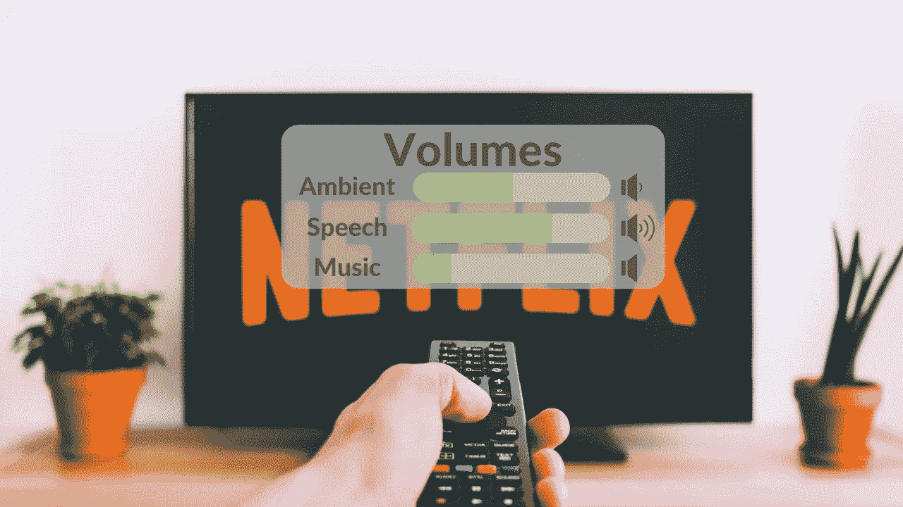
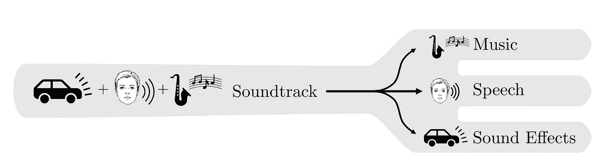
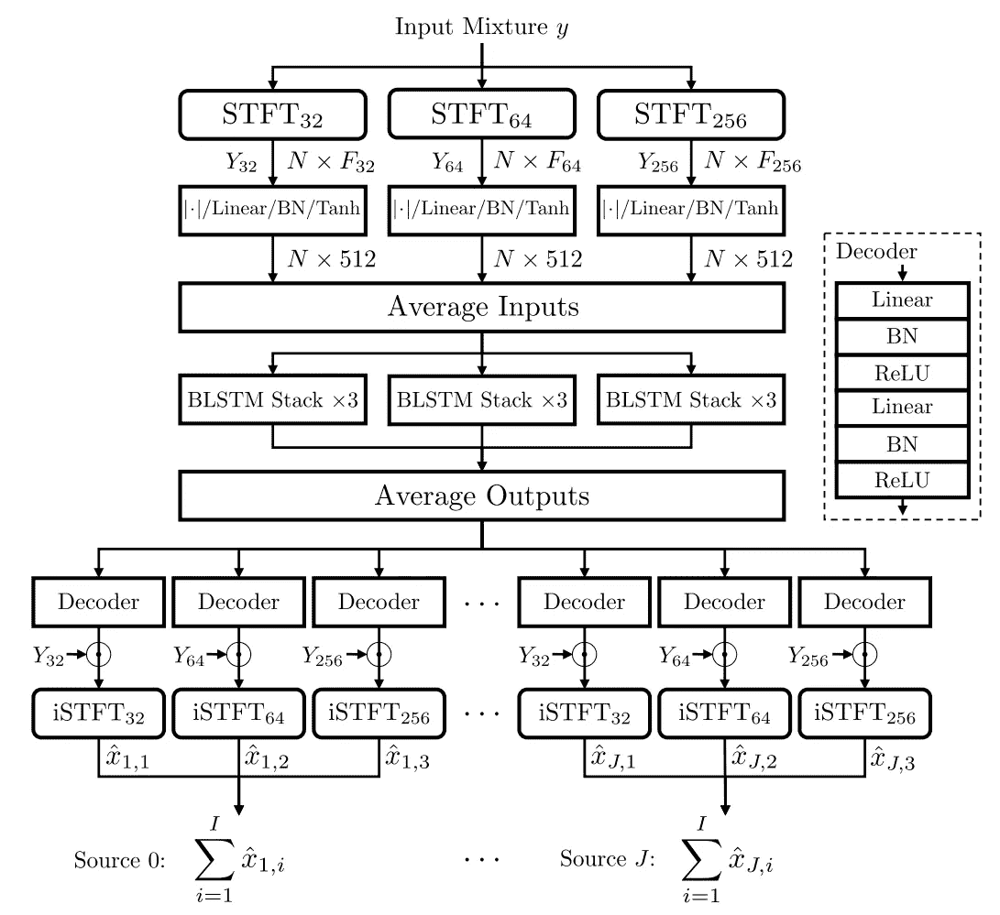
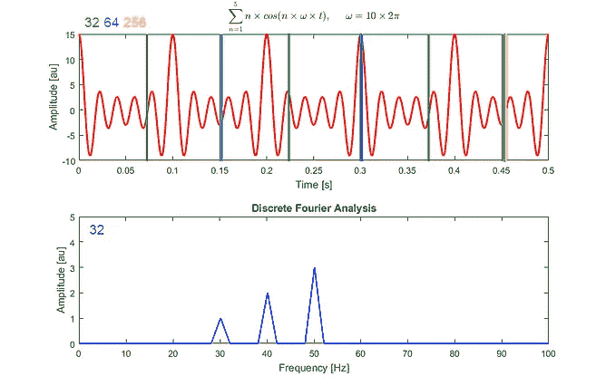
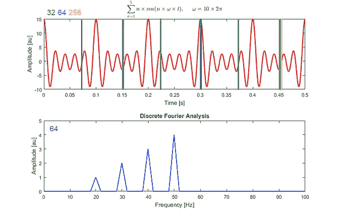
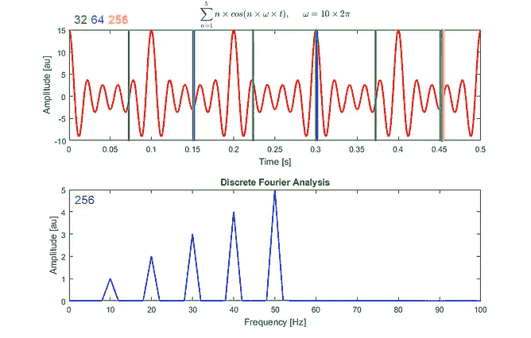
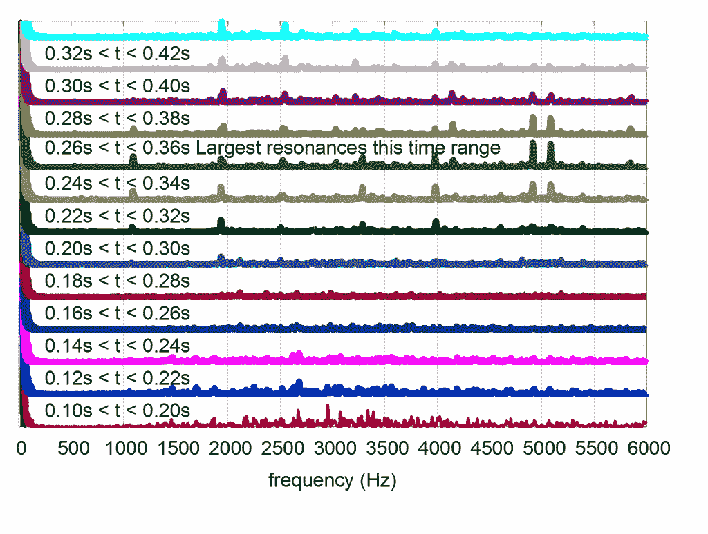

# 用人工智能分离语音、音乐和音效

> 原文：<https://pub.towardsai.net/separate-voice-music-and-sound-effects-with-ai-9a652f4f9cfc?source=collection_archive---------1----------------------->

## [人工智能](https://towardsai.net/p/category/artificial-intelligence)

## 如果我们在播放音乐的时候声音太大，你只需要调高音量，调低音乐就可以了！

> 原载于 [louisbouchard.ai](https://www.louisbouchard.ai/isolate-voice-music-and-sound-effects-with-ai/) ，前两天在[我的博客](https://www.louisbouchard.ai/isolate-voice-music-and-sound-effects-with-ai/)上看到的！

## 看视频！

你有没有听过一个视频或电视节目，声音是这样的…

演员完全听不见，或者类似这样的…

音乐太吵了。嗯，这个问题，也叫鸡尾酒会问题，可能再也不会发生了。三菱和印第安纳大学刚刚发布了一个新的模型和一个新的数据集来处理识别正确的配乐的任务。例如，如果我们把刚才播放的同一个音频片段的音乐音量调得太大，你可以简单地调高或调低音轨，让语音比音乐更重要。

这里的问题是从复杂的声学场景中分离出任何独立的声源，比如电影场景或 youtube 视频，其中一些声音不平衡。有时你根本听不到一些演员的声音，因为背景中有音乐、爆炸声或其他环境声音。嗯，如果你成功地分离出一个音轨中的不同类别，这意味着你也可以调高或调低其中一个类别，就像我们刚才做的那样，把音乐调低一点，以便正确地听到所有其他演员的声音。对于母语不是英语的人来说，这在听背景音乐很响、演员或演讲者带有我不习惯的浓重口音的视频时会非常有用。

将音轨分成音乐、语音和音效。[图片来自 Petermann，d .等人(2021)。](https://arxiv.org/pdf/2110.09958.pdf)

想象一下，在 youtube 视频中有这三个滑块可以手动调整。那该多酷啊！这对于翻译或语音到语音的应用程序也非常有用，在这些应用程序中，我们可以隔离说话者来改善任务的结果。

在这里，研究人员专注于将音轨分成三类的任务:音乐、语音和音效。电影或电视剧中经常看到的三类。他们称这个任务为鸡尾酒叉问题，你可以清楚地看到他们从哪里得到这个名字。我将用结果来宠坏你们:它们相当惊人，我们将在接下来的几秒钟内听到。但首先，让我们看看他们是如何接收一个电影配乐，并将其转换为三个独立的配乐的。

模型概述。[图片来自 Petermann，d .等人(2021)。](https://arxiv.org/pdf/2110.09958.pdf)

这是模型的架构。你可以看到输入混合 y，在顶部是完整的声道，在底部是我们所有的三个输出源，x。我重复的是语音，音乐和其他声音效果分开。

第一步是使用称为 STFT 或短时傅立叶变换的不同分辨率的傅立叶变换对音轨进行编码。这意味着输入，即具有随时间变化的频率的音轨，首先被分割成更短的片段。例如，在这里，它被分成 32、64 或 256 毫秒的窗口。

然后，我们对这些较短的片段中的每一个计算傅立叶变换，每次为每个窗口或片段发送 8 毫秒。这将给出在相同音轨的不同片段大小上分析的每个片段的傅立叶频谱，允许我们通过强调来自初始输入的特定频率(例如，如果它们在较长片段中出现得更频繁)来获得音轨的短期和长期信息。最初以时间-频率表示的该信息现在被傅立叶相位和幅度分量或傅立叶频谱所取代，傅立叶频谱可以在类似于此的频谱图中示出。

短时傅立叶变换。来源:[维基百科](https://en.wikipedia.org/wiki/Short-time_Fourier_transform)

注意，这里我们只有 0.10 秒的重叠段。
在我们的例子中是同样的事情，但是有三个不同大小的线段重叠。

然后，这个简单地包含关于声轨的更多信息的变换表示被发送到完全连接的块中，以被变换为所有分支的相同维度。这种转换是在算法的训练过程中学习到的东西之一。然后，我们对结果进行平均，因为结果表明，这可以提高模型的能力，将这些多个来源作为一个整体来考虑，而不是单独考虑。这里，多个源是使用不同大小的窗口转换的音轨。

先不要放弃；在听到最终结果之前，我们只剩下几步了！

这种平均信息被发送到双向长短期记忆中，这是一种递归神经网络，允许模型随着时间的推移理解输入，就像卷积神经网络理解空间中的图像一样。如果你不熟悉递归神经网络，我邀请你观看我制作的介绍它们的视频。这是培训期间培训的第二个模块。

我们再次对结果进行平均，最后将它们发送到我们的三个分支，每个分支将为每个类别提取适当的声音。这里的解码器只是完全连接的层，正如你在右边看到的。他们将负责从我们的编码信息中只提取想要的信息。当然，这是培训期间学习的第三个也是最后一个模块，目的是实现这一目标。而且这三个模块都是同时训练的！

最后，我们只需反转第一步，将频谱数据还原为时频分量。瞧，我们的最终配乐分为三类！

正如我之前在视频中所说的，这项研究允许你独立地调高或调低每个类别的音量。但是一个例子总是比文字更好，所以让我们快速听听两个不同的片段…

如果这还不够酷，这种分离还允许你独立编辑特定的音轨来添加声音过滤器或混响…

他们还通过合并三个独立的数据集为这项新任务发布了一个数据集，一个用于语音，一个用于音乐，另一个用于音效。通过这种方式，他们创建了音轨，从中他们已经有了真正分离的音频通道，并可以训练他们的模型来复制这种理想的分离。当然，合并或混合步骤并不像听起来那么简单。他们必须让最终的配乐像真实的电影场景一样具有挑战性。这意味着他们必须对独立的音轨进行转换，以获得听起来真实的良好混合，以便能够在这个数据集上训练一个模型，并在现实世界中使用它。

如果你也想完成这项任务，我邀请你阅读他们的论文，了解更多关于他们的实现和他们介绍的这个新数据集的技术细节。如果你这样做，请让我知道，并给我你的进展。我很想看看！或者说，听到这个！两者都在下面的参考文献中链接。

非常感谢你们这些还在这里的人的阅读，非常感谢安东尼·马内洛，他是最近支持我制作视频的 YouTube 成员！

如果你喜欢我的工作，并想与人工智能保持同步，你绝对应该关注我的其他社交媒体账户( [LinkedIn](https://www.linkedin.com/in/whats-ai/) 、 [Twitter](https://twitter.com/Whats_AI) )并订阅我的每周人工智能[简讯](http://eepurl.com/huGLT5) ！

## 支持我:

*   支持我的最好方式是成为这个网站的成员，或者如果你喜欢视频格式，在 [**YouTube**](https://www.youtube.com/channel/UCUzGQrN-lyyc0BWTYoJM_Sg) 上订阅我的频道。
*   在经济上支持我在 [**地区**](https://www.patreon.com/whatsai) 的工作
*   在 [**中**](https://whats-ai.medium.com/) 跟我来
*   想进入 AI 或者提升技能，[看这个](https://www.louisbouchard.ai/learnai/)！

## 参考

*   Petermann，d .，Wichern，g .，Wang，z .，& Roux，J.L. (2021)。鸡尾酒叉问题:现实世界音轨的三干音频分离。[https://arxiv.org/pdf/2110.09958.pdf](https://arxiv.org/pdf/2110.09958.pdf)
*   项目页面:[https://cocktail-fork.github.io/](https://cocktail-fork.github.io/)
*   DnR 数据集:[https://github.com/darius522/dnr-utils#overview](https://github.com/darius522/dnr-utils#overview)