# 血清分析

> 原文：<https://pub.towardsai.net/serum-analysis-636d1198c7d6?source=collection_archive---------3----------------------->

## [数据分析](https://towardsai.net/p/category/data-analysis)

## 寻找 R 中的混合模型

在这篇文章中，我将向你展示，利用商业数据，我是如何尝试对来自奶牛的血清数据进行建模的。不幸的是，我不能分享这些数据，但是对商业数据的分析总能让你看到真实数据的样子。即使实验的设计经过了最严格的审查，建模本身仍然是一个相当大的挑战。

我将尽我所能展示数据，并编写代码，使它们可以用于您自己的数据集。

首先，让我们加载我使用的库。您不需要所有这些工具来充分地对数据建模，但是 R 有一种方法允许通过多个包进行分析，其中一些包在其他包的基础上提供了额外的功能

```
## Loading packages 
rm(list = ls())
library(plyr)
library(sjPlot)
library(ggplot2)
library(lattice)
library(reshape2)
library(kml)
library(dplyr)
library(effects)
library(lme4)
library(sjmisc)
library(arm)
library(pbkrtest)
library(lmerTest)
library(lmtest)
library(AICcmodavg)
library(lubridate)
library(merTools)
library(piecewiseSEM)
require(parallel)  # parallel computing  
library(scales)    # for squish()
library(gridExtra)
library(coefplot)  # coefficient plots (not on CRAN)
library(coda)      # MCMC diagnostics
library(aods3)     # overdispersion diagnostics
library(plotMCMC)  # pretty plots from MCMC fits
library(bbmle)     # AICtab
library(nlme)
library(readxl)
library(readr)
library(lubridate)
library(sjPlot)
library(sjstats)
```

然后，我会加载数据并开始调查。

```
SerumDairy <- read_delim("data.csv", delim = ";", 
                   escape_double = FALSE, trim_ws = TRUE)
SerumDairy$Treatment<-as.factor(SerumDairy$Treatment)
SerumDairy$Treatment<-factor(SerumDairy$Treatment, 
                             levels=c("1","2", "3","4","5","6"))
print(levels(SerumDairy$Treatment))
SerumDairy$Treatment<-factor(SerumDairy$Treatment, levels(SerumDairy$Treatment)[c(2:6,1)])
SerumDairy$Treatment<-factor(SerumDairy$Treatment, ordered=TRUE)
SerumDairy$Treatment_cont<-as.character(SerumDairy$Treatment)
SerumDairy$sample<-NULL
SerumDairy$collar<-NULL
SerumDairy$Zn.ppm <- gsub(",", "", SerumDairy$Zn.ppm) 
SerumDairy$Cu.ppm <- gsub(",", "", SerumDairy$Cu.ppm)
SerumDairy$Zn.ppm<-as.numeric(SerumDairy$Zn.ppm)
SerumDairy$Cu.ppm<-as.numeric(SerumDairy$Cu.ppm)
head(SerumDairy)
class(SerumDairy$date)
SerumDairy$date
SerumDairy$Daydiff<-dmy(SerumDairy$date)
SerumDairy$Daydiff<-SerumDairy$Daydiff-SerumDairy$Daydiff[1]
SerumDairy<-SerumDairy[order(SerumDairy$Cow),]
SerumDairy$Daydiff<-as.numeric(SerumDairy$Daydiff)
SerumDairyCompl<-SerumDairy[complete.cases(SerumDairy),]
SerumMelt<-melt(SerumDairy, id.vars=c("Day", "Daydiff", "Cow","Block", "Treatment"), 
                measure.vars=c("Zn.ppm", "Cu.ppm"))
SerumMelt$value <- gsub(",", "", SerumMelt$value) 
SerumMelt$value<-as.numeric(SerumMelt$value)#Summarising data tabular
table(SerumDairy$Day)
table(SerumDairy$Treatment) 
table(SerumDairy$Block) 
table(SerumDairy$Cow)
```

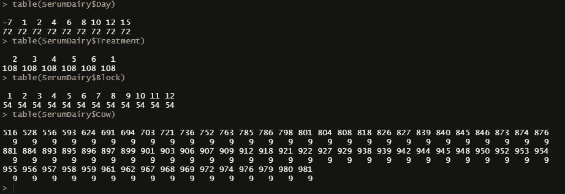

如您所见，我们每天对每个街区的每头奶牛进行多次测量。这确实是一个[随机完全区组设计](https://medium.com/@marc.jacobs012/building-and-optimizing-randomized-complete-block-designs-using-sas-c973d127d862)。

去墓地吧。

```
ggplot(SerumMelt, aes(x=Day, y=value, color=variable,group=Cow)) + 
  geom_point() + 
  geom_line(alpha=0.5)+
  theme_bw() +
  facet_wrap(~Treatment) + 
  theme(panel.grid.major = element_blank(), panel.grid.minor = element_blank()) +
  guides(linetype=F, size=F)
```

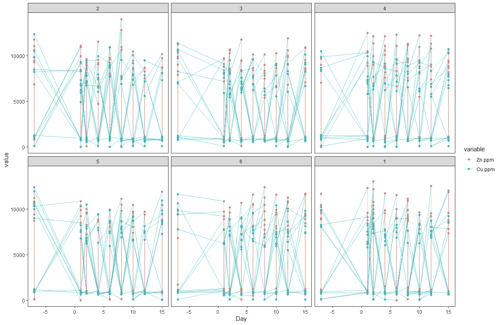

这是相当惊人的数据。这里的问题是我在处理之间建模，而不是块，这使得数据有点奇怪。然后，它继续上升和下降，所以我想仔细看看我看到的是什么。

```
# Plotting data 
dev.off()
par(mfrow=c(2,1))
boxplot(SerumDairy$Zn.ppm~SerumDairy$Day)
boxplot(SerumDairy$Cu.ppm~SerumDairy$Day)
boxplot(SerumDairy$Zn.ppm~SerumDairy$Treatment)
boxplot(SerumDairy$Cu.ppm~SerumDairy$Treatment)
coplot(Zn.ppm~Day|Treatment, data=SerumDairy)
coplot(Zn.ppm~Day|Block, data=SerumDairy)
coplot(Cu.ppm~Day|Treatment, data=SerumDairy)
coplot(Cu.ppm~Day|Block, data=SerumDairy)
```

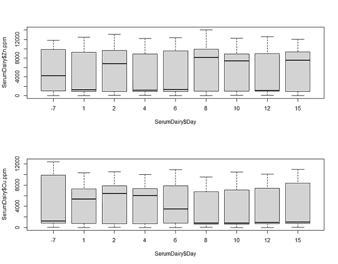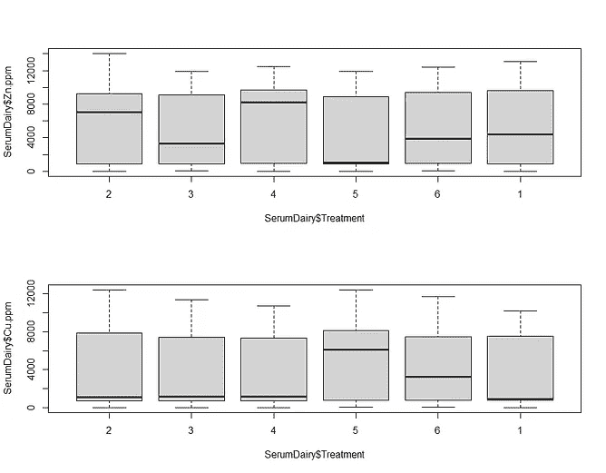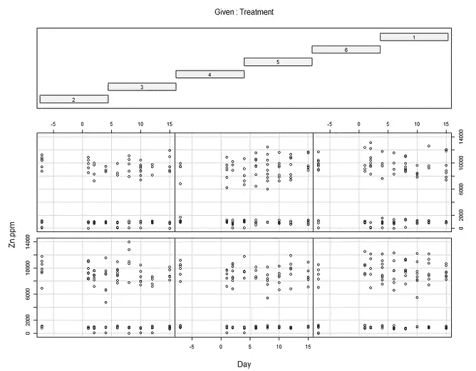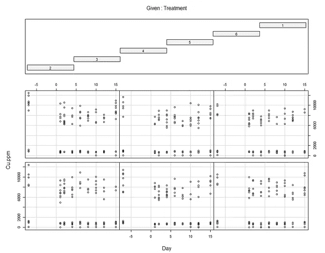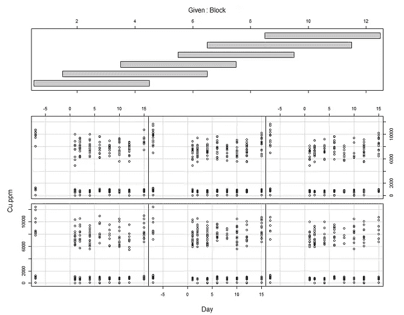

这些图帮助我更好地了解数据的各个部分。我没有看到任何奇怪的山峰。

现在，我想画更多的图来得到一个更好的想法。记住，我做的第一个计划一点帮助都没有。

```
# plotting Zn.ppm & Cu.ppm
ggplot(SerumMelt, aes(x=Day, y=value, group=Cow, color=variable)) + 
        geom_point(color="gray", shape=1)+ 
        geom_smooth(aes(group=variable, colour=variable), method="loess", size=1.5, se=F, span=0.5)+
        scale_y_continuous("Value") +
        scale_x_discrete("Days")+
        ggtitle(paste("Smoothed curves Zn.ppm & Cu.ppm"))+
        theme_bw()+
        facet_wrap(~Treatment)+
        theme(text=element_text(size=10), 
              axis.title.x = element_text(), 
              panel.grid.minor = element_blank())ggplot(SerumMelt, aes(x=Day, y=value, fill=variable)) +
        geom_boxplot() +
        theme_bw()+
        theme(panel.grid.major = element_blank(), panel.grid.minor = element_blank())+
        ggtitle(paste("Boxplot of Zn.ppm & Cu.ppm by Days")) +
        scale_y_continuous("Value") +
        scale_x_discrete("Days") +
        facet_grid(~Treatment)+
theme(text=element_text(size=10), 
      axis.title.x = element_text(), 
      panel.grid.minor = element_blank())
```

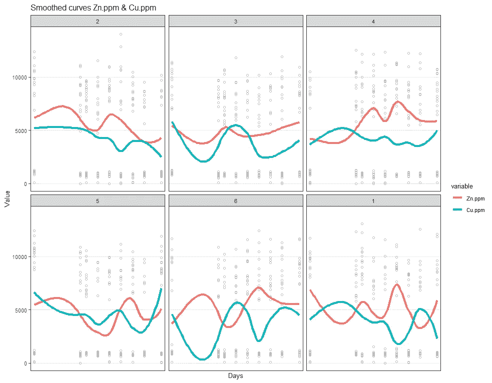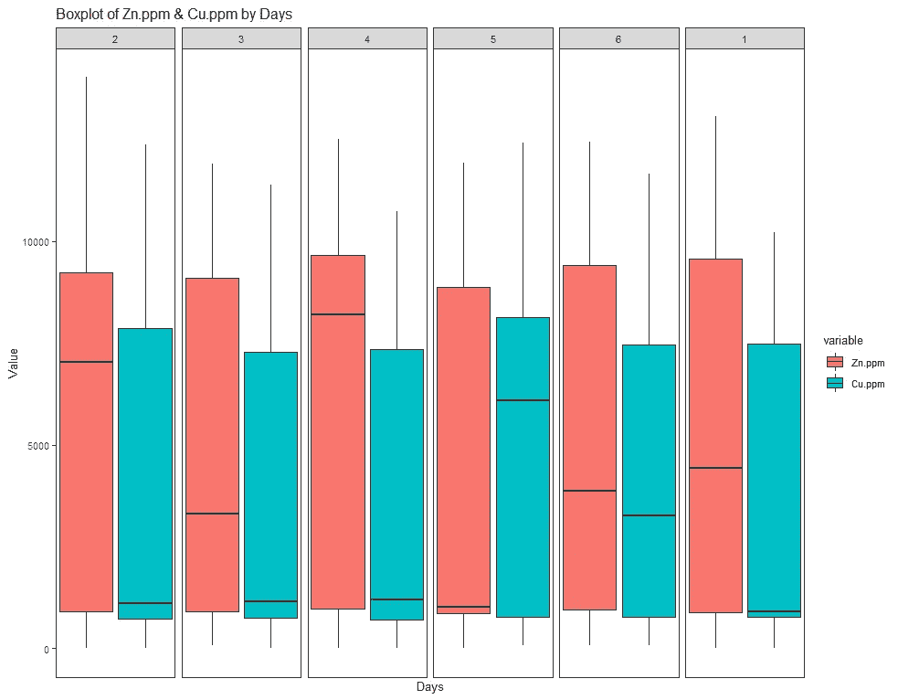

虽然黄土平滑器看起来总是很酷，但箱线图提供的信息更多，因为它显示了巨大的分布量和无法达到的真实值差距。不管设计如何，这将使分析变得相当困难。

现在，我想更仔细地看看治疗方法。

```
# boxplot showing per treatment BW over time
ggplot(SerumDairy, aes(x=as.factor(Day), y=Zn.ppm, colour=as.factor(Treatment))) +
        geom_boxplot() +
        theme_bw() +
        ggtitle(paste("Boxplot of Zn.ppm by Days")) +
        scale_y_continuous("Zn.ppm") +
        scale_x_discrete("Days") +
        theme(text=element_text(size=10), 
              axis.title.x = element_text(), 
              panel.grid.minor = element_blank())# line plot
ggplot(SerumDairy, aes(x=as.factor(Day), y=Zn.ppm, group=Cow)) + 
        geom_point(color="gray", shape=1) + 
        geom_smooth(aes(group=Treatment, colour=as.factor(Treatment)), method="loess", size=1.5, se=F, span=0.5) +
        scale_y_continuous("Zn.ppm") +
        scale_x_discrete("Days")+
        ggtitle(paste("Smoothed curve Zn.ppm"))+
        theme_bw()+
        facet_wrap(~Block)+
        theme(text=element_text(size=10), 
              axis.title.x = element_text(), 
              panel.grid.minor = element_blank())ggplot(SerumDairy, aes(x=Daydiff, y=Zn.ppm, group=Cow, colour=Treatment)) + 
        geom_point(color="gray", shape=1) + 
        geom_smooth(aes(group=1), size=1.5, se=F, alpha=0.8, span=0.5) +
        facet_wrap(~Treatment)+
        theme_bw()
```

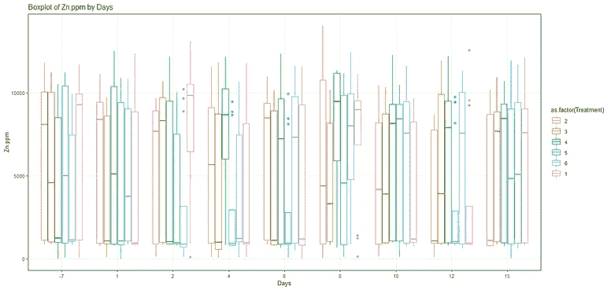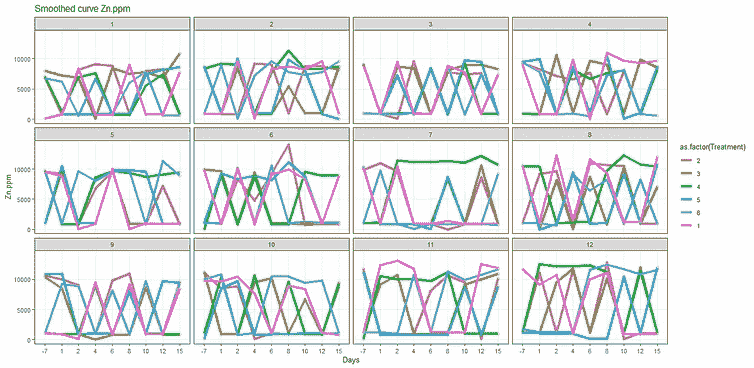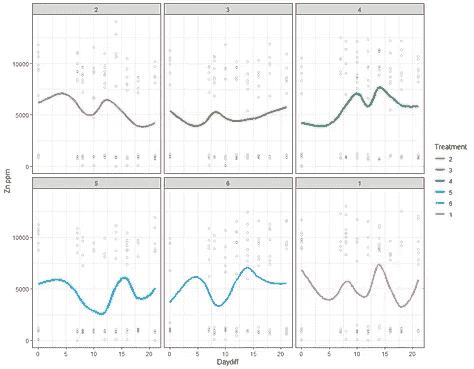

中间的图显示了我们在第一个图中看到的奇怪的上下模式，它累积在左侧的方框图中。这两个图合在一起，显示了右边黄土图的无用性，如果你把它作为唯一的图，那是危险的。

接下来的图可能是查看治疗数据最方便的了。不是因为他们试图描绘出每种治疗的平均效果，而是因为他们显示了箱线图中已经暗示的绝对差异水平。就此而言，箱线图可能是最具包容性的图。

```
# nicest line plot for Treatment
theme_set(theme_bw())
myx<-scale_x_continuous(breaks=c(0,7,8,10,12,14,16,18,21))
ggplot(SerumDairyCompl, aes(x=Daydiff, y=Zn.ppm, group=Cow))+
        myx+
        geom_line(colour="grey80") +
        facet_grid(~Treatment, margins=T)+
        stat_summary(aes(group=1), fun.y=mean, geom="point", size=3.5)+
        stat_summary(aes(group=1), fun.y=mean, geom="line", lwd=1.5)theme_set(theme_bw())
myx<-scale_x_continuous(breaks=c(0,7,8,10,12,14,16,18,21))
ggplot(SerumDairyCompl, aes(x=Daydiff, y=Zn.ppm, group=Cow))+
        myx+
        geom_line(colour="grey80") +
        stat_summary(aes(group=Treatment, colour=Treatment), fun.y=mean, geom="point", size=3.5)+
        stat_summary(aes(group=Treatment, colour=Treatment), fun.y=mean, geom="line", lwd=1.5)# nicest line plot for Block
theme_set(theme_bw())
myx<-scale_x_continuous(breaks=c(0,7,8,10,12,14,16,18,21))
ggplot(SerumDairyCompl, aes(x=Daydiff, y=Zn.ppm, group=Cow))+
        myx+
        geom_line(colour="grey80") +
        facet_grid(~Block, margins=T)+
        stat_summary(aes(group=1), fun.y=mean, geom="point", size=3.5)+
        stat_summary(aes(group=1), fun.y=mean, geom="line", lwd=1.5)xyplot(SerumMelt$value~SerumMelt$Daydiff|SerumMelt$Treatment, type=c("p", "smooth"))
histogram(~SerumDairy$Zn.ppm|SerumDairy$Day+SerumDairy$Treatment)
```

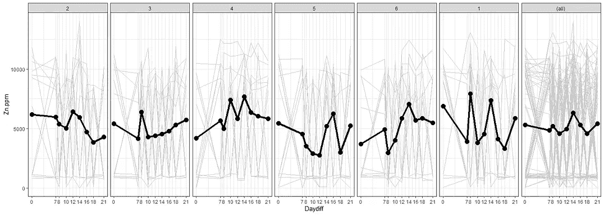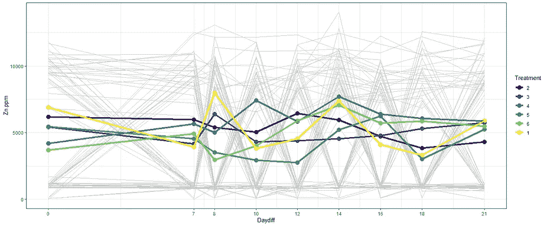

再一次，治疗数据非常可怕。这让我想知道选择的时间是否有帮助。

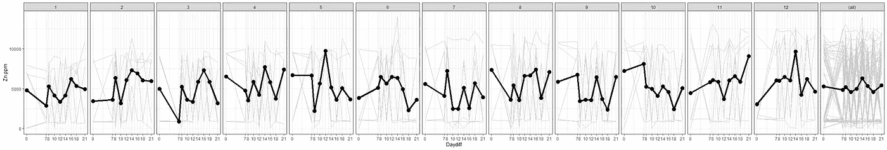

这张图清楚地显示了模式的变化。

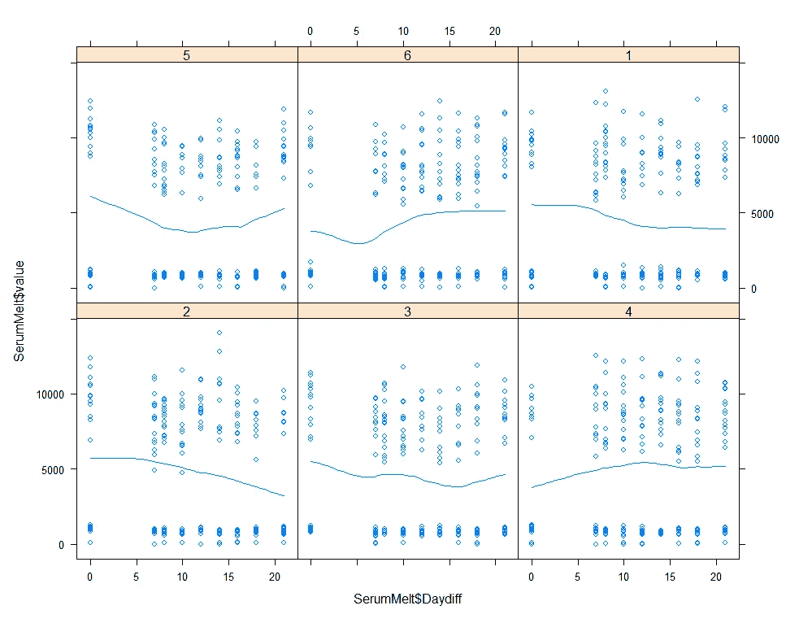

最后，也是最不重要的，平滑的曲线增加的如此之少，却如此努力。

图表时代已经到来，我想现在就开始建模，使用[线性混合模型](https://medium.com/mlearning-ai/introduction-to-mixed-models-in-r-9c017fd83a63)通过重复测量来考虑数据的相关性。

首先，进行一些简单的回归，以更好地了解模型将如何处理设计的不同组件。

```
### Linear Mixed Models
## Zinc 
# Linear model for exploring data
SerumDairy$Daydiff<-as.numeric(as.character(SerumDairy$Daydiff))
class(SerumDairy$Daydiff)
SerumDairy$Treatment<-factor(SerumDairy$Treatment, ordered=FALSE)
summary(regr1<-lm(Zn.ppm~Daydiff, data=SerumDairy))
summary(regr2<-lm(Zn.ppm~Daydiff*Treatment, data=SerumDairy))
summary(regr3<-lm(Zn.ppm~Daydiff*Block, data=SerumDairy))
summary(regr4<-lm(Zn.ppm~Daydiff*Treatment*Block, data=SerumDairy))
plot(allEffects(regr1))
plot(allEffects(regr2))
plot(allEffects(regr3))
plot(allEffects(regr4))
anova(regr1, regr2, regr3, regr4)
```

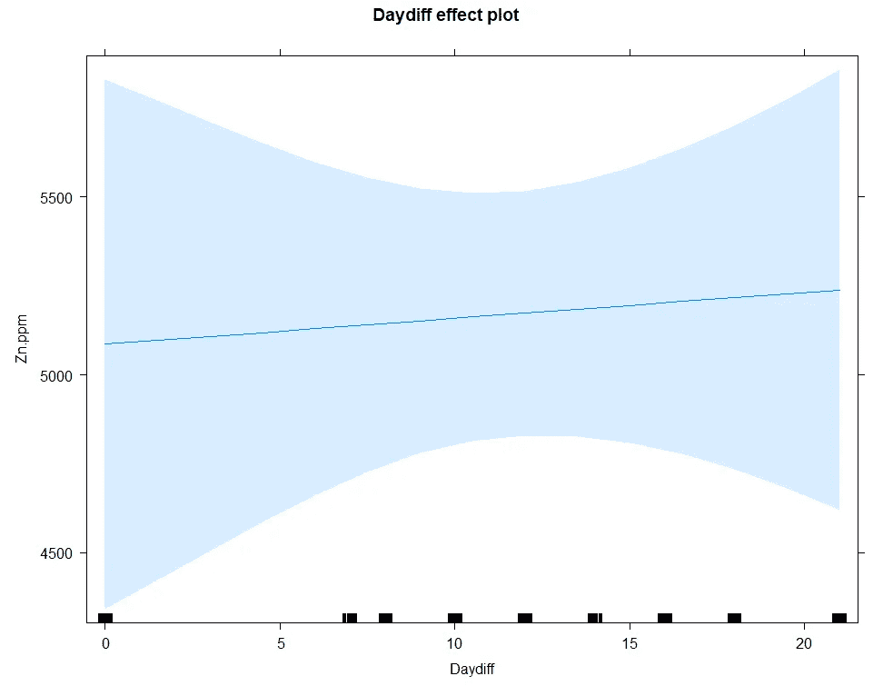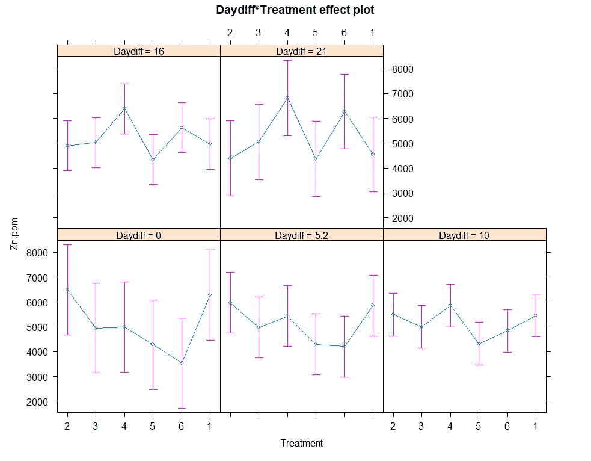

日效应和治疗

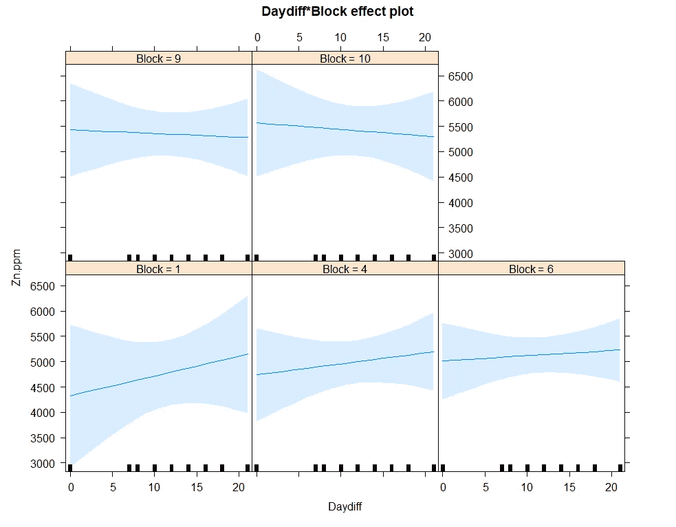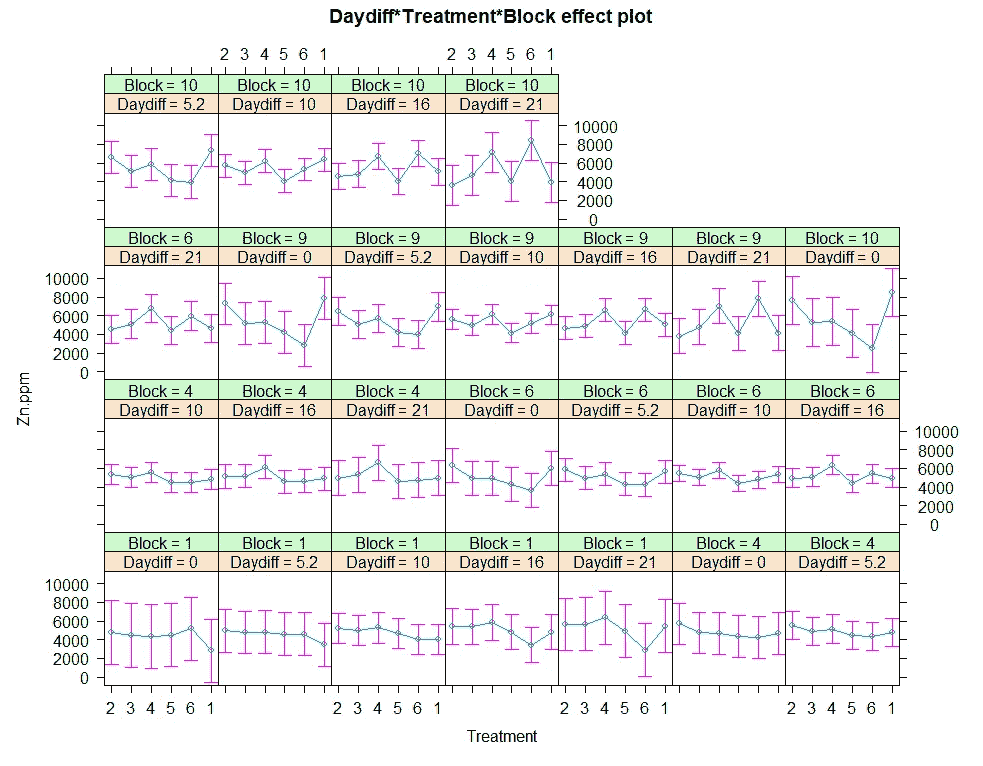

跨区块的日效应和处理。如果你看看上一篇文章，你会对这些数据和其中固有的差异有更好的感觉。


如您所见，与仅包含日的第一个模型相比，所有模型在统计上并不显著。从数据来看，这是有意义的，但是我们还没有包括相关的结构。

让我们继续建立无条件增长模型。

```
# Unconditional means model - intercept only model
model.i<-lmer(Zn.ppm~1 + (1|Cow), SerumDairy, REML=FALSE) # Unconditional growth model - linear effect of time
model.l<-lmer(Zn.ppm~1 + Daydiff + (1|Cow), SerumDairyCompl, REML=FALSE) # random intercept + fixed time # Unconditional polynomial growth model - quadratic effect of time
model.q<-lmer(Zn.ppm~1 + Daydiff + I(Daydiff^2) + (1|Cow), SerumDairy, REML=FALSE)

# comparing the unconditional mean model, the unconditional growth model, and the unconditional polynomial growth model
mynames<-c("I", "L", "Q")
myaicc<-as.data.frame(aictab(cand.set=list(model.i,model.l,model.q), modnames=mynames))[, -c(5,7)]
myaicc$eratio<-max(myaicc$AICcWt)/myaicc$AICcWt
data.frame(Model=myaicc[,1],round(myaicc[, 2:7],4))
```

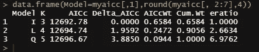

第一个模型，线性的，似乎是最好的。

然后我将继续添加[随机斜率](https://blog.devgenius.io/randomness-in-mixed-models-8b7affd8a7c4)到模型中。

```
 model.l<-lmer(Zn.ppm~1 + Daydiff + (1|Cow), SerumDairyCompl, REML=FALSE) 
model.lr<-lmer(Zn.ppm~1 + Daydiff + (1+Daydiff|Cow), SerumDairyCompl, REML=FALSE) 
anova(model.l, model.lr) 
PBmodcomp(model.lr, model.l, nsim=1000, cl=cl)

plot_model(model.lr, facet.grid=F, sort.est="sort.all", y.offset=1.0)plot_model(model.lr, type="est"); 
plot_modelr(model.4, type="std") 
plot_model(model.lr, type="eff") 
plot_model(model.lr, type="pred", facet.grid=F, vars=c("Daydiff", "Treatment"))ranef(model.lr)
fixef(model.lr)sam<-sample(SerumDairy$Cow, 15);sam
plot_model(model.lr, type="slope", facet.grid = F, sample.n=sam) # plotting random intercepts
plot_model(model.lr, type="resid", facet.grid = F, sample.n=sam) # plotting random intercepts but does not work?? 
plot_model(model.lr, type="diag")
```

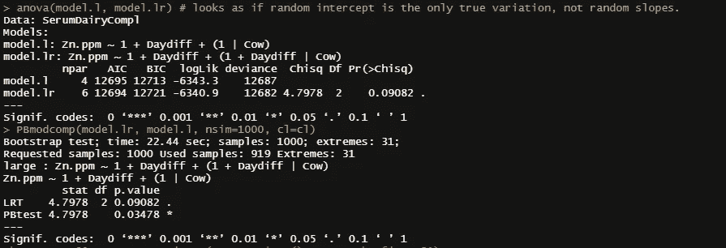

在直接的似然比测试中，随机斜率分量并不重要，但当我们通过自举对数据进行排列时，它就重要了。就目前而言，最好还是保持随机截距和随机斜率的混合模型。

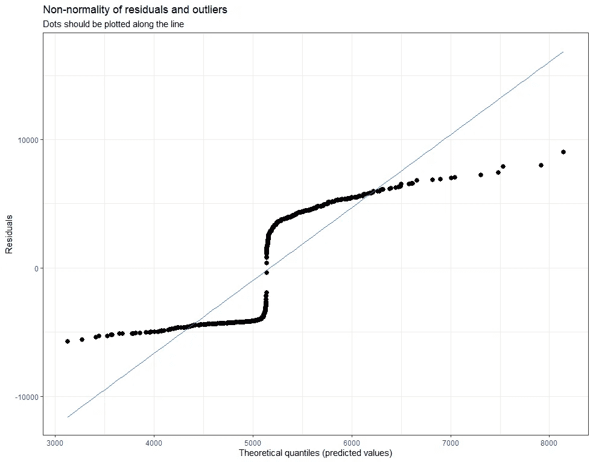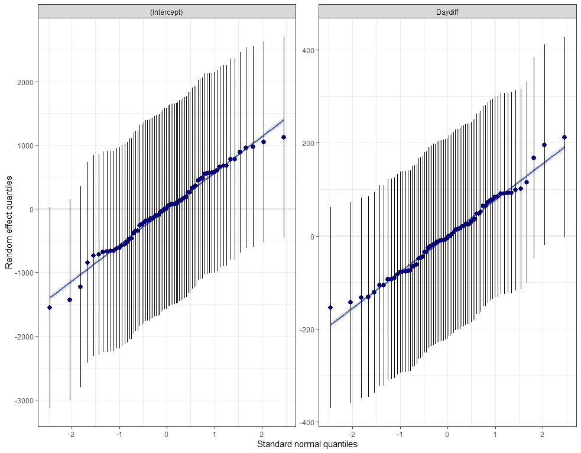

尽管随机分量遵循正态分布，但残差与您希望看到的相差甚远。

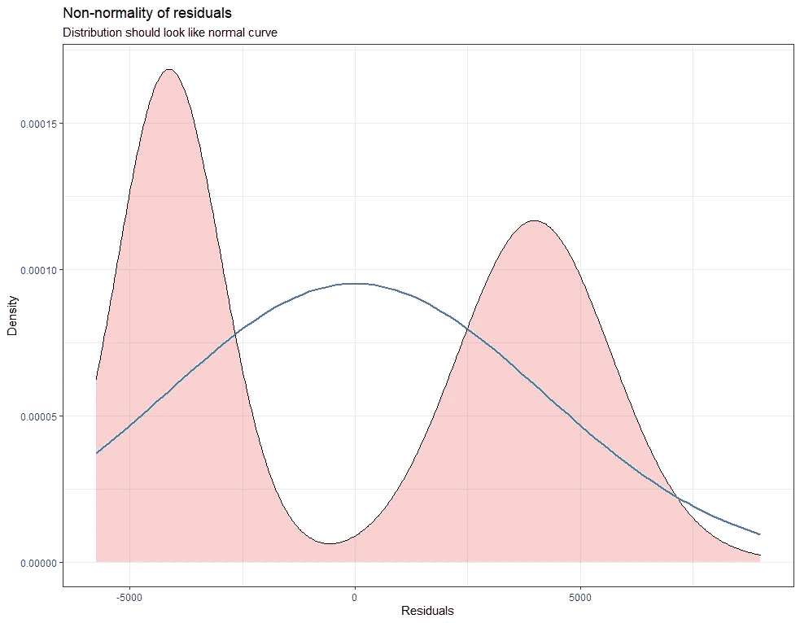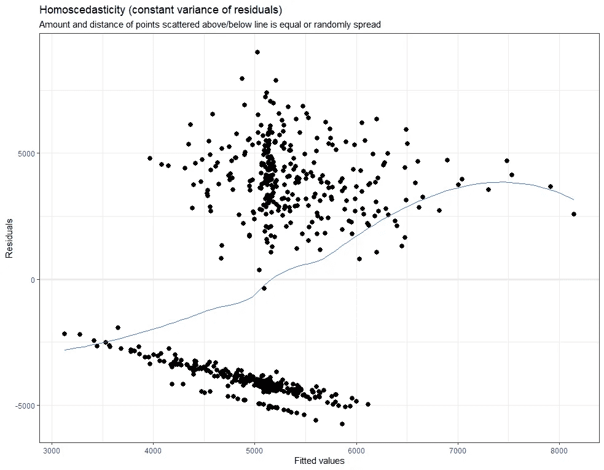

残差暗示了一个不匹配的模型，就好像需要一个[混合物](https://blog.devgenius.io/mixture-component-zero-inflated-and-hurdle-models-44c5e6fe5d7f)。

```
model.qr<-lmer(Zn.ppm~1 + Daydiff + I(Daydiff^2) + (1+Daydiff|Cow), SerumDairyCompl, REML=FALSE)
summary(model.qr) 
anova(model.l, model.q, model.lr, model.qr)
```

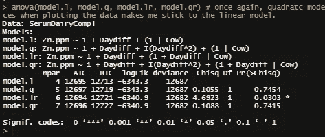

嗯，模型之间的差异是微观的。最好用[奥卡姆剃刀](https://en.wikipedia.org/wiki/Occam%27s_razor)。

我现在将添加治疗效果

```
## Adding treatment effect
model.ltt<-lmer(Zn.ppm~1 + Daydiff*Treatment + (1|Cow), SerumDairyCompl, REML=FALSE)
summary(model.ltt)
anova(model.l, model.ltt)
```

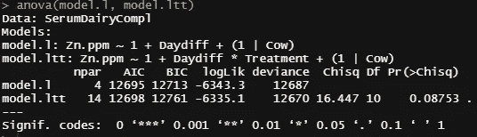

一点帮助都没有。尽管 p 值可能暗示了潜在的重要性，但 AIC 几乎没有变化。

```
# plotting time over treatments and blocks 
pd <- position_dodge(width = 0.2)
ggplot(SerumDairy, aes(x=Daydiff, y=Zn.ppm, group=Cow, color=Treatment))+ geom_point(position=pd) + geom_line(position=pd) + facet_grid(Treatment~Block)
ggplot(SerumDairy, aes(x=Daydiff, y=Zn.ppm, group=Cow, color=Treatment))+ geom_point(position=pd) + geom_line(position=pd) + facet_wrap(~Block)
plot(allEffects(model.5))
eff.model.5<-allEffects(model.5)
regr<-lm(Zn.ppm~Daydiff+Treatment+Block, data=SerumDairyCompl)
plot(allEffects(regr)) # smaller confidence intervals then multilevel model
```

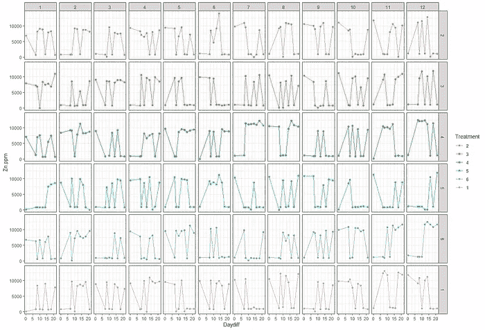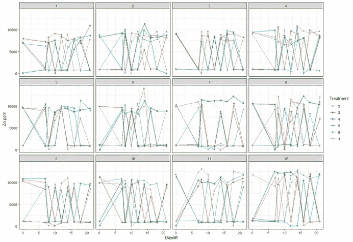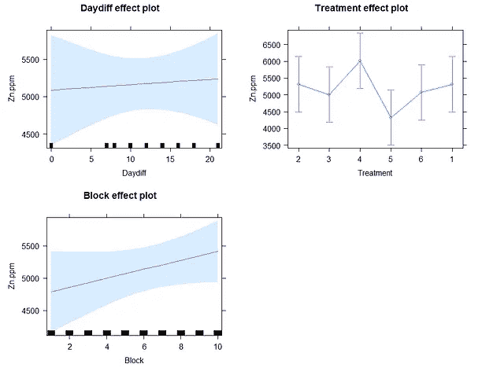

再一次，看到这些情节，结果并不真的令人惊讶。

接下来，我将使用块效应扩展模型。

```
## Adding block effect
SerumDairy$Block<-as.integer(SerumDairy$Block)
model.l<-lmer(Zn.ppm~1 + Daydiff + (1|Cow), SerumDairyCompl, REML=FALSE) # random intercept + fixed slope
model.lttb<-lmer(Zn.ppm~1 + Daydiff+Treatment++(1|Cow), SerumDairyCompl, REML=FALSE)
summary(model.lttb)
model.lttbr<-lmer(Zn.ppm~1 + Daydiff+Treatment+Block+(1|Cow) + (1|Block), SerumDairyCompl, REML=FALSE)
summary(model.lttbr)
anova(model.lttb, model.lttbr)
model.lttbri<-lmer(Zn.ppm~1 + Daydiff*Treatment*Block + (1|Block/Cow), SerumDairyCompl, REML=FALSE) # (1|Block/Cow) is the same as (1|Cow) & (1|Block)
summary(model.lttbri)
anova(model.l,model.ltt,model.lttbri)
```

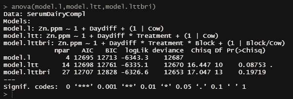

同样，日差斜率和随机截距的单一模型表现最好。

然后我会寻找互动效应。在这一点上，我已经有了一种感觉，一个直接的比较将如何在结果中结束。

```
# Interaction effects or just fixed effects?
model.lttbri1<-lmer(Zn.ppm~1 + Daydiff*Treatment*Block + (1|Block/Cow), SerumDairy, REML=FALSE) # (1|Block/Cow) is the same as (1|Cow) & (1|Block)
model.lttbri2<-lmer(Zn.ppm~1 + Daydiff+Treatment+Block + (1|Block/Treatment), SerumDairy, REML=FALSE) 
model.lttbri3<-lmer(Zn.ppm~1 + Daydiff+Treatment+Block + (1|Block/Cow), SerumDairy, REML=FALSE) 
anova(model.lttbri1, model.lttbri2, model.lttbri3) # because each cow represent the treatment in a block (6 cows to represent 6 treatments in a block) it does not matter if we specify Block/Treatment or Block/CoW
```

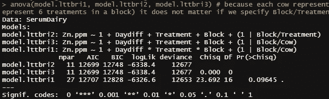

互动效果不会增加任何东西。

是时候更深入地比较最有可能的模型了。

```
 model.1<-lme4::lmer(Zn.ppm~1 + (1|Block/Treatment), SerumDairyCompl, REML=FALSE)model.2<-lme4::lmer(Zn.ppm~Daydiff + (1|Block/Treatment), SerumDairyCompl, REML=FALSE)model.3<-lme4::lmer(Zn.ppm~Daydiff + Treatment + (1|Block/Treatment), SerumDairyCompl, REML=FALSE)model.4<-lme4::lmer(Zn.ppm~Daydiff + Treatment + Block + (1|Block), SerumDairyCompl, REML=FALSE)model.5<-lme4::lmer(Zn.ppm~Daydiff + Treatment + Block + (1|Block/Treatment), SerumDairyCompl, REML=FALSE)model.6<-lme4::lmer(Zn.ppm~Daydiff + Treatment + Block + (Daydiff|Treatment) + (1|Block/Treatment), SerumDairyCompl, REML=FALSE) # is maximal model possible, random slopes + intercept by subjects, and random intercept of treatment, blocks and treatment within blocks. But Corr is NaN which seems like overfitting the model or making it redundantmodel.7<-lme4::lmer(Zn.ppm~Daydiff + Treatment + Block + (0+Block|Treatment), SerumDairyCompl, REML=FALSE) # experimental model, leaving the intercept alone, and thus only specifying the random slope. Do not fully understand that model yet. model.8<-lme4::lmer(Zn.ppm~Daydiff + Treatment + Block + (1|Treatment) + (1|Block), SerumDairyCompl, REML=FALSE) # shows varing intercepts by Block, not by Treatment. Is that even possible?

model.9<-lme4::lmer(Zn.ppm~Daydiff + Treatment + Block + (1|Cow), SerumDairyCompl, REML=FALSE
, SerumDairyCompl, REML=FALSE)model.10<-lme4::lmer(Zn.ppm~Daydiff + I(Daydiff^2) + Treatment + Block + (1|Block/Treatment), SerumDairyCompl, REML=FALSE)model.11<-lme4::lmer(Zn.ppm~Daydiff + Treatment + Block + (1|Block:Treatment), SerumDairyCompl, REML=FALSE)model.11<-lme4::lmer(Zn.ppm~Daydiff + Treatment + (1|Block:Treatment), SerumDairyCompl, REML=FALSE)model.12<-lme4::lmer(Zn.ppm~1+(1|Block:Treatment:Daydiff), SerumDairyCompl, REML=FALSE) # Error: number of levels of each grouping factor must be < number of observationsmodel.13<-lme4::lmer(Zn.ppm~Daydiff + Treatment + Block + (1|Block) + (1|Block:Treatment), SerumDairyCompl, REML=FALSE) # exact same as model.5 model.14<-lme4::lmer(Zn.ppm~Daydiff + Block + (1|Block/Treatment), SerumDairyCompl, REML=FALSE)model.15<-lme4::lmer(Zn.ppm~Daydiff + Block + (1|Block), SerumDairyCompl, REML=FALSE)model.16<-lme4::lmer(Zn.ppm~poly(Daydiff,3) + Treatment + Block + (1|Block/Treatment), SerumDairyCompl, REML=FALSE)
```

我们可以使用 [jtools](https://jtools.jacob-long.com/) 包轻松比较许多模型。

```
jtools::plot_summs(model.2,
                   model.3,
                   model.4, 
                   model.5,
                   model.6,
                   model.7,
                   model.8,robust = "HC3",
                   model.names = c("+Daydiff",
                                   "+Treatment",
                                   "only (1|Block)",
                                   "(1|Block/Treatment)",
                                   "(1|Daydiff/Treatment)",
                                   "(0+Block|Treatment)",
                                   "(1|Treatment) + (1|Block)"))
```

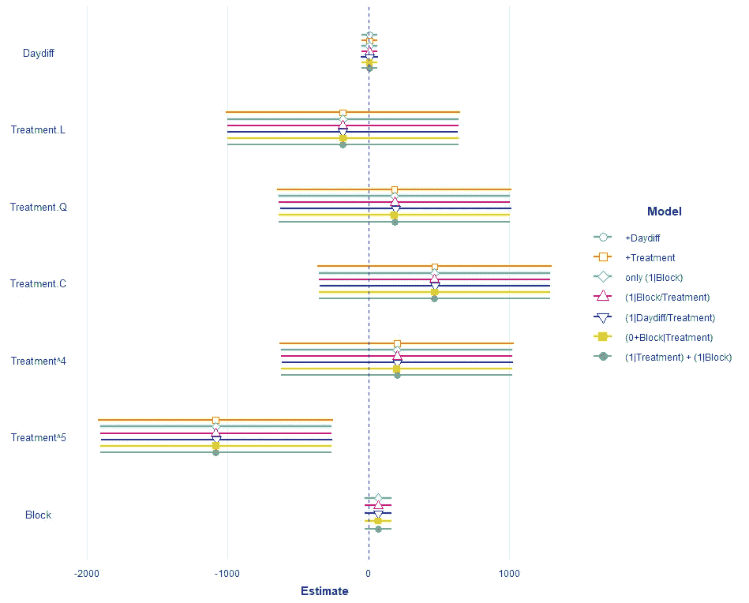

它们都显示了相同的效果估计。在这种情况下，选择最简单的模型。

让我们看看其他模特的表现。

```
jtools::plot_summs(model.10,
                   model.11,
                   model.13,
                   model.14,
                   model.15,
                   model.16,
                   robust = "HC3",
                   model.names = c("+I(Daydiff^2)",
                                   "+(1|Block:Treatment)",
                                   "(1|Block) + (1|Block:Treatment)",
                                   "(1|Block/Treatment)",
                                   "(1|Block)",
                                   "poly(Daydiff,3)"))
```

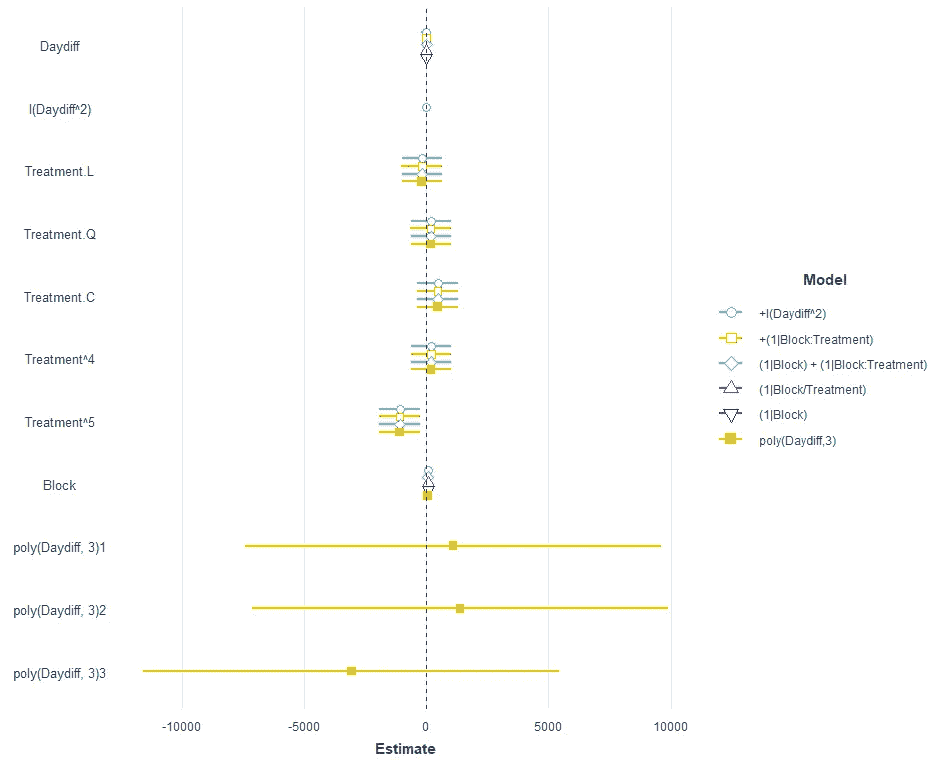

也好不到哪里去。

我现在要选择一个模型，model.5，因为它在给定设计设置的情况下最有意义。然而，考虑到这些数据，选择只显示时间效应的最简单的模型是一个很好的主意。

```
# diagnostic plots model.5
plot(allEffects(model.11))
plot(model.11, type=c("p", "smooth"))
plot(model.11, sqrt(abs(resid(.)))~fitted(.), type=c("p", "smooth"))
qqmath(model.11, id=0.05)
```

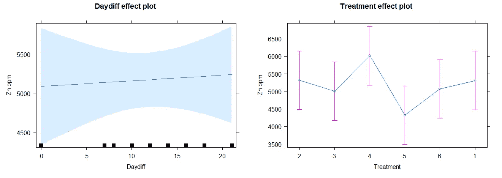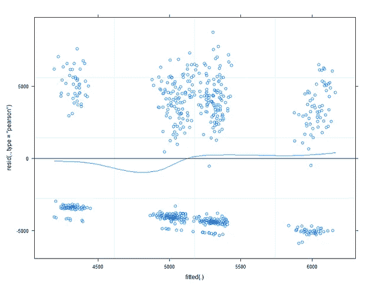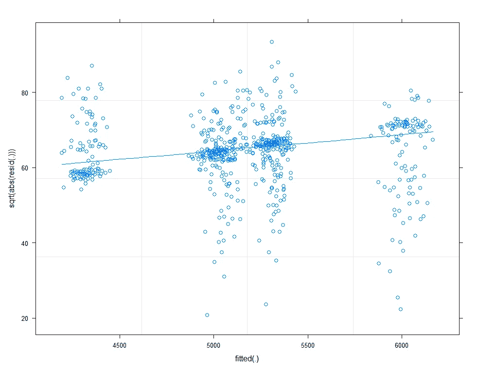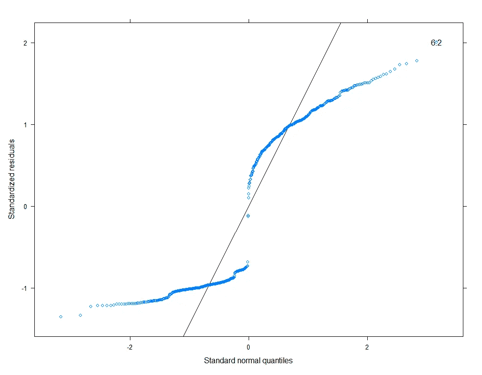

正如你所看到的，这个模型的诊断结果并不好。

有一个很好的软件包，叫做 [HLMdiag](https://cran.r-project.org/web/packages/HLMdiag/index.html) ，它可以让你更深入地研究模型的残差，在不同的层次上进行诊断。

```
model.l<-lmer(Zn.ppm~1 + Daydiff + (1|Cow), SerumDairyCompl, REML=FALSE)
model.q<-lmer(Zn.ppm~1 + Daydiff + I(Daydiff^2) + (1|Cow), SerumDairy, REML=FALSE)
model.q3<-lmer(Zn.ppm~1 + Daydiff + I(Daydiff^2) + I(Daydiff^3) + (1|Cow), SerumDairy, REML=FALSE) # cubic model
model.qr<-lmer(Zn.ppm~1 + Daydiff + I(Daydiff^2) + (Daydiff|Cow), SerumDairy, REML=FALSE)model.l.resid <- hlm_resid(model.l, standardize = TRUE, include.ls = TRUE, level=1)
ggplot(data = model.l.resid, aes(x = Daydiff, y = .std.ls.resid)) + 
  geom_point(alpha = 0.2) +
  geom_smooth(method = "loess", se = FALSE) + 
  labs(y = "LS level-1 residuals", title = "LS residuals against Day Difference")
```

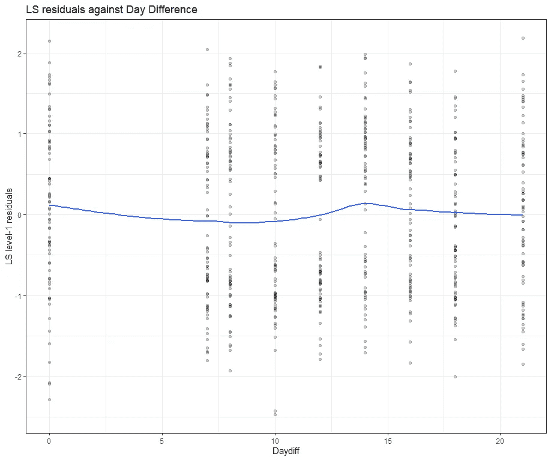

最简单模型的残差，我觉得不错。

然后，我想看看有影响的人，我会通过观察数据的第一层来做到这一点，这就是观察。下面你可以看到，肯定有一些有影响的观察，但这并不意味着他们需要删除。当你发现影响者或异常者时，他们会向你展示现实生活中的机制。找到了就要珍惜。如果模型不能处理它们，模型就会显示出它的局限性。

当标有异常值的观察值不是坏数据时，上述所有情况都适用。它们不应该是错误。

```
model.l.infl  <- hlm_influence(model.l, level = 1)
dotplot_diag(model.l.infl$cooksd, name = "cooks.distance", cutoff = "internal")
dotplot_diag(model.l.infl$cooksd, name = "mdffits", cutoff = "internal")
dotplot_diag(model.l.infl$cooksd, name = "covratio", cutoff = "internal")
dotplot_diag(model.l.infl$cooksd, name = "rvc", cutoff = "internal")
```

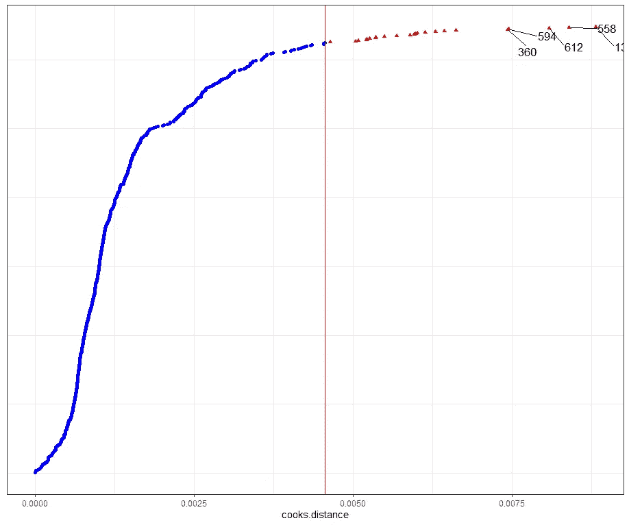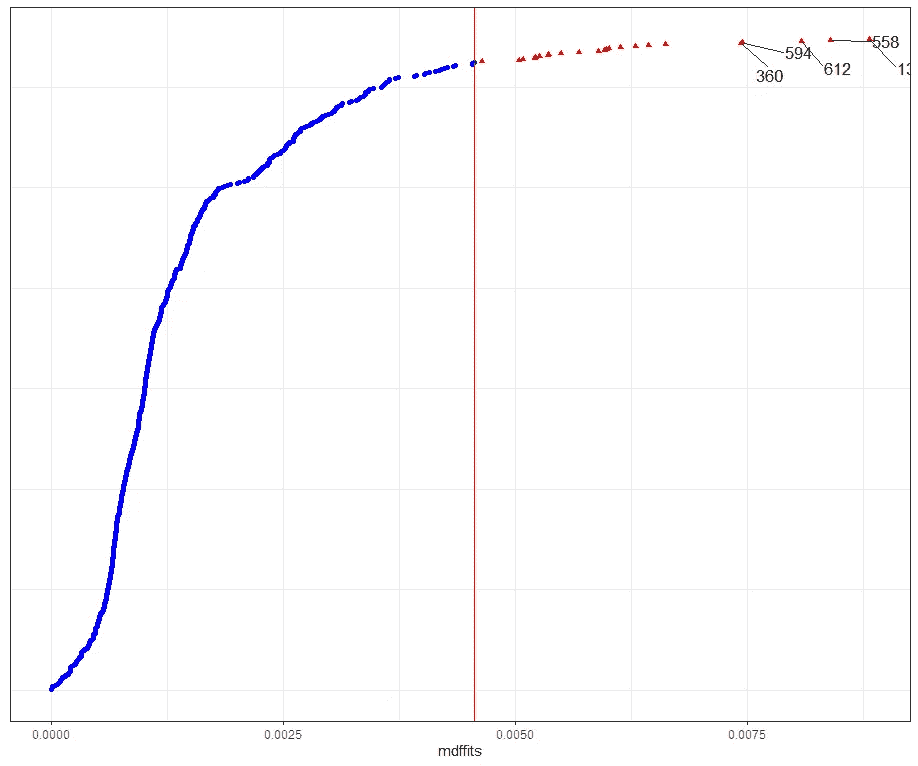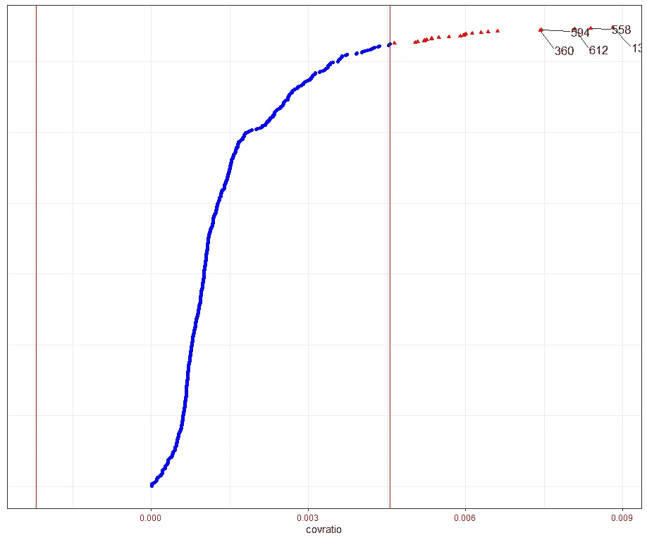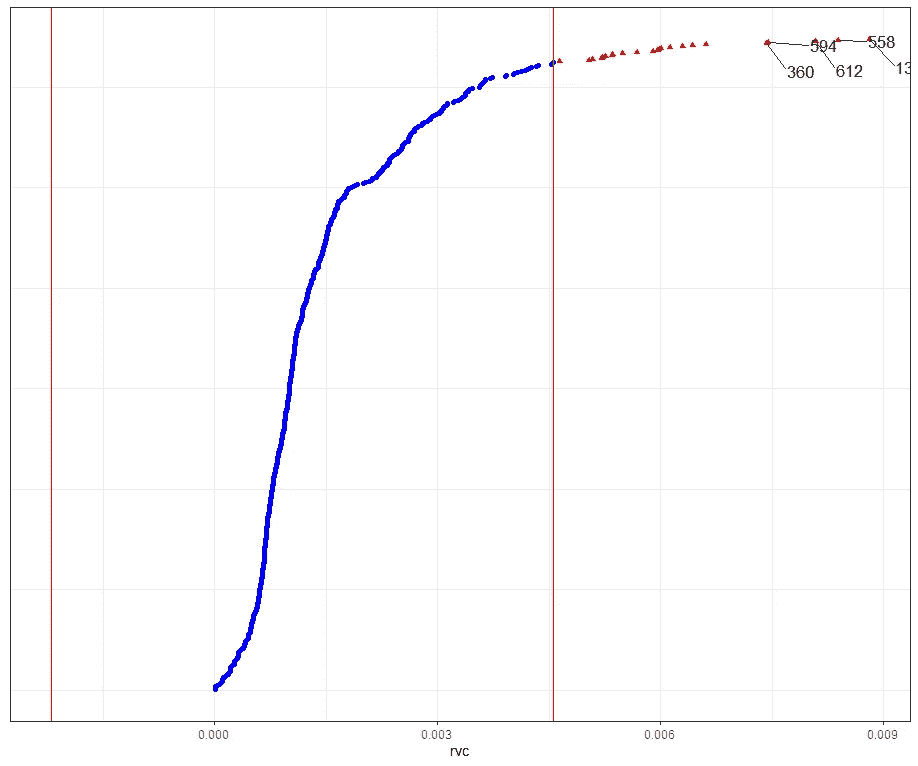

如果我开始完全删除奶牛呢？

```
model.l.del<-case_delete(model.l, level="Cow", type="both")
model.l.del$fitted.delete<-as.data.frame( model.l.del$fitted.delete)
ggplot(data = model.l.del$fitted.delete, 
       aes(y = as.factor(deleted), 
           x= as.factor(Daydiff), 
           fill=fitted.x.)) + 
  geom_tile() +
  scale_fill_viridis_c(option="C")+
  theme_bw()+
  labs(y = "Deleted cow",
       x = "Day difference", 
       title = "Changes in Zn (ppm) by deletion of cows")
```


没什么变化。再一次，如果你看最早的情节，我无论如何都会预料到这一点。整个数据集都存在差异。

接下来，我想看看来自模型 5 的后验预测模拟。首先，我们来拟合模型 5。

```
model.5<-lme4::lmer(Zn.ppm~Daydiff + Treatment + Block + (1|Block/Treatment), SerumDairyCompl, REML=FALSE)
```

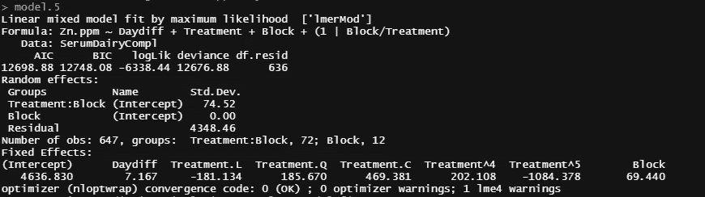

一切看起来都很好，除了块方差似乎没有做任何事情。

然后模拟工作开始。

```
mySumm <- function(.) { s <- sigma(.)
c(beta =getME(., "beta"), sigma = s, sig01 = unname(s * getME(., "theta"))) }
boo01<-bootMer(model.5, mySumm, nsim = 1000)
plot(boo01,index=3)
```

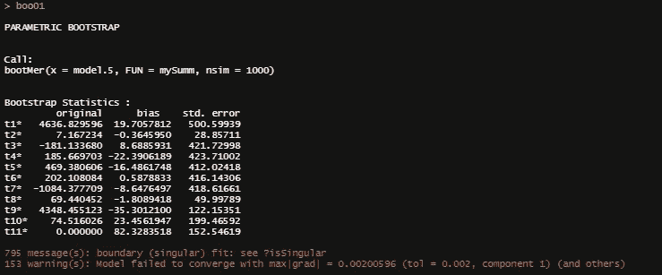

在这里，您可以看到来自引导程序的值。这 11 个值代表了在**模型中测量的 11 个变量。5\.** 你在这样的模拟中寻找的不是显著的，而是扩散。偏倚有多大，标准差有多大？大的数字暗示着不稳定的数据集。

从自举结果中，我可以提取不同水平的特定种类的置信区间，并绘制它们。在这里，您可以通过直方图和第三个变量 *t3 的 qq 图看到分布情况。*恰逢*处理。L* 。因此，它显示了*治疗的效果。L* 通过重采样与参考处理进行比较。重采样显示您希望它显示的内容-正态分布，如扩散。进行*治疗。然而，这种无效果现在变得非常明显。*

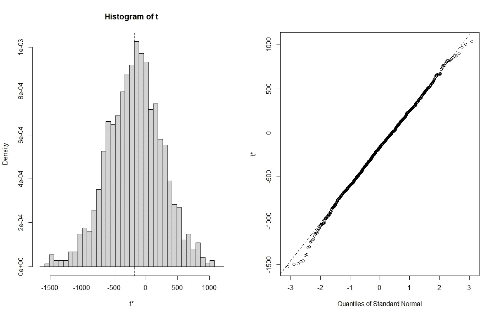

从所有这些，我们可以选择选择哪种信心。它们并不都一样。从功能中，您可以选择:

1.  **正常**。使用正态近似计算区间矩阵。它有 3 列，第一列是水平，另外两列是区间的上下端点。
2.  **基本**。使用基本的 bootstrap 方法计算区间。
3.  学生。使用学生化 bootstrap 方法计算区间。
4.  **百分之**。使用 bootstrap 百分位法计算区间。
5.  **BCA** 。使用调整的 bootstrap 百分位(BCa)方法计算间隔。

```
## ------ Bootstrap-based confidence intervals ------------
bCI.1 <- boot.ci(boo01, index=1, type=c("norm", "basic", "perc")); bCI.1 # Intercept
bCI.2  <- boot.ci(boo01, index=2, type=c("norm", "basic", "perc")) # Residual standard deviation - original scale
plot(boo01,index=3)
confint(model.5, method="boot", nsim=1000)
```

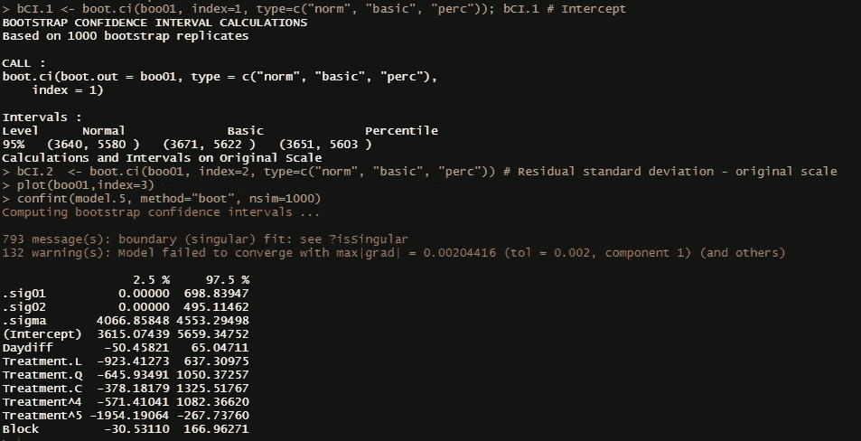

我请求 t1 的正常、基本和百分比置信区间。如你所见，它们是不同的。


就像我之前说的，R 有办法通过不同的包以不同的方式做同样的事情。下面我展示了来自 [merTools](https://cran.r-project.org/web/packages/merTools/vignettes/merToolsIntro.html) 包和 lme4 bootMer 函数的预测间隔。

```
 PI<-predictInterval(model.5, newdata=SerumDairyCompl, level=0.95, n.sims=1000, stat="median", type="linear.prediction", include.resid.var=T)
head(PI)ggplot(aes(x=1:30, y=fit, ymin=lwr, ymax=upr), data=PI[1:30,])+geom_point()+geom_linerange()+labs(x="Index", y="Prediction w/95% PI") + theme_bw()
```

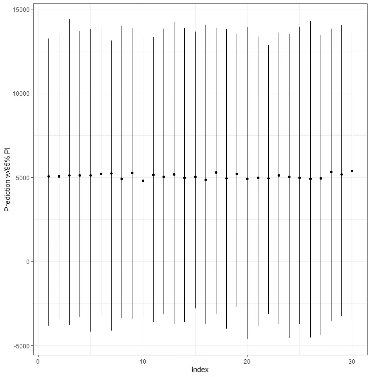

通过 bootstrapping 对模型进行线性预测，显示前 30 次提取

```
mySumm <- function(.) {
        predict(., newdata=SerumDairyCompl, re.form=NULL)
}####Collapse bootstrap into median, 95% PI
sumBoot <- function(merBoot) {
        return(
                data.frame(fit = apply(merBoot$t, 2, function(x) as.numeric(quantile(x, probs=.5, na.rm=TRUE))),
                           lwr = apply(merBoot$t, 2, function(x) as.numeric(quantile(x, probs=.025, na.rm=TRUE))),
                           upr = apply(merBoot$t, 2, function(x) as.numeric(quantile(x, probs=.975, na.rm=TRUE)))))}boot1 <- lme4::bootMer(model.5, mySumm, nsim=1000, use.u=FALSE, type="parametric")
PI.boot1 <- sumBoot(boot1)
ggplot(PI.boot1)+
  geom_density(aes(x=fit))+
  geom_density(aes(x=lwr, fill="red"),alpha=0.5)+
  geom_density(aes(x=upr, fill="red"),alpha=0.5)+
  theme_bw()+
  theme(legend.position = "none")
```

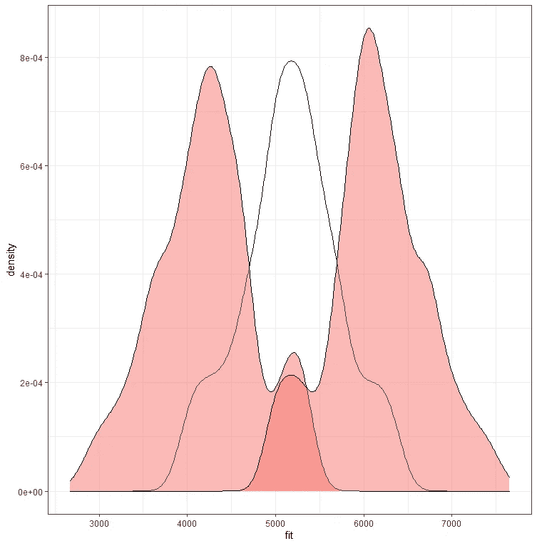

现在你可以看到它们了——拟合的置信区间和上下置信区间是它们自身的分布，有重叠的地方。情节可能看起来有点奇怪，但我真的很有兴趣在这里传播。我的模特表现有多好？

我现在要做的是，稍微回顾一下，看看相互作用。我想弄清楚发生了什么，我将使用方差分析模型来仔细观察。由于数据是平衡的，方差分析会工作得很好。否则，我将不得不使用混合模型。

```
model.5.aov<-aov(Zn.ppm~Daydiff+Treatment*Block, data=SerumDairyCompl)
coef(model.5.aov)
summary(model.5.aov)
par(mfrow=c(2,1))
interaction.plot(SerumDairyCompl$Daydiff, SerumDairyCompl$Block, SerumDairyCompl$Zn.ppm, col=seq(1,12,1))
interaction.plot(SerumDairyCompl$Daydiff, SerumDairyCompl$Treatment, SerumDairyCompl$Zn.ppm, col=seq(1,6,1))
```

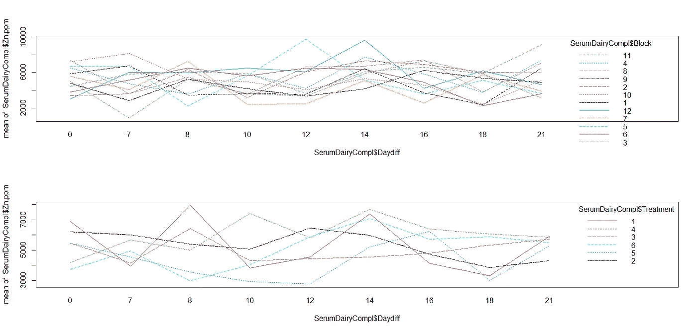

看起来有互动的空间，但这些效果确实是白天的效果。每个模特都在展示这一点。

```
rr<-ranef(model.5)
dotplot(ranef(model.5, condVar=T))
qqmath(ranef(model.5)); abline(0,1)
```

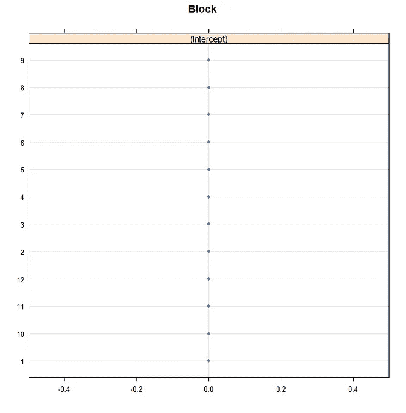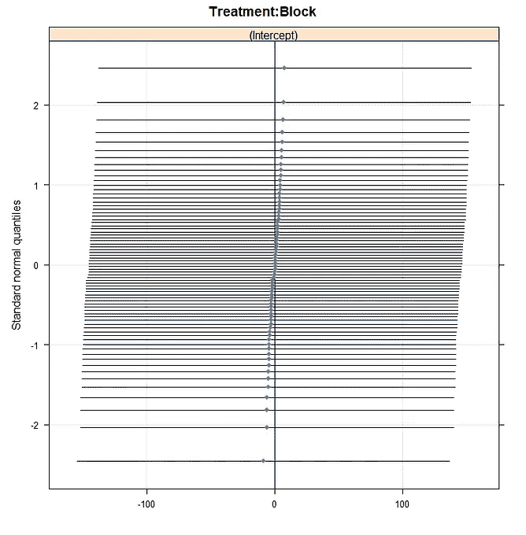

评估模型的随机效应。可以肯定地说，不包含任何随机效应是好的。你可能会期待不同的线，不相似的平均值，和疯狂的置信区间。

您还可以使用引导来比较模型。劳动密集型的电脑，所以要确保你并行运行。

```
# parametric bootstrapping of confidence values when comparing models
(nc <- detectCores())
cl <- makeCluster(rep("localhost", nc))
PBmodcomp(model.5,model.14, nsim=2000, cl=cl)
```

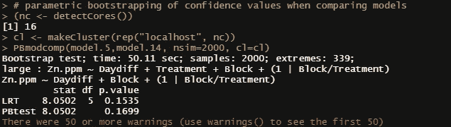

14 型并不比 5 型好。

让我们再次使用 MerTools 包，进一步研究这些模型。通过 MerTools，您可以使用 te 函数 *arm::sim* 模拟来自后部的固定效果值。FEsim 是一个方便的包装器，提供了一个信息丰富的数据框架。

```
fastdisp(model.4) 
feEx <- FEsim(model.4, 5000) # simulate values of the fixed effects from the posterior using te function arm::sim. FEsim is a convenience wrapper to do this and provides an informative dataframe
cbind(feEx[,1] , round(feEx[, 2:4], 3))
library(ggplot2)
plotFEsim(feEx) + 
        theme_bw() + 
        labs(title = "Coefficient Plot of InstEval Model", x = "Median Effect Estimate", y = "Evaluation Rating") # The lighter bars represent grouping levels that are not distinguishable from 0 in the data.
reEx <- REsim(model.5, 5000); reEx
table(reEx$groupFctr)
table(reEx$term)
lattice::dotplot(ranef(model.5, condVar=TRUE))
p1 <- plotREsim(reEx); p1
```

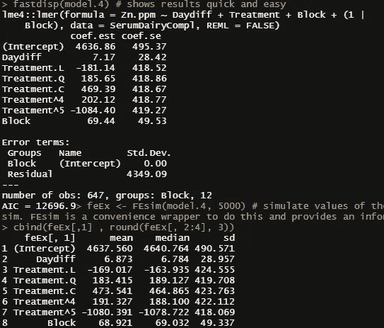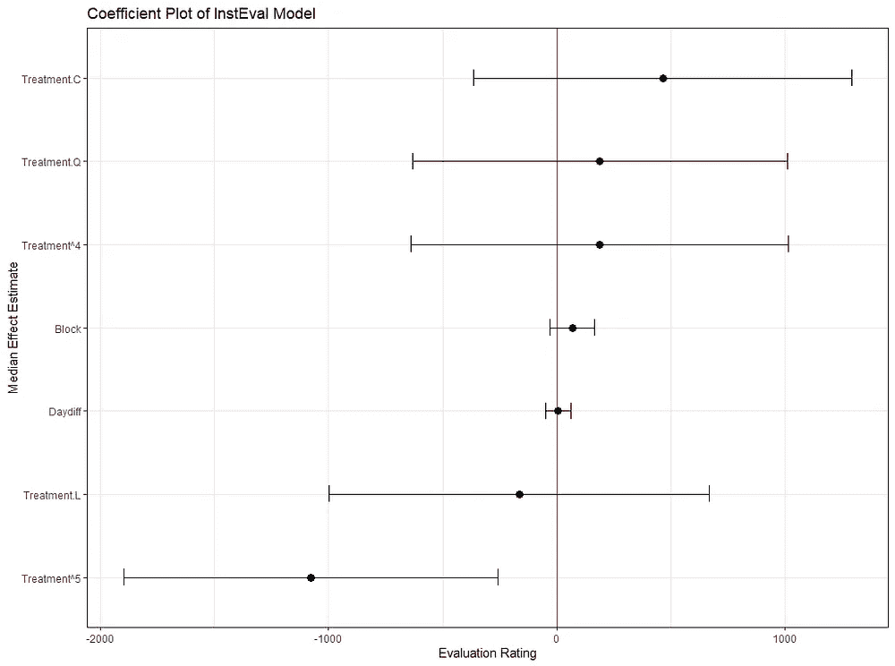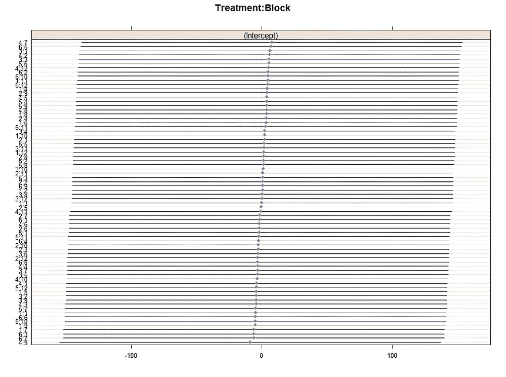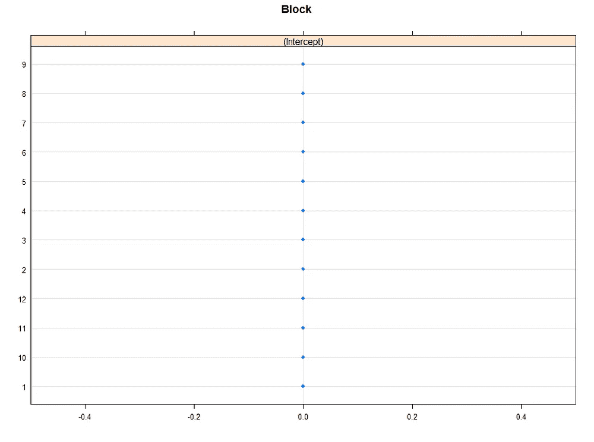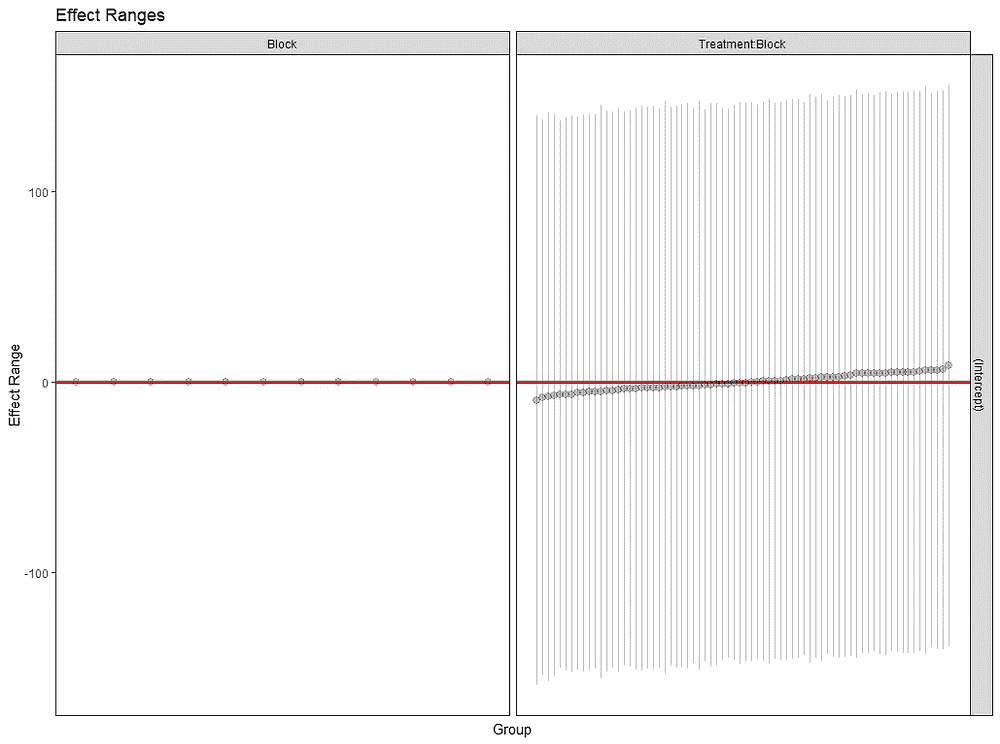

只显示单一治疗效果，绝对不需要随机效果。我们已经知道了。

```
plot(model.4)
plot_model(model.4, type="diag") 
```

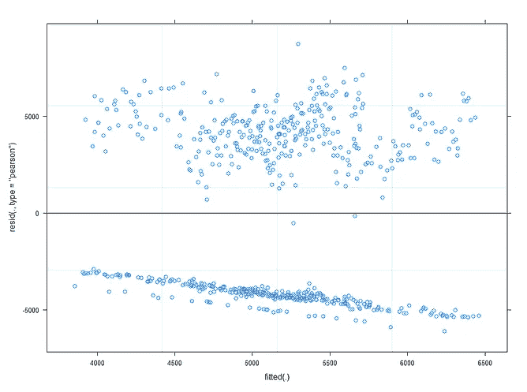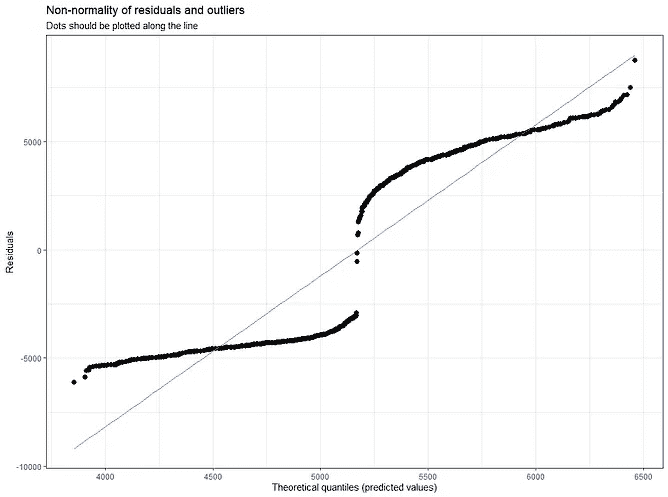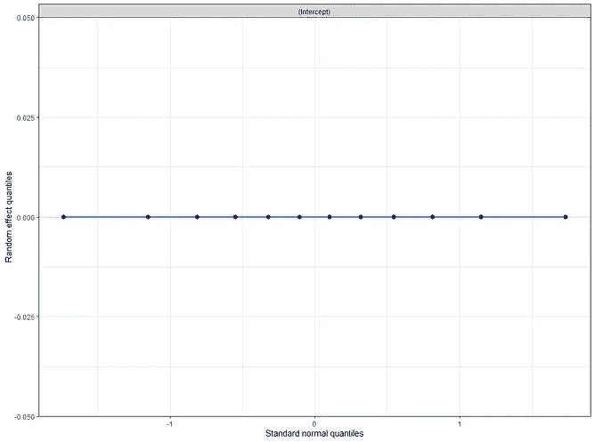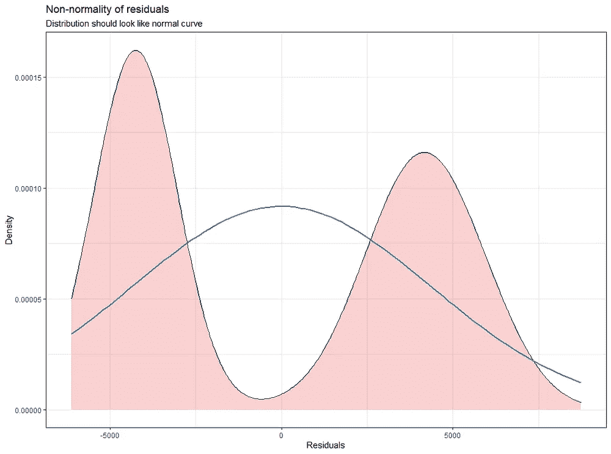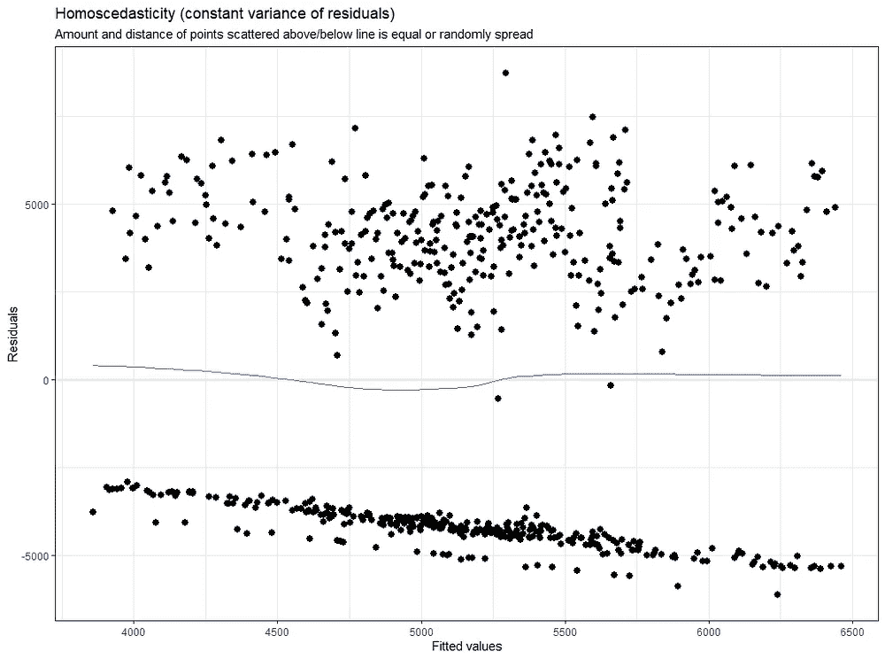

而 model.4 也好不到哪里去。

最后但并非最不重要的，预测与观察，看看模型适合。

```
SerumDairyFitted<-broom.mixed::augment(model.4)
ggplot(SerumDairyFitted, aes(x=Zn.ppm, y=.fitted, colour=.resid, size=Block))+
  geom_point()+
  geom_abline(slope=1, lty=2)+
  scale_color_viridis_c(option="C")+
  facet_wrap(~Treatment, scales="free")+
  labs(title="Fitted vs Observed from Mixed Model 4",
       x="Observed Zn (ppm)",
       y="Predicted Zn (ppm)")+
  theme_bw()
```

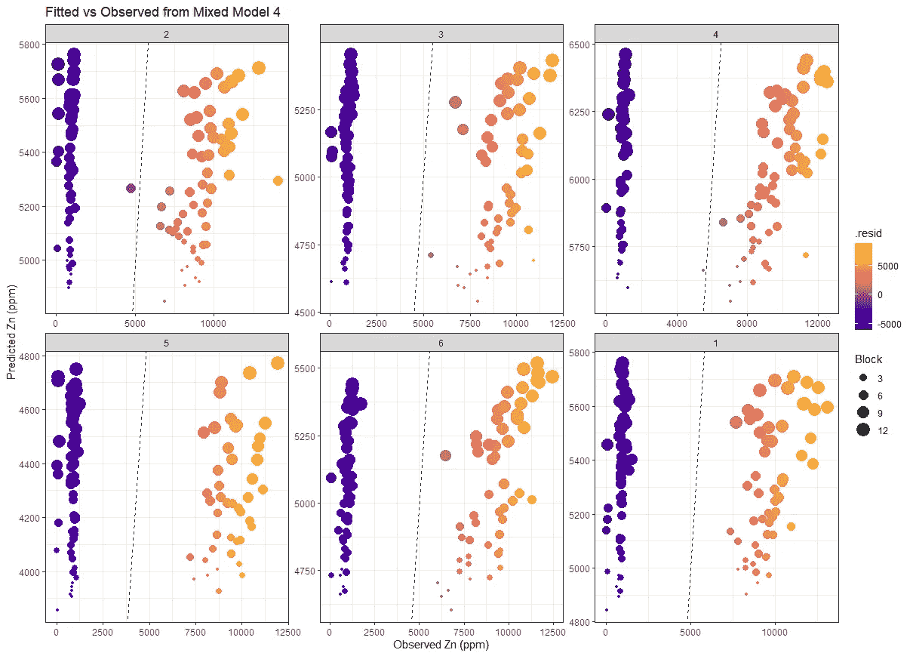

太可怕了

有时，最好保留数据，不要建模。我们已经从图表中看到了这一点，但当时我不能就此罢休。反正是商业数据。

不要犯我的错误！