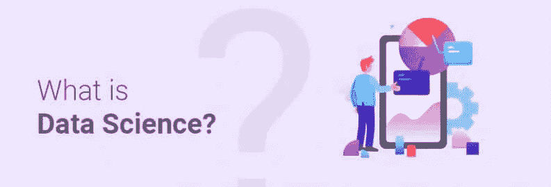
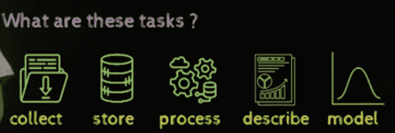
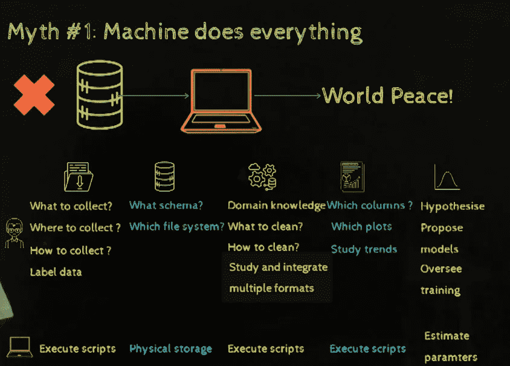
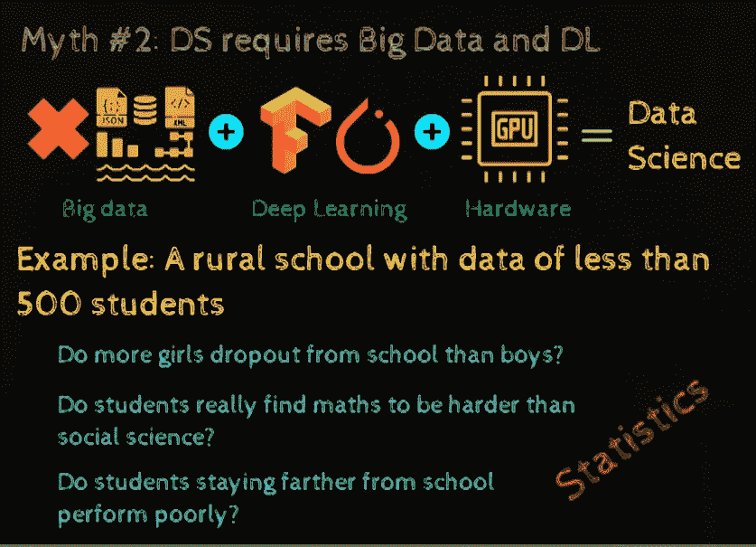
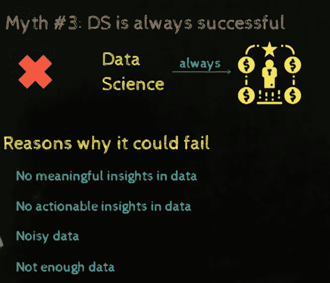
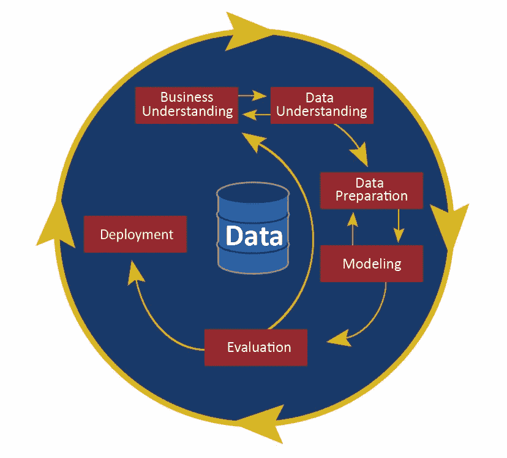

# 为新手提供数据科学服务

> 原文：<https://pub.towardsai.net/serving-data-science-to-a-rookie-b03af9ea99a2?source=collection_archive---------0----------------------->

所以，上周我的团队负责人让我面试一些可能加入数据科学和机器学习团队的实习生，他给了我他们的简历。他让我从 8 个合格的候选人中最多选择 2 个。这很平常，对吧？

现在问题来了，我召集所有人，只问了一个基本问题"**什么是数据科学？**”，一个回答说它是提取数据然后建模的科学，另一个回答说它相当于机器学习，下一个告诉我它是人工智能的一部分来预测/分类。

这些定义总体上可能是正确的，但它到底是什么？没有人能够提供一个像样的借口和合法使用。我很震惊，因为他们的知识与他们花哨的简历完全相反。

现在进入正题，什么是数据科学？

**数据科学**是*收集、存储、处理、描述和建模数据*的科学。

5 种配料有助于做出美味的数据科学菜肴:

1.  收集
2.  保管
3.  处理
4.  描述
5.  建模

这里需要注意的关键点是机器学习，数据科学并不相同，你可以从我之前的文章中了解它们之间的区别，即[机器学习到底是什么？](https://medium.com/machine-deep-learning/what-exactly-machine-learning-is-1746c9d151ed)

**收集:**这是数据科学的第一步，是对不同来源的相关或不相关数据的收集。数据可以是结构化的(这将需要使用 SQL)或非结构化的(这将需要爬行/抓取的技能)。

所需技能:

1.  编程知识
2.  数据库知识
3.  统计知识

**存储**:这包括存储收集到的数据，以便它随时可用于进一步的计算和预测。数据可以存储在数据湖或数据仓库中(例如 Hadoop)。

大数据有 3 个特征:高容量、高多样性、高速度(3V)。

所需技能:

1.  编程知识
2.  数据库知识(SQL，NoSQL)
3.  数据仓库/数据湖知识

**处理**:此时我们开始准备主要原因的数据，即预测/分类。它包括数据争论、填补缺失数据和数据规范化。在新手风格中，删除/替换每个不必要的/NaN 值，只存储相关的数据。

所需技能:

1.  编程知识
2.  Map Reduce (Hadoop)
3.  数据库知识(SQL，NoSQL)
4.  基本统计知识

**描述**:这包括可视化处理后的数据，以便更好地理解和总结。这个阶段是决定性的，因为它帮助你相应地对算法建模。

所需技能:

1.  统计知识
2.  电子表格知识(MS Excel)
3.  可视化工具(Python、Tableau、Power-BI)

**建模**:这是从处理过的数据中进行推论。它包括确定数据之间的关系，检验假设，并提供统计保证。

还有两种类型的建模；

1.  统计建模—包括简单、直观的模型，适用于低维数据。
2.  算法建模——这也称为机器学习，它包含一个复杂、灵活的模型，可以处理高维数据。

所需技能:

1.  编程知识
2.  统计知识
3.  领域知识

但是，机器学习有一个限制:你不能用它解决所有问题。假设你有大量的高维数据，你想学习一些值和标签之间的复杂关系。在那里，我们将使用深度学习。

深度学习所需的技能:

1.  推论统计
2.  概率论
3.  结石
4.  优化算法
5.  机器学习
6.  编程技能

那么，数据科学需要哪些集体技能呢？

1.  领域知识(中级到专家)
2.  编程技能(中级到专家)
3.  数学/统计知识(中级到专家)
4.  黑客技能(新手到中级)

# 关于数据科学的神话

1.  机器可以做任何事情。

2.数据科学需要深度学习和大数据。

3.数据科学总是成功的。

**现在我们知道了很多关于数据科学的知识，但是它的实现和它需要的工具呢？**

# Crisp DM(数据科学管道)

它是一个开放的标准过程模型，描述了用于解决业务分析问题的传统方法。

1.  商业理解
2.  数据理解
3.  数据准备
4.  建模
5.  估价
6.  部署

# 数据科学家的工具

1.  无代码环境(新手用户)— H20.ai，亚马逊 Lex
2.  电子表格/商务智能工具(新手)——MS Excel、Tableau、Power BI
3.  编程语言(中级用户)— Python、R、MATLAB
4.  高性能堆栈(高技能用户)— Hadoop、Apache Spark

# 结论

希望这篇文章能帮助你理解*什么是数据科学？*，以及成为卓越的数据科学家可能需要的所有技能。很不寻常的是，我们发现只需点击几下鼠标，掌握一点统计和编程知识，就可以管理许多数据。但是，我们所关心的只是一个善于预测/分类的模型:)

一个独特的表示感谢:

1.  来自[one fourth labs](https://padhai.onefourthlabs.in/)~[https://www.linkedin.com/company/one-fourth-labs/](https://www.linkedin.com/company/one-fourth-labs/)的 Mitesh Khapra 博士和 Pratyush Kumar 博士
2.  高拉夫·查特吉([机器学习人](https://www.machinelearningman.com/))~【https://www.linkedin.com/in/gaurav-chatterjee-857813137/】T2
3.  梅根·迪布尔~【https://www.linkedin.com/in/megandibble1/ 

请随意连接:

> 领英~[https://www.linkedin.com/in/dakshtrehan/](https://www.linkedin.com/in/dakshtrehan/)
> 
> insta gram ~[https://www.instagram.com/_daksh_trehan_/](https://www.instagram.com/_daksh_trehan_/)
> 
> github ~[https://github.com/dakshtrehan](https://github.com/dakshtrehan)

关注更多机器学习/深度学习博客。

> 干杯。