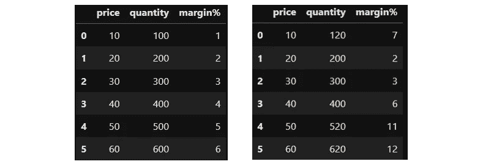
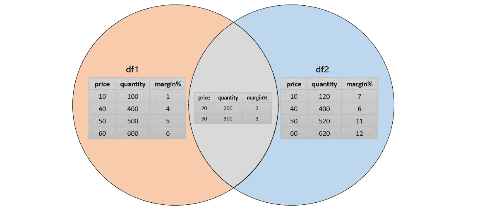
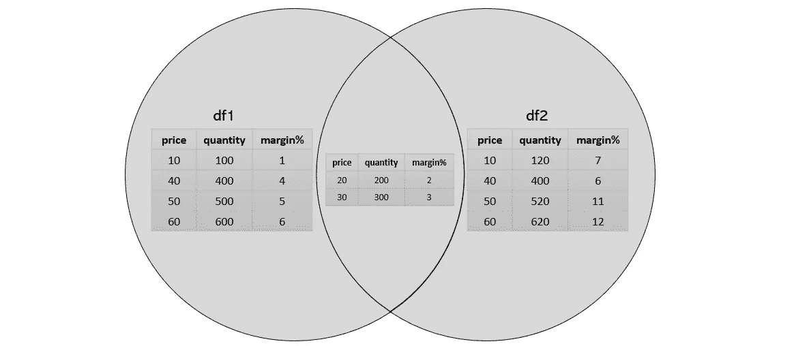
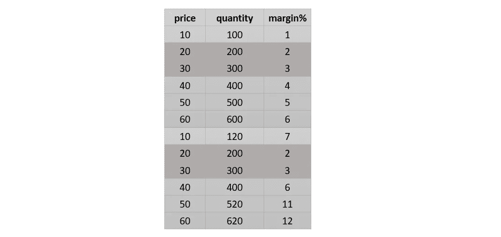
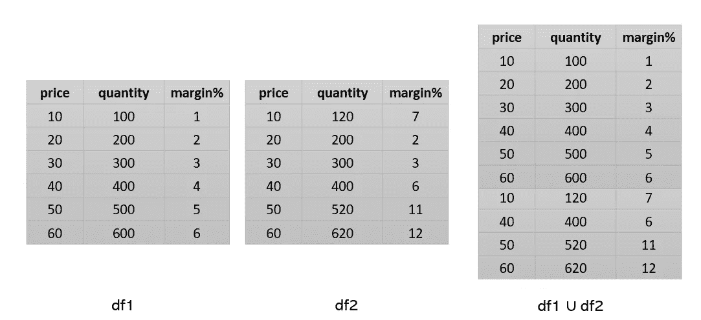
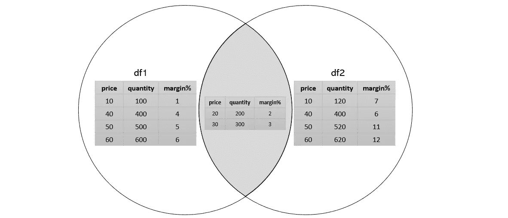
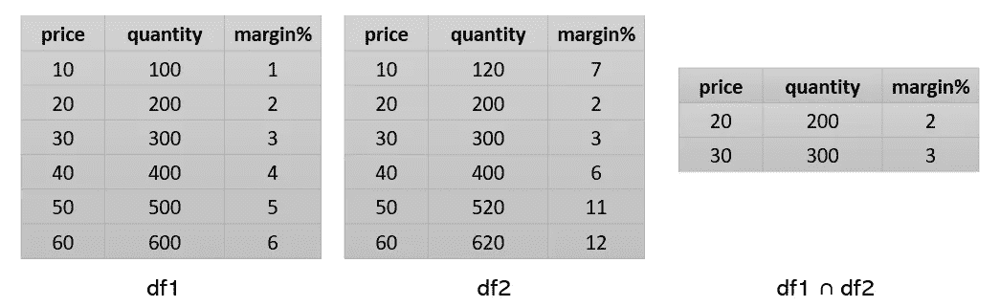
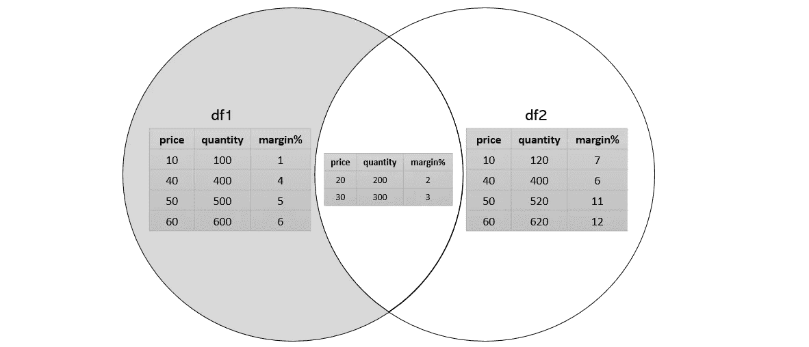
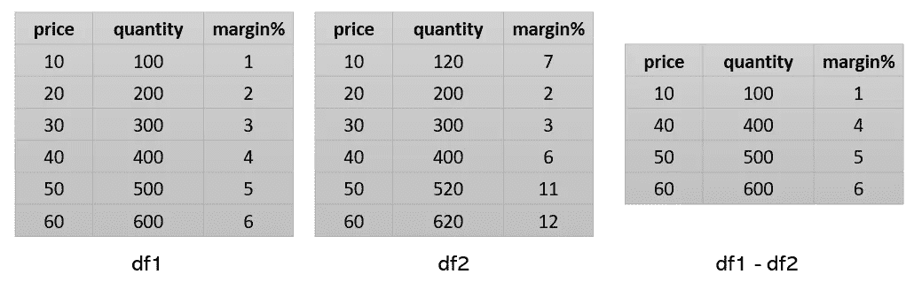

# Python 数据帧上的集合操作

> 原文：<https://pub.towardsai.net/set-operations-on-python-dataframes-49116cfb283d?source=collection_archive---------3----------------------->

我们经常执行 join、union、difference、intersection 等。python 数据帧之间的操作。在我的数据科学之旅中，理解集合论的概念帮助我高效地执行这些任务。在这篇文章中，我想用集合论来实现数据帧操作。


泰勒·拉斯托维奇在 [Unsplash](https://unsplash.com?utm_source=medium&utm_medium=referral) 上的照片

> ***讨论的话题！***
> 
> 1.“集合论”和“维恩图”的基础知识
> 2。在数据帧
> 3 上设置操作。结论

## 1.“集合论”和“维恩图”的基础知识

我们在数学和概率论中广泛使用集合和集合论。一个简单的定义是，*集合是元素的集合，其中元素的顺序无关紧要*。集合的概念也在 python 中使用，通常称为数据类型集合。

在 python 中，集合与列表非常相似，除了它们的元素是*不可变的*(这意味着一旦声明，就不能更改/改变集合的元素)。但是，您可以在集合中添加/移除元素。一个集合可以包含不同数据类型的元素。一套可以；

```
mySet = set(("Theory", "Mathematics", 214, 3.14, (1,0,0,1)))
```

我们用维恩图来形象化这些集合。在集合运算部分，我们将看到如何使用它们。

## 2.数据帧上的集合操作

让我们考虑两个简单的数据框架来演示集合运算的逻辑

```
df1 = pd.DataFrame({'price': [10,20,30,40,50,60],'quantity': [100,200,300,400,500,600], 'margin%': [1,2,3,4,5,6]})df2 = pd.DataFrame({'price': [10,20,30,40,50,60],'quantity': [120,200,300,400,520,620], 'margin%': [7,2,3,6,11,12]})
```

打印 df1 和 df2 看起来像；



图 1:打印(df1)和打印(df2)结果。截图(来源:作者)

我们有两个简单的数据框架，分别来自两个不同的卖家，其中有商品的价格、以该价格出售的商品数量以及利润率。

**df1 和 df2 的维恩图表示:**

*   橙色阴影:卖方 1 以不同于卖方 2
    的价格、数量和利润出售的商品。例如，卖方 1 以 10，100 美元的价格出售商品 0，利润为 1%,而卖方 2 以 10，120 美元的价格出售商品 0，利润为 7%。
*   蓝色阴影:卖家 2 以不同于卖家 1 的价格、数量和利润出售的商品。
*   灰色份额:由卖方 2 和卖方 1 以相同的价格、数量和利润销售的商品
    例如，商品 3 由卖方 1 和卖方 2 以相同的价格 30，300 美元的数量销售，利润为 3%。



图 2:对 dfs 的维恩摘要。截图(来源:作者)

**a .工会**

两个集合的**并**是由集合 A 或 b 中的所有元素组成的新集合，例如，

集合 A = {1，2，3，4}和集合 B = {3，4，5，6}
集合 A 的并集 B = {1，2，3，4，5，6}通常称为 A∪B

在我们的例子中，



图三。两个 dfs 的并集(灰色区域)。截图(来源:作者)

一个简单的联合方法是:

```
# Union : Concat or append **with** duplicatespd.concat([df1, df2]) #ORdf1.append(df2)
```

输出:



图 4。Union:用重复项连接或追加。截图(来源:作者)

更好的方法是:

```
# Union : Concat or append or merge **without** duplicatespd.concat([df1,df2]).drop_duplicates().reset_index(drop=True) #ORdf1.append(df2).drop_duplicates().reset_index(drop=True) #ORdf1.merge(df2, how='outer') #left.merge(right, on='key', how='outer')
```



图五。Union: Concat 或 append 或 merge 没有重复。这是 df1 联合 df2 的预期结果。(来源:作者)

**b .交叉点**

两个集合的**交集**是由集合 A 和集合 b 中的所有元素组成的新集合，例如，

集合 A = {1，2，3，4}和集合 B = {3，4，5，6}
集合 A 的并集 B = {3，4}通常称为 A∩B

在我们的例子中，



图六。两个 dfs 的交集(灰色区域)。截图(来源:作者)

一种简单的交叉方法是:

```
pd.merge(df1, df2, how='inner')  #OR
df1.merge(df2) #left.merge(right, on='key')
```

输出:



图六。两个 dfs 的交集。截图(来源:作者)

> 交集是两个数据帧的内部连接操作，并集是两个数据帧的外部连接操作。其他连接操作包括:

```
#Inner Join / Intersection
left.merge(right, on='key')#Outer Join / Union
left.merge(right, on='key', how='outer')#Left outer join / Left join - keys from left are used
left.merge(right, on='key', how='left')#Right outer join / Right join - keys from right are used
left.merge(right, on='key', how='right')#In case of different key column names
left2.merge(right2, left_on='keyLeft', right_on='keyRight', how='inner')#To see all possible options ("left_only", "right_only" or "both")
left.merge(right,  how='outer', suffixes=['', '_'], indicator=True)
```

[*用于更高级的加入操作*](https://stackoverflow.com/questions/53645882/pandas-merging-101)

**c .差异**

集合 A B 由 A 中的元素组成，但不在 B 中。例如，

集合 A = {1，2，3，4}和集合 B = {3，4，5，6}
集合 A 差 B = {1，2}通常称为 A-B

在我们的例子中，



图六。两个 dfs 的差异，即 df1-df2(灰色区域)。截图(来源:作者)

区别的一个简单方法是:

```
# Using isin with tuple
df1[~df1.apply(tuple,1).isin(df2.apply(tuple,1)) #OR
df1[~df1.astype(str).apply(tuple, 1).isin(df2.astype(str).apply(tuple, 1))] #If df contains, nan# merge with indicator
df1.merge(df2,indicator = True, how='left').loc[lambda x : x['_merge']!='both']
```

输出:



图 7。两个 dfs 的区别(df1-df2)。截图(来源:作者)

[*Python 设置方法*](https://www.w3schools.com/python/python_ref_set.asp)

## 结论

在本文中，您熟悉了集合的概念及其通过维恩图的表示。我们还了解了并集、交集、连接和差集等基本运算，以及我们如何将这些逻辑和概念应用于 python 数据帧来解决我们的数据科学问题。

感谢您的阅读！

## 参考

*   [https://www . probabilitycourse . com/chapter 1/1 _ 2 _ 2 _ set _ operations . PHP](https://www.probabilitycourse.com/chapter1/1_2_2_set_operations.php)
*   [https://realpython.com/python-sets/](https://realpython.com/python-sets/)
*   [https://www.w3schools.com/python/python_ref_set.asp](https://www.w3schools.com/python/python_ref_set.asp)
*   [https://stack overflow . com/questions/53645882/pandas-merging-101](https://stackoverflow.com/questions/53645882/pandas-merging-101)