# Tableau 中的设置和参数:Tableau 桌面专家认证之路

> 原文：<https://pub.towardsai.net/sets-parameters-in-tableau-a-road-to-tableau-desktop-specialist-certification-fa08c9ba3931?source=collection_archive---------5----------------------->

## 第 9 章:Tableau 中集合和参数的综合指南，带有示例认证问题和免费 Udemy 转储。

欢迎来到第九章，在这一章中，我们将学习 [Tableau](https://medium.com/u/fcbe60d0bf8b?source=post_page-----fa08c9ba3931--------------------------------) 中的集合和参数。

如果你想浏览其他章节，请访问: [**画面:这是什么？为什么它是最好的？；Tableau 桌面专家认证之路。**](https://dakshtrehan.medium.com/tableau-what-it-is-1e2cdff35440)

> 如果您想直接访问 Tableau 桌面专家笔记，请在此处访问它们→[https://dakshtrehan . comment . site/Tableau-Notes-c 13 fceda 97 b 94 BDA 940 edbf 6751 cf 30](https://dakshtrehan.notion.site/Tableau-Notes-c13fceda97b94bda940edbf6751cf303)
> 
> 使用链接访问免费 Tableau 认证转储(有效期至 2022 年 7 月 6 日):
> 
> [https://www . udemy . com/course/tableau-desktop-specialist-certification-dumps-2022/？coupon code = e3f 08189 fa 4 bafae 72 BC](https://www.udemy.com/course/tableau-desktop-specialist-certification-dumps-2022/?couponCode=E3F08189FA4BAFAE72BC)

# 目录

*   **集合**
    –动态集合
    –静态集合
    –从集合中添加/删除数据点
    –组合集合
    –在 viz 中使用集合
    –组 vs 集合
    –过滤器 vs 集合
    –集合动作
*   **参数**
    –在过滤器中使用参数
    –在计算中使用参数
    –在 Viz 中显示参数控制
    –参数 vs 过滤器
*   **本主题的认证问题示例**

# 设置

集合可以用来比较数据的子集。简而言之，这有助于突出显示指定特定标准的数据子集。集合也被称为**预计算过滤器**，因为它们是数据的子集。

**只能在尺寸上创建集合。**

**集合本身就是一个维度。**

一个集合由一个' ***文氏图*** '类型的图标定义:

[来源](https://evolytics.com/wp-content/uploads/2016/07/An-Introduction-to-Tableau-Sets-Feature-300x300.jpg)

可以通过两种方式创建集合:

## 动态集合

顾名思义，动态集合是动态的**,即当底层数据被修改时发生变化。**这些只能基于**一个奇异的维度。**

要创建动态集，请执行以下操作:

步骤 1 →右键单击一个尺寸，并选择“设置”

步骤 2 →动态集合会给你三个选项，从 ***常规、条件、顶部中选择。***

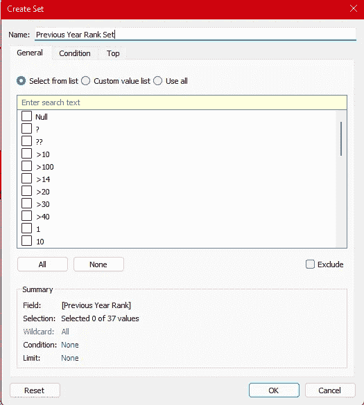

**常规—** 手动选择需要的数据点。

**条件—** 您可以根据手工公式上的字段添加/创建条件。

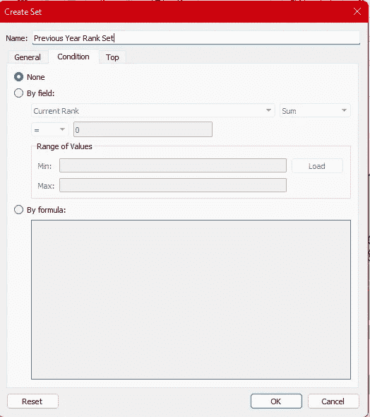

**Top —** 使用此选项，我们可以根据不同的字段/公式定义我们可以获取的值的范围。

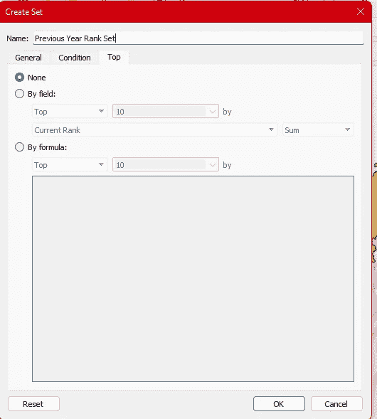

新集合将作为一个维度添加到我们的数据窗格中。

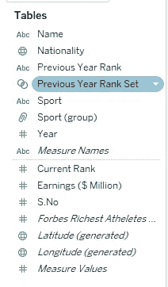

## 静态集合

顾名思义，静态集合是静态的**，也就是说，即使底层数据发生变化，它们也不会发生变化。**这些可以在**单个或多个维度上创建。**

要创建固定集，请执行以下操作:

步骤 1 →在 viz 中选择一个或多个标记，然后选择“创建集合”选项。

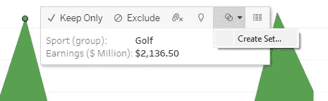

步骤 2 →给集合命名。

**如果我们想排除所有选定的数据点，我们也可以使用“排除”选项。**

一个集合将被添加到维度窗格下的数据窗格中。

## 从集合中添加/移除数据点

我们可以通过两种方式在集合中添加/删除数据点:

1.  从数据窗格。

只需右键单击该集合，然后选择“编辑集合”。

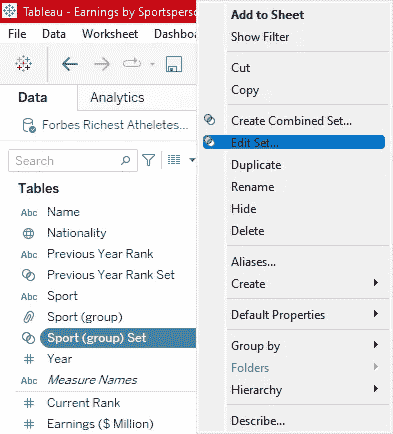

然后，我们可以在对话框中添加/删除数据点。

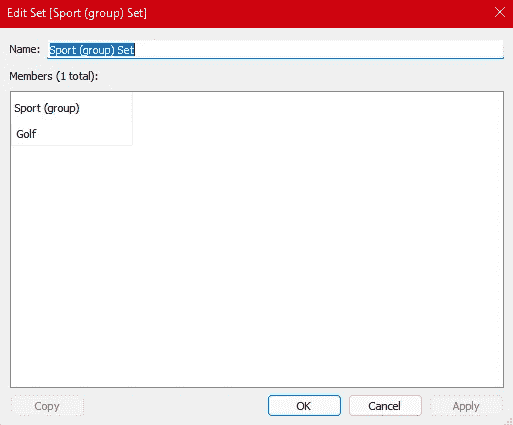

2.从视野来看。

只需从视图中选择所需的点。

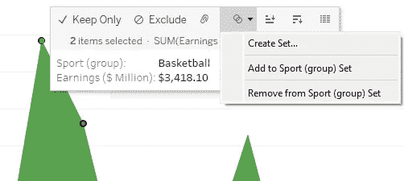

根据所需结果，单击“添加到器械包”或“从器械包中移除”。

## 组合集合

我们可以把两组画面结合起来。

**要合并两个集合，它们必须基于相同的维度。**

当我们组合不同的集合时，会创建一个新的集合，它包含所有成员的组合，或者同时存在于两个集合中的成员的组合，或者只存在于一个集合中的成员的组合。

要合并不同的器械包:

步骤 1 →右键单击任意集合并选择“创建组合集合”。

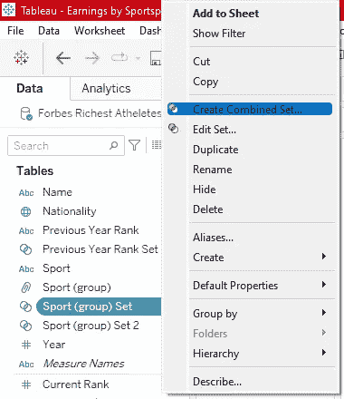

步骤 2 →选择要组合的器械包以及如何组合这两个器械包。

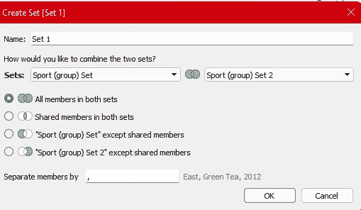

## 在 Viz 中使用集合

集合是独立的维度，可以像 Tableau 中的任何其他字段一样进行拖放。

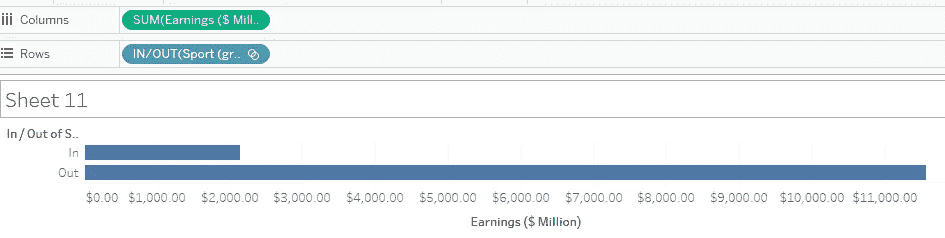

当我们拖动一个集合到一个行/列架子上时，**默认情况下 Tableau 会显示 *IN/OUT* 符号。**

IN 表示集合中存在的成员。OUT 是指从集合中排除的成员。

**我们可以通过使用别名或计算字段(if-else 块)来重命名 IN/OUT**

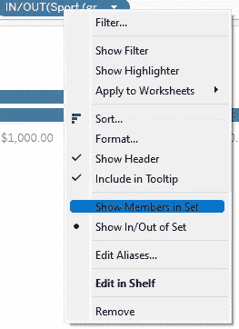

我们可以选择 ***“显示集合中的成员”*** 或者 ***“显示集合中/集合外”*** 。

如果我们选择 ***“显示集合中的成员”*** ，我们将只得到集合中成员的输出。

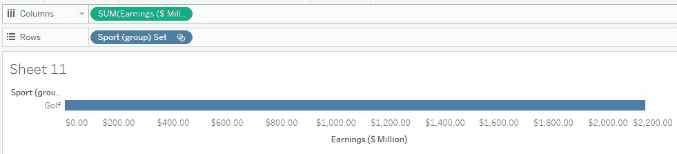

## 组与集合

所以基本上，无论我们做什么，我们都可以通过群体来实现。但是，我们为什么要使用集合呢？

来源:Tableau 文件

分组只能在静态数据上进行，不能根据底层数据的变化而自动改变。但是集合既可以用作静态的也可以用作动态的。

我们可以创建无限的组，但对于集合，只能有进/出。成员可能在集合中，也可能不在集合中。

集合可以在计算字段中使用，但我们不能在那里使用组。

## 过滤器与集合

**集合用于比较，而过滤器用于过滤数据。**

集合也可以用作过滤器，只需将它们拖到过滤器架上。

**筛选器和集合在某种程度上是相同的，但是集合更像是永久筛选器，因为它们可以在整个工作簿中重复使用，而筛选器只能用于单个工作表(默认情况下)。**

**集合成为元数据，因此如果工作表正在使用，则可以使用集合。tds 文件。**

**过滤器改变视图，但集合给视图增加了一个维度。**

## 设置操作

我们知道，当我们使用动态集时，当底层数据改变时，视图也会改变。但是如果用户想要更改数据，我们可以使用 Set actions 来生成用户要求的结果。

集合操作更新集合中的值。

要创建一个集合动作，选择**工作表>动作。**

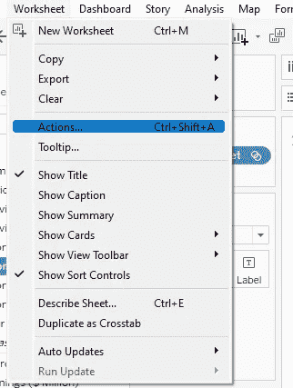

我们可以为**“工作簿”**或**“工作表”**选择动作。

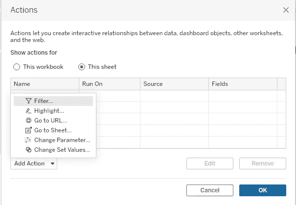

选择**“更改设置值”**根据用户偏好更新设置。

为您的操作取一个有意义的名称，并选择源工作表和目标集合。

有三种方式可以引发这种行为:

1.  **悬停→** 一旦用户悬停在视图中的任何标记上，这将改变设置。
2.  **选择→** 这将在用户点击视图中的任何标记时触发动作。
3.  **菜单→** 当用户右击标记并在上下文菜单中选择一个选项时，将触发动作。

选择如何运行操作以及清除视图后会发生什么。

# 因素

参数是控制变量值的交互式工具。例如，对于 viz，我们可能需要视图的前 10 个数据点，但以后可能需要前 20 个数据点，用户不会手动更改它，因此我们可以简单地输入一个参数，用户可以调整它们以获得所需的值。

## 创建参数

步骤 1 →在数据窗格的下拉箭头中，选择“创建参数”。

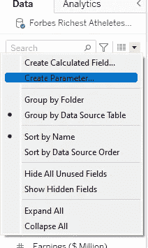

步骤 2 →为我们的参数选择名称、数据类型和缺省值。

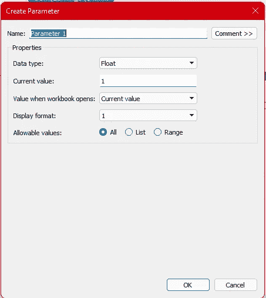

**All —** 参数控件只允许一个文本字段。

**列表—** 控件会让你从列表中选择一个选项。

**范围—** 控件会让你在指定的范围内选择一个选项。

> *这些选项的可用性取决于数据类型的选择。*

步骤 3-在数据窗格中找到参数。

## 在过滤器中使用参数

参数可以帮助更改前 N 名过滤器的值。用户可以使用参数，而不是手动更改这些值。

要在过滤器中使用参数:

步骤 1 —打开过滤器对话框，在“顶部”选项中选择您的参数。

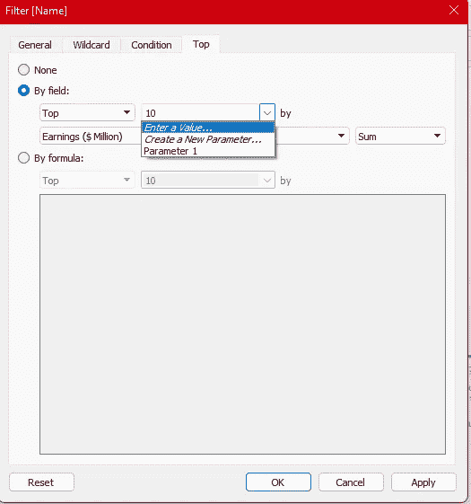

第二步—通过输入您想要的标题数量来更改视图。

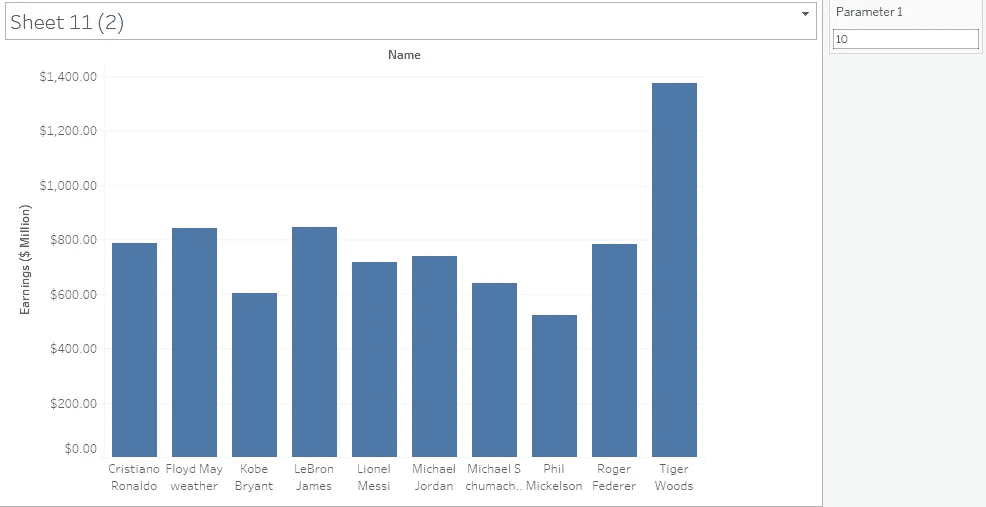

**注:**显示视图中的一个参数控件。右击参数，选择 ***“显示参数”。***

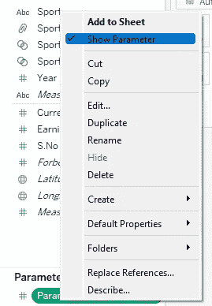

## 在计算中使用参数

可以在计算中使用参数来修改值，从而动态地更改计算。

要在计算中添加参数，只需在计算对话框中拖放参数。

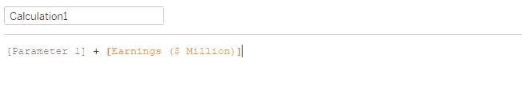

## 参数卡

我们可以格式化我们的参数卡，只需点击视图中参数卡的下拉菜单。

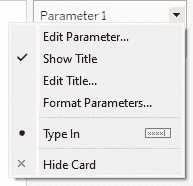

**编辑参数—** 允许您编辑您的参数。

**显示标题—** 显示参数的标题。

**编辑标题—** 允许您编辑参数的标题。

**格式参数—** 允许您更改参数的字体和颜色。

**输入—** 允许你改变输入参数的方式，可以是文本框、滑块、下拉框等。这取决于参数的数据类型。

**隐藏卡片—** 允许您隐藏参数卡片。

## 参数操作

我们可以添加一个参数动作，允许用户通过悬停、单击或选择菜单来直接更改视图。

步骤 1-要创建参数动作，请转到 ***工作表<动作。***

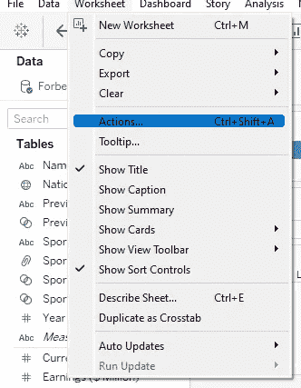

步骤 2 —选择“更改参数”。

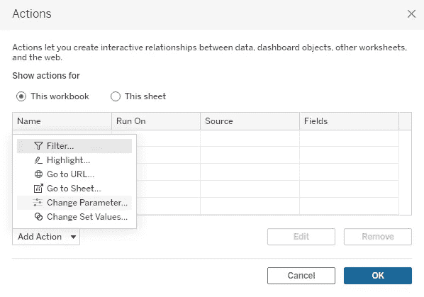

步骤 3-选择源表、目标参数以及如何触发参数。

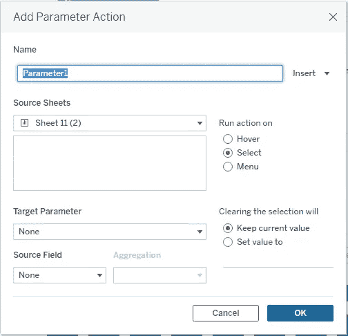

有三种方式可以引发这种行为:

1.  **悬停→** 一旦用户悬停在视图中的任何标记上，这将改变设置。
2.  **选择→** 这将在用户点击视图中的任何标记时触发动作。
3.  **菜单→** 当用户右击标记并在上下文菜单中选择一个选项时，将触发动作。

选择如何运行操作以及清除视图后会发生什么。

# 参数与过滤器

参数与过滤器不同，但它们可用于自定义过滤器。

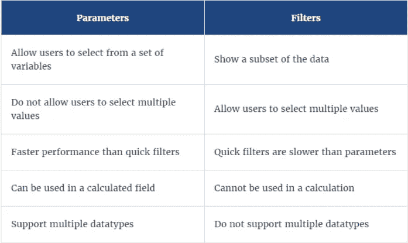

来源:Tableau 文件

# 本主题的试题示例

**套也可以当滤镜？**

a.真
b .假

**解:**真

**要创建可变大小的箱子，我们使用:**

a.设置
b .组
c .直方图
d .计算字段

**解:**计算字段

**以下哪一项支持多种数据类型？**

a.参数
b .过滤器
c .设置
d .组

**解决方案:**参数

**只能在尺寸上创建集合？** a .真
b .假

**解决方案:**正确

我们能把两套组合在一起吗？
a .真
b .假

**解:**真

> 使用链接访问免费 Tableau 认证转储(有效期至 2022 年 7 月 6 日):
> 
> [https://www . udemy . com/course/tableau-desktop-specialist-certification-dumps-2022/？coupon code = e3f 08189 fa 4 bafae 72 BC](https://www.udemy.com/course/tableau-desktop-specialist-certification-dumps-2022/?couponCode=E3F08189FA4BAFAE72BC)

# 参考资料:

[1] [Tableau 帮助| Tableau 软件](https://www.tableau.com/support/help)

[2] [个人笔记](https://dakshtrehan.notion.site/Tableau-Notes-c13fceda97b94bda940edbf6751cf303)

[3] [Tableau 桌面专家考试(新模式— 2021) — Apisero](https://apisero.com/tableau-desktop-specialist-exam-new-pattern-2021/)

# 感谢阅读！

请随意鼓掌，这样我就知道这篇文章对你有多有帮助，并在你的社交网络上分享它，这对我很有帮助。

如果你喜欢这篇文章，想了解更多**机器学习，数据科学，Python，BI。**请考虑订阅我的简讯:

> [达克什·特雷汉的简讯](https://mailchi.mp/b535943b5fff/daksh-trehan-weekly-newsletter)。

在网上找到我:[www.dakshtrehan.com](http://www.dakshtrehan.com/)

在 LinkedIn 与我联系:[www.linkedin.com/in/dakshtrehan](http://www.linkedin.com/in/dakshtrehan)

阅读我的科技博客:[www.dakshtrehan.medium.com](http://www.dakshtrehan.medium.com/)

在 Instagram 和我联系:[www.instagram.com/_daksh_trehan_](http://www.instagram.com/_daksh_trehan_)

# 想了解更多？

[YouTube 是如何利用 AI 推荐视频的？](/how-is-youtube-using-ai-to-recommend-videos-38a142c2d06d)
[利用深度学习检测新冠肺炎](https://towardsdatascience.com/detecting-covid-19-using-deep-learning-262956b6f981)
[逃不掉的 AI 算法:抖音](https://towardsdatascience.com/the-inescapable-ai-algorithm-tiktok-ad4c6fd981b8)
[GPT-3 向一个 5 岁的孩子解释。](/gpt-3-explained-to-a-5-year-old-1f3cb9fa030b)
[Tinder+AI:一场完美的牵线搭桥？](https://medium.com/towards-artificial-intelligence/tinder-ai-a-perfect-matchmaking-b0a7b916e271)
[一个内部人士的使用机器学习卡通化指南](https://medium.com/towards-artificial-intelligence/an-insiders-guide-to-cartoonization-using-machine-learning-ce3648adfe8)
[谷歌是如何做出“哼哼来搜索？”](/how-google-made-hum-to-search-865f224b70d0)
[一行神奇的代码执行 EDA！](/one-line-magical-code-to-perform-eda-f83a731fbc35)
[给我 5 分钟，我给你深度假！](/give-me-5-minutes-ill-give-you-a-deepfake-ce83a645b0f9)

> *欢呼*