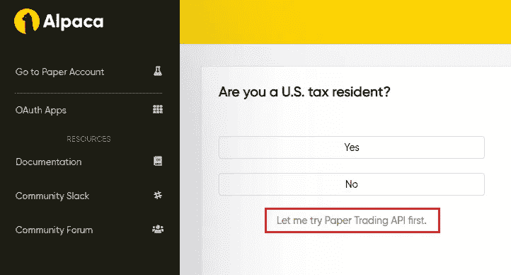
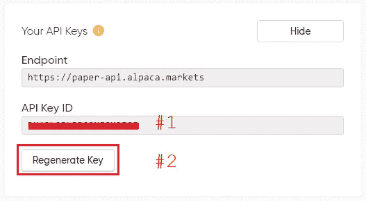
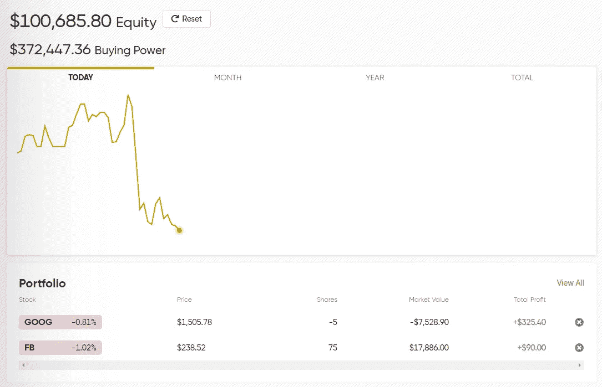

# 为算法交易设置羊驼 API

> 原文：<https://pub.towardsai.net/setting-up-alpaca-api-for-algorithmic-trading-490db5be4e4?source=collection_archive---------1----------------------->

## API，[教育](https://towardsai.net/p/category/education)，[编程](https://towardsai.net/p/category/programming)

## 使用 API 向经纪公司下订单。完整的参考代码[可以在这个 Github 库](https://github.com/alpacahq)获得。这个代码[在我的回购](https://github.com/arditoibryan/Projects/tree/master/20200722_Alpaca_API)。

在网上，你可以找到几家允许你交易的经纪公司。羊驼提供了一个非常先进的界面，让您通过浏览器与其主终端进行通信，甚至使用代码进行信息交流。

在这篇文章中，我不会解释贸易的基础知识，也许只是一些特定的术语，以免让人混淆。这是一篇关于如何通过使用 API 来协调自动事务的技术文章。


来源:[https://alpaca.markets/](https://alpaca.markets/)

> ***如果你是编码/金融初学者，要知道每个经纪公司都提供一个简单的界面，你可以在那里放置你的头寸。我所做的是绕过接口，通过使用代码来放置事务。***

## 如果我可以手动做同样的事情，为什么还要使用代码呢？

如果只是需要交易，完全没有必要使用代码。事实上，事情可能会更复杂。但是，如果你需要根据几秒钟一变的指标，每天做几百个微交易，那么你就不是在正常交易，你是在做**量化交易**。

## 注册账户

在这个帐户中，我将建立一个模拟。真正的账户还没有设立。事实上，在使用算法用真钱交易之前，要确保你的代码运行良好。您可以通过简单地实现一个模拟来做到这一点。出了问题，**可以复位**。



您必须单击才能立即开始模拟的屏幕截图，无必填信息

一旦你注册了一个账户，你就可以点击“让我先试试纸交易 API”进入界面。你将进入羊驼主界面。在这里，您可以手动打开您的交易。我将通过使用代码来做到这一点。

## 导入库

```
!pip3 install alpaca-trade-api
```

## 设置连接

对于您将要连接的每个 API，您可能需要获得您的 API 密钥。当您进入控制面板时，您会立即在屏幕右侧看到这个框，其中包含建立连接所需的信息。



这是如何找到两把钥匙

```
import alpaca_trade_api as tradeapi#estabilish connection
api = tradeapi.REST(
'key #1', 
'key #2', 
'[https://paper-api.alpaca.markets'](https://paper-api.alpaca.markets'), 'v2')
```

通过使用上面的代码，您已经创建了 **api** 对象，它充当您和代理之间的连接。

## 获取请求:获取输入

```
#get open positions
pos = api.list_positions()
pos
```

通过这行代码，您将创建您的 **pos** 对象。这是您当前投资组合中所有未平仓头寸的列表。要访问它的任何变量，请记住这是一个类:

## 市场如何运作:下单与持仓

这个概念很简单:在你下单之前，它会变成一个头寸。这就像你在向券商申请进入市场的许可。如果你有足够的资金，并且所有的信息都是正确的，那么订单就被下了，并且现在在队列中。

在等待接受的队列中，订单和空缺职位之间有很大的区别。在未平仓的情况下，您的押注目前活跃在市场上，您可能会盈利或亏损。有些职位是可以立即开仓的，除非你要求具体的参数。例如，您可能希望只在一只股票达到特定的价格限制时才买入它。**只有当条件满足**时，该指令才成为持仓指令。

## 发布请求:下订单

我们可以使用以下代码在交易平台上轻松下单:

```
try:
    placing_order = api.submit_order(
      symbol='', #GOOG, AMZN, FB...
      qty=quantity,#10, 100, 1000...
      side='', #buy, sell
      type='', #market, limit
      time_in_force='day',
      limit_price=limit,
      stop_price=stop
    )
    #print(placing_order)
  except:
    print('Something went wrong')
    return 0
  print('Successful')
  return 1
```

有了这个代码，你就可以把你需要的所有规格的订单发送给经纪公司。它将打印出订单是否成功。



顺便说一下，这是一个模拟，股票是随机挑选的

## 用羊驼毛还能做什么？

到目前为止，我决定用最重要的工具与羊驼交易经纪公司沟通。在[链接库](https://github.com/alpacahq)中，您可以根据需要找到完整的列表。

与必须手动输入所有订单的经纪人相比，量化金融无疑让你处于优势，但如果你的代码不稳定，这也是一件危险的事情。