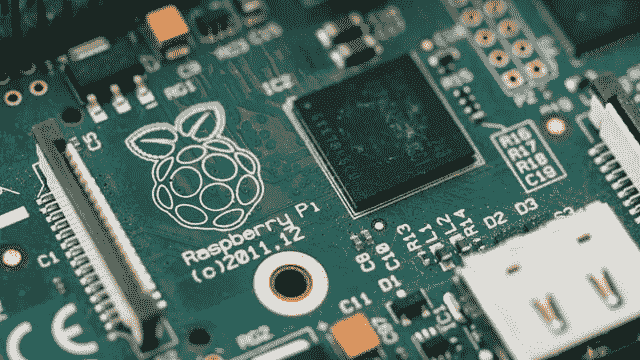
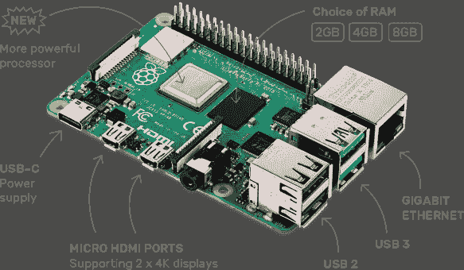
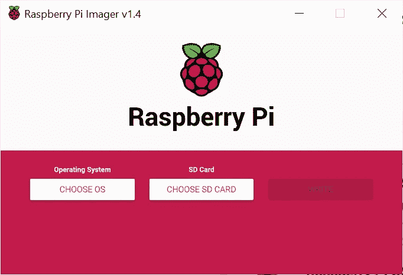
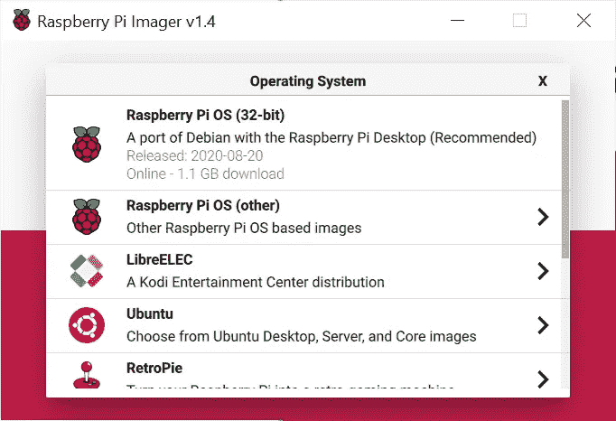
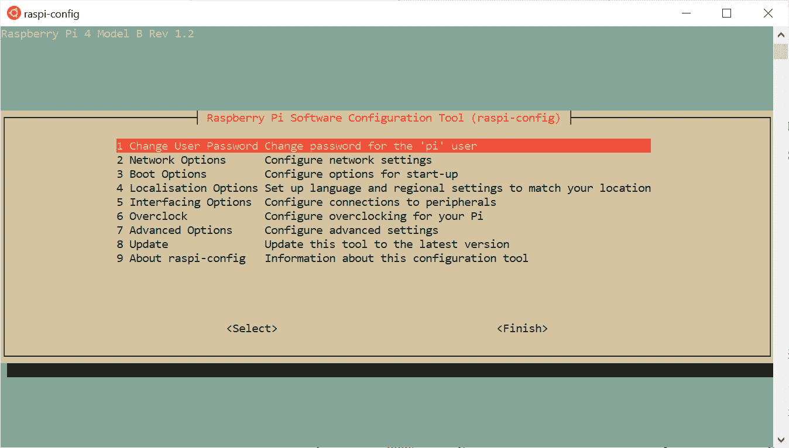
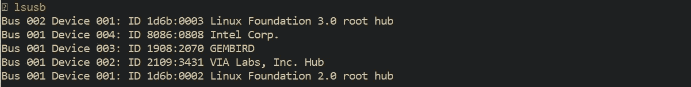
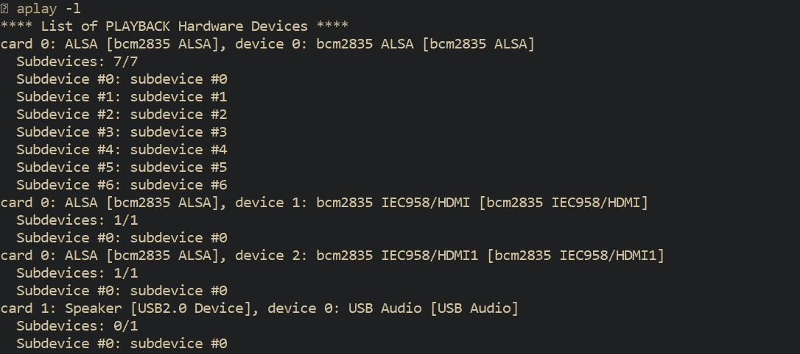
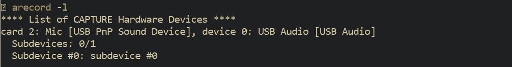

# 快速设置您的树莓 Pi

> 原文：<https://pub.towardsai.net/setup-your-raspberry-pi-quickly-a0198fc837d3?source=collection_archive---------2----------------------->

## [技术](https://towardsai.net/p/category/technology)



**Raspberry Pi** 是一款简单易用的单板计算机，专为教授计算机科学基础知识而开发。这是一个很好的工具，可以开始尝试小项目，如物联网、家庭自动化、网站、游戏等等。你可以在这里找到[树莓派基金会](https://www.raspberrypi.org/documentation/) [展示的很多项目。最后发布的型号是](https://projects.raspberrypi.org/en/projects) [Raspberry Pi 4 Model B](https://www.raspberrypi.org/products/raspberry-pi-4-model-b/?resellerType=home) ，这是一个相当便宜但功能强大的选择。



来源:[https://www . raspberry pi . org/products/raspberry-pi-4-model-b/？resellerType=home](https://www.raspberrypi.org/products/raspberry-pi-4-model-b/?resellerType=home)

但是，你只买硬件。软件由你决定。所以你要做的第一件事就是设置设备。你必须安装操作系统，设置你的用户，连接任何外部设备，当你准备好了。然而，事实是 Pi 是一个非常容易使用的设备，也是最好的起点。

当我开始使用我的 Pi 时，树莓 Pi 基金会有一些非常好的文档确实帮助了我。它们写得很好，有据可查。然而，没有一个完整的指南。设置的每一步都在不同的页面上，我不得不一直来回或在互联网上搜索。

在这篇文章中，我将尝试总结所有你应该做的正确的事情来让你的 Pi 运行起来。

首先，你需要:

*   你的 Pi(当然)
*   一个最小容量为 16 GB 的微型 SD 卡(你可以买一个更小的，使用不同的操作系统版本)，[这个](https://shop.pimoroni.com/products/noobs-32gb-microsd-card-3-1?variant=31703694245971)非常划算
*   用于电源的微型 USB 电缆
*   带有 SD 端口的笔记本电脑
*   键盘和鼠标
*   一根 HDMI 电缆将其连接到显示器
*   可选扬声器和麦克风(这取决于您如何使用它)

## 装置

Raspberry Pi Foundation 已经开发了 [Raspberry Pi Imager](https://www.raspberrypi.org/downloads/) ，这是一个很好的工具，可以轻松地为每个 Pi 模型安装 Raspberry Pi 操作系统(以前的 Raspbian)。Imager 适用于 Windows、macOS 和 Ubuntu。它可以从前面的链接下载并安装到您的笔记本电脑上。当您执行应用程序时，会出现这个窗口。



选择你喜欢的操作系统(大多数情况下我会推荐第一个)。将 SD 卡插入您的笔记本电脑，从成像仪界面中选择它，然后单击写入。这个过程需要几分钟，所以请放松。

RPi 成像仪是一个很好的工具，因为它简化了整个过程。它会下载最新版本，确保您始终处于最新状态。它将操作系统直接安装在 SD 卡中，无需任何其他操作。它还会在您的计算机上保存下载版本的本地副本，以便您可以将其用于不同的 SD 卡并跳过下载部分。如果您使用其他工具，您将不得不手动下载操作系统映像，然后将其写入您的 SD 卡。

完成后，将 microSD 插入您的 Raspberry Pi 并通电。

现在，您的设备已经准备就绪。如果你连接一个显示器，一个鼠标，一个键盘，你就有了一个完整的系统。当然，您可以远程使用它，从您的笔记本电脑访问它。但是对于无头的情况，您需要多做几个步骤。

## Pi 用户

首先，默认用户是`pi`和密码`raspberry`，建议您在开始使用最安全的设备时更改它们。一个简单的方法是打开 bash 并点击`sudo raspy-config`。你会看到和我一样的窗户。



它会打开 RPi 配置工具，您可以在其中更改您的 Pi 设置，如密码、网络或接口选项等。

你也可以查看[这篇文章](https://projects.raspberrypi.org/en/projects/raspberry-pi-setting-up)了解更多细节，特别是如果你想使用你安装的操作系统的 Linux 桌面。

## 远程存取

大多数情况下，您将通过 wi-fi 从笔记本电脑远程使用您的 Pi。如果你有一个无密码的 wi-fi 网络，你就可以开始了，否则，你就必须插上显示器和键盘并登录到你的网络。然后，您可以通过它的 IP 地址访问您的 Pi。

如果你只有一个 Raspberry 连接到网络，并且你的设备支持 mDNS(它可能支持)，你可以用它的主机名，在这个例子中是`raspberrypi`和`.local`后缀来访问你的 Raspberry。您可以使用以下命令检查连接:

```
$ ping raspberrypi.local
```

如果可以到达 Raspberry Pi，`ping`将显示其 IP 地址:

```
$ PING raspberrypi.local (192.168.1.0): 56 data bytes
64 bytes from 192.168.1.9: icmp_seq=0 ttl=255 time=2.151 ms
```

## 获取本地 IP 地址

IP(互联网协议)地址是分配给网络中每个设备的唯一编号，就像设备的网络 ID 一样。有一些方法可以找到你的 IP。如果您 ping 您的设备，您已经有了它的 IP，您可以跳过这一部分。但是知道第二种方法是好的。

在**无头**情况下，您可以:

*   **连接路由器:**远程查找 Pi 的 IP 的一种方法是登录你的 wi-fi 路由器。从你的浏览器中，在地址栏中输入`http://192.168.1.1`,然后按回车键。填写你的路由器的管理员和密码(它们印在你的路由器上)，你就进入了。您可以找到您的网络当前托管的所有 IP。
*   **使用 nmap 命令:** nmap 是一个开源的免费网络搜索工具。它扫描您的网络，并返回所有连接的设备及其地址。您必须从[的官方页面](https://nmap.org/download.html)下载该工具，然后您可以在整个子网范围内使用带有`-sn`标志的工具(ping scan ),如下所示:

```
$ nmap -sn 192.168.1.0/24
```

您的设备 pings 您网络的所有 IP 地址，并查看它们是否有响应。它返回它们的 IP 和主机名。这是一个非常好的工具，但是你不必为了找到你的圆周率而陷入这么多的麻烦。当您的网络中有许多连接的设备时，或者您是更高级的开发人员时，我会推荐您使用它。

您也可以使用已经插入的**显示器**。打开终端并键入:

*   `ifconfig`系统将在`inet`后返回其 IP 地址，或者
*   `hostname -I`

## 启用远程命令行

从 Pi 获得远程访问的最后一步是通过 **ssh** (安全 shell)启用远程命令行访问。在所有最新的 Raspberry Pi 版本中，ssh 是默认禁用的。您可以使用`raspi-config`工具将其启用。您必须选择接口选项，然后选择 SSH 并选择 Yes。

当您无法将 Pi 连接到显示器时，另一种方法是将一个名为`ssh`的空文件(没有任何扩展名)从您的计算机放入启动的 SD 卡中。当操作系统启动时，它会寻找`ssh`文件，如果找到了，它会自动启用 SSH，然后文件被删除。准确地说，你可以在这个文件里放任何你想要的东西。操作系统不关心上下文，只关心文件名。*注意，如果你已经将 Raspberry Pi 操作系统加载到一张空白 SD 卡上，你将有两个分区。第一个，也是较小的一个，是引导分区。把文件放在这里。*

## ssh 和 scp

SSH (secure shell)和 SCP (secure copy)是完全远程连接所需的两个命令。它们内置于 Linux 发行版和 Mac OS 中，是 Windows 10 中的一个可选功能。如果你有 Windows，我会建议你下载[WSL](https://ubuntu.com/wsl)(Linux 的 Windows 子系统)，不要陷入 Windows 需要的额外软件，如 [PuTTY](https://www.putty.org/) 。

要使用这两个命令，您必须知道您的设备的 IP 和您的 Pi。

**SSH** 是一个从同一网络中的另一台计算机远程访问设备命令行的工具。格式非常简单。

```
$ ssh user@ipaddress
```

在我们的案例中:

```
$ ssh pi@raspberrypi.local
```

如果您不键入用户名，默认情况下，ssh 将使用您设备的用户名。之后，远程设备会询问密码，然后您就可以登录了。

SCP 是一个通过 ssh 在不同主机之间交换文件的命令。您可以在一行中轻松地将文件从您的 Pi 中复制出来或复制到 Pi 中。我将讲述最常见的情况，但你需要更多的细节，你可以在这里看到和。

*   将文件从远程 Pi 复制到本地主机:

```
$ scp pi@raspberrypi.local:file.txt /my/local/directory/
```

*   将 file.txt 从本地主机复制到远程 Pi:

```
$ scp file.txt pi@raspberrypi.local:/remote/directory/
```

*   在两台远程主机之间复制文件:

```
$ scp user@fromhostip:/from/dir/file.txt user@tohostip:/to/dir/
```

## 设置音频输入/输出

在最后一部分，我将通过音频设置。Raspberry Pi 处理音频设备的方式与众不同，一开始真的让我很困惑。我花了很多时间试图弄清楚它是如何在引擎盖下工作的，因为我在一个项目中使用了 Pi 之上的语音界面，所以音频流对我来说是必不可少的。

> Raspberry Pi 创建了**虚拟卡**来处理数据输入和输出设备。

操作系统在每个虚拟卡中分配不同类型的多个设备。这意味着您最多可以有一个输入设备(麦克风)和一个输出设备(扬声器)。这意味着如果您有两个输出连接，如 HDMI 和扬声器，它们将被分配到不同的虚拟卡中。

你可以说，*好吧，太好了，我为什么要这么麻烦呢？*

重要的是只能有一张虚拟卡作为默认。这意味着在我们之前的例子中，声音来自 HDMI 扬声器**或**，而不是两者。操作系统将选择设置为默认卡的卡。我还面临另一个问题。有时系统会将我的扬声器和麦克风分配到不同的卡上，默认情况下我不能同时使用这两个卡。

所以我必须通过不同的虚拟卡明确地设置我的可用设备。

***免责声明*** *:有可能你不会面临这些问题中的任何一个，你的系统会工作得很好。我建议你检查一下你的虚拟卡，确保你以后不会有任何问题。*

我发现[这篇文章](https://iotbytes.wordpress.com/connect-configure-and-test-usb-microphone-and-speaker-with-raspberry-pi/)对如何设置我的可玩设备非常有帮助，我会解释这个过程。

首先，您必须连接任何外部设备并打开您的 Pi 终端。`lsusb`命令显示任何连接的设备和 USB 总线的信息，如下所示:



您可以用`aplay -l`列出所有可用的播放设备，用`arecord -l`列出所有的录制设备。您将看到所有虚拟卡及其分配的设备。如果您的设备在同一个虚拟卡中，您只需将适当的卡设置为默认卡，但是如果您将设备分配给不同的卡，就像我下面的情况一样，您可能需要重新调整一些东西。



所有连接的可播放设备的列表



所有连接的捕获设备的列表

您可以使用下一个模板配置文件将您的设备设置为默认设备。

```
pcm.!default {
  type asym
  capture.pcm "mic"
  playback.pcm "speaker"
}
pcm.mic {
  type plug
  slave {
    pcm "hw:<card number>,<device number>"
  }
}
pcm.speaker {
  type plug
  slave {
    pcm "hw:<card number>,<device number>"
  }
}
```

您必须将*卡号*和*设备号*替换为您的麦克风和扬声器号。比方说，要使用卡 1 的 USB 扬声器和卡 2 的麦克风，我必须将`"hw:1,0"`和`"hw:2,0"`分别设置在它们的 PCM 线上。完成这些更改后，您将把该文件保存为 ***。您的 Pi 主目录下的 asoundrc*** 。

最后，您可以通过录制一小段 3 秒钟的音频并将其保存到 *out.raw* 文件中，用下一个命令检查您的麦克风。

```
arecord --format=S16_LE --duration=3 --rate=16000 --file-type=raw out.raw
```

然后，您可以通过播放录制的视频来检查您的扬声器:

```
aplay --format=S16_LE --rate=16000 out.raw
```

如果你想进一步定制和改变你的设备名称或声卡索引，你可以阅读[这篇文章](https://www.instructables.com/Change-the-Name-and-Index-of-the-Sound-Card-in-Ras/)。

*希望对你有帮助！* ***谢谢！***

## 参考资料:

*   [https://www.raspberrypi.org/documentation/](https://www.raspberrypi.org/documentation/)
*   [https://www . raspberry . org/blog/raspberry-pi-imager-imaging-utility/](https://www.raspberrypi.org/blog/raspberry-pi-imager-imaging-utility/)
*   [https://www.ssh.com/ssh/command/](https://www.ssh.com/ssh/command/)
*   [https://linuxize . com/post/how-to-use-scp-command-to-securely-transfer-files/](https://linuxize.com/post/how-to-use-scp-command-to-securely-transfer-files/)
*   [https://IOT bytes . WordPress . com/connect-configure-and-test-USB-microphone-and-speaker-with-raspberry-pi/](https://iotbytes.wordpress.com/connect-configure-and-test-usb-microphone-and-speaker-with-raspberry-pi/)
*   [https://www . instructables . com/Change-the-Name-and-Index-of-the-Sound-Card-in-Ras/](https://www.instructables.com/Change-the-Name-and-Index-of-the-Sound-Card-in-Ras/)快速设置您的树莓派