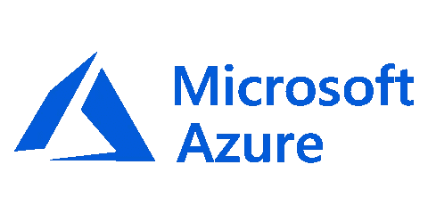
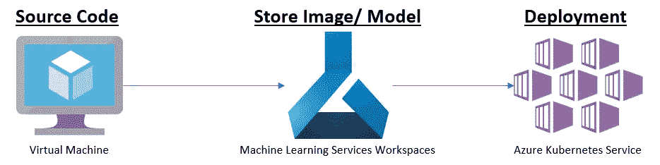
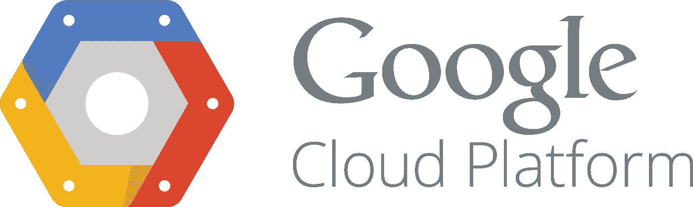
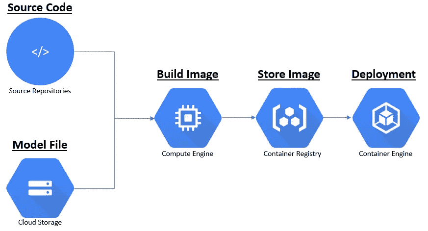

# 机器学习模型服务(模型即服务)的几种方式

> 原文：<https://pub.towardsai.net/several-ways-for-machine-learning-model-serving-model-as-a-service-c2687d0db26b?source=collection_archive---------1----------------------->

## [机器学习](https://towardsai.net/p/category/machine-learning)

## 在云平台上使用模型即服务(MaaS)

[马志威](https://unsplash.com/@makcedward?utm_source=medium&utm_medium=referral)在 [Unsplash](https://unsplash.com/?utm_source=medium&utm_medium=referral) 上拍照

如果你不能发布一个模型，那么无论你做得多好，没有人会知道。然而，许多数据科学家希望专注于模型构建，而跳过数据摄取和模型服务等其他工作。DevOps 对于数据科学家来说非常重要。有许多方法可以将您的模型作为 API 提供给下游的产品团队。

# 将二进制文件传递给你的队友

不时听说数据科学家不知道如何做软件工程的东西。所以他们只会专注于模型的建立，而忽略了数据提取，模型服务部分。没有对错之分。然而，如果没有专门的团队进行数据提取和模型服务，你最好还是吃你自己的狗粮。

# 把它当作一个正常的应用程序

如果一个模型是用 Java 的 Python 构建的，你可以考虑用尽可能简单的框架把你的模型包装成 API 服务。

## 长期的

对于 Python 来说， [flask](http://flask.pocoo.org/) 是一个简单的 web 框架，如果你熟悉它，你可以在 10 分钟内构建一个 API。Django 是另一个强大的 web 框架。它还有其他很棒的特性，但是如果你只想建立一个简单的网络服务器，你可能不会喜欢它。

[Spring](https://spring.io/) 和 [Tomcat](http://tomcat.apache.org/) 是 Java 的选项。这两种编程语言中有很多 web 框架，只需选择你熟悉的一种。

## 暂时的

如果你只是想建立一个临时 API，你可以把它部署到 [Jupyter 笔记本](https://jupyter.org/)上。你可以使用 [flask](https://www.flaskapi.org/#example) 、 [tornado](https://www.tornadoweb.org/en/stable/) 或者 REST 框架来构建 API。

# 把它当作一个机器学习应用

您可以利用 [kubernetes](https://kubernetes.io/) 进行部署，而不是将其视为普通的应用程序。Azure 和 GCP (Google 云平台)也都提供 kubernetes 服务进行部署。

在 kubernetes 之上，Azure 提供了一种简单的模型服务方式。API(应用编程接口)认证、REST API 等工程任务由 Azure 处理，而数据科学家只需专注于数据输入处理和模型预测部分。

[机器学习服务](https://azure.microsoft.com/en-in/services/machine-learning-service/)和 [Azure Kubernetes 服务(AKS)](https://azure.microsoft.com/en-us/services/kubernetes-service/?&OCID=AID2000586_SEM_UInoS0XO&lnkd=Google_Kubernetes_Brand&MarinID=sUInoS0XO_366906494820_azure%20kubernetes%20service_e_c__78855468680_kwd-486572907816_) 有助于减少部署的工作量。

*   机器学习服务:处理预部署任务，包括模型存储、docker 图像存储。
*   Azure Kubernetes 服务:提供 API 认证、部署和监控服务。

Azure 中的部署工作流

另一方面，GCP 提供了两种部署方式。ML 引擎提供了一种简单的方法来部署像 API 这样的机器学习模型。但是，缺点是资源限制，如 CPU 大小和型号大小。您可以访问此[页面](https://cloud.google.com/ml-engine/docs/quotas#requesting_a_quota_increase)了解更多信息。第二种方法是在你获得更多控制权的同时，渴望更多的工程技能。

[云存储](https://cloud.google.com/storage/)、[容器注册](https://cloud.google.com/container-registry/)和 [Kubernetes 引擎](https://cloud.google.com/kubernetes-engine/)可以用来完成模型服务部分。

*   云存储:存储您的模型文件
*   容器注册表:存储 docker 映像，其中包括源代码(用于数据处理和模型预测)和模型文件。
*   Kubernetes 引擎:处理部署和监控

GCP 的部署工作流程

# 喜欢学习？

我是湾区的数据科学家。专注于数据科学、人工智能，尤其是 NLP 和平台相关领域的最新发展。在 [LinkedIn](https://www.linkedin.com/in/edwardma1026) 或 [Github](https://github.com/makcedward) 上随时联系 [me](https://makcedward.github.io/) 。

# 延伸阅读

*   [在早期管理您的数据科学项目结构](https://towardsdatascience.com/manage-your-data-science-project-structure-in-early-stage-95f91d4d0600)

# 参考

*   [微软 Azure 平台](https://azure.microsoft.com)
*   [谷歌云平台](https://cloud.google.com)