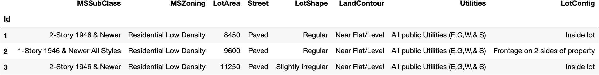
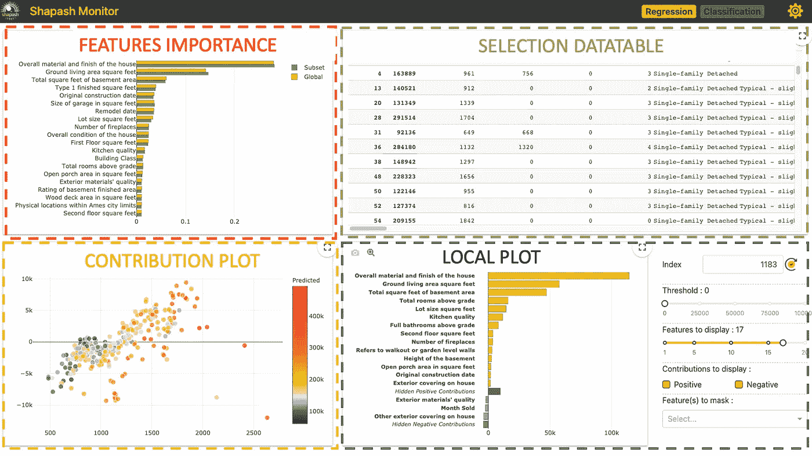
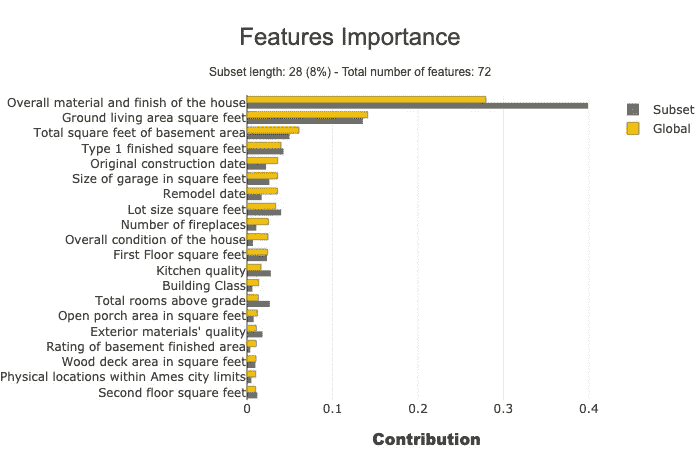
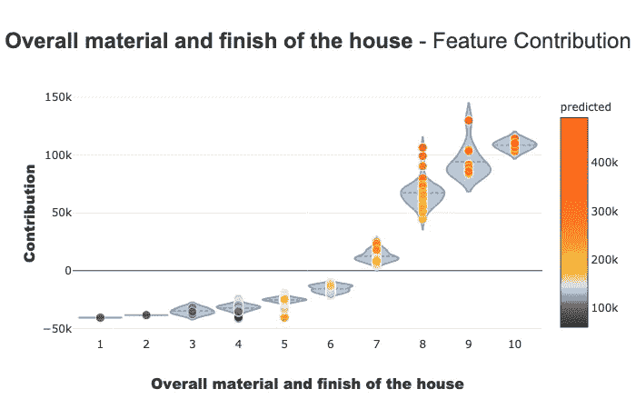
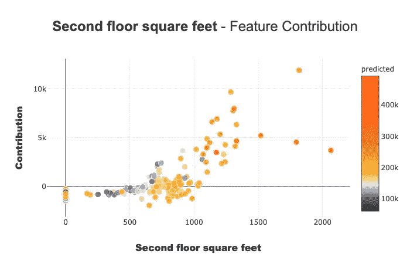
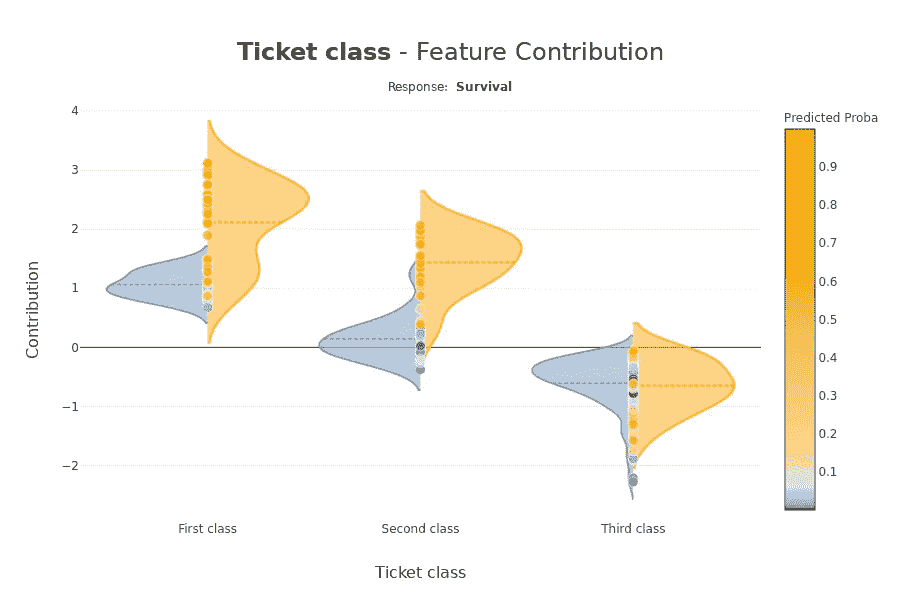
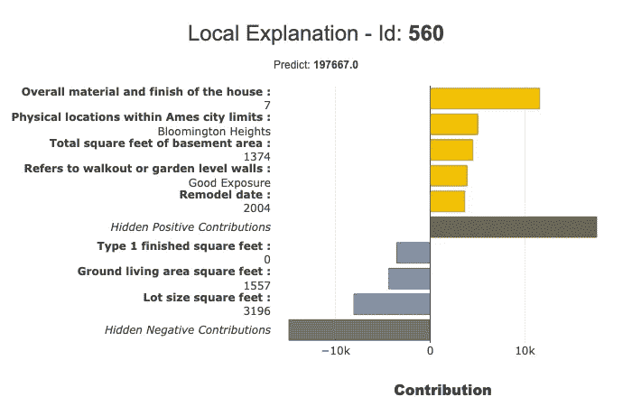
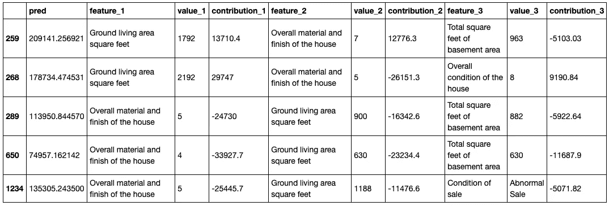
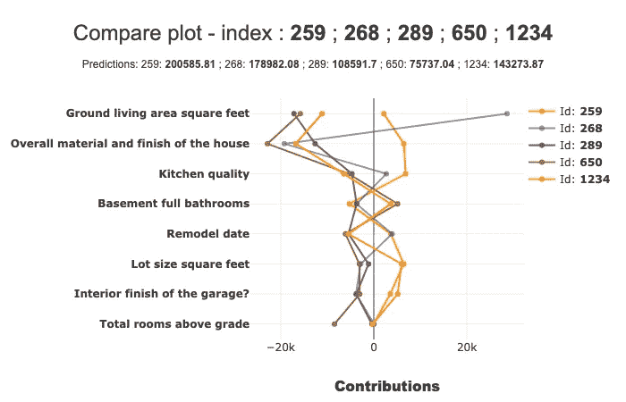

# Shapash:让每个人都能理解 ML 模型

> 原文：<https://pub.towardsai.net/shapash-making-ml-models-understandable-by-everyone-8f96ad469eb3?source=collection_archive---------0----------------------->

## [机器学习](https://towardsai.net/p/category/machine-learning)

## 在本文中，我们将介绍 [Shapash](https://github.com/MAIF/shapash) ，这是一个开源的 python 库，可以帮助数据科学家使他们的机器学习模型更加透明，更容易被所有人理解！


[Shapash 网络应用演示](https://shapash-demo.ossbymaif.fr/)

[**Shapash**](https://github.com/MAIF/shapash)by[**MAIF**](https://www.maif.fr/)是一个 Python 工具包，方便数据科学家理解机器学习模型。这使得与非数据专家共享和讨论模型可解释性变得更加容易:业务分析师、经理、最终用户…

具体来说，Shapash 提供了易于阅读的可视化和一个[网络应用](https://shapash-demo.ossbymaif.fr/)。Shapash 以适当的措辞显示结果(预处理反向/后处理)。Shapash 在操作环境中很有用，因为它使数据科学家能够从探索到生产使用可解释性:您可以在生产中轻松部署本地可解释性，以通过本地可解释性的总结来完成您的每个预测/建议。

在本帖中，我们将介绍 [**Shapash**](https://github.com/MAIF/shapash) 的主要特点以及它是如何操作的。我们将通过一个具体的用例来说明这个库的实现。

# **语境要素:**

模型的可解释性和可解释性是热门话题。有许多关于它的文章、出版物和开源贡献。所有这些贡献都没有涉及同样的问题和挑战。

大多数数据科学家出于多种原因使用这些技术:为了更好地理解他们的模型，检查它们是否一致和公正，以及为了调试。

然而，还有更多:

> 出于教学目的，可理解性很重要。可理解的机器学习模型可以与非数据专家的人进行辩论:商业分析师、最终用户…

具体来说，在我们的数据科学项目中，有两个非专业人员参与的步骤:

*   ***探索性步骤&模型拟合:***

在这一步，数据科学家和业务分析师讨论风险所在，并定义他们将集成到项目中的基本数据。这需要很好地理解我们正在建模的问题的主题和主要驱动因素。

为了做到这一点，数据科学家研究全局可解释性、特征重要性以及模型的主要特征所扮演的角色。他们还可以局部观察一些个体，尤其是离群值。在这个阶段，Web 应用程序很有意思，因为他们需要查看可视化和图形。与业务分析师讨论这些结果对于挑战方法和验证模型是很有趣的。

*   ***在生产环境中部署模型***

就是这样！该模型经过验证、部署，并为最终用户提供预测。局部可解释性可以给他们带来很多价值，只要有一种方法可以给他们提供一个好的、有用的和可理解的摘要。这对他们很有价值，原因有二:

*   透明带来信任:如果他理解模型，他会信任模型。
*   人类保持控制:没有模型是 100%可靠的。当他们能够理解算法的输出时，如果用户认为他们依赖于不正确的数据，他们可以推翻算法的建议。

[**Shapash**](https://github.com/MAIF/shapash) 已经被开发出来帮助数据科学家满足这些需求。


# Shapash 的主要特点:

*   易于阅读的可视化，为每个人。
*   一个 web 应用程序:为了理解一个模型是如何工作的，你必须查看多个图表、特征重要性以及一个特征对一个模型的整体贡献。网络应用程序是一个有用的工具。
*   用适当的措辞显示结果的几种方法(预处理、逆处理、后处理)。您可以轻松地添加数据字典、*类别编码器*对象或 sk learn*column transformer*以获得更明确的输出。
*   轻松保存 *Pickle* 文件并将结果导出到表格中的功能。
*   可解释性概要:概要是可配置的，以适应您的需要，并关注对局部可解释性重要的内容。
*   能够在生产环境中轻松部署，并通过每个运营应用(批处理或 API)的本地可解释性摘要完成每个预测/建议
*   Shapash 开放了多种处理方式:它可以用来轻松地获得结果或改进措辞。显示结果只需要很少的参数。但是你清理和记录数据集的工作越多，最终用户得到的结果就越清晰。

[**Shapash**](https://github.com/MAIF/shapash) 适用于回归、二元分类或多类问题。
兼容多种型号: *Catboost* ， *Xgboost* ， *LightGBM* ， *Sklearn Ensemble* ，*线性型号*， *SVM* 。

**Shapash** 基于使用[**Shap**](https://github.com/slundberg/shap)(Shapley 值) [**Lime**](https://github.com/marcotcr/lime) 计算的本地贡献，或允许计算可累加本地贡献的任何技术。

# 装置

您可以通过 pip 安装该软件包:

`$pip install shapash`

# 沙帕什演示

让我们在一个具体的数据集上使用Shapash。在本文的剩余部分，我们将向您展示 [**Shapash**](https://github.com/MAIF/shapash) 如何探索模型。

我们将使用来自 [Kaggle](https://www.kaggle.com/c/house-prices-advanced-regression-techniques) 的著名“房价”数据集来拟合回归变量…并预测房价！让我们从加载数据集开始:

```
import pandas as pd
from shapash.data.data_loader import data_loading
house_df, house_dict = data_loading('house_prices')
y_df=house_df['SalePrice'].to_frame()
X_df=house_df[house_df.columns.difference(['SalePrice'])]house_df.head(3)
```



对分类特征进行编码:

```
from category_encoders import OrdinalEncoder

categorical_features = [col for col in X_df.columns if X_df[col].dtype == 'object']
encoder = OrdinalEncoder(cols=categorical_features).fit(X_df)
X_df=encoder.transform(X_df)
```

训练、测试分割和模型拟合。

```
from sklearn.model_selection import train_test_split
from sklearn.ensemble import RandomForestRegressor

Xtrain, Xtest, ytrain, ytest = train_test_split(X_df, y_df, train_size=0.75)
reg = RandomForestRegressor(n_estimators=200, min_samples_leaf=2).fit(Xtrain,ytrain)
```

**和预测测试数据……**

```
y_pred = pd.DataFrame(reg.predict(Xtest), columns=['pred'], index=Xtest.index)
```

**让我们发现并使用 Shapash SmartExplainer。**

*第一步—导入*

```
from shapash.explainer.smart_explainer import SmartExplainer
```

*步骤 2 —初始化 SmartExplainer 对象*

```
xpl = SmartExplainer(features_dict=house_dict) # Optional parameter 
```

*   features_dict: dict 指定 x pd.DataFrame 的每个列名的含义。

*步骤 3 —编译*

```
xpl.compile(
    x=Xtest,
    model=regressor,
    preprocessing=encoder,# Optional: use inverse_transform method
    y_pred=y_pred # Optional
)
```

编译方法允许使用另一个可选参数:*后置处理。*它提供了应用新函数来指定更好的措辞的可能性(正则表达式、映射字典等)。

现在，我们可以显示结果并了解回归模型是如何工作的！

*步骤 4 —启动网络应用*

`app = xpl.run_app()`

web 应用程序链接出现在 Jupyter 输出中(点击查看演示[)。](https://shapash-demo.ossbymaif.fr/)

**这个 Web App 有四个部分:**



每一个都有助于轻松探索模型。

***特性重要性* :** 您可以点击每个特性来更新下面的贡献图。

***贡献图* :** 一个特征如何影响预测？显示特征的每个局部贡献的小提琴图或散点图。

***局部剧情:***

*   局部解释:哪些特征对预测值的贡献最大。
*   您可以使用几个按钮/滑块/列表来配置这个局部可解释性的概要。我们将在下面用*过滤器*方法描述不同的参数，您可以用这些参数进行汇总。
*   这个 web 应用程序是一个有用的工具，可以与业务分析师讨论总结可解释性以满足运营需求的最佳方式。

***选择表:*** 允许 Web App 用户选择:

*   一个子集，将探索的重点放在这个子集上
*   单行显示相关的本地解释

如何使用数据表选择子集？在表的顶部，在要用于筛选的列名称的正下方，指定:

*   *=值，>值，<值*
*   *如果您想选择包含特定单词的每一行，只需键入不带“=”的单词*

这个 web 应用程序有几个可用选项(右上角按钮)。最重要的一个大概就是样本的大小(默认:1000)。为了避免延迟，web 应用程序依赖一个样本来显示结果。使用此选项修改样本大小。

要关闭应用程序:

```
app.kill()
```

*第五步—地块*

所有的情节都可以在 jupyter 笔记本上找到，下面的段落描述了每个情节的要点。

**特征重要性**

该参数允许比较子集的特征重要性。检测子集中的特定行为非常有用。

```
subset = [ 168, 54, 995, 799, 310, 322, 1374,
          1106, 232, 645, 1170, 1229, 703, 66,  
          886, 160, 191, 1183, 1037, 991, 482,  
          725, 410, 59, 28, 719, 337, 36 ]xpl.plot.features_importance(selection=subset)
```



***贡献情节***

贡献图用于回答以下问题:

某个特性如何影响我的预测？它有积极的贡献吗？该功能的贡献越来越大吗？逐渐减少？有没有什么门槛效应？对于一个分类变量，每个模态如何贡献？…该图完善了特征对于模型的可解释性和整体可理解性的重要性，从而更好地理解特征对模型的影响。

这张图上有几个参数。请注意，显示的图会根据您对分类变量还是连续变量感兴趣(小提琴或散点图)以及您处理的用例类型(回归、分类)进行调整

```
xpl.plot.contribution_plot("OverallQual")
```



应用于连续特征的贡献图。

分类案例:Titanic 分类器—应用于分类特征的贡献图。

**局部情节**

您可以使用局部图来获得模型的局部可解释性。

filter()和 local_plot()方法允许您测试并选择最佳方式来总结模型拾取的信号。你可以在探索阶段使用它。然后，您可以将该摘要部署到生产环境中，让最终用户在几秒钟内了解对每个建议最有影响的标准是什么。

我们将发表第二篇文章来解释如何在生产中部署本地可解释性。

**结合过滤和局部 _ 绘图方法**

使用 filter 方法指定如何总结局部可解释性。您有四个参数来配置您的摘要:

*   max_contrib:要显示的最大标准数
*   阈值:显示标准所需的贡献的最小值(绝对值)
*   正面:仅显示正面贡献？消极？(默认无)
*   features_to_hide:不想显示的功能列表

定义这些参数后，我们可以用 local_plot()方法显示结果，或者用 to_pandas()导出结果。

```
xpl.filter(max_contrib=8,threshold=100)
xpl.plot.local_plot(index=560)
```



## `Export to pandas DataFrame:`

```
xpl.filter(max_contrib=3,threshold=1000)
summary_df = xpl.to_pandas()
summary_df.head()
```



**比较剧情**

使用 compare_plot()方法，SmartExplainer 对象可以理解为什么两个或多个个体没有相同的预测值。最具决定性的标准出现在图的顶部。

```
xpl.plot.compare_plot(row_num=[0, 1, 2, 3, 4], max_features=8)
```



我们希望 [**Shapash**](https://github.com/MAIF/shapash) 将有助于建立对 AI 的信任。提前感谢所有给我们反馈的人，idea… [**Shapash**](https://github.com/MAIF/shapash) 是开源的！请随意评论这篇文章或直接在 [GitHub 讨论](https://github.com/MAIF/shapash/discussions)上发表意见。