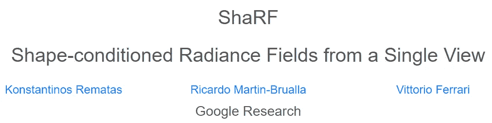
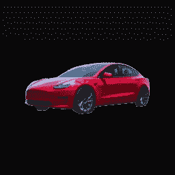
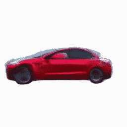
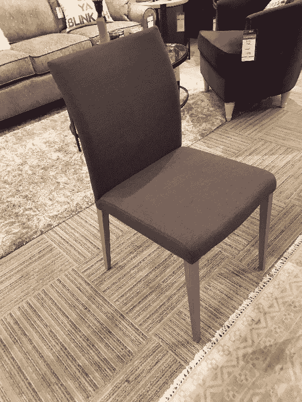
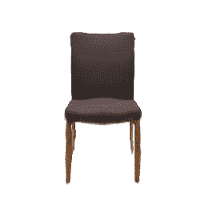
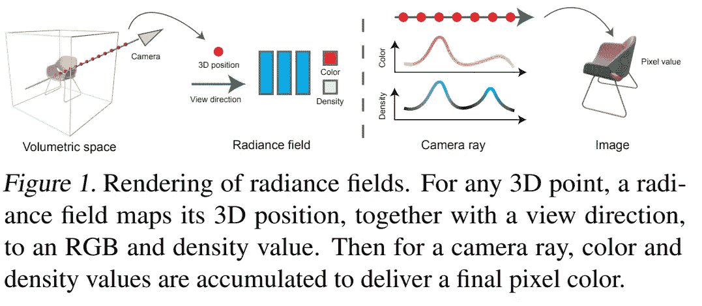
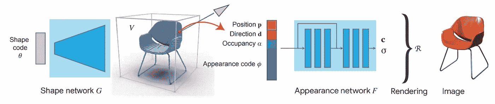
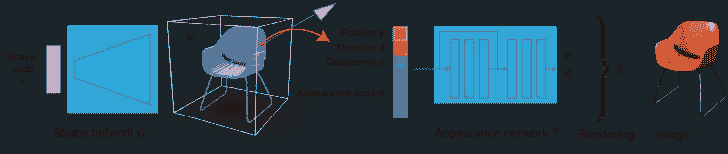

# ShaRF:从现实生活中的物体上拍一张照片，然后创建一个它的 3D 模型

> 原文：<https://pub.towardsai.net/sharf-take-a-picture-from-a-real-life-object-and-create-a-3d-model-of-it-c6809806b32?source=collection_archive---------2----------------------->

## [计算机视觉](https://towardsai.net/p/category/computer-vision)

## 想象一下，拍一张物体的照片，然后以 3D 形式插入到你正在创作的电影或视频游戏中，或者插入到 3D 场景中作为插图，那该有多酷。

单幅图像的神经场景表示是一个非常复杂的问题。“最终目标”是能够从现实生活中的物体拍摄照片，并将这张照片转换为 3D 场景。这意味着模型理解整个三维场景，或现实生活中的场景，使用单一图片的信息。即使对人类来说，这有时也很困难，因为图像中的颜色或阴影会欺骗我们的眼睛。

由[迈克尔·泽兹奇](https://unsplash.com/@lazycreekimages?utm_source=medium&utm_medium=referral)在 [Unsplash](https://unsplash.com?utm_source=medium&utm_medium=referral) 上拍摄的照片

哦，它不仅需要理解图像的深度，这已经是一项具有挑战性的任务，而且它还需要用正确的材料和纹理重建物体，使它们看起来真实。

更多结果… [1]

想象一下，拍一张物体的照片，然后以 3D 形式插入到你正在创作的电影或视频游戏中，或者插入到 3D 场景中作为插图，那该有多酷。

好吧，我不是唯一一个考虑这种类型的模型可能创造的所有可能性的人，因为谷歌的研究人员正在他们的新论文“ShaRF:来自单个视图的形状调节辐射场”中研究这个问题。

更多结果… [1]

请注意，对于您看到的每个结果，他们只使用了一张从任何角度拍摄的照片。然后，它被发送到模型，以产生这些结果，当你想到任务的复杂性和所有可能的参数时，这对我来说是不可思议的。例如照明、分辨率、尺寸、角度或视点、图像中物体的位置等。！如果你和我一样，你可能想知道他们是怎么做到的。

好吧，我撒了一点小谎，他们不仅把图像作为网络的输入，而且还把相机参数作为过程的辅助。

图片来自[1]

他们的算法学习了一种功能，可以将这些 3D 点和 3D 视点转换为 RGB 颜色以及每个点的密度值。提供足够的信息，以便稍后从任何视点渲染场景。这称为辐射场，将位置及其观察方向作为输入，输出每个点的颜色和体积密度值。

这与 NeRF 的做法非常相似。我已经完成了一篇论文。基本上，在 NeRF 情况下，辐射场函数是使用在图像和预期输出上训练的神经网络来完成的。这意味着他们需要每个场景的大量图像，以及为每个场景训练不同的网络。使得这个过程非常昂贵和低效。

因此，我们的目标是找到一种更好的方法来获得所需的辐射场，由 RGB 和密度值组成，然后在新的视图中以 3D 形式呈现对象。

模型[1]

为了获得创建这种辐射场所需的信息，他们使用了他们所谓的形状网络，将图像的潜在代码映射到由体素组成的 3D 形状。体素就像像素一样，但是在三维空间中，并且所讨论的潜在代码基本上是图像中物体形状的所有有用信息。这种压缩的形状信息是使用由完全连接的层和随后的卷积组成的神经网络找到的，卷积是计算机视觉应用的强大架构，因为卷积具有两个主要属性:它们对于平移是不变的，并且使用图像的局部属性。

形状网络 G [1]

当然，这个网络是在多个图像上训练的，并且能够找到一个好的函数来将形状信息映射成我们所说的潜在代码。然后，利用这个潜在代码来产生这个第一 3D 形状估计。

模型[1]

你可能会认为我们已经完成了，但事实并非如此。这只是第一步，然后，正如我们所讨论的，我们需要这个表示的辐射场，在这里使用一个外观网络。这里，它再次使用类似的潜在代码，但是对于外观，以及作为输入的 3D 形状，使用另一个网络(这里称为 f)产生该辐射场。然后，该辐射场最终可以与相机参数信息一起使用，以产生该对象的最终渲染。

当然，这只是这篇新论文的概述。我强烈推荐阅读下面链接的论文。不幸的是，代码现在还不可用，但是我联系了其中一个作者，他说将在几周内可用，所以请继续关注！

如果你喜欢我的工作，并想了解最新的人工智能技术，你绝对应该在我的社交媒体频道上关注我。

*   订阅我的 [**YouTube 频道**](https://www.youtube.com/channel/UCUzGQrN-lyyc0BWTYoJM_Sg) 。
*   在[**LinkedIn**](https://www.linkedin.com/in/whats-ai/)**上关注我的项目，在[**上关注中型**](https://whats-ai.medium.com/) **。****
*   **一起学习 AI，加入我们的 [**Discord 社区**](https://discord.gg/learnaitogether) ，*分享你的项目、论文、最佳课程，寻找 Kaggle 队友，等等！***

## **参考**

**[1] Rematas，k .，Martin-Brualla，r .，和 Ferrari，v .，“ShaRF:来自单一视图的形状调节辐射场”，(2021)，[https://arxiv.org/abs/2102.08860](https://arxiv.org/abs/2102.08860)**

**ShaRF 的项目网站和代码链接:[http://www.krematas.com/sharf/index.html](http://www.krematas.com/sharf/index.html)**

**[3]米尔登霍尔等，NeRF:将场景表示为用于视图合成的神经辐射场，(2020)，[https://www.matthewtancik.com/nerf](https://www.matthewtancik.com/nerf)**