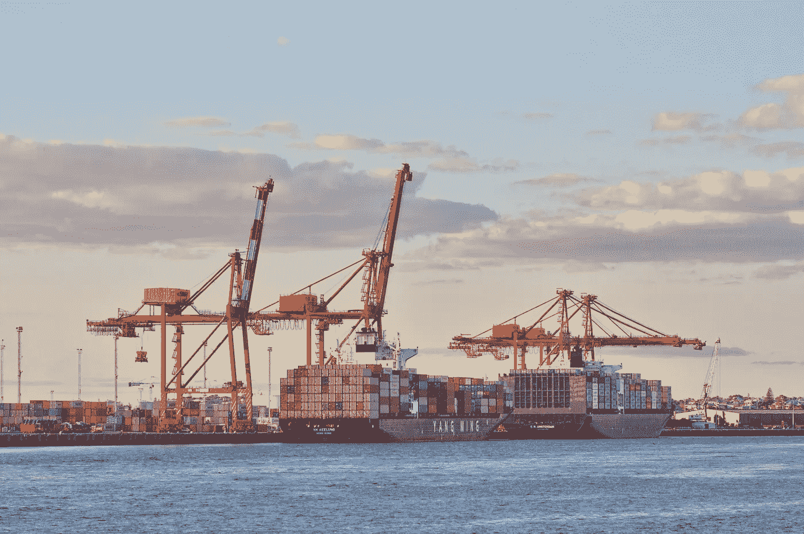
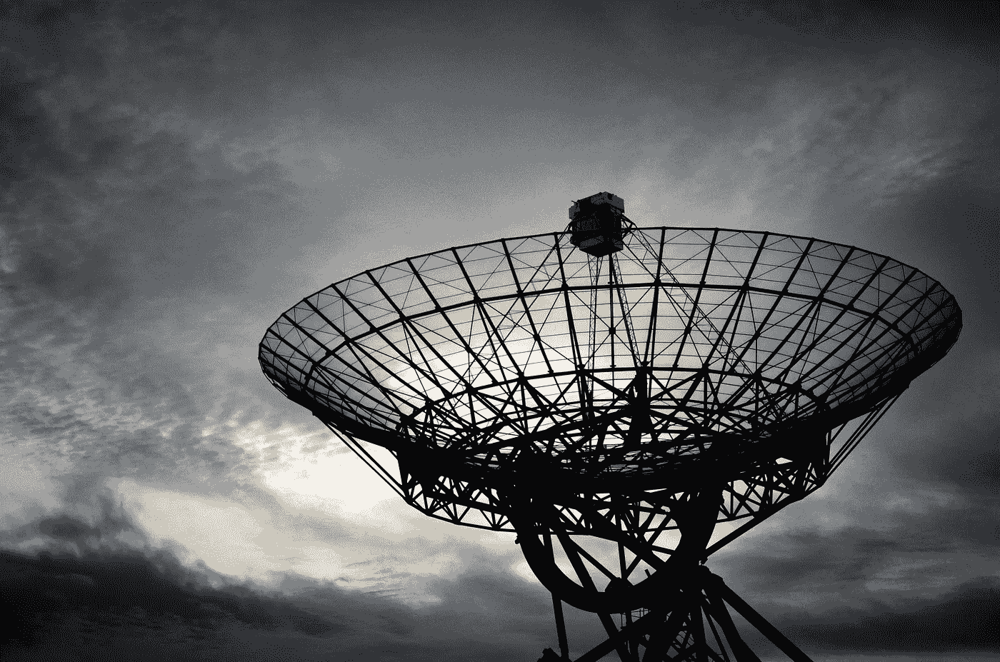
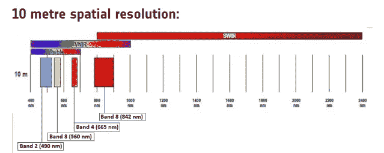
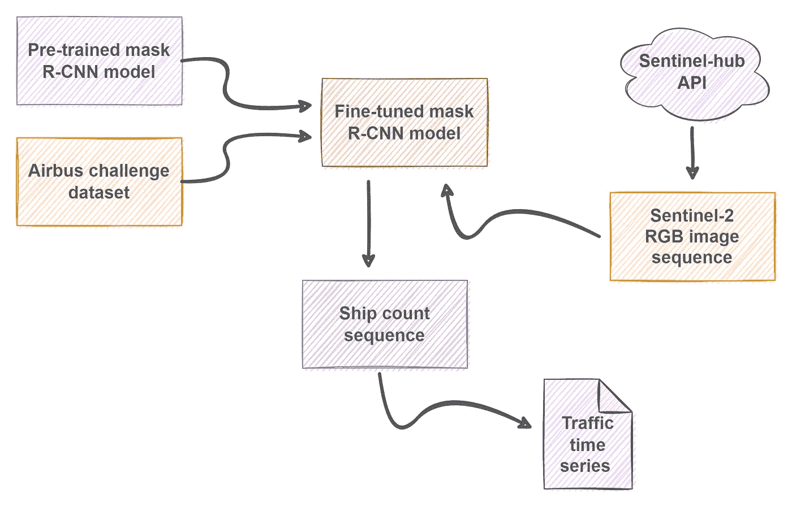
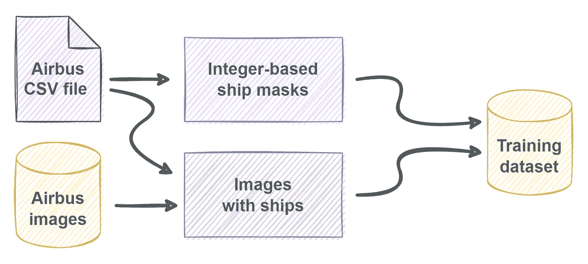
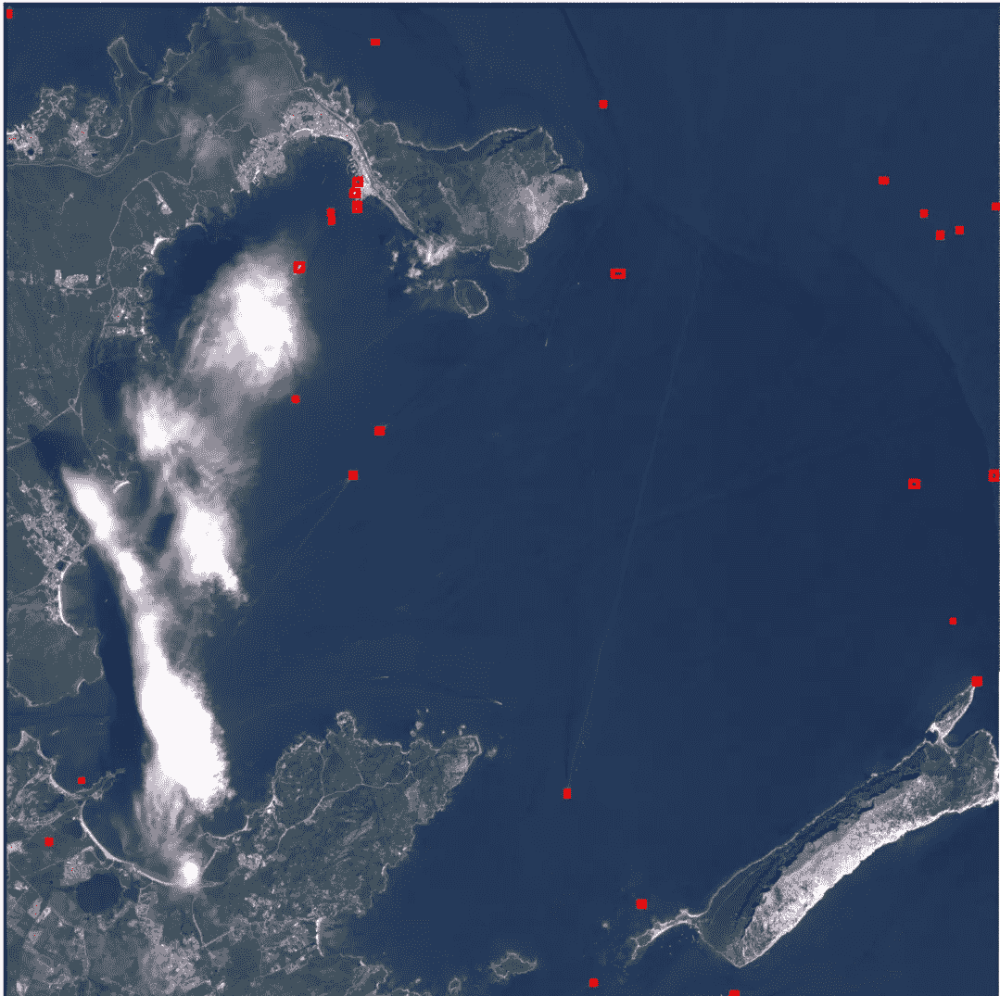
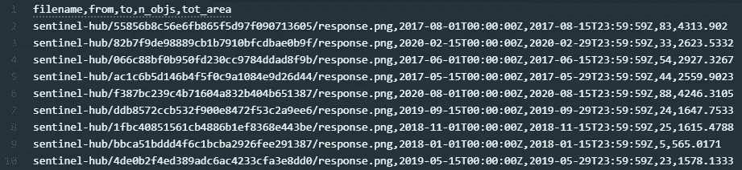
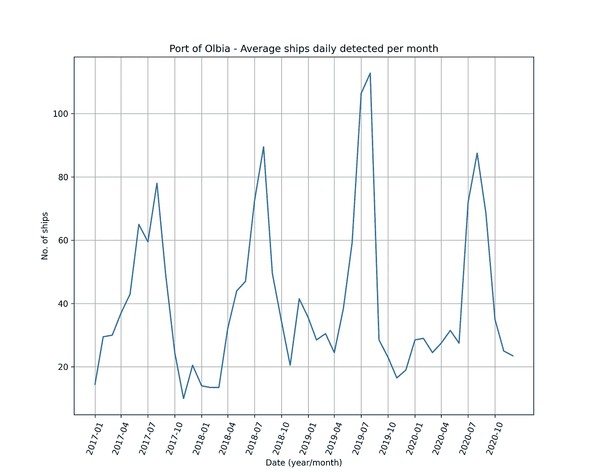
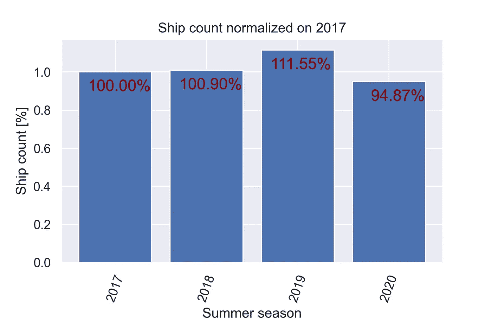

# 基于掩模 R-CNN 模型的 Sentinel-2 图像舰船检测

> 原文：<https://pub.towardsai.net/ship-detection-on-sentinel-2-images-with-mask-r-cnn-model-eb8dc9bfc80?source=collection_archive---------1----------------------->

## [深度学习](https://towardsai.net/p/category/machine-learning/deep-learning)

## 基于 PyTorch 和 open 数据的海上交通时间分析



照片由[史蒂夫·多伊格](https://unsplash.com/@srd?utm_source=unsplash&utm_medium=referral&utm_content=creditCopyText)在 [Unsplash](https://unsplash.com/s/photos/port?utm_source=unsplash&utm_medium=referral&utm_content=creditCopyText) 上拍摄

作为更大的 ML 项目的一部分，我们决定探索使用公开的卫星图像评估海上交通的可能性。特别是，我们的目标是估计一个时间序列，该时间序列代表在给定区域内随时间观察到的海上交通流量。在本文中，我们将讨论**方法和获得的结果**。

**注**:以下讨论的所有代码都可以在我位于[https://github.com/andrea-ci/s2-ship-detection](https://github.com/andrea-ci/s2-ship-detection)的个人 GitHub 上获得。

# 为什么是卫星数据



Matthijs van Heerikhuize 在 [Unsplash](https://unsplash.com/s/photos/satellite?utm_source=unsplash&utm_medium=referral&utm_content=creditCopyText) 上拍摄的照片

> 卫星升上天空了诸如此类的事情快把我逼疯了我看了一会儿我喜欢看电视节目
> 
> 卢·里德，“爱情的卫星”

在过去的几年里，遥感发生了巨大的变化，其他领域也是如此，如计算机视觉和机器学习。此外，越来越多的卫星图像已经公开。著名的例子包括地球资源探测卫星和 T21 哨兵-2 星座图像。

卫星对用户来说有三个基本优势:

*   它们允许获取通常难以通过其他方式获得的信息；
*   它们提供全球地理覆盖；
*   它们以高时间分辨率周期性地收集信息(所谓的[重访期](https://en.wikipedia.org/wiki/Satellite_revisit_period))。

此外，图像的空间分辨率，即区分两个接近物体的能力，正在不断提高，从而能够实现越来越多的新应用。市场研究公司[1]给出了一个著名的例子，他们最近利用卫星图像来统计停放在停车场的汽车数量，以估计零售需求。原则上，类似的方法也可以用于社会和行政目的的应用，例如测量城市交通或计算政治集会的人群。

# 哨兵-2 任务

在这个实验中，我们考虑 ESA Sentinel-2 任务。Sentinel-2 卫星配备了一个多光谱仪器(MSI)，该仪器使用 [13 个波段以 3 种不同的分辨率](https://sentinels.copernicus.eu/web/sentinel/user-guides/sentinel-2-msi/resolutions/spatial)收集数据:10 米、20 米和 60 米。为了获得最佳可用分辨率，我们使用了 **B02、B03 和 B04 波段**，这些波段位于可见光谱中，提供 10 米的分辨率。



分辨率为 10 米的 Sentinel-2 波段—来源:[https://sentinels . Copernicus . eu](https://sentinels.copernicus.eu/web/sentinel/user-guides/sentinel-2-msi/resolutions/spatial)

可以通过不同方式访问 Sentinel-2 图像，包括:

*   [哥白尼开放访问中心](https://scihub.copernicus.eu/)，欧空局的一个网站，提供对 Sentinel-1、Sentinel-2、Sentinel-3 和 Sentinel-5P 用户产品的免费和开放访问；
*   来自亚马逊 AWS 的[开放数据注册表](https://registry.opendata.aws/)；
*   [Sentinel HUB](https://www.sentinel-hub.com/) ，一个用于卫星图像的云 API，也有一个方便的 Python 库 [**sentinelhub**](https://sentinelhub-py.readthedocs.io/en/latest/index.html) 。

# 建模方法

检测图像上的船只是一项艰巨的任务，因为通过构造，正样本(即属于船只的像素)的数量与负样本的数量相比非常小。因此，我没有尝试语义分类任务，而是选择了一种**对象检测方法**。



处理工作流程-按作者分类的图像

作为基线，已经考虑了预训练的[掩模 R-CNN](https://arxiv.org/abs/1703.06870) 模型。该模型为[更快的 R-CNN](https://arxiv.org/abs/1506.01497) 模型增加了一个额外的分支，该模型反过来基于 Resnet 的架构，在“[图像识别的深度残差学习](https://arxiv.org/abs/1512.03385)中介绍。

Resnet 代表**残差网络**，因为该网络引入了残差学习的概念。残差学习是一种旨在提高深度卷积神经网络分类和识别任务性能的方法。一般来说，深度网络通过它们的层来学习低、中和高水平的特征。残差网络通过使用图层之间的快捷连接来学习残差，即要素之间的差异。这种方法已被证明可以使训练更容易，获得更好的精度值。Resnet 型号有 5 种型号，分别包含 18、34、50、101 和 152 层。

对于深度学习的实现，我已经使用了 **PyTorch** 和 **TorchVision 提供的 Mask R-CNN 模型。**自带 50 层，在 [COCO 数据集](https://cocodataset.org/#home)上进行预训练。

现在是微调模型的时候了。

# 模型微调:数据和训练

为了微调模型，我使用了 Kaggle [**空中客车船舶探测挑战赛**](https://www.kaggle.com/c/airbus-ship-detection) 的比赛数据。

这个数据集由 192556 幅图像组成，其中只有 42556 幅包含至少一艘船(占总数的 22%)。而且，它们中的大多数(大约 60%)包含*恰好*一艘船。因此，数据集非常不平衡，阳性样本的数量非常有限。

更困难的是，图像中包含的船只在大小上可能有很大差异，它们可能位于公海或码头和码头，例如靠近陆地的地方。

数据集附带一个 CSV 文件，其中船舶掩码由[游程编码](https://en.wikipedia.org/wiki/Run-length_encoding)表示。由于大多数图像不包含任何船只，我将它们从数据集中删除。对于剩余的，生成**掩模**,因此它们可用于模型目标的创建。



准备训练数据-按作者分类的图像

遮罩是基于整数的 2D 阵列，这意味着对于任何像素 *x:*

*   *x=0，*如果不代表船；
*   *x=1，*如果是第一艘船的一部分；
*   *x=2，*如果是第二艘船的一部分；
*   诸如此类。

需要像素编号来识别图像中包含的任何最终船只，因为模型返回对象(船只),并且每个对象由唯一的边界框来表征。

因此，遵循 TorchVision 提供的优秀教程[，我已经为**空中客车数据集**准备了代码，如下一个片段所示。](https://pytorch.org/tutorials/intermediate/torchvision_tutorial.html)

```
class AirbusShipDetection(Dataset): def __init__(self, image_ids, dir_images, dir_masks, transforms = None): self.image_ids = image_ids
        self.dir_images = dir_images
        self.dir_masks = dir_masks
        self._transforms = transforms def __getitem__(self, idx): # Read the RGB image.
        fn_image = f'{self.image_ids[idx]}.jpg'
        path_image = path.join(self.dir_images, fn_image)
        image = Image.open(path_image).convert("RGB") # Read the integer-based mask.
        fn_mask = f'{self.image_ids[idx]}_mask.png'
        path_mask = path.join(self.dir_masks, fn_mask)
        mask = np.array(Image.open(path_mask)) # Instances are encoded with different integers.
        obj_ids = np.unique(mask) # We remove the background (id=0) from the mask.
        obj_ids = obj_ids[1:]
        num_objs = len(obj_ids) # Split the mask into a set of binary masks
        # masks.shape[0] = number of istances
        masks = mask == obj_ids[:, None, None] # Get bounding box of each mask.
        boxes = []
        for mask in masks: pos = np.where(mask) xmin = np.min(pos[1])
            xmax = np.max(pos[1])
            ymin = np.min(pos[0])
            ymax = np.max(pos[0]) # Enforce a positive area.
            if xmax - xmin < 1:
                xmax += 1
            if ymax - ymin < 1:
                ymax += 1 boxes.append([xmin, ymin, xmax, ymax]) boxes = torch.as_tensor(boxes, dtype = torch.float32) # Compute the area.
        area = (boxes[:, 3] - boxes[:, 1]) * (boxes[:, 2] - boxes[:, 0]) # Only one class (ships).
        labels = torch.ones((num_objs,), dtype = torch.int64)
        masks = torch.as_tensor(masks, dtype = torch.uint8) # Crowd flag not applicable here.
        iscrowd = torch.zeros((num_objs,), dtype=torch.int64) image_id = torch.tensor([idx]) target = {}
        target['boxes'] = boxes
        target['labels'] = labels
        target['masks'] = masks
        target['image_id'] = image_id
        target['area'] = area
        target['iscrowd'] = iscrowd # Apply image augmentation.
        if self._transforms:
            image, target = self._transforms(image, target) return image, target def __len__(self):
        # return length of
        return len(self.image_ids)
```

这里可以清楚地看到模型输出的结构:它由一个字典组成，其中包含与模型检测到的对象相关的信息。

在 10 个训练时期之后，评估度量表现出可接受的值，从而可以终止训练，并且模型最终准备好应用于 Sentinel-2 图像。


模型评估—作者提供的图片

# 对哨兵-2 数据的推断

在实验中，我将注意力集中在意大利撒丁岛奥尔比亚市**港口周围的一小块区域**。这个港口是从意大利半岛来的渡船进入该岛的主要入口之一，尤其是在暑假期间。

已经考虑了从 **2017 到 2020** 之间的时间段，并且每个月以固定的时间间隔采集了两幅图像。因此，模型输入由一系列 **96 幅原始 RGB 图像**组成。不幸的是，其中一些导致了畸形，要么是因为下载期间的 API 问题，要么是因为它们没有通过 Sentinel-2 处理链的质量检查，因此它们必须被丢弃。



根据 Sentinel-2 快照推断——作者提供的图片

模型对图像序列进行处理，并将检测结果保存到 **CSV 文件中:**报告每幅图像的采集日期和检测到的船只数量。此外，船只占据的总面积也包括在内，尽管它不用于此分析。



检测结果—作者提供的图片

# 结果分析

使用 **Pandas** 很容易从 CSV 文件中提取和可视化时间序列。文件中报告的计数按月平均，以获得参考月份每天观察到的船只的时间序列。



该时间序列显示出很强的季节性。这种现象很可能是由几个不同的原因造成的:

*   港口的活动以**旅游型**为主，夏季游客流量较大；
*   夏季的天气条件有利于获取更清晰的图像(即低云量)，从而允许更多的船只被正确检测到。

这两个因素导致夏季交通量最大，然后逐渐减少，直到冬季达到最小值。

据当地报纸[2]报道，2020 年夏季，奥尔比亚港的交通量**比 2019 年减少了约 15%** ，原因是疫情的限制影响了整个国家。

考虑到夏季期间(即 4 月至 9 月，包括 4 月和 9 月)获得的计数总和，获得的数据与此声明一致，因为它们表明**的交通量在 2020 年减少了约 16.28%。**



作者图片

# 结论

可见光谱中的卫星图像对天气条件高度敏感，必须根据具体的项目要求(例如，感兴趣的区域、重访周期、图像分辨率)仔细评估其用途。然而，从原则上来说，应用它们来提取海事活动的替代措施似乎是可能的。

# 参考

[1][https://international banker . com/brokerage/how-satellite-imagery-is-helping-hedge-funds-perform/](https://internationalbanker.com/brokerage/how-satellite-imagery-is-helping-hedge-funds-outperform/)

[2][https://www . lanuovasardegna . it/ol bia/crona ca/2021/08/19/news/e-ripartito-车安-il-Porto-aumentano-I-passeggeri-1.40616298](https://www.lanuovasardegna.it/olbia/cronaca/2021/08/19/news/e-ripartito-anche-il-porto-aumentano-i-passeggeri-1.40616298)

[https://sentinel.esa.int/web/sentinel/missions/sentinel-2](https://sentinel.esa.int/web/sentinel/missions/sentinel-2)

[https://scihub.copernicus.eu/](https://scihub.copernicus.eu/)

[https://sentinelhub-py.readthedocs.io/en/latest/index.html](https://sentinelhub-py.readthedocs.io/en/latest/index.html)

[6][https://py torch . org/tutorials/intermediate/torch vision _ tutorial . html](https://pytorch.org/tutorials/intermediate/torchvision_tutorial.html)

[https://www.kaggle.com/c/airbus-ship-detection](https://www.kaggle.com/c/airbus-ship-detection)