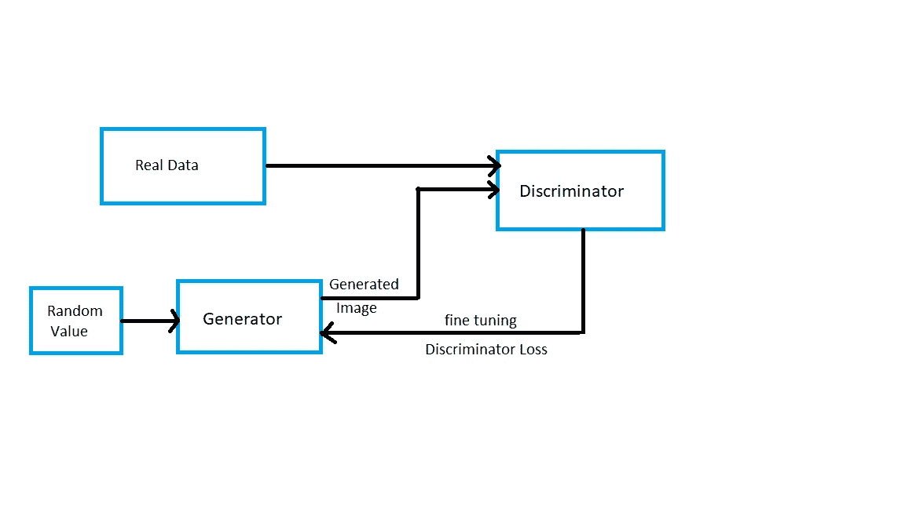
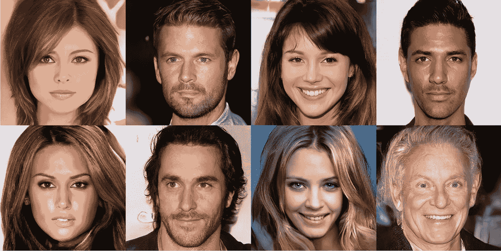

# 生成对抗网络简介

> 原文：<https://pub.towardsai.net/short-introduction-to-generative-adversarial-networks-gans-c1dca425e2be?source=collection_archive---------1----------------------->

## [机器学习](https://towardsai.net/p/category/machine-learning)

通用对抗网络(GAN)是一种使用深度学习神经网络(如 CNN)的生成建模方法。

有两种类型的建模技术，I)判别建模和 ii)生成建模。判别模型是机器学习中用于分类的典型模型。它们以特征 X(图像，用于图像分类)作为输入，并预测给定特征的输出 Y(图像的概率)。另一方面，生成式模型输出给定随机值的特征 X(图像)。

一些生成模型是潜在的狄利克雷分配，或 LDA，和高斯混合模型，或 GMM。一些深度学习生成模型是变分自动编码器或 VAE、通用对抗网络或 GAN。

甘作品的简单再现

**甘的工作是怎样做的？**

GAN 由两个模块组成，一个发生器和一个鉴别器。鉴别器是一个经过训练的网络，能够区分真实和伪造的图像，而生成器没有经过训练。使用随机值，生成器将生成一个图像，然后将该图像提供给鉴别器。然后鉴别器会给出生成的图像有多假/真。这有助于生成器微调后续的图像生成，最终生成无法区分的假图像。

从它的名字，你可以看到生成器和鉴别器在新图像的生成上是相互对立的。

这里是由 NVIDIA 制作的[甘制作的图像](https://research.nvidia.com/sites/default/files/pubs/2017-10_Progressive-Growing-of/karras2018iclr-paper.pdf)

这些图像是不属于任何人的脸，而是甘生成的！。

希望这篇博客至少澄清了甘是什么？