# 给我看看黑盒

> 原文：<https://pub.towardsai.net/show-me-the-black-box-3495dd6ff52c?source=collection_archive---------0----------------------->

## 向 AI 解释机器学习模型|

## 解释和诠释黑盒模型；基于树的算法的用例

H 您是否曾经面临过业务(高管或用户)挑战模型所做决策的情况？

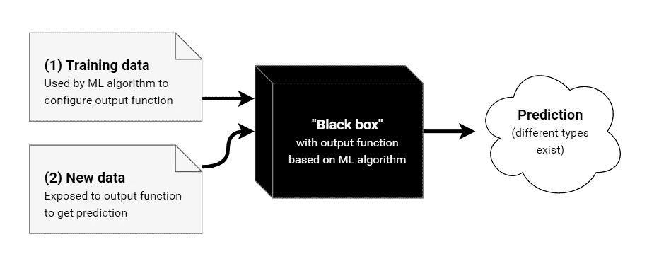

**图 1** :“黑箱”模型简图

几乎所有的行业和公司都意识到了机器学习在改进产品、流程和战略方面的优势和潜力。然而，**模型通常不会解释它们的预测**，这导致我们作为人类提出质疑，有时会成为采用机器学习的障碍。

**可解释性**和**可解释性**已经成为现实世界的热门话题之一(见下面一些新闻)。我们知道*预测的是什么，但现在我们想知道 ***为什么*** 会做出预测。知道了原因，我们就能从本质上理解问题的根源(为什么我们首先要建立模型),并帮助我们从一开始就防止问题的发生。*

*[](https://www.newscientist.com/article/2225186-companies-could-be-fined-if-they-fail-to-explain-decisions-made-by-ai/) [## 如果公司未能解释 AI 做出的决定，可能会被罚款

### 如果企业和其他组织不能解释由…做出的决定，他们可能面临数百万英镑的罚款

www.newscientist.com](https://www.newscientist.com/article/2225186-companies-could-be-fined-if-they-fail-to-explain-decisions-made-by-ai/) [](https://www.nasdaq.com/articles/goldman-sachs-ceo-denies-gender-bias-in-credit-limits-for-apple-card-2019-11-21) [## 高盛首席执行官否认苹果信用卡信用额度存在性别偏见

### (RTTNews) -高盛公司首席执行官大卫·所罗门周四否认了性别歧视的指控

www.nasdaq.com](https://www.nasdaq.com/articles/goldman-sachs-ceo-denies-gender-bias-in-credit-limits-for-apple-card-2019-11-21) 

在本帖中，我们将探讨一些解释该模型的方法。通过使用轻 GBM 分类，但是该概念可以应用于任何算法和回归问题)。

# 模型解释

在本节中，我们将使用银行客户流失数据作为练习数据，并使用轻型 GBM 算法进行预测和解释。

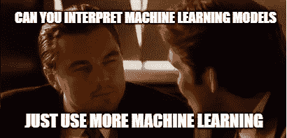

**图二** : ML 解释了另一个 ML 模因

通常，我们会将解释视为两个主要类:*局部*和*全局*。

1.  本地可解释性:提供每个预测是如何做出的详细解释。这将有助于用户信任我们的模型，并了解模型/建议是如何制定的。
2.  **全局可解释性**:提供对模型结构的整体理解，以及模型的一般工作方式。这对于需要在高层次上理解模型的资深人士或发起人来说更为重要。

现在让我们来看看每一种方法。

# *1。特征重要性*

特征重要性是一种全局解释方法，它提供了一个分数，表明数据中的每个特征在构建基于树的模型时的价值(在本例中为 Light GBM)。一个属性在每棵树上被用来做关键决策的次数越多，它的相对重要性就越高。

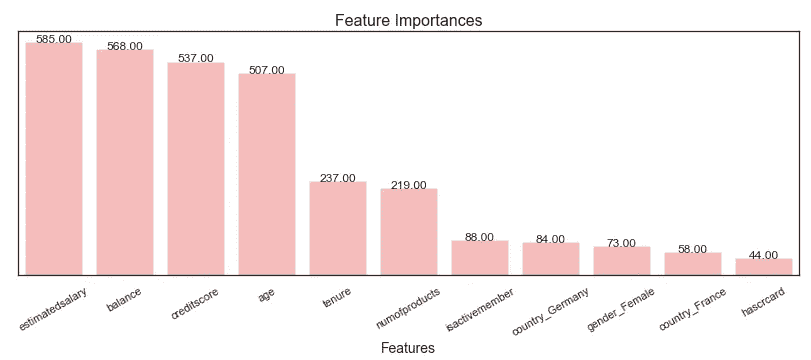

**图 3:** 使用增益作为度量，从轻型 GBM 生成的特征重要性

然而，有一个关键是我们需要理解它所代表的价值是什么。有几种计算/类型:

*   ***增益*** 表示通过使用每个特征对模型中每棵树的贡献来计算对模型的相对贡献。该值越高，该特征对于预测结果越重要
*   ***覆盖率*** 是与每个特性相关的相对观察数量，以所有特性覆盖率的百分比表示。让我们来看一些例子:`Feature x`用来决定叶节点`a`、`b`和`c`观察，因此覆盖范围是`a+b+c`。
*   ***权重*** 是表示该特征在模型的树中出现的相对次数的百分比，并表示为其占所有特征权重的百分比。

一般来说，我们将重点使用每个特征的**增益**。

# 2.ELI5

Eli5(或解释为 i5)是一个帮助进入机器学习模型并解释其预测的包。

看待分类或回归模型有两种主要方式:

1.  检查模型参数并尝试弄清楚模型如何全局工作(`eli5.show_weights()`)
2.  检查一个模型的单个预测，试图找出为什么模型会做出这样的决定(`eli5.show_prediction()`)

```
eli5.show_weights(lgb_model)
```

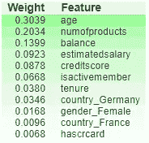

**图 4:** 特征的权重

上面的分数与特征重要性类似。

我们可以用`eli5`做的另一件事是**排列重要性**，或均值降低准确度(MDA)。其思想是，当*特征不可用*时，可以通过查看分数(可以是准确度 F1)降低多少来测量特征重要性。

为了避免重新训练机器学习模型，它不会删除该特征，而是通过从与原始特征值相同的分布中提取来用随机噪声替换它。这可以简单地通过改变一个特性的值来实现(如图 5 所示)。请注意，如果列的数量很大，这个过程可能会占用大量资源。

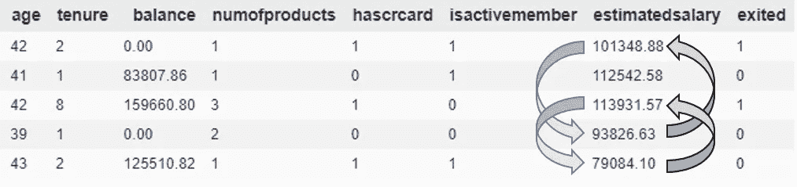

**图 5:** 如何进行洗牌的例子

排列重要性的结果如下表所示，`x±y`，越靠前的值是最重要的特征。第一个数字显示随机洗牌后模型性能下降了多少。该符号显示了由于特征上的混洗而导致的确切性能变化的一些随机性。通过重复洗牌过程来测量这种随机性，从而得出第二个数字。

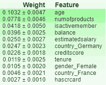

**图 6:** 排列重要性结果

有时，排列重要性会导致负值。这意味着由混洗数据产生的**预测最终比真实数据更加准确**。

然而，它并没有告诉你每个特性的重要性。如果一个特性具有中等排列重要性，这可能意味着它具有中等排列重要性；

*   对一些预测有较大影响，但总体上没有影响，或
*   所有预测的中等效果

ELI5 还可以用来做局部解释，解释来自机器学习模型的个体预测。它显示了特征权重，该权重是通过遵循集成树中每棵树的决策路径来计算的。决策路径上的每个特征的贡献是期望分数从父代到子代改变了多少。所有特征的权重加起来就是模型的输出分数。

```
eli5.explain_prediction_lightgbm(lgb_model, X_test.iloc[1])
```

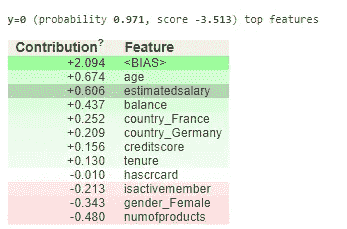

**图 7** :使用 eli5 的个别说明

请注意`<BIAS>`值，这是因为`eli5`中的解释器实现开始为所有树中的每个节点重建伪叶分数。该算法也适用于树的根节点，其被类似地分配伪叶分数。对所有树求和，所有根节点分数的总和就是你可能得到的所有树的平均分数。这就是`eli5`里的`<BIAS>`。

# 3.并行分布处理

部分相关图(PDP)是一种**全局解释方法**；该方法考虑了所有实例，并给出了关于特征与预测结果的全局**关系的陈述。它可用于显示目标和特征之间的关系是线性的、单调的还是更复杂的关系。**

对于分类问题，在模型输出概率的情况下，PDP 显示给定某个特性的不同值时某个类别的概率。

请注意特征重要性和部分相关的区别；

*   特征重要性显示了哪些变量对预测影响最大
*   部分相关性显示了特征如何影响预测

PDP 非常有用，可以为以下问题提供额外的见解；

1.  在不同的地区，类似大小的房子如何定价？
2.  两组之间预测结果的差异是由于具体特征的不同吗？

让我们来看看用法和结果图的例子。

```
pdp_goals = pdp.pdp_isolate(model=lgb_model, dataset=X_test, 
                            model_features=X_test.columns,  
                            feature='age')
pdp.pdp_plot(pdp_goals, 'Ages')
plt.show()
```

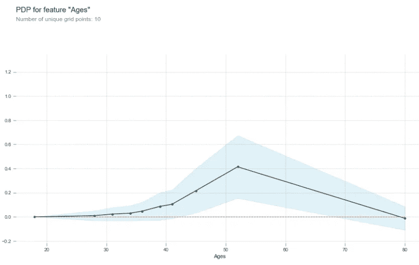

**图 8** :特性的 PDP

```
fig, axes = pdp.pdp_plot(pdp_goals, 'Ages', center=True,                                                           
                         plot_lines= True, x_quantile=True, 
                         show_percentile=True, frac_to_plot=100, 
                         plot_pts_dist=True)
plt.show()
```

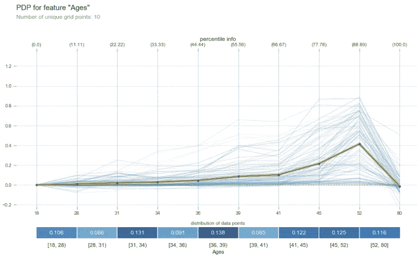

**图 9:** 另一个包含更多细节的 PDP

这里我们可以看到,`Ages`特征从 40 增加到 50，结局(退出)的概率增加。然而，这一特征的有效性降低了。

请注意，当我们解释该图时，当数据点不可用时，该区域的 PD 估计值不太可靠。

另一种用法是同时查看两个特征的部分相关性:

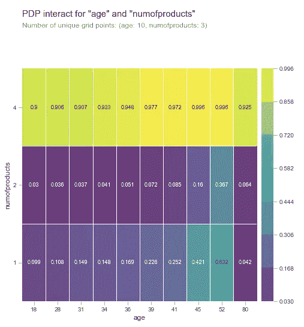

**图 10** :两个特征的 PD 交互图

在该图中，我们可以看到客户退出银行的概率以及年龄和产品特性数量的相互作用。同样，得出结论时要小心，任何增加/减少的概率可能只是一种相关性，而不是因果关系。

# 4.石灰

LIME，本地可解释的模型不可知解释，是实现**本地代理模型**的方法。LIME 不是训练一个全局的代理模型，而是专注于训练一个局部代理模型，通过围绕每个预测建立稀疏线性模型来解释黑盒模型如何工作，从而解释单个预测。

现在，我们可以使用**保真度测量**，可解释模型逼近黑盒预测的程度，来查看可解释模型在解释预测方面的可靠性。

在撰写本文时，LIME 是为数不多的能够处理表格数据、文本和图像的方法之一。

让我们来看看如何用 Python 来编写代码。首先，我们需要使用训练数据集来训练解释器，就像我们对其他机器学习算法所做的那样。

然后，我们可以为解释者提供每个单独的数据集来解释预测。

```
lime_explainer = lime.lime_tabular.LimeTabularExplainer(
   X_train.values,
   feature_names=X_train.columns.values.tolist(),
   class_names=['non_exited', 'exited'],
   verbose=True, mode='classification')expLgb = lime_explainer.explain_instance(
   data_row=X_test.values[1], 
   predict_fn=lgb_model.predict_proba, 
   num_features=3)expLgb.show_in_notebook(show_table=True)
```

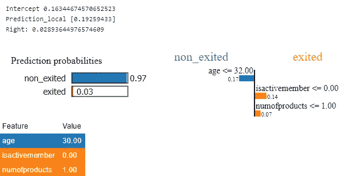

**图 11** :个人讲解员的输出

我们最终可以看到哪些特征正在影响预测以及预测的最终概率。请注意，在这种情况下，我只展示了前 3 个特性。

# 5.SHAP

SHAP 是一种通过计算每个特征对预测的贡献来解释单个预测的方法。然而，SHAP 也带来了许多基于 Shapley 值聚合的全局解释方法。 **SHAP 方法是基于博弈理论上的最优沙普利值**。

Shapley 值的技术定义是一个特征值在所有可能的联合中的平均边际贡献(T4)。或者，Shapley 值使用所有可能的输入组合来考虑实例的所有可能的预测。因此，Shapley 值是唯一具有可靠理论的解释方法，不像 LIME，它假设机器学习模型在局部具有线性行为。

SHAP 方法是将石灰与沙普利值联系在一起。让我们看看如何使用 SHAP 来解释和说明这个模型(全球和本地)。

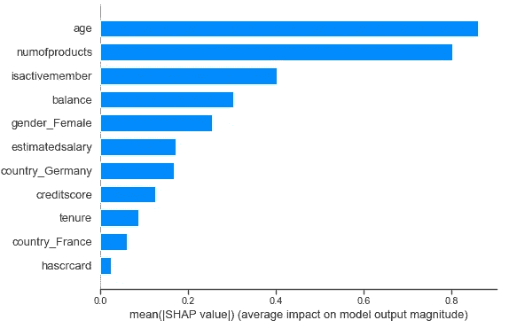

**图 12** : SHAP 版特征重要性

SHAP 使用 Shapley 值来表示特征的重要性，或者说它是基于特征属性的大小，这与排列特征重要性是不同的。

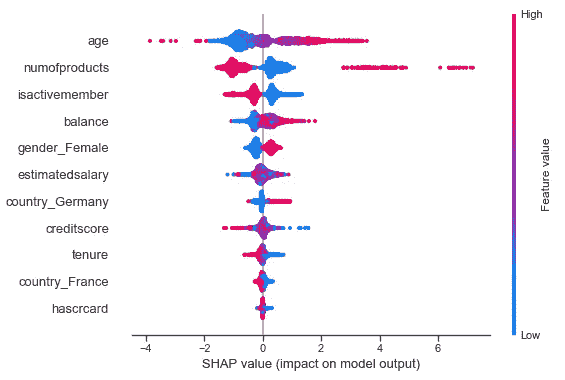

**图十三** : SHAP 概要图

该图结合了特征重要性和特征效果。图上的每个点都是特征和目标的 Shapley 值。这些特征根据其重要性进行排序(类似于*图 12* )。颜色表示特征的值，x 轴是 Shapley 值。

SHAP 还支持**依赖图**，通过使用`dependence_plot()`函数，它可以显示单个特征如何影响模型的输出。

下图显示了`age`特征如何与预测相互作用。该功能将选择另一个可视化功能(颜色)，我们可以使用`interaction_index=None`关闭它。

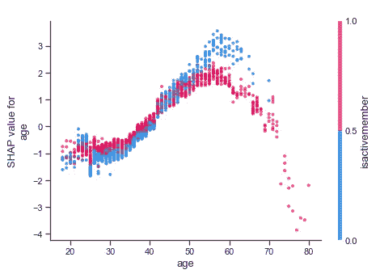

**图 14** :年龄特征与预测交互

SHAP 为每个单独的预测提供了可视化，在这种情况下，我们可以了解每个 SHAP 值如何影响预测。图中的基值是所有预测的所有 Shapley 值的平均值。

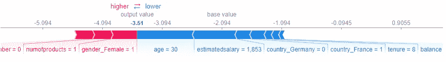

**图十五** : SHAP 个人解释

SHAP 也有如下几个缺点:

*   Shapley 值**需要大量的计算时间**，基于树的算法除外
*   可能是**曲解了**，不是从模型训练中去除特征后的预测值的差异。而是，给定特征值的当前集合，特征值对实际预测和平均预测之间的差异的贡献是估计的 Shapley 值。
*   Shapley 值总是**使用所有特征**来计算

# 结论

我已经为我们的黑盒模型提供了基本的解释方法，尽管这个例子是基于轻量级 GBM 的，但是大多数方法可以与其他算法一起重用。您可以选择使用哪种方法最适合您的用例，以及您将向谁进行演示(即，选择**本地解释**供实际操作用户进行交互并使用模型结果来做出决策，选择**全局解释**供业务主管查看哪些因素(特征)影响模型或我们试图解决的问题)。

所有的情节和代码以及解释都可以在下面我的 GitHub 库中找到。

[](https://github.com/netsatsawat/model-interpretation) [## netsatsawat/模型-解释

### 这个库存储 Jupyter 笔记本和 HTML 文件，笔记本解释了方法和演练…

github.com](https://github.com/netsatsawat/model-interpretation)*