# 基于和尚人工智能的手语分类

> 原文：<https://pub.towardsai.net/sign-language-classification-using-monk-ai-c9e34dc8f946?source=collection_archive---------1----------------------->

## 计算机视觉

## 介绍

手语是聋哑人的一种交流工具，其中手、面部和身体运动用于交流。全世界有超过 135 种不同的手语。全世界约有 4.66 亿人患有听力损失，其中 3400 万是儿童。据估计，到 2050 年，超过 9 亿人将遭受听力损失。

聋人没有太多的方法与听力正常的人沟通，因为许多解决方案存在很大的差距。口译员通常是没有的，而且费用也很高。虽然出现了新的和可获得的技术来帮助那些有语言和听力障碍的人，但仍有大量工作要做。人工智能和机器学习可以帮助开发一种解决方案。

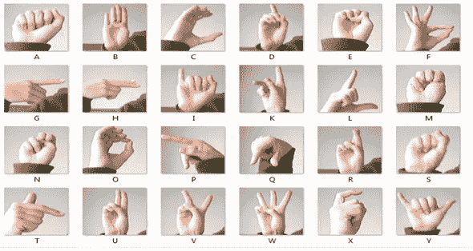

在这篇文章中，我建立了一个分类模型，这个模型将自动处理手语翻译。该模型建立在手势的美国手语字母数据库上，该数据库表示具有 24 类字母(不包括需要运动的 J 和 Z)的多类问题，并且标签(零-二十五)被表示为每个字母 A-Z 的一对一映射。

## 安装和下载数据

让我们从设置 Monk 及其依赖项开始:

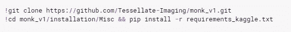

因为我正在使用 Kaggle，所以我安装了 Kaggle 依赖项。

在这个任务中，我使用了[手语——MNIST](https://www.kaggle.com/datamunge/sign-language-mnist?rvi=1)，它可以在 Kaggle 上的给定链接上下载。

让我们看看不同符号的含义:

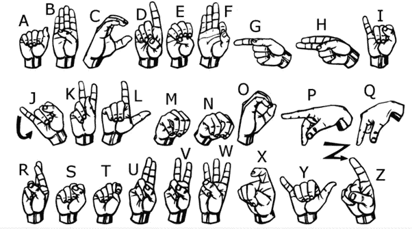

## 创造一个实验

我创建了一个实验，为了这个任务，我使用了 **mxnet 胶子后端。**

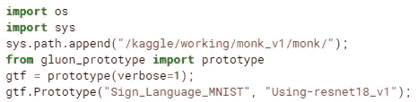

## 模型选择和培训

在这个实验中，我使用了“ **resnet18_v1** 模型。

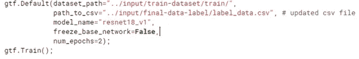

经过训练，我得到了以下结果:

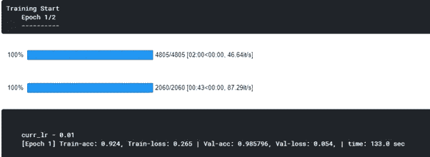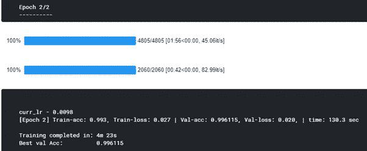

可以看出，epoch=2 后，训练准确率为 99%，验证准确率为 99%，相当不错。

## 测试数据集的准确性

在测试图像上检查模型的预测:

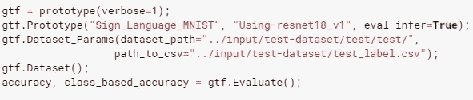

共有 7172 个测试图像，下面是对这些测试图像的预测:

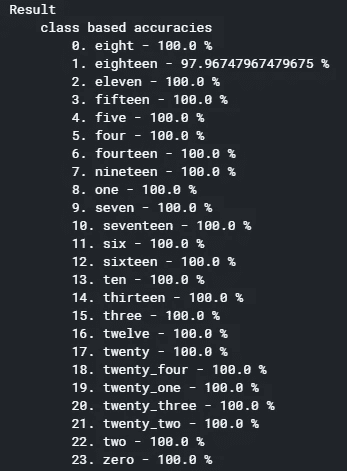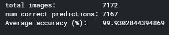

我们可以看到，在 7172 幅图像中，该模型已经正确预测了 7167 幅图像，这意味着 99.93%的准确率！

## 在测试图像上运行推理

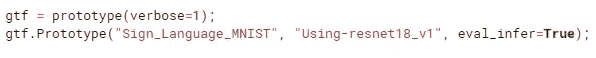

我已经选择了 2 个测试图像，并对这些图像进行了推理

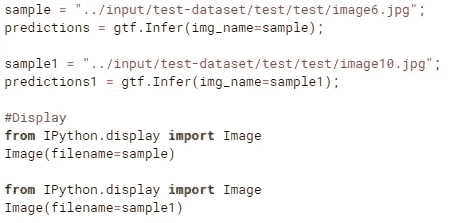

这是第一张图片。正如你所看到的，一个人不容易识别这是哪个字符，但这个模型将正确地对它进行分类。

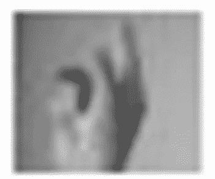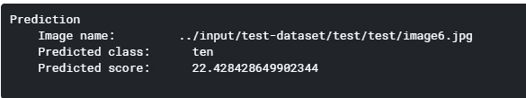

给定图像的预测类别是十(L)。模型已经分类正确！

第二个图像是:

像前面的图像一样，这个图像也不容易识别。

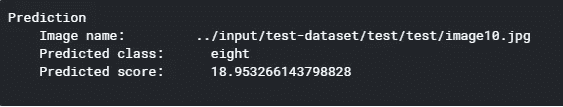

给定图像的预测类别是八(I)。模型再次正确地对其进行了分类！

这个模型在这个数据集上给出了相当不错的 99%的准确率。

本文中的所有代码都驻留在这个 Github 链接上:[https://Github . com/shubham 7169/MonkAI/blob/master/sign _ language _ mnist . ipynb](https://github.com/shubham7169/MonkAI/blob/master/sign_language_MNIST.ipynb)