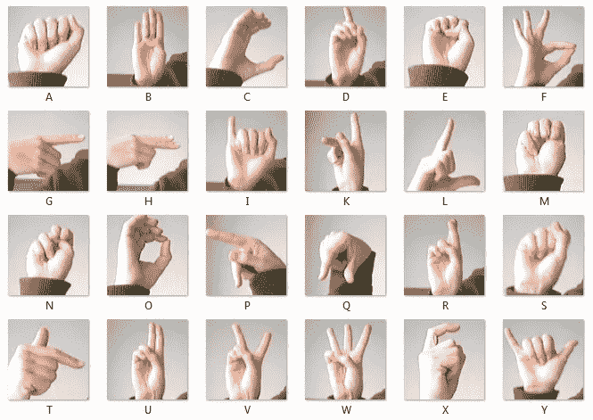
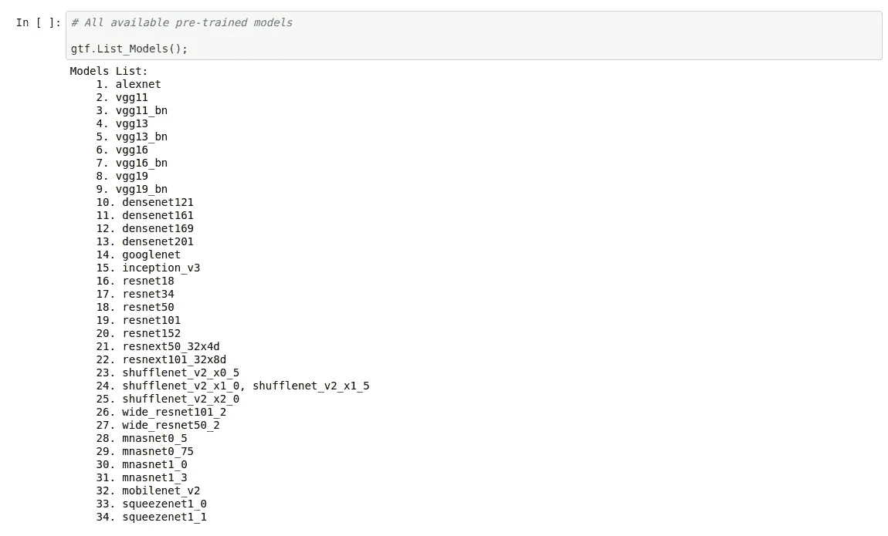
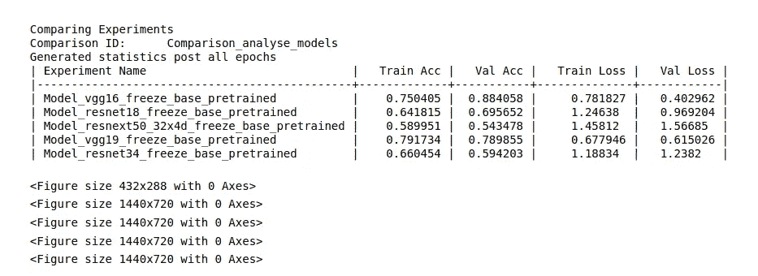
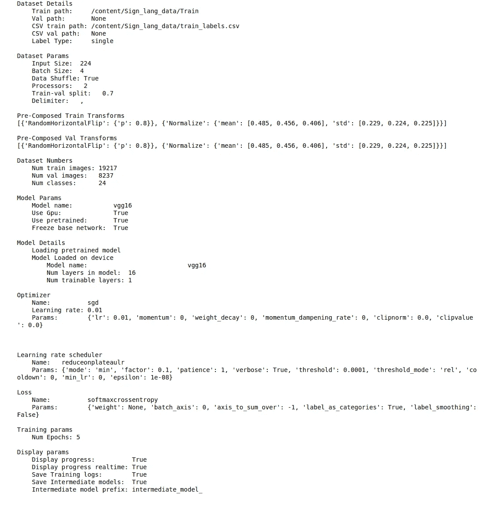
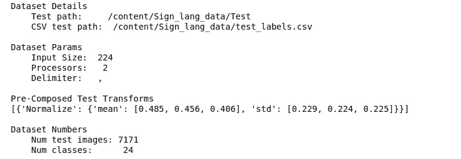
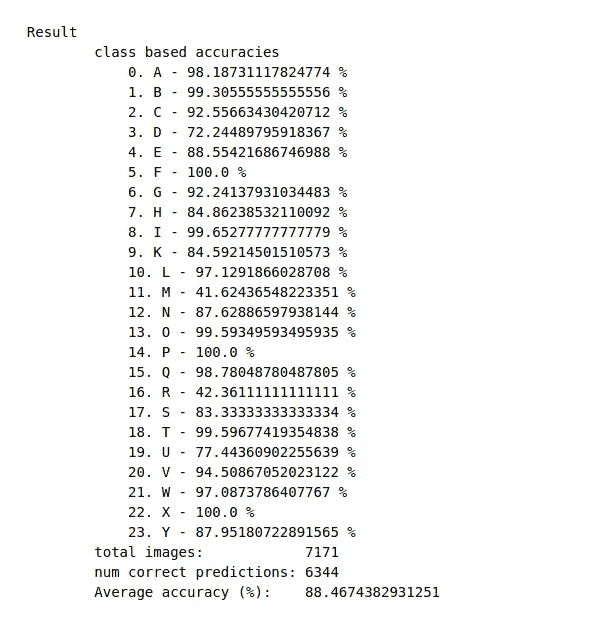
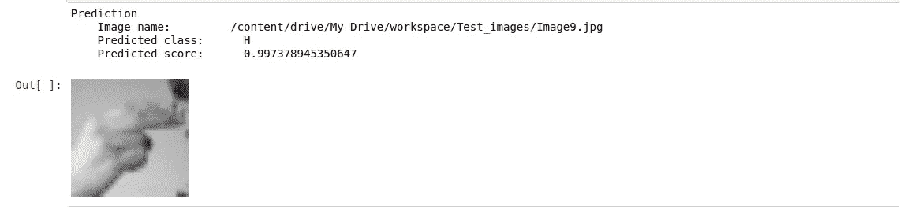

# 基于和尚人工智能的手语分类

> 原文：<https://pub.towardsai.net/sign-language-classification-using-monkai-f481f6c26fd0?source=collection_archive---------3----------------------->

## [计算机视觉](https://towardsai.net/p/category/computer-vision)，[深度学习](https://towardsai.net/p/category/machine-learning/deep-learning)

Monk AI 库是一个低代码库，用于计算机视觉，支持 Mxnet-Gluon、Pytorch 和 Keras 后端。这是一个神奇的库，让我们可以轻松地解决 CV 问题。

字母表的手语

## 关于项目:

这个项目是对手语进行分类，对应于字母，从而使我们能够解释一个有语言障碍的人试图告诉我们的信息。

这个项目非常有益，使用 MonkAI 库也很容易完成。因此，通过这篇博客，我将分享如何轻松构建这个项目的细节，以及如何使用 MonkAI 构建更棒的项目。

## 数据集:

对于任何分类，我们都需要将数据输入到模型架构中。在这种情况下，原始手语数据集(MNIST)的图像像素值存储在. csv 文件中。为了使任务对我来说更容易，我将它们预处理成。jpg 图片。和包含对应于每个图像的标签的 CSV 文件。

该数据集具有 27，454 个训练图像和 7171 个测试图像，每个图像的大小为 28×28。

数据集链接:[https://drive . Google . com/file/d/1 a5 cvk 7 bhsp 3 pexl 4 ur MOX 2 DOF 2 MDF qpx/view？usp =分享](https://drive.google.com/file/d/1A5cvK7bhsP3pexL4urMOX2Dof2mdFqPX/view?usp=sharing)

## 安装 MonkAI:

我在谷歌实验室做这个项目。，所以要安装我使用的 MonkAI 库，

但是如果你在本地设备或 Kaggle 上工作，你也可以把它安装在那里。

## 设置库，执行分类:

现在使用 Monk AI 相当简单，只需两到三个步骤即可设置库来执行任务。

1.  选择后端来执行分类，正如您在这里看到的，我正在使用 PyTorch 后端。

2.初始化项目将为您创建一个单独的工作区文件夹来存储项目。

3.现在获取训练数据集，执行训练

这里，数据集路径是指向包含列车图像的文件夹的路径，path_to_csv 包含指向标签文件的路径。

## 比较和分析模型性能:

通常，当我们进行迁移学习时，我们希望尝试不同的模型，以检查哪种模型架构最适合。Monk AI 可以让您轻松地比较不同的型号，并选择性能更好的型号。

提供预先训练的模型

因此，为了分析和比较模型性能，我们将不得不建立一个实验。

然后下一步是决定我们想要比较性能的模型。

在这里，我们首先检查 5 种不同的型号，如 vgg16、vgg19、resnet18、resnet34 和 resnext50_32x4d。性能将基于从 5%的训练数据和 5 个时期的训练中获得的结果。

调用分析器函数后，在标准 GPU 上完成该过程大约需要 10 分钟。一旦过程结束，我们就会看到这样的结果。

这给出了一个完整的概念，哪个模型在这个任务中表现得更好。

## 执行分类:

一旦决定了模型，我们将再次通过训练数据集。

一旦发生这种情况，您将会看到这样的输出。

在这里，您可以看到 0.7 的 train-val 分割是自动完成的，同时还对 train 和验证数据进行了一些转换。但是，您可以根据需要自由更改这些值。

现在我们将进行训练。

这将开始培训过程。一旦完成，我们将测试模型性能。

## 测试模型:

为了测试模型，我们有一个测试数据集，它已经在主数据集中提供了。

这将在推理模式下加载您的实验，以便您检查模型性能。

加载测试数据集后，输出将显示测试图像的数量，没有分类类别。

这将需要一些时间来运行，取决于测试数据集的大小，一旦完成，您将会看到类似这样的输出。

根据您更改超参数的方式，您的情况可能会有所不同。

除了基于类别的准确性之外，我们还可以在单个图像上检查我们的模型性能。

如你所见，它以大约 99%的置信度预测了图像的类别。

这样，使用 Monk AI 库，您可以执行分类任务，甚至可以向网络追加更多的自定义层，并构建更好的分类器。

## 资源:

手语分类项目:

[https://github . com/Tessellate-Imaging/monk _ v1/blob/master/study _ road maps/4 _ image _ class ification _ zoo/Classifier % 20-% 20 sign % 20 language % 20 detection(MNIST)。ipynb](https://github.com/Tessellate-Imaging/monk_v1/blob/master/study_roadmaps/4_image_classification_zoo/Classifier%20-%20Sign%20Language%20Detection(MNIST).ipynb)

Monk AI 文档:

【https://github.com/Tessellate-Imaging/monk_v1 号