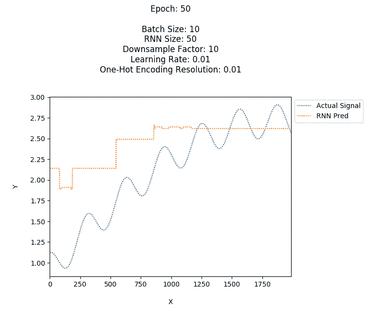
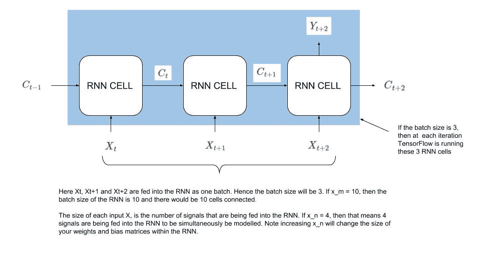
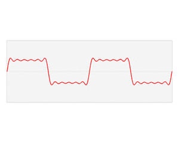
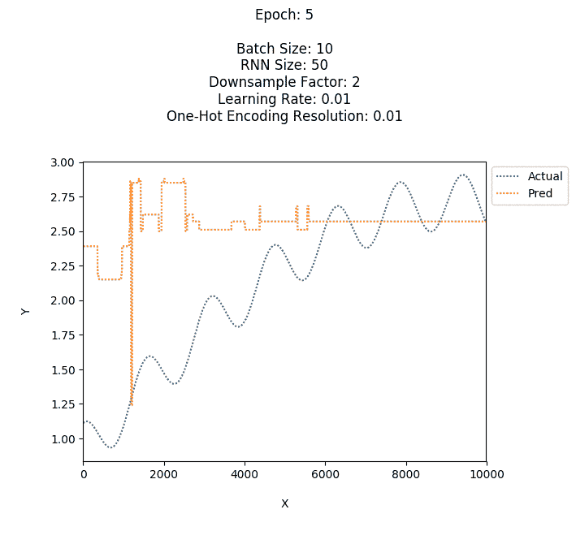
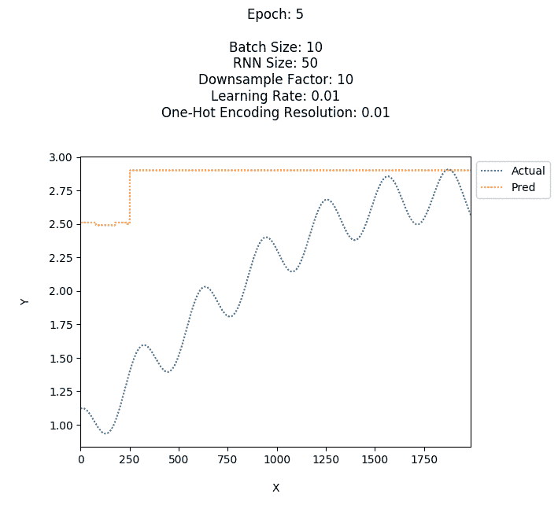

# 使用递归神经网络的信号建模

> 原文：<https://pub.towardsai.net/signal-modelling-using-recurrent-neural-networks-d832f0c50503?source=collection_archive---------0----------------------->

## 用 RNNs | [构建面向 AI](https://towardsai.net) 的信号建模器

在我之前的[文章](https://medium.com/@vsadhak/disassembling-recurrent-neural-networks-695ce75dddf6)中，我提到了理解事物的最好方法之一是把它拆开，看看它是如何工作的，然后用它来建造一些东西。在那篇文章中，我们剖析了一个递归神经网络(RNN ),并理解了它的工作原理。本文将集中于用 RNNs 构建一些东西，从而更深入地理解递归神经网络(RNNs)。我们将在 TensorFlow 中构建一个递归神经网络来模拟傅立叶级数。

# 基础工作

基本项目在[这里](https://github.com/veda-s4dhak/RNN_Signal_Modeler)有安装说明。我不会重复 TensorFlow 的基础知识，因为在其他地方[有广泛的介绍。然而，我将介绍 RNN 在 TensorFlow 中是如何构造的。](https://www.tensorflow.org/tutorials/)

在我们进入代码的细节之前，让我们先对信号建模器如何工作有一个高层次的了解。我们正在建模的信号只是一组坐标(x，y)。我们希望使用先前的 y 值通过 RNN 来建模/预测即将到来的 y 值。当我们将 y 值输入 RNN 时，RNN 将创建一个概率分布，将 y 的可能未来值映射到 y 的先前值

这里有一个重要的概念需要考虑。如果 y 是实值呢？在这种情况下，y 的未来值有无限多种可能的结果。例如，如果我们试图对函数 y=sin(x)建模。我们知道 y 被约束在[1，-1]之间。然而，y 可以在[1，-1]之间有无限个值。**因此，我们如何创建一个具有无限多个结果的概率空间的概率分布呢？为了简单起见，我们不会。相反，我们将人为地将概率空间(即 y 的值)离散化为我们需要的分辨率。**

在 y = sin(x)的情况下，我们将把[1，-1]分成几组区域。每个区域的大小将决定 RNN 模拟信号的分辨率。例如，如果我们有两个大小为 1 的区域。第一个区域包含[1，0]之间的所有值，另一个区域包含[0，-1]之间的所有值。我们模型的分辨率将是 1。如果我们使用分辨率为 1 的 RNN 对 y=sin(x)建模，结果将不会非常准确，因为模型将仅预测 2 个值。相反，我们需要更高的分辨率，这样模型才会准确。但是，请记住，如果分辨率太高，RNN 的大小将会增加，因此正向/反向传播的计算时间将会增加。我们希望在分辨率上取得平衡，我们的 RNN 生成一个精确的模型，而不需要太多的计算量。

要理解的核心思想是，实值函数可以通过离散化用 RNN 来建模。这个特定于神经网络的离散化过程被称为*一键编码* 。一旦实值函数被离散化，RNN 就可以创建一个概率分布，将以前的 y 值建模为新的 y 值。现在，我们对项目有了一个高层次的了解，让我们进入代码。

# 源头

RNN 在文件 RNN _ 信号 _ 建模器. py 中实现。其余文件用于支持功能:读取 CSV、绘制数据、记录。在 RNN _ 信号 _ 建模器. py 文件中，有一个名为 RNN _ 信号 _ 建模器的类，它包含三个方法:初始化(缩写为 init)、训练和运行。由于 RNN 是在 init()中构造的，我们将主要研究该方法。

要定义 RNN，必须指定几个关键参数。它们是 x_m、x_n、y_m、w_m、w_n、b_m、x_r、x_s、rnn_cell、输出、状态、预测、成本和优化器。注意，所有这些参数在源代码中都带有前缀“self”。理解这些参数非常重要，因为它们实际上代表了 RNN。

该网络由一组 RNN 单元构成。RNN 细胞的数量等于批量大小。批量大小定义为 x_m(批量大小将在下一节解释)。RNN 单元的这种分组在每次迭代中运行。下图进一步解释了输入参数 x_m 和 x_n。

大多数神经网络的标准标签矩阵定义为 y_m。标签矩阵是用来比较预测值和实际值的矩阵。权重矩阵定义为(w_m，w_n)，偏差矩阵定义为(b_m，1)。偏差矩阵不是多维矩阵。如上所述，输入矩阵的列数(x_n)会影响你的权重和偏差矩阵。具体来说，它会影响权重矩阵中的列数。条件是 w_n = x_n = b_m. **参数 w_m 很重要。它决定了你的 RNN 的大小。您可以将 w_m 设置得非常高，这将通过增加 RNN 细胞内的神经元数量来增加 RNN 的复杂性。注意细胞不是神经元，细胞内有大量的神经元。**更高复杂度的 RNN 将能够模拟更复杂的信号，然而，它将需要更多的内存和时间来训练和运行。****

参数 x_r 和 x_s 用于将输入矩阵 x 分割成许多小矩阵，每个小矩阵将被单独馈入 RNN。顾名思义，输出参数包含当前迭代中 RNN 的输出。状态是代表 RNN 单元内部状态的参数。它将被传递到下一个 RNN 细胞。这是完成数据的临时保留的地方，这是 RNNs 的核心功能(这里[解释](https://medium.com/@vsadhak/disassembling-recurrent-neural-networks-695ce75dddf6))。其余的参数，预解码，成本，优化等。是大多数其他网络(卷积神经网络等)的标准。)在 TensorFlow。

# 细节决定一切，校准

在运行 RNN 之前，校准网络的超参数非常重要。RNN 对一段数据建模的有效程度取决于超参数。你总是可以有超功率的超参数，以便 RNN 可以模拟几乎任何信号，然而，这是内存和时间的代价。为了达到事半功倍的效果，即在低内存资源和低计算量的情况下精确建模，我们必须对 RNN 进行校准。

**这些超参数是什么？这些是批量大小、一键编码、RNN 大小、学习速率、次数和下采样因子。**我们将尝试超参数的许多不同组合，并观察神经网络如何响应数据。

批量大小指的是 RNN 在每次迭代中生成输出所需的数据点数。**我们输入到网络中的数据点越多(批量越大)，网络就越能有效地进行预测。**批量越大，每次迭代网络越慢。这是因为批量大小与每次迭代运行的 RNN 池数量成正比。更多的 RNN 单元相当于更多的计算和内存。

如上所述的独热编码指的是如上所述被建模的信号的离散化。**有效独热编码的大小指的是 RNN 的分辨率。**更高的分辨率将创建更精确的模型，但需要模式记忆和训练时间。

RNN 大小是指每个单元内的复杂度。如上所述，RNN，我所说的复杂性指的是 RNN 细胞内的神经元。**更高的复杂度将允许 RNN 模拟更复杂的信号，但也会导致训练和运行需要更多的内存和时间。** RNN 大小可以被视为网络架构的一部分，但是，我更喜欢将其作为超参数的一部分，因为它比其他超参数更显著地影响精度、计算时间和所需内存。因此，根据您的数据校准 RNN 大小非常重要。

**学习率指的是每当 RNN 出错时，它将做出的修正的大小。**如果学习率太高，RNN 将总是过校正，并且永远不会得到正确的预测。另一方面，如果学习率太低，那么 RNN 将需要很长时间(可能永远不会)才能得到正确的预测。在我们的代码中，我们将从一个高的学习率开始，然后迅速降低到原来的十分之一。这允许 RNN 在训练的初始阶段过度校正，然后当它在一个良好的值范围内预测时，学习率将降低，以允许 RNN 学习信号的细微差别。

次数是指 RNN 将重复数据训练的次数。更多的纪元会给 RNN 更多的机会去尝试、失败和修正它的预测。更高的历元数也意味着需要更长的训练时间。

下采样因子实际上与数据集相关，而不是与 RNN 直接相关。降采样是指降低数据集的分辨率。如果我们以因子 10 对数据集进行下采样，那么我们将取数据集中每第 10 个值，并忽略其余的 9 个值。降采样允许 RNN 从更一般的角度来看待数据。下采样和批量大小密切相关。**较高的下采样因子和较高的批量，允许 RNN 回溯到很远的时间，但会损失分辨率(时间序列数据的时间分辨率损失)。**

至此，我们已经设计了一个 RNN。那是什么意思？嗯，这意味着你已经有效地创建了一个可以看透时间的人工神经网络。**现在让我们输入我们的神经网络数据，看看它是如何实现的！**

# 数据生成

我们将提供什么样的数据？任意信号。我们从哪里得到这些任意的信号呢？我们会自己做的！使用傅立叶级数，我们将生成我们自己的信号，这些信号具有不同的幅度、频率和复杂性。然后，我们将使用这些生成的信号来训练和测试我们的 RNN。为了您的方便，下面是傅立叶级数的快速入门。

一个名叫约瑟夫·傅立叶的法国数学家和物理学家首先将傅立叶级数理论化。傅立叶级数的基本思想是，时间的函数可以用各种谐波的无限和来近似，谐波是正弦和余弦，如下所示。

傅立叶级数([来源](https://en.wikipedia.org/wiki/Fourier_series))

本质上，我们将通过傅里叶级数产生信号，然后通过 RNN 对其建模。我们可以增加复杂性和规模来挑战 RNNs 的极限！谢谢，[傅立叶先生](https://en.wikipedia.org/wiki/Joseph_Fourier)！

# 这里什么都没有…

我选择了由下面的傅立叶级数定义的任意信号来用 RNN 建模。它有一个变化的频率和幅度范围，足以证明我们的系统。

y = 2s in(0.08 x)+0.02 cos(2x)+sin(0.02 x+2)+sin(0.001 x)

从批量大小为 10、RNN 大小为 50、下采样因子为 2 以及独热编码分辨率为 0.01 开始，经过 45 个时期的训练后，我们得到以下结果。

正如所观察到的，网络对数据的建模不够精确。可能是因为数据的分辨率太高，RNN 需要查看更早的数据。我们可以增加批量大小或增加下采样因子。**为了便于实验，我们将下采样因子增加到 10。**

预测略有改善，网络仍可进一步完善。它仍然不能精确地模拟较高频率的分量。在任何特定的学习速度下，我们只运行 5 个时期。让我们给网络更多的时间来训练每个学习速率。**让我们将每个学习率的时期数从 5 增加到 50** 。

看起来不错！增加纪元的数量给了 RNN 更多的机会去学习信号的细微差别，事实也的确如此！

因此，通过简单地改变下采样因子、批量大小和周期数，我们能够校准网络来模拟该信号。

# 瞧啊。

好了，现在你知道了，我们已经知道了如何使用 RNNs 来构建一个信号建模器！我希望这能让 RNNs 更容易理解。这可能是一个很好的练习，产生更复杂的信号，并尝试用 RNN 来模拟它们。修改本文中提供的 RNN 代码来模拟多变量信号可能会更好(**提示:**rnn _ signal _ modeller . py 中的第 66 行)。

RNNs 是神经网络领域的核心构件。由于 CNN 在建模空间方面是有效的，rnn 在建模时间方面是有效的。CNN 能够创建高效且有效的数据模型，这些数据在每次迭代中都是固有的大数据(例如视频)。另一方面，rnn 在对迭代之间存在潜在关系的数据进行建模时是有效的。观察 RNNs 将如何发展并与人工神经网络领域中的其他基本构件一起应用将是有趣的。我很高兴看到 RNNs 的未来发展。