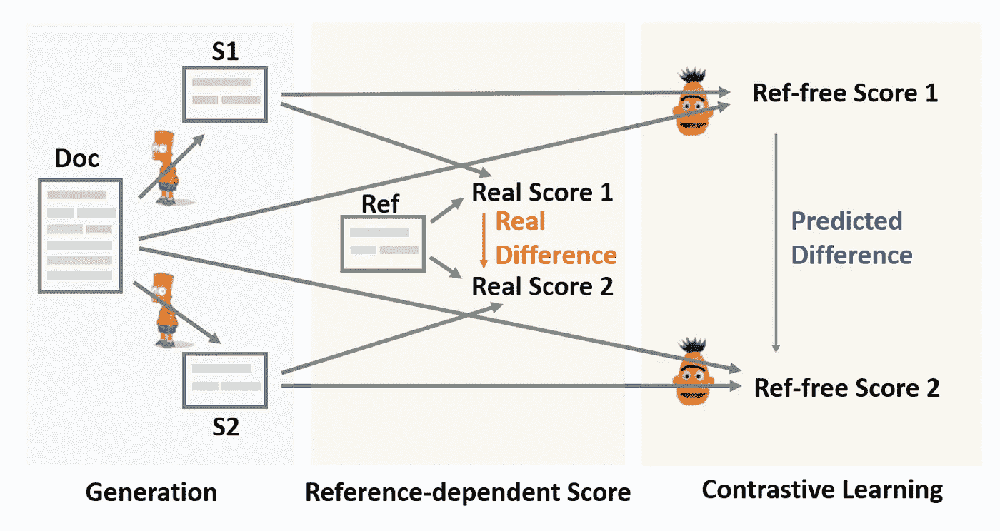
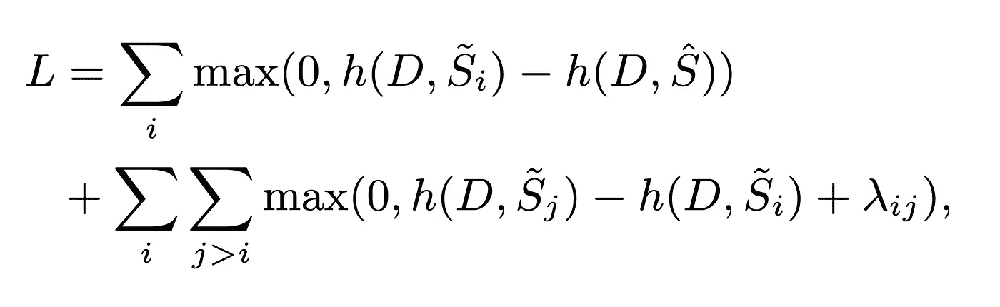
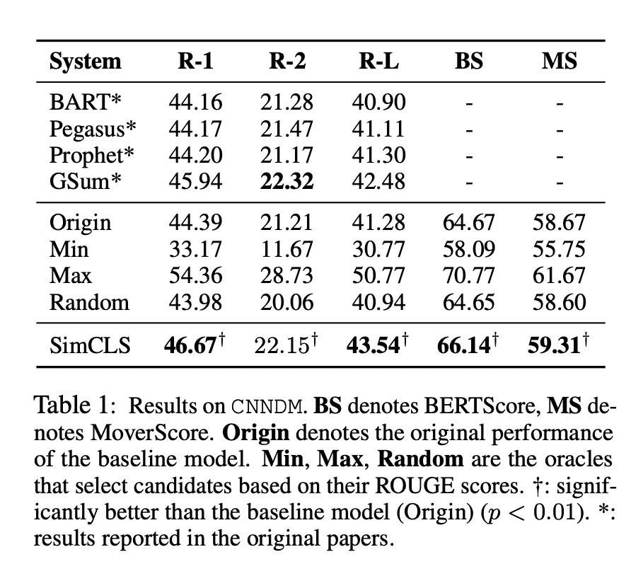
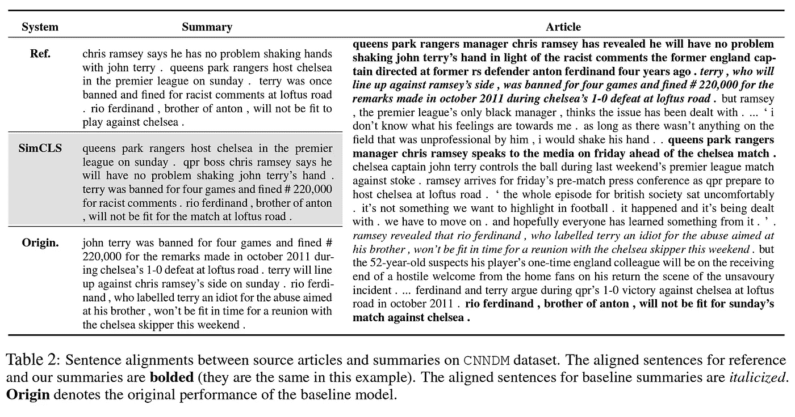

# SimCLS:抽象概括对比学习的一个简单框架

> 原文：<https://pub.towardsai.net/simcls-a-simple-framework-for-contrastive-learning-of-abstractive-summarization-review-explained-87f9d394c620?source=collection_archive---------2----------------------->

## 解释目前在抽象文本摘要方面拥有最先进成果的论文。

图一。论文整体介绍了体系结构。(摘自[1])

这篇论文发表于 2021 年 6 月，不是比较新的研究。(至少在快节奏的机器学习宇宙中)但是，它已经在我跟踪的抽象概括[排行榜](http://nlpprogress.com/english/summarization.html)上排名第一九个月了，以同样的机器学习宇宙标准来看，这是令人印象深刻的！他们使用对比学习方法和两阶段架构的组合，将 BART [2]和 PEGASUS [3]等模型的性能提高了 2.5 分(R-1 分数)。让我们看看他们简单的想法是如何工作的，以及为什么他们的结果显示有很大的改进空间。

# 生成-然后评估

这就是他们所谓的“生成-然后评估对比学习的两阶段框架”；主要想法是提出一个解决方案，以一种不依赖于参考摘要的方式将对比学习纳入生成过程。它可以弥补我们用来“训练(损失函数)”和“评估(评估度量)”模型之间的差距。提到的两个阶段是**生成**和**对比学习**，讨论如下:

1.  **发电模型:**它可以是任何预训练的[基于序列间变压器的](/a-full-introduction-on-text-summarization-using-deep-learning-with-sample-code-ft-huggingface-d21e0336f50c)模型。该研究使用 BART-large 生成了 16 个候选摘要，使用了不同的波束搜索解码策略。这款被冻*(我觉得！)*并且仅用于创建一堆候选摘要。
2.  **对比学习(或评估模型):**论文使用罗伯塔模型(具体地说，CLS 令牌的输出)来度量每个候选摘要和文章之间的余弦距离。他们的理论是，一个好的摘要应该与源文档有很近的距离！因此，这个距离被用作对每个候选人进行排名的分数，以找到具有最高排名的最终输出。
    以下公式用于在训练评估模型时计算损失值。我不打算解释这个公式，但基本上，它意味着最高分的候选摘要将与目标摘要和其他候选摘要进行比较，以计算损失值。

图二。评估模型的损失函数。

损失函数取自 MatchSum [4]的论文。您可以阅读该研究，以便更深入地分析损失函数。这两个片段的想法很接近*(真的很接近！不同之处在于它应用于提取还是抽象概括。火柴纸有积极和消极得分总结的想法，以实现对比性质。但是，SimCLS 的研究只是提到了下面这句话。*

> 这里的“对比性”反映在由参数化模型评估的自然生成的摘要的不同质量中…

如果他们能更详细地说明他们的意思，我会很高兴。对比学习的基础之一是呈现不一样的样本(如猫和狗的图片)，让模型从中学习。这是一种自我监督的方法。从一个模型生成的各种摘要确实不同，但它们并没有相互对比。我期望看到一些证明在标题中使用“对比学习”的东西！但是，这个模型有一个很酷的标题，所以这并不重要。

# 结果

该论文在三个不同的分数 ROUGE、BERTScore 和 MoverScore 上评估了他们提出的方法，如图 3 所示。我们将只查看 CNN/DM 数据库的结果。值得注意的是，该架构还提高了 XSum(更短摘要)数据库的分数。

图 3。结果是使用 CNN/DailyMail 数据库。

结果非常清楚。SimCLS 模型在几乎所有基准测试中都优于竞争对手。因此，生成大量结果并在之后过滤它们的新趋势也可以改进摘要任务。虽然，对我来说更令人兴奋的结果是 **Max** 基准测试。我的意思是 54.36 R1 分数是疯狂的！

据我所知， **Max** 基准测试代表我们将目标摘要传递给模型并要求它输出最佳摘要的情况。意味着模型已经知道目标是什么，这不是我们在推断时一般想要的。但是，这也显示了潜力！从技术上讲，我们可以通过使用不同的损失函数来增加分数。

图 4。样本案例上的位置对齐。

像 ROUGE 这样的分数是比较不同型号性能的不错的指标。但是，它不在上下文级别上评估摘要。这意味着模型可以学习生成一个摘要，其中包含许多接近目标的单词，这将增加(至少)R-1 分数，而生成的文本没有任何意义，在许多情况下，甚至可能在语法上不正确！这是文本摘要领域的一个已知问题！缺乏良好的评估标准。

这篇文章很好地展示了所提出的方法生成的摘要提供了更好的**上下文**。他们在实体层面和句子层面都做了实验。他们提出的一个有趣的发现是，seq2seq 模型通常倾向于在文章开头生成更多焦点的摘要。如果你正在研究文本摘要领域，这是显而易见的，但是我从来没有研究过。事实证明，他们的模型可以通过更多地关注文章的其余部分来减轻这种偏见。您可以在图 4 中看到，SimCLS 框架模型结果集中在文章的最后一句！

# 结论

多级神经网络现在越来越流行，这是有原因的。他们工作了！本文主要研究抽象的文本摘要，并表明产生一组不同的摘要并从中选择最佳的摘要作为最终输出是有益的。然而，仍有改进的余地。

> 我每周给 NLP 的书呆子发一份时事通讯。如果您想了解自然语言处理的最新发展，可以考虑订阅。
> [阅读更多，订阅](https://nlpiation.github.io/) —加入酷孩子俱乐部，立即报名！

参考文献 **【1】**刘 y .&刘 P. (2021)。Simcls:抽象概括对比学习的简单框架。arXiv 预印本 arXiv:2106.01890。
**【2】**刘易斯，m .，刘，y .，戈亚尔，n .，加兹维尼贾德，m .，穆罕默德，a .，利维，o .，… &泽特勒莫耶，L. (2019)。Bart:用于自然语言生成、翻译和理解的去噪序列间预训练。arXiv 预印本 arXiv:1910.13461
**【3】**张，j，赵，y，萨利赫，m，&刘，P. (2020，11 月)。Pegasus:用提取的间隔句进行抽象摘要的预训练。在*机器学习国际会议*(第 11328–11339 页)。PMLR。
*【钟鸣】、陈、王丹青、邱希鹏、黄。2020.作为文本匹配的摘要。在*计算语言学协会第 58 届年会会议记录*中，6197-6208 页，在线。计算语言学协会。*