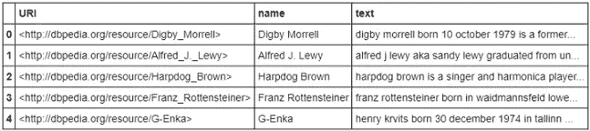
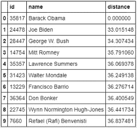

# 用几行代码在 Python 中搜索相似的文本:一个 NLP 项目

> 原文：<https://pub.towardsai.net/similar-texts-search-in-python-with-a-few-lines-of-code-an-nlp-project-9ace2861d261?source=collection_archive---------0----------------------->

## [自然语言处理](https://towardsai.net/p/category/nlp)

## 在 Python 中使用计数矢量器和最近邻法查找相似的维基百科资料，这是一个简单而有用的自然语言处理(NLP)项目


由[安东尼·马蒂诺](https://unsplash.com/@amartino20?utm_source=medium&utm_medium=referral)在 [Unsplash](https://unsplash.com?utm_source=medium&utm_medium=referral) 上拍摄

## **什么是自然语言处理？**

自然语言处理(NLP)是指开发理解人类语言的应用程序。如今 NLP 有如此多的用例。因为人们每天都在通过博客、社交媒体评论、产品评论、新闻档案、官方报告等等产生数千千兆字节的文本数据。搜索引擎是 NLPs 最大的例子。我不认为你会发现你周围有很多人从来没有使用过搜索引擎。

## **项目概述**

根据我的经验，最好的学习方法是做一个项目。在本文中，我将用一个真实的项目来解释 NLP。我将使用的数据集名为“people_wiki.csv”。我在 Kaggle 找到了这个数据集。**请随意从这里下载数据集:**

[](https://www.kaggle.com/sameersmahajan/people-wikipedia-data) [## 人民维基百科数据

### 维基百科关于各种人的信息

www.kaggle.com](https://www.kaggle.com/sameersmahajan/people-wikipedia-data) 

该数据集包含一些名人的名字、他们的维基百科 URL 以及他们的维基百科页面的文本。因此，数据集非常大。这个项目的目标是，找到有相关背景的人。最后，如果你给算法提供一个名人的名字，它将根据维基百科的信息返回预定数量的具有相似背景的人的名字。这听起来是不是有点像搜索引擎？

## **分步实施**

1.  导入必要的包和数据集。

```
**import** **numpy** **as** **np**
**import** **pandas** **as** **pd**
**from** **sklearn.neighbors** **import** NearestNeighbors
**from** **sklearn.feature_extraction.text** **import** CountVectorizer
df = pd.read_csv('people_wiki.csv')
df.head()
```



2.向量化“文本”列

## **如何矢量化？**

在 Python 的 scikit-learn 库中，有一个名为'[计数矢量器](https://scikit-learn.org/stable/modules/generated/sklearn.feature_extraction.text.CountVectorizer.html)'的函数。这个函数为每个单词提供一个索引，并生成一个向量，其中包含每个单词在一段文本中出现的次数。在这里，我用一小段文字来演示一下，供大家理解。假设，这是我们的文本:

```
text = ["Jen is a good student. Jen plays guiter as well"]
```

让我们从 scikit_learn 库中导入函数，并将文本放入函数中。

```
vectorizer = CountVectorizer()
vectorizer.fit(text)
```

在这里，我打印词汇:

```
print(vectorizer.vocabulary_)#Output:
{'jen': 4, 'is': 3, 'good': 1, 'student': 6, 'plays': 5, 'guiter': 2, 'as': 0, 'well': 7}
```

看，课文中的每个单词都有一个数字。那些数字是那个词的索引。它有八个重要的单词。所以，指数是从 0 到 7。接下来，我们需要转换文本。我将把转换后的向量打印成一个数组。

```
vector = vectorizer.transform(text)
print(vector.toarray())
```

下面是输出:[[1 1 1 1 2 1 1]]。“Jen”的索引为 4，并且出现了两次。所以在这个输出向量中，第四个索引元素是 2。所有其他的单词只出现了一次。所以矢量的元素是 1。

**现在，使用相同的技术对数据集的“文本”列进行矢量化。**

```
vect = CountVectorizer()
word_weight = vect.fit_transform(df['text'])
```

在演示中，我先使用了“fit ”,然后使用了“transform”。但方便的是，您可以同时使用拟合和变换。这个单词权重是我之前解释过的数字向量。“文本”列中的每一行文本都有一个这样的向量。

3.在[最近邻](https://scikit-learn.org/stable/modules/neighbors.html)函数中拟合上一步的“单词权重”。

最近邻函数的思想是计算预定义数量的训练点到所需点的距离。如果不清楚，不要担心。看看实现，对你来说会容易一些。

```
nn = NearestNeighbors(metric = 'euclidean')
nn.fit(word_weight)
```

4.找出 10 个与巴拉克·奥巴马总统背景相似的人。

首先，从数据集中找到‘巴拉克·奥巴马’的索引。

```
obama_index = df[df['name'] == 'Barack Obama'].index[0]
```

计算与奥巴马总统背景最接近的 10 个人的距离和指数。在单词权重向量中，包含关于“Barak Obama”的信息的文本的索引应该与数据集在同一索引中。我们需要传递那个索引和我们想要的人的号码。这将返回这些人与“巴拉克·奥巴马”的计算距离以及这些人的指数。

```
distances, indices = nn.kneighbors(word_weight[obama_index], n_neighbors = 10)
```

将结果组织在数据帧中。

```
neighbors = pd.DataFrame({'distance': distances.flatten(), 'id': indices.flatten()})
print(neighbors)
```


让我们从索引中找出这些人的名字。有几种方法可以从索引中找到名字。我用了合并功能。我只是将上面的“邻居”数据帧与原始数据帧“df”合并，使用 id 列作为公共列。按距离排序的值。奥巴马总统应该和自己没有距离。所以，他是第一名。

```
nearest_info = (df.merge(neighbors, right_on = 'id', left_index = **True**).sort_values('distance')[['id', 'name', 'distance']])
print(nearest_info)
```



根据维基百科提供的信息，这是与奥巴马总统最亲近的 10 个人。结果是有意义的，对吗？

类似的文本搜索可以在许多领域有用，如搜索类似的文章，类似的简历，类似的项目简介，类似的新闻条目，类似的歌曲。希望你觉得这个小项目有用。

## 推荐阅读:

[](https://towardsdatascience.com/a-complete-k-mean-clustering-algorithm-from-scratch-in-python-step-by-step-guide-1eb05cdcd461) [## Python 中从头开始的完整 K 均值聚类算法:分步指南

### 还有，如何使用 K 均值聚类算法对图像进行降维

towardsdatascience.com](https://towardsdatascience.com/a-complete-k-mean-clustering-algorithm-from-scratch-in-python-step-by-step-guide-1eb05cdcd461) [](https://towardsdatascience.com/great-quality-free-courses-to-learn-machine-learning-and-deep-learning-1029048fd0fc) [## 学习机器学习和深度学习的优质免费课程

### 顶级大学高质量免费课程的链接

towardsdatascience.com](https://towardsdatascience.com/great-quality-free-courses-to-learn-machine-learning-and-deep-learning-1029048fd0fc) [](https://towardsdatascience.com/a-complete-guide-to-confidence-interval-and-examples-in-python-ff417c5cb593) [## 置信区间的完整指南，以及 Python 中的示例

### 对统计学中一个非常流行的参数——置信区间及其计算的深入理解

towardsdatascience.com](https://towardsdatascience.com/a-complete-guide-to-confidence-interval-and-examples-in-python-ff417c5cb593) [](https://towardsdatascience.com/want-to-become-a-data-scientist-in-12-weeks-3926d8eacee2) [## 想在 12 周内成为数据科学家？

### 花钱前再想一想

towardsdatascience.com](https://towardsdatascience.com/want-to-become-a-data-scientist-in-12-weeks-3926d8eacee2) [](https://towardsdatascience.com/an-ultimate-cheat-sheet-for-numpy-bb1112b0488f) [## Numpy 的终极备忘单

### 对学习也有好处

towardsdatascience.com](https://towardsdatascience.com/an-ultimate-cheat-sheet-for-numpy-bb1112b0488f) [](https://towardsdatascience.com/an-ultimate-cheat-sheet-for-data-visualization-in-pandas-4010e1b16b5c) [## 熊猫数据可视化的终极备忘单

### 熊猫所有的基本视觉类型和一些非常高级的视觉…

towardsdatascience.com](https://towardsdatascience.com/an-ultimate-cheat-sheet-for-data-visualization-in-pandas-4010e1b16b5c)