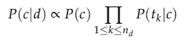
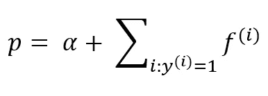
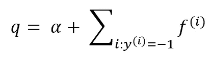
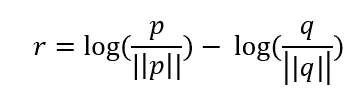
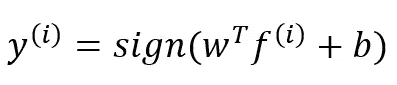

# 简单，好的情感分类

> 原文：<https://pub.towardsai.net/simple-good-sentiment-classification-726984bd73d4?source=collection_archive---------3----------------------->

## 使用多项式的情感分类


坦纳·博瑞克在 Unsplash[拍摄的照片](https://unsplash.com/s/photos/machine-learning?utm_source=unsplash&utm_medium=referral&utm_content=creditCopyText)

在这篇文章中，我引用了一篇最先进的论文[1]，该论文使用多项式 NB 对情感进行分类。读完这篇文章后，您将能够体会到朴素贝叶斯这样简单的技术在一些分类任务中是多么的有效。

## 什么是多项式 NB？

在他的书[2]中， *Manning 等人*介绍了多项式朴素贝叶斯或 MNB 模型，一种概率学习方法。根据朴素贝叶斯，文档 *d* 在类别 *c* 中的概率计算如下:



资料来源:c . Manning，Raghavan，p .，& Schütze，H. (2008 年)。*信息检索简介*。剑桥:剑桥大学出版社。doi:10.1017/CBO 978051180971

其中 *P(tₖ|c)* 是术语 *tₖ* 出现在类别 *c* 文档中的条件概率。我们将 *P(tₖ |c)* 解释为对 *tₖ* 贡献了多少证据来证明 *c* 是正确的类的一种度量。P(c) 是文档出现在类别 *c* 中的先验概率。 *(t₁，t₂，。。。，tₙ)* 是 *d* 中的记号，是我们用于分类的词汇的一部分。例如，单句文档*西雅图不是晴天*的标记可能是{ *西雅图*，*是，不是，晴天}* ，n = 4。

## 多项式 NB 启发的情感分类器

在论文[1]中，研究人员使用 MNB(以及其他类似的算法)来预测不同数据集的情绪。他们使用计数向量来记录文档中的字数。

我首先尝试了一个简单的例子来展示如何填充计数向量，然后是如何进行预测。最后，我在一个相当大的数据集中使用了相同的方法对文档进行分类。

## 定义 p 和 q

在本文中，我们假设任何文档 *d* 都可以归为这两类中的一类。文件以客户评论的形式出现，类别为*正面*和*负面*。我们定义词汇表`*V*`，它是数据集中所有标记的通用集合。

我们通过下面给出的公式定义`*p*` 。简单来说，`*p*`是一个向量，为**正面评论**保存词汇`*V*` 中每个 token 出现的次数。这里的`***f***` 是 *1* 如果令牌出现在`***i***` 否则 *0。* `*α*` 为平滑因子(取为 1)。



图片作者:计算 **p** 计数向量

类似地，我们将`*q*`定义为针对**负面**评论的词汇表中每个单词出现的计数向量。



图片作者:计算 **q** 计数向量

## 生成 p 和 q 向量的示例

让我们通过一个例子来理解 p 和 q 值。为了简单起见，我采取了一个审查，每一个相应的积极和消极的类别。

1.  我们用`*α*` (1)初始化`*p*`和`*q*`字典中的记号
2.  我们创造并列举词汇`*V*` *。*
3.  我们遍历每一个正面评论，如果评论中有令牌，则递增`*p*`中令牌的计数。
4.  当迭代负面评论时，我们类似地填充`*q*`字典。

用于填充 p 和 q 计数向量的代码片段

上面的例子为词汇 *V.* 产生了下面的值 *p* 和 *q*

词汇的 p 和 q 向量

## 理解 r 矢量

一旦我们有了`*p*`和`*q*`，我们通过下面的公式最终定义`*r*`。



作者图片:填充 r 向量的计算

*r* 试图通过找到该表征的正( *p* )和负( *q* )出现之间的归一化对数差来捕捉表征的情感。简单来说，如果`*r* < 0`，这意味着令牌似乎具有负面情绪，如果`*r* > 0`，那么它具有正面情绪。

下面这段 python 代码试图为 *V.* 中的每个标记计算 *r*

计算 r 向量

对于上述例子，下表说明了对应于词汇表`*V*`中每个标记的 r 值。我们可以仔细观察到，令牌如*简单*和*好*有**正**，而令牌如*确实*和*坏*有**负** `*r*`值。

词汇的 r 向量值

## 介绍分类模型

一旦计算出了`*r*`值，论文就使用一个简单的线性模型来预测评论的情绪。该模型描述如下。我们通过采用朴素贝叶斯公式(在文档开始时定义)并对两边取对数，最终得到这个线性模型。我们这样做是因为许多条件概率是成倍增加的，一个条件概率对应一篇评论中的一个标记。这可能导致浮点下溢。因此，通过增加概率的对数而不是乘以概率来执行计算是更好的。



按作者分类的图像:文档分类的线性模型

其中，
*b = log(N+/N-)
w = r
f =大小为|V|* 的向量

这里， *N+* 和 *N-* 是正面和负面评论的计数。下面的例子将有助于更好地理解模型变量。同样，为了简单起见，我们采取了另一个测试审查`test_review`进行分类。我们使用词汇表`*V*`和上例中计算出的`*r*`值(将其视为训练集)对`test_review`进行分类。

我们通过将词汇表`*V*` 中出现在`test_review`中的所有记号标记为 *1* ，其余标记为 *0，来创建大小为`*|V|*`的向量`*f*`。*我们定义`*w = r*` *、*最后计算转置`*w*`和`*f*`的点积。简单地说，我们只是对出现在词汇`*V*` *中的`test_review` 中的所有记号的`*r*`值求和。*python 脚本计算`*y*`并使用其符号来确定评论应该被分类为正面还是负面。

预测班级

```
V = ['This', 'is', 'a', 'simple', 'good', 'review', 'indeed', 'bad']
w = [ 0\.    0\.    0\.    0.69  0.69  0\.   -0.69 -0.69]
f = [1, 1, 1, 0, 0, 1, 0, 1]
b = 0.0
y = -0.69
Predicted a negative review
```

## 在大型数据集上建模

我在 IMDb 评论数据集[3]上使用了上述方法(做了一些改进)。数据集中有 25k 条正面和 25k 条负面评论。我构建模型的步骤[4](如论文中所述)是:

1.  **数据预处理:**我只从评论内容中去掉标点、数字、特殊字符。我做了**而不是**清除停用词或使标记词条化。
2.  **标记化:**我使用了两种不同的标记变体——单字和双字[5]。
3.  **计算** `***p, q, r***` **:** 这些向量是使用本文前面描述的方法计算的。
4.  **预测类别:**上述线性模型用于计算`*y*`。

结果与论文中发表的结果一致。
-一元模型的精确度为 **0.85**
-二元模型的精确度明显更高，为 **0.88**

你可以在这里找到 IMDb 评论的分类代码。

感谢您抽出时间阅读本文。受最近 ML 研究论文的启发，我计划每月至少发表两篇文章。敬请关注。✌️

如果您对数据可视化和讲故事感兴趣，这篇文章可能对您有用。

[](https://towardsdatascience.com/arrows-in-python-plots-51fb27d3077b) [## python 图中的箭头

### matplotlib 图中箭头和文本注释的介绍

towardsdatascience.com](https://towardsdatascience.com/arrows-in-python-plots-51fb27d3077b) 

## 参考

[1]:基线和二元模型
[https://aclanthology.org/P12-2018.pdf](https://aclanthology.org/P12-2018.pdf)

[2]:信息检索导论
Manning，c .，Raghavan，p .，& Schütze，H. (2008)。*信息检索概论*。剑桥:剑桥大学出版社。doi:10.1017/CBO 978051180971

[3]:大型电影评论数据集[http://ai.stanford.edu/~amaas/data/sentiment/](http://ai.stanford.edu/~amaas/data/sentiment/)

[4]:https://www.kaggle.com/pratishgupta915/notebookfb2823693f 为 IMDb 分类的笔记本

[5]:n-gram
[https://en.wikipedia.org/wiki/N-gram](https://en.wikipedia.org/wiki/N-gram)