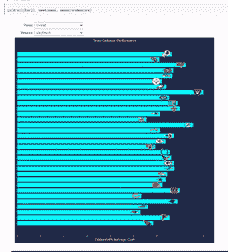

# 仅使用 Matplotlib 的简单交互式绘图

> 原文：<https://pub.towardsai.net/simple-interactive-plots-only-with-matplotlib-5a707e69b77?source=collection_archive---------6----------------------->

## [数据可视化](https://towardsai.net/p/category/data-visualization)

## 使用比 Plotly 更简单的语法

如果你足够频繁地关注趋势数据科学项目，你就不难发现，为交互式数据可视化而生的 Plotly 是如此具有统治性。我承认 Plotly 在很大程度上是有用的，除非你对它没有经验，需要立即产生一些东西。


由[威廉·艾文](https://unsplash.com/@firmbee?utm_source=unsplash&utm_medium=referral&utm_content=creditCopyText)在 [Unsplash](https://unsplash.com/s/photos/data-visualization?utm_source=unsplash&utm_medium=referral&utm_content=creditCopyText) 上拍摄

在这篇文章中，我将介绍一种很少使用但很容易掌握的方法:使用众所周知的 matplotlib 创建交互式情节！这只需要你的 matplotlib 知识。

# 我们需要什么？

为了帮助 matplotlib，我们只需要导入包 *ipywidgets* 。Ipywidgets 是一个内置库，它提供了以交互方式表达代码的控件。因此，用户可以通过控制小部件来管理他们的可视化或绘图，这样您的笔记本将是一个类似 lite 应用程序的外观。

如果您在导入软件包时遇到困难，例如，您在 conda 环境中运行您的笔记本，但是发现，您可以做的是从 Anaconda 安装:

```
conda install -c conda-forge ipywidgets
```

之后，我们需要从 ipywidgets 导入以下模块:

和其他必要的库:

# 交互式条形图

在我们开始之前，请注意，所有数据都来自 [NFL 大数据碗 2021](https://www.kaggle.com/c/nfl-big-data-bowl-2021/data) 。作为这次比赛的参与者，我将分享我在这次比赛中学到的一些东西。

现在我将使用一个条形图来显示对手每队的平均收益(通过比赛结果、进攻比赛结果和 EPA 来衡量)。我想要两个下拉菜单，其中一个用于季节周期选择，而另一个用于措施选择。然后我首先分别为它们定义了两个小部件:

应该对数据列进行一些处理，但这与简介无关，所以我将跳过它。请注意，下面的“df”是指原始数据集中经过处理的数据帧:

上面的函数是绘制条形图的函数。为了使其具有交互性，我们可以尝试 ipywidgets 的 interact 和 interact_manual。

如果你选择*交互*，下面是它的样子:



作者图片

使用*交互*，您对可视化的命令将自动执行，无需确认。在我的例子中，无论何时你改变下拉菜单中的值，都会立即对图形产生反应。

如果你选择 *interact_manual* ，下面是它操作剧情的方式:


作者图片

与*交互*不同，只有当你点击“运行交互”按钮时，可视化才会如你所愿地改变。这有助于您在让需要长时间运行的图运行之前进行仔细检查。

# 交互式散点图

同样，我们只需要定义另一个执行散点图绘制的函数:

# 利弊

## 赞成的意见

正如我所说，这种方法在数据可视化方面对只熟悉 matplotlib 的人来说确实很友好。只要你懂 matplotlib 语法，你用这种方式把它转换成交互式的就是小菜一碟。

此外，与 Plotly 相比还有一个显著的优势:如果我需要实现一个类似的产品，我没有办法，只能从所有选择中逐个定义选项的每个组合，因为在我的例子中，我的数据存储在 pandas 的 dataframe 中，很难通过命名参数变量来递归地完成。Ipywidgets 帮助我节省了代码，因为我可以很容易地定义一个下拉菜单。

第三，相比于 Plotly，如果使用 matplotlib，总会有更多的背景样式供我们选择。在 ipywidgets 的帮助下，我们设法保持了情节风格的真实性。举例来说，我在我的可视化中使用了一种[赛博朋克风格](https://pypi.org/project/mplcyberpunk/)，而在使用 plotly 时却无法使用。

## 骗局

不幸的是，ipywidgets 还不能与 Kaggle 笔记本兼容。Kaggle 笔记本是已经在单元中运行的稳定结果的集合，而 ipywidgets 要求只要输入参数改变就重新运行。

万岁！你坚持到了最后！关于这篇文章的任何细节，比如源代码，请随时查看我下面的笔记本！

[](https://www.kaggle.com/anzhemeng/nfl-defence-efficiency-analysis-ft-cyberpunk) [## NFL 防御效率分析。赛博朋克)

### 使用 Kaggle 笔记本探索和运行机器学习代码|使用来自多个数据源的数据

www.kaggle.com](https://www.kaggle.com/anzhemeng/nfl-defence-efficiency-analysis-ft-cyberpunk) 

不确定接下来要读什么？去看看我以前的故事:

[](https://towardsdatascience.com/you-dont-have-to-win-a-kaggle-competition-to-showcase-your-data-science-ability-2852a77b6d8c) [## 你不必赢得一场 Kaggle 比赛来展示你的数据科学能力！

### 一篇指导 Kaggle 竞赛中的失败者使用你的 Kaggle 项目给面试官留下深刻印象的文章。

towardsdatascience.com](https://towardsdatascience.com/you-dont-have-to-win-a-kaggle-competition-to-showcase-your-data-science-ability-2852a77b6d8c) [](https://towardsdatascience.com/ml-ml-who-is-the-champion-of-them-all-1a4d253e86ad) [## ML，ML，谁是他们所有人的冠军？

### 使用机器学习预测停赛后的欧洲冠军联赛 2019/20 冠军

towardsdatascience.com](https://towardsdatascience.com/ml-ml-who-is-the-champion-of-them-all-1a4d253e86ad) [](https://chatbotsjournal.com/faq-chatbot-on-facebook-messenger-9982cfc7f738) [## Facebook Messenger 上的常见问题聊天机器人

### 用 Flask，sklearn 和 MongoDB

chatbotsjournal.com](https://chatbotsjournal.com/faq-chatbot-on-facebook-messenger-9982cfc7f738)