# 具有基本机器学习模型的简单文本分类器(第 5 部分)

> 原文：<https://pub.towardsai.net/simple-text-classifier-with-basic-machine-learning-model-fa414791d26e?source=collection_archive---------1----------------------->

## 为初学者创建具有基本机器学习模型的文本分类器的最简单方法

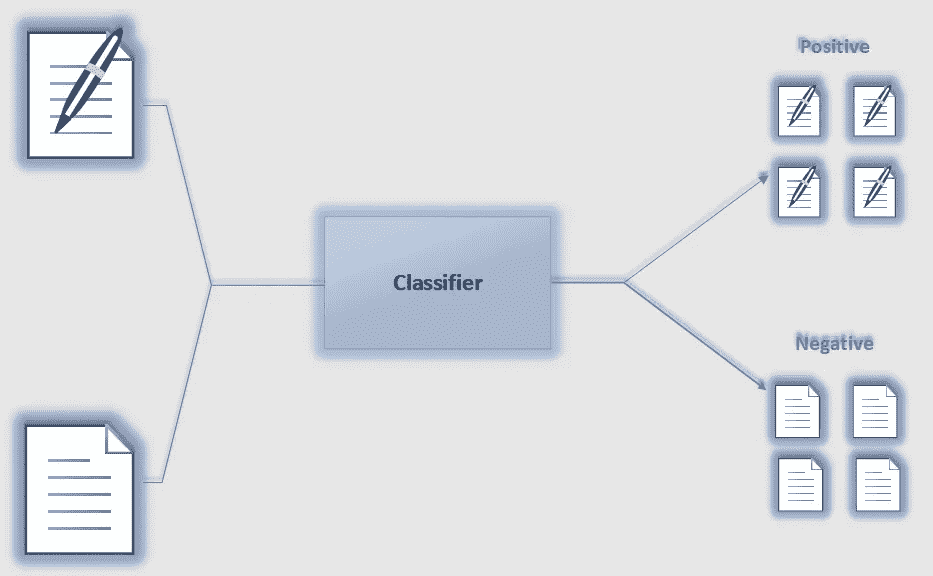

作者图片

## 动机

当我熟悉了数据科学之后，我发现这个领域非常广阔。在我的数据科学之旅中，我首先学习了基本的机器学习算法，并且我有足够的信心在现实世界的应用中实现 ML 算法。后来我开始了解自然语言处理(NLP)。NLP 背后的想法很酷，但一开始对我来说似乎并不容易。在某种程度上，我成功地将 NLP 与基本的机器学习技术联系起来。我的结论是，NLP 只不过是一种现代技术，包括基本的机器学习和一些附加的语言处理技术，通过这些技术，计算机可以实现人类语言。出于对自然语言处理的基本理解，我创建了一个简单的文本分类器，没有使用任何深度学习技术来分类文本。它会让我们对文本分类有一个清晰的认识。

现在，是时候按照完整的指导方针来构建一个简单的文本分类器了…..

## 先决条件

在开始这个项目之前，我想建议您对以下内容有一个基本的了解—

*   标记化
*   词汇化
*   堵塞物
*   禁用词
*   命名实体识别
*   词性标注
*   一袋单词
*   TF-IDF

如果你不熟悉这些技术，请阅读下面的文章。

[](https://towardsdatascience.com/a-complete-guide-to-natural-language-processing-nlp-c91f1cfd3b0c) [## 自然语言处理完全指南(第三部分)

### 机器如何识别人类语言并据此行动

towardsdatascience.com](https://towardsdatascience.com/a-complete-guide-to-natural-language-processing-nlp-c91f1cfd3b0c) 

为了方便起见，我将在本文中讨论 ***单词包*** *和* ***TF-IDF*** ，因为这些是构建我们的分类器最重要的概念。我会尽量保持简单和容易。

*单词包*和 *TF-IDF* 都是单词嵌入技术。这些单词嵌入系统对于训练用于分类的机器学习模型是重要的。

**包话(鞠躬)**

单词包是一种以数字形式表示文本的简单方法。有了单词包向量，我们就可以表示一串数字的句子组合。出于演示的目的，考虑下面两个句子—

1.  我喜欢看书。
2.  我喜欢玩耍和上学。

如果我把所有的单词都转换成小写，把句子记号化，会发现下面这些记号***‘我’，‘喜欢’，‘要’，‘读书’，‘玩’，‘和’，‘去’，‘学校’***。在标记化的情况下，我们丢弃标点符号。令牌的总数是 9。我们可以用以下方式来表示令牌。

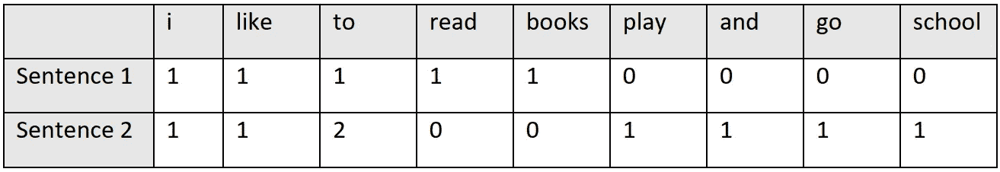

作者图片

这个图像描述了我们如何用单词向量包来表示一个句子。因此——的向量

*第一句:[1 1 1 1 1 0 0 0]*

*第二句:[1 1 2 0 0 1 1 1 1]*

**词频-逆文档频率(TF-IDF)**

让我们从来自*维基百科的正式定义开始。*

> ***TF-IDF****是一个数字统计量，意在反映一个词对集合或语料库中的文档有多重要[1]。*

*现在，试着深入挖掘…*

***什么是词频(TF)？***

*它衡量一个单词/标记/术语在文本中出现的频率。下面的公式表示它。*

> **TF=(文档中术语的频率)/(文档中术语的总数)**

*再次考虑前面两句话。*

1.  *我喜欢看书。*
2.  *我喜欢玩耍和上学。*

*在第一句中，有 5 个标记或项目—***‘我’，‘喜欢’，‘到’，‘阅读’，‘书籍’。****

*所以， **TF** 对于单词**‘我’**=*(句子 1 中‘我’出现的次数)/(句子 2 中的项数)=1/5。**

*同样的，*

*TF(*‘喜欢’*)= 1/5*

*TF( *'到'【T35])= 1/5**

*TF( *'read'* )=1/5*

*TF(*‘书籍’*)= 1/5*

*句子的 TF 可以表示如下。*

*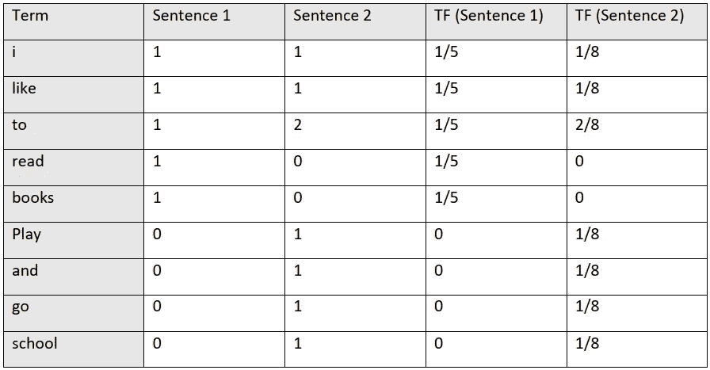*

*作者图片*

***什么是逆文档频率(IDF)？***

*仅测量术语频率不足以知道一个词/术语是否重要。术语 IDF 是为了从一堆文档中提取更重要的单词而引入的。IDF 通过以下公式计算。*

> **IDF = log((文档数)/(具有特定单词或术语的文档数)】**

*我们可以如下计算句子 1 的 IDF*

***IDF**for word**‘I’**=*log((文档数=2)/(带有单词‘I’的文档数= 2)) = log(2/2)=0**

*同样的，*

*IDF('like') = log (2/2)=0*

*IDF('to') = log(2/2) =0*

*IDF('read') = log(2/1)=0.301*

*IDF('书籍')= log(2/1)=0.301*

*如果我们按照公式计算所有令牌的 IDF，我们将获得表中所示的值。*

*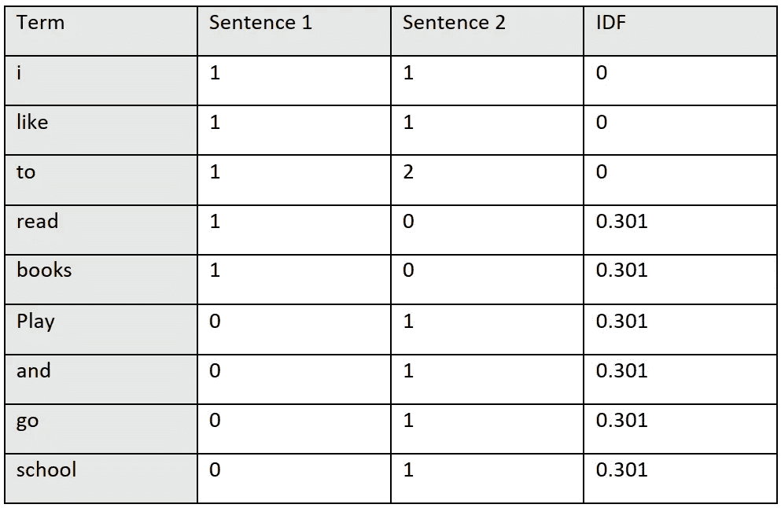*

*作者图片*

*因此，TF-IDF 可以用下列公式计算:*

> *TF-IDF = TF x IDF*

*如果你计算两个句子的 TF-IDF，你会得到下面的结果。*

**

*作者图片*

*最后，我们成功地计算出了单词/词汇的分数。我们可以得出结论，当 IDF 和 TF 值都高时，TF-IDF 为不太频繁的词提供高值。从另一个角度来说，如果一个单词在单个文档中频繁出现，但在整个文档中很少出现，那么 TF-IDF 就很大。*

***词袋和 TF-IDF 的对比分析***

1.  *单词包是表示单词在文档中出现的一组向量。另一方面，TF-IDF 找出了具有更多信息以及更少信息的单词。*
2.  *词袋矢量非常容易理解和解释。不过 TF-IDF 有点复杂但是对于机器学习模型非常有效。*

> ****由于 TF-IDF 是机器学习模型的最佳选择，我们将在我们的运行项目中使用 TF-IDF，而不仅仅是一袋单词。****

**让我们开始创建简单的文本分类模型…**

## *创建文本分类器的步骤*

*   *读取文本数据或语料库*
*   *一些初始预处理*
*   *为训练和测试拆分数据*
*   *创建用于向量化数据和机器学习模型的管道*
*   *训练模型*
*   *用新数据测试模型*
*   *评估模型*

## ***读取文本数据或语料库***

*读取或加载数据集是每个机器学习模型的第一步。我们将在整个项目中使用 python 编程语言，我们已经在项目中使用了`[**moviereviews**](https://github.com/Zubair063/Simple-Text-Classifier-/blob/main/moviereviews.tsv)` 数据集。因此，为了加载数据，我们将使用`pandas` 库，文本已经被预处理为制表符分隔的文件。*

```
*import pandas as pd
df = pd.read_csv('moviereviews.tsv', sep='\t')*
```

*如果我们想要数据集的前几个实例，我们可以通过`df.head()`命令来完成，它给出了下面的结果。*

*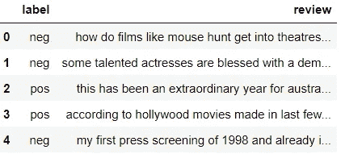*

*作者图片*

## ***初始预处理***

*在这一步中，我们将尝试找出不包含任何内容的评论。我们需要抛弃这些类型的评论。可能有两种情况，*

**i)它可能是一个 NaN 值(NaN 表示不是一个数字，相当于无)**

*ii)只包含空白。让我们试着深入了解数据集。*

```
*df.info()*
```

*这段代码产生以下结果。*

*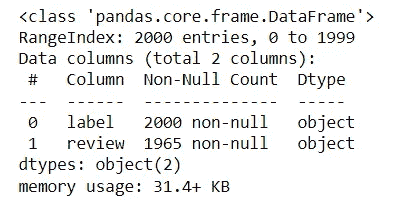*

*它显示总共有 2000 个实例，一些**评论**无效。我们必须删除没有审核的行。让我们开始吧。*

```
*df.dropna(inplace=True)*
```

*现在，检查数据框的信息。*

```
*df.info()*
```

*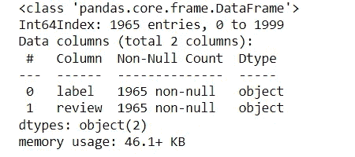*

*现在看起来还行。所有包含空值的行都已被删除。*

*现在，我们将检测并从数据集中删除空字符串。我写了一个函数来检测评论栏的空字符串。*

*如果我们将数据帧`**df**` 传入函数，它将返回空字符串行的索引列表。*

```
*blank_data_index=detect_blank(df)*
```

*`len(blank_data_index)`返回 27。这表明有 27 行包含一个空字符串。现在，我们将按照这段代码删除它。*

```
*df.drop(blank_data_index, inplace=True)*
```

*我们的数据集中没有空白评论，评论总数是 1938 条。*

```
*df.label.value_counts()*
```

**标签列的频率。**

```
*neg    969
pos    969*
```

*它表明，负面和正面的审查频率是相等的，这是一个平衡的数据集。*

## ***为训练和测试拆分数据***

*对于每一个机器学习模型，我们都需要大量的数据来训练模型，以及一些看不见的数据来评估模型，这些数据称为测试数据。在这个项目中，我们将 67%的数据用于训练，33%的数据用于测试(这不是一个固定的参数。可以根据自己的选择进行微调)。*

```
*from sklearn.model_selection import train_test_splitX = df['review']
y = df['label']X_train, X_test, y_train, y_test = train_test_split(X, y, test_size=0.33, random_state=42)*
```

## ***创建向量化数据和机器学习模型的管道***

*机器学习管道是一种将自动化工作流程的一系列工作进行编码的方式。在我们的模型中，我们将使用管道执行两项任务。首先，用 **TF-IDF 对词汇/标记进行矢量化。**其次，创建机器学习模型。Scikit-learn 有很多模块可以让我们的生活更加轻松。因此，我们将使用 scikit-learn 库进行 TF-IDF 矢量化和其他机器学习模型。*

*为此，我们为朴素贝叶斯和线性 SVC 分类器创建了管道。*

## ***在文本数据上训练模型***

*我们为朴素贝叶斯分类器和线性 SVC 模型创建了两个管道。*

***用朴素贝叶斯管道训练***

```
*text_clf_nb.fit(X_train, y_train)*
```

**管道详情**

*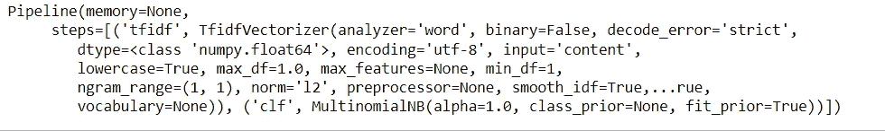*

## ***预测测试数据的输出***

```
*# Form a prediction set
predictions = text_clf_nb.predict(X_test)*
```

***为我们的模型绘制混淆矩阵***

*它会产生以下结果。*

*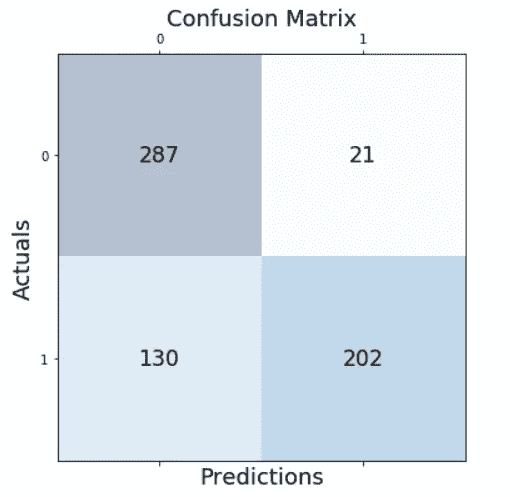*

***管道分类报告(精度、召回、F1 评分、支持)***

```
*# Print a classification report
print(metrics.classification_report(y_test,predictions))*
```

*输出*

*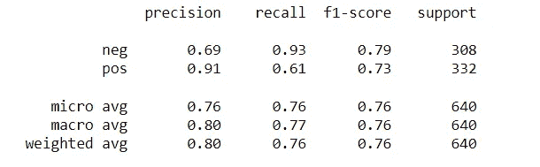*

***准确度***

```
*# Print the overall accuracy
print(metrics.accuracy_score(y_test,predictions))*
```

*总准确度*

```
*0.7640625*
```

***带有线性 SVC 管道的列车***

```
*text_clf_lsvc.fit(X_train, y_train)*
```

**管道详情**

*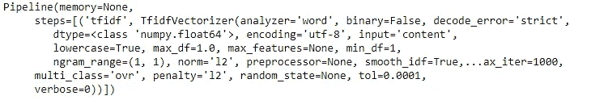*

***预测测试数据的输出***

```
*# Form a prediction set
predictions_2 = text_clf_lsvc.predict(X_test)*
```

***混淆矩阵***

```
*# Report the confusion matrix
from sklearn import metrics
print(metrics.confusion_matrix(y_test,predictions_2))*
```

**混淆矩阵输出**

```
*[[259  49]
 [ 49 283]]*
```

*在这里，我已经展示了第一个管道中混淆的图形表示和第二个管道中的一般表示。你可以根据自己的选择使用任何一种技术。*

***第二管道的分类报告(精确度、召回率、F1 得分、支持)***

```
*# Print a classification report
print(metrics.classification_report(y_test,predictions_2))*
```

**输出**

**

***第二条管线的精度***

```
*# Print the overall accuracy
print(metrics.accuracy_score(y_test,predictions))*
```

**整体精度**

```
*0.846875*
```

*流水线的结果表明第二流水线(线性 SVC)在评估度量方面表现更好。因此，我们将使用第二个管道作为首选模型。如果您愿意，您可以使用其他分类算法，并为您的最终模型接受最佳算法。*

## ***预测新复习的类别***

```
*myreview = "A movie I really wanted to love was terrible. \
I'm sure the producers had the best intentions, but the execution was lacking."print(text_clf_lsvc.predict([myreview]))*
```

*输出*

```
*['neg']*
```

**

*艾蒂安·吉拉尔代在 [Unsplash](https://unsplash.com?utm_source=medium&utm_medium=referral) 上拍摄的照片*

## *结论*

*自然语言处理(NLP)是一项激动人心的技术。本文展示了使用基本机器学习算法构建简单文本分类器的最简单方法。尽管这种类型的模型性能不好，但对于 NLP 的初学者来说，这可能是一篇有趣的文章。*

***参考***

1.  *[TF–IDF—维基百科](https://en.wikipedia.org/wiki/Tf%E2%80%93idf)*

****以下文章你可能会感兴趣……****

*[](https://towardsdatascience.com/tips-and-tricks-to-work-with-text-files-in-python-89f14a755315) [## 使用 Python 处理文本文件的技巧和诀窍(第 1 部分)

### 使用文本文件并熟悉 Python 中令人惊叹的技术

towardsdatascience.com](https://towardsdatascience.com/tips-and-tricks-to-work-with-text-files-in-python-89f14a755315) [](https://towardsdatascience.com/manipulate-pdf-files-extract-information-with-pypdf2-and-regular-expression-39ff697db0ca) [## 操作 PDF 文件，使用 PyPDF2 和正则表达式提取信息(第 2 部分)

### 使用 PyPDF2 和正则表达式简化 PDF 操作任务

towardsdatascience.com](https://towardsdatascience.com/manipulate-pdf-files-extract-information-with-pypdf2-and-regular-expression-39ff697db0ca) [](https://towardsdatascience.com/hands-on-implementation-of-basic-nlp-techniques-nltk-or-spacy-687099e02816) [## 用 spaCy 实现基本 NLP 技术的完整指南(第 4 部分)

### 了解如何使用 Python 库实现基本的 NLP 技术

towardsdatascience.com](https://towardsdatascience.com/hands-on-implementation-of-basic-nlp-techniques-nltk-or-spacy-687099e02816)*